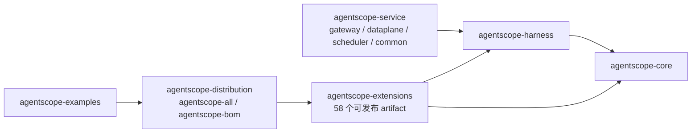
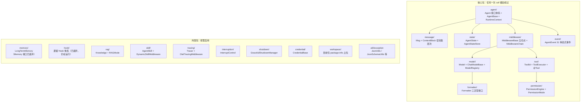

# 第 1 章 模块全景与依赖拓扑（核心）

> 本章回答三个问题：仓库里有哪些模块、它们之间怎么依赖、agentscope-core 内部的包怎么分工。
> 读完本章你应该能做到：拿到任何一个 AgentScope 类名，立刻知道它属于哪一层、大概负责什么。

## 1.1 七个 Maven 模块

根 `pom.xml`（`io.agentscope:agentscope-parent`，版本 `<revision>` = 2.0.3-SNAPSHOT）聚合 7 个模块：

| 模块 | 职责 | 内部依赖 |
|---|---|---|
| `agentscope-core` | 框架内核：Agent/ReAct 循环、Model 抽象、Message、Tool、State、Middleware/Hook、Event、Permission、Interruption、Shutdown、Tracing。**2.0 起不含任何具体模型厂商实现**（DashScope/OpenAI 等已全部迁往 extensions） | 无内部依赖。第三方仅 reactor-core、jackson、MCP SDK、okhttp、opentelemetry-api、json-schema 生成/校验、snakeyaml、sqlite-jdbc，以及一个已声明但尚未被代码使用的 tree-sitter-bash（详见第 4 章 4.5） |
| `agentscope-harness` | 工程化外壳：在 ReActAgent 之上包一层 HarnessAgent，提供 workspace、可插拔文件系统、沙箱、子 Agent 编排、技能自演化、记忆压缩/落盘、Plan Mode、MCP 配置化、channel/gateway 路由 | → core（唯一内部依赖） |
| `agentscope-extensions` | 全部外部集成，18 个一级模块展开为 **58 个可发布 artifact**：模型厂商、RAG、长期记忆、存储、云沙箱、协议、IM 渠道、调度器、Spring Boot Starter | → core，部分（沙箱/技能类）→ harness |
| `agentscope-service` | **2.0.3 新增**。四平面 Agent 管控平台：`service-gateway` / `service-dataplane` / `service-scheduler` / `service-common`，另带 `aistio`（控制面）、`frontend`（Dashboard）、docker 编排。定位是**统一控制面**——把用 AgentScope、LangChain、ADK、Claude 等不同运行时搭的 Agent 统一注册、观测、编排（Teams），并提供基于 HarnessAgent 的低代码托管运行（Managed Agents，由 `agentscope-builder` 升级而来） | → harness（+ Spring Boot / Spring Cloud） |
| `agentscope-examples` | 示例：`documentation`（14 个子包，按官方文档章节组织）+ `agents/` 下 3 个完整应用（codingagent / dataagent / paw）+ `agui` 与 `agentscope-copilotkit` 两个前端集成示例。**原 `agentscope-builder` 已升级为 `agentscope-service` 的 Managed Agents** | → core/harness/extensions |
| `agentscope-dependencies-bom` | 第三方依赖版本收敛 | — |
| `agentscope-distribution` | `agentscope-all`（一站式 fat 依赖聚合）+ `agentscope-bom`（对外发布的 BOM，**应用项目 import 的就是它**） | 聚合以上所有 |

依赖拓扑（箭头表示"依赖于"）：



**设计要点**：依赖方向严格单向，core 对 harness、extensions 一无所知。core 通过三类接缝把控制权交出去：
1. **SPI**（`ServiceLoader`）：如 `model/spi/ModelProvider`，让 `ModelRegistry` 能解析 `"dashscope:qwen-plus"` 这样的字符串 id；
2. **接口注入**：如 `AgentStateStore`、`LongTermMemory`、`Knowledge`，应用把实现塞进 Builder；
3. **Middleware/Tool**：harness 的全部能力都以 core 的 `MiddlewareBase` + `AgentTool` 形式注入 ReActAgent，不改 ReAct 算法一行（第 7 章详述）。

## 1.2 agentscope-core 的 20 个包地图

包根：`agentscope-core/src/main/java/io/agentscope/core/`。顶层只有两个类：`ReActAgent.java`（5353 行，框架心脏，第 3 章专讲）与 `Version.java`。

下图按"主执行链路"把包分为核心与外围两圈，节点上的类是各包的代表类：



逐包速查表（各包细节在后续章节展开，此处建立索引）：

| 包 | 代表类（路径相对 `agentscope-core/src/main/java/io/agentscope/core/`） | 职责 | 详见 |
|---|---|---|---|
| （顶层） | `ReActAgent.java` | ReAct 循环唯一实现 | 第 3 章 |
| `agent` | `Agent.java`、`AgentBase.java`、`RuntimeContext.java`、`accumulator/ReasoningContext.java` | Agent 接口体系、调用生命周期、每次调用的身份上下文、流式分片累加 | 第 2、3 章 |
| `message` | `Msg.java`、`ContentBlock.java`、`GenerateReason.java` | 消息与内容块数据模型、循环终止原因 | 第 2 章 |
| `state` | `AgentState.java`、`AgentStateStore.java`、`JsonFileAgentStateStore.java` | 2.0 状态载体与持久化 | 第 2 章 |
| `model` | `Model.java`、`ChatModelBase.java`、`ModelRegistry.java`、`transport/HttpTransport.java` | 模型抽象、SSE 流式传输、字符串 id 解析 | 第 5 章 |
| `formatter` | `Formatter.java`、`AbstractBaseFormatter.java` | AgentScope 消息 ↔ 厂商协议互转 | 第 5 章 |
| `tool` | `Toolkit.java`、`ToolExecutor.java`、`Tool.java`（注解）、`ToolSchemaGenerator.java` | 工具注册、Schema 生成、反射执行、MCP | 第 4 章 |
| `middleware` | `MiddlewareBase.java`、`MiddlewareChain.java` | 2.0 官方扩展机制（五切点洋葱模型） | 第 6 章 |
| `event` | `AgentEvent.java`、`AgentEventType.java`、`AgentEventEmitter.java` | 细粒度流式事件（31 种） | 第 6 章 |
| `permission` | `PermissionEngine.java`、`PermissionMode.java`、`PermissionContextState.java` | 工具权限（HITL 的基础） | 第 3 章 |
| `hook` | `Hook.java`、`LegacyHookDispatcher.java` | 1.x 钩子体系，`@Deprecated(forRemoval)` 但 2.0 仍在循环内触发 | 第 6 章 |
| `memory` | `LongTermMemory.java`（活跃）、`Memory.java`（已废弃） | 长期记忆扩展点；会话上下文已迁往 `AgentState.getContext()` | 第 2 章 |
| `interruption` | `InterruptControl.java` | 会话级安全中断 | 第 3 章 |
| `shutdown` | `GracefulShutdownManager.java` | 优雅停机（按 requestId 追踪） | 第 3 章 |
| `tracing` | `Tracer.java`、`TracerRegistry.java`、`OtelTracingMiddleware.java` | 可观测性 | 第 6 章 |
| `rag` | `Knowledge.java`、`RAGMode.java` | RAG 扩展点 | 第 8 章 |
| `skill` | `AgentSkill.java`、`DynamicSkillMiddleware.java`、`repository/AgentSkillRepository.java` | Markdown 技能体系（部分类已废弃，repository 与 middleware 仍活跃） | 第 7、8 章 |
| `credential` | `CredentialBase.java` | 模型凭证与 ModelCard 列举 | 第 8 章 |
| `workspace` | `package-info.java` | 占位包，workspace 能力实际在 harness 实现 | 第 7 章 |
| `util` | `JsonUtils.java`、`JsonSchemaUtils.java`、`MessageUtils.java`、`ExceptionUtils.java` | JSON 编解码、Schema 生成、消息工具、异常链判定（如 `containsInterruptedException`，第 3 章 3.6 用到） | 各章穿插 |
| `exception` | `CompositeAgentException.java` | 框架异常类型（多异常聚合） | 各章穿插 |

## 1.3 推荐的源码阅读切入点

按"从数据到行为"的顺序：

1. `message/Msg.java` + `message/ContentBlock.java` + `state/AgentState.java` —— 数据模型（第 2 章）
2. `agent/AgentBase.java`（1040 行）—— 先看 `runLifecycle` / `runLifecycleBody` / `notifyPreCall` 三个方法
3. `ReActAgent.java` 的内部类 `CallExecution`（`:1636` 起，约 2300 行）—— 全部循环逻辑都在这里
4. `tool/Toolkit.java`（1060 行）→ `tool/ToolExecutor.java`
5. `model/ChatModelBase.java` → 挑一个厂商扩展（推荐 dashscope）读完整实现
6. `harness/agent/HarnessAgent.java`（2884 行）—— 重点读 `Builder#build`（`:2264`）的 middleware 装配段

## 1.4 customer_work 实战：一个生产项目如何声明依赖

customer_work 根 `pom.xml` 用 BOM 统一版本：

```xml
<dependency>
    <groupId>io.agentscope</groupId>
    <artifactId>agentscope-bom</artifactId>
    <version>2.0.0</version>
    <type>pom</type>
    <scope>import</scope>
</dependency>
```

依赖集中声明在 `customer-work-starter/pom.xml`，共 20 个 artifact，按用途分组：

| 用途 | artifactId |
|---|---|
| 主干（core 经 harness 传递） | `agentscope-harness` |
| 模型五厂商 | `agentscope-extensions-model-{dashscope,openai,anthropic,gemini,ollama}` |
| 会话状态后端 | `agentscope-extensions-redis`、`agentscope-extensions-mysql` |
| 长期记忆 | `agentscope-extensions-mem0`、`agentscope-extensions-reme`、`agentscope-extensions-memory-bailian` |
| RAG | `agentscope-extensions-rag-{simple,dify,bailian}` |
| 调度 | `agentscope-extensions-scheduler-common`、`agentscope-extensions-scheduler-xxl-job` |
| 协议/网关/观测 | `agentscope-extensions-agui`、`agentscope-extensions-higress`、`agentscope-extensions-studio`、`agentscope-extensions-nacos-prompt` |

两个值得注意的工程决策（`customer-work-starter/pom.xml` 注释中明确记录）：

1. **模型实现必须逐个显式声明**——2.0.0 GA 起模型实现从 core 拆到 `io.agentscope.extensions.model.{provider}`，RC4 升 GA 时如果只依赖 core 会发现所有 `XxxChatModel` 类消失（这是该项目踩过的真实坑，见第 10 章）。
2. **`customer-channel` 额外依赖官方 Web 端 starter**（`agentscope-admin-spring-boot-starter`、`agentscope-chat-completions-web-starter`、`agentscope-agui-spring-boot-starter`），说明"扩展生态"里的 starter 与"业务基础设施"可以分模块各取所需。
