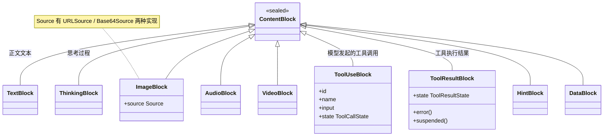
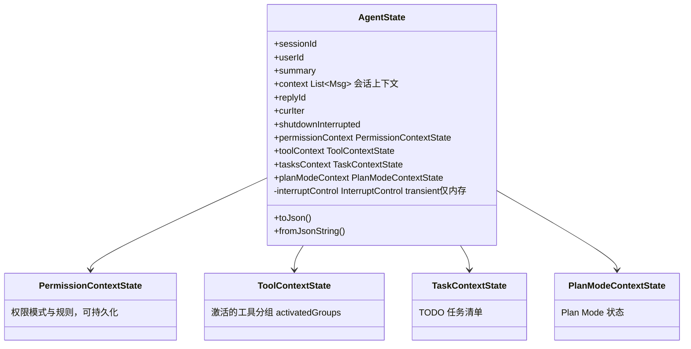
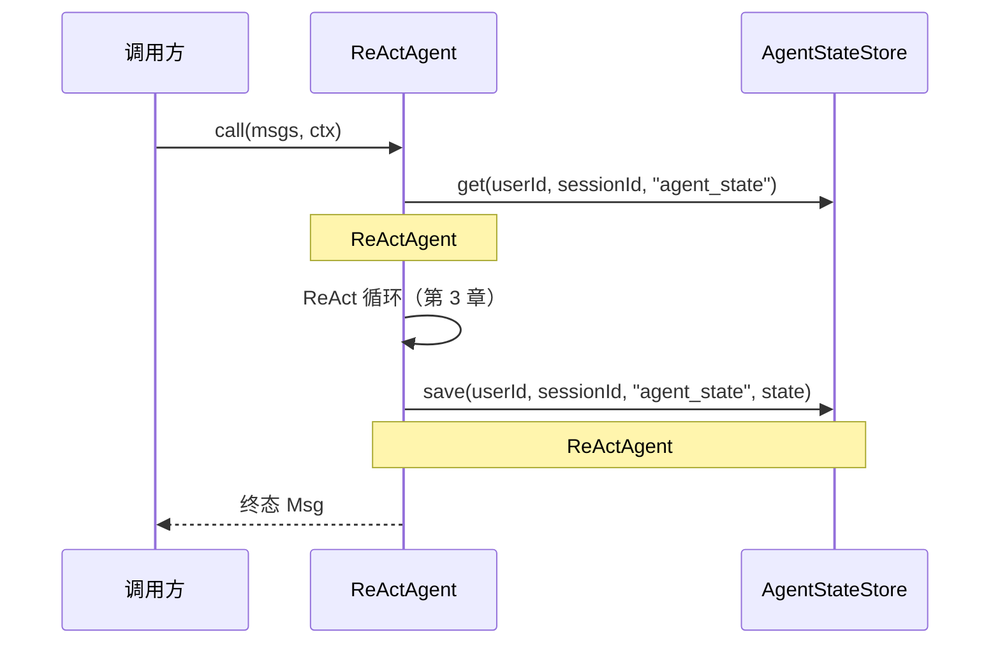

# 第 2 章 消息与状态模型（核心）

> 数据模型是理解一切行为的前提。本章讲三样东西：消息（`Msg`/`ContentBlock`）、状态（`AgentState`/`AgentStateStore`）、以及"每次调用的身份"（`RuntimeContext`）。
> 路径前缀：`agentscope-core/src/main/java/io/agentscope/core/`

## 2.1 Msg：一切内容的载体

`message/Msg.java`（实现 `State` 接口，因此可持久化）：

```
Msg = id + name + role(MsgRole) + List<ContentBlock> + metadata(Map) + timestamp + usage(ChatUsage)
```

要点：

- **一条消息可以同时携带多种内容块**：一条助手消息可能既有 `TextBlock` 又有多个 `ToolUseBlock`——这是理解 ReAct 循环"是否结束"判据的关键（第 3 章：`isFinished` 判「没有 `ToolUseBlock`」且「有非空 `TextBlock`」）。
- **metadata 上的约定 key**（`Msg` 中的常量）：
  - `METADATA_GENERATE_REASON`：本条终态消息因何产生（见 2.2 的 `GenerateReason`）；
  - `METADATA_CONFIRM_RESULTS`：HITL 权限确认结果回传的唯一通道（第 3 章权限门）；
  - `METADATA_CONFIRM_REQUEST_REPLY_ID` / `METADATA_EXTERNAL_EXECUTION_REQUEST_REPLY_ID`：暂停时记下"是哪一条回复在等确认/等外部执行"，恢复时据此把结果对回原来那轮；
  - `METADATA_SYNTHETIC` / `METADATA_REMINDER_KIND`：标记"框架/中间件合成的瞬态消息"，不属于用户真实输入。空回复重试注入的提醒就带 `REMINDER_KIND="empty_response"`（第 3 章 3.4）。

除这几个约定 key 外，`Msg.metadata` 还会被框架自动写入两类内容：模型返回的 `ChatUsage`，以及厂商私有的响应 metadata（如 OpenAI 推理模型的加密推理链），二者都由 `ReasoningContext#buildFinalMessage` 合并进来（第 3 章 3.4）。
- 便捷子类：`UserMessage` / `AssistantMessage` / `SystemMessage` / `ToolResultMessage`。

## 2.2 ContentBlock：密封类多态层次

`message/ContentBlock.java` 是 **sealed class**，配 Jackson `@JsonTypeInfo(property="type")` 做序列化多态。类图如下（与正文类名一致）：



两个"状态机载体"值得单独记：

- `ToolCallState`（挂在 `ToolUseBlock` 上，共 5 值）：`PENDING`（刚从模型解析出来）→ `ASKING`（权限引擎判定需人工确认，本次调用到此暂停）→ `ALLOWED`（放行，或用户确认后提升）→ `SUBMITTED`（已交给执行器）→ `FINISHED`。权限引擎评估后把状态打回上下文里的工具调用块上，所以**状态随会话持久化**——这是断点续跑能对上号的原因；
- `ToolResultState`（挂在 `ToolResultBlock` 上，共 5 值）：`SUCCESS` / `ERROR` / `INTERRUPTED` / `DENIED` / `RUNNING`。`determineToolResultState`（第 3 章 3.5）在写工具结果消息前先定这个状态。

这两个枚举加上 `Msg.METADATA_CONFIRM_RESULTS`，构成了人机协作（HITL）在**数据层**的全部痕迹——第 3 章讲权限门时会看到它们如何被读写。

**`GenerateReason`（`message/GenerateReason.java`）是读 ReAct 循环的最佳线索**。终态消息一定带其中一个值，每个值对应循环的一个出口。全部 11 个值，按"正常结束 / 被要求停 / 暂停待续"分三组看：

| 组 | 值 | 出口位置（第 3 章展开） |
|---|---|---|
| **正常结束** | `MODEL_STOP` | 模型正常收尾，任务完成 |
| | `STRUCTURED_OUTPUT` | 结构化输出完成（3.7 的 `generate_response` 成功） |
| | `MAX_ITERATIONS` | 达到 maxIters，走 `summarizing()` 总结收尾 |
| **被要求停** | `REASONING_STOP_REQUESTED` | Hook 在推理后调用了 `stopAgent()` |
| | `ACTING_STOP_REQUESTED` | Hook 在行动后调用了 `stopAgent()` |
| | `MIDDLEWARE_STOP_REQUESTED` | Middleware 发出 `RequestStopEvent`；**恢复方式是无参再 `call()` 一次**，agent 自己捡起 pending 工具接着跑 |
| | `ALL_TOOLS_DENIED` | 最近一轮的工具调用被用户全部拒绝，且 `AllToolsDeniedEvent` 的处理器调了 `stopAgent()` |
| | `INTERRUPTED` | 被 `interrupt(...)` 中断（3.8） |
| **暂停待续** | `PERMISSION_ASKING` | 有工具在等人工确认，本次调用暂停返回；**恢复方式是带 `ConfirmResult` 再 `call()` 一次** |
| | `TOOL_SUSPENDED` | 有 externalTool 挂起，等外部执行结果 |
| **循环内部** | `TOOL_CALLS` | 模型返回了内部工具调用——框架会继续执行，**这个值一般不会出现在你拿到的终态消息上** |

三组的区别在**调用方要做什么**：正常结束什么都不用做；"被要求停"里除 `MIDDLEWARE_STOP_REQUESTED` 外都是终态；"暂停待续"必须由调用方发起第二次 `call()` 并带上恢复所需的数据（`ConfirmResult` 或 `ToolResultBlock`），这就是第 3 章 3.3 的情况 4 和 5。

## 2.3 AgentState：2.0 的核心状态载体

1.x 用 `Memory` 管上下文；**2.0 的规范位置是 `state/AgentState.java`**：



注意：

- **`context`（`List<Msg>`）就是会话记忆本身**。`memory/Memory.java` 整个接口已 `@Deprecated(forRemoval, since=2.0.0)`，`memory/StateBackedMemory.java` 只是把旧 API 转发到 `AgentState.contextMutable()` 的兼容适配器。
- `interruptControl` 是 `transient volatile`——中断信号只存在于内存、只作用于目标会话，不随状态持久化（第 3 章 3.8）。
- 子状态（权限/工具分组/任务/Plan Mode）都随 `AgentState` 一起序列化，**所以"用户勾选过的权限规则""模型自己开关过的工具组"都能跨调用、跨进程恢复**。

`memory/LongTermMemory.java` 与上面是两回事，它**未废弃**，是长期记忆扩展点，仅两个方法：

```java
Mono<Void> record(List<Msg> msgs);   // 记录
Mono<String> retrieve(Msg msg);      // 检索
```

配套 `LongTermMemoryMode`：`AGENT_CONTROL`（agent 通过工具自主读写）/ `STATIC`（框架自动注入检索结果）/ `BOTH`。

## 2.4 AgentStateStore：可插拔持久化

`state/AgentStateStore.java` 按 `(userId, sessionId, key)` 三元组寻址：`save / get / getList / exists / delete / listSessionIds`。

| 实现 | 位置 | 特点 |
|---|---|---|
| `JsonFileAgentStateStore` | core，`state/JsonFileAgentStateStore.java` | 默认实现，落盘 `~/.agentscope/state/<agentId>/`；list 采用**增量追加** |
| `InMemoryAgentStateStore` | core，`state/InMemoryAgentStateStore.java` | 内存实现；list 为**全量替换** |
| `RedisAgentStateStore` | extensions-redis（Jedis/Lettuce/Redisson 三套客户端适配） | 分布式部署首选 |
| `MysqlAgentStateStore` | extensions-mysql | JDBC 系，另有 Postgres/H2/Sqlite 方言 |

**持久化时机（重要，图文对应第 3 章主循环图）**：

- **写**：每次 `doCall` 完成后，`ReActAgent#saveStateToSession`（`ReActAgent.java:475`）在 `Schedulers.boundedElastic()` 上执行 `stateStore.save(uid, sid, "agent_state", state)`；
- **读**：`ReActAgent#activateSlotForContext`（`ReActAgent.java:647`）——**配置了 stateStore 时每次调用都重新从 store 读，不信任本地缓存**。这是刻意设计：任一无状态副本都能接管任一用户会话，支撑水平扩展。



## 2.5 乐观并发：同一会话被两个副本同时写怎么办

2.4 说"任一无状态副本都能接管任一用户会话"。反过来问：如果**两个副本同时**接管了同一个会话呢？同会话串行闸门（`callSerializationKey`）只在单进程内有效，跨副本管不住。

`AgentStateStore` 为此加了一组带版本的方法，默认实现全都退化成旧行为，所以自定义 store 不改也能编译：

| 方法 | 默认实现 | 语义 |
|---|---|---|
| `supportsVersioning()` | 返回 `false` | 本后端是否支持乐观并发 |
| `getVersioned(uid, sid, key, type)` | 包一层 `get`，版本报 `UNVERSIONED` | 读值的同时拿到版本号 |
| `saveIfVersion(uid, sid, key, value, expectedVersion)` | 直接 `save`，返回 `UNVERSIONED` | CAS 写；成功返回新版本，冲突返回 `UNVERSIONED` **且不写** |

`expectedVersion` 三种取值：`0` 是"仅当不存在时创建"，`UNVERSIONED` 是"无条件覆盖"，其它值是"仅当当前版本相等时写"。

**支持情况**：`InMemoryAgentStateStore`、Redis 三套客户端（`RedisAgentStateStore` / `JedisAgentStateStore` / `RedissonAgentStateStore`）、`MysqlAgentStateStore`、`PostgresAgentStateStore` 都返回 `true`；`JsonFileAgentStateStore` 没有实现，走 last-writer-wins 的默认路径。选后端时这是一条容易忽略的差异——**本地用 json 跑得好好的并发语义，换到生产不一定一样**（反之亦然）。

`ReActAgent` 侧对应一个 `ConflictPolicy`（Builder 可配，默认 `OVERWRITE`）。关键前提写在 `ConflictPolicy` 的 javadoc 里，值得原样记住：**CAS 冲突发生在一轮的末尾——回复可能已经流给用户了，工具的副作用也已经发生了，策略回滚不了这些**。所以只能显式选一个：

| 策略 | 行为 | 适用 |
|---|---|---|
| `OVERWRITE`（默认） | 无条件覆盖，last-writer-wins | 保持旧行为；单副本或不在意丢写 |
| `FAIL` | 抛 `ConcurrentSessionModificationException`，跳过写 | 上层已有分布式会话闸门时推荐——冲突说明闸门漏了，应该炸出来 |
| `APPEND_MERGE` | 重新加载最新基线，把本轮新增的消息追加上去，重试 CAS | 普通聊天轮次可用；**压缩/总结轮次不安全**，因为那类轮次会重写历史，追加式合并会把被压缩掉的消息又拼回来 |

`APPEND_MERGE` 依赖 `CallExecution.loadedContextSize`（加载时记下的上下文长度）来界定"本轮新增了哪些消息"——这就是第 3 章 3.1 里那个字段的用途。冲突次数由 `stateConflictCount` 计数，可读出来做监控。

## 2.6 RuntimeContext：每次调用的身份，不持久化

`agent/RuntimeContext.java` 与 `AgentState` 是刻意分开的两个概念：

| 维度 | RuntimeContext | AgentState |
|---|---|---|
| 生命周期 | 单次调用 | 跨调用持久化 |
| 内容 | `sessionId` / `userId` / 字符串属性 / 类型化属性（`ToolExecutionContext` 已废弃，见第 4 章 4.2） | 会话上下文、权限、工具分组、任务等 |
| 谁创建 | 调用方每次传入 | 框架从 store 加载或新建 |
| 典型用途 | 多租户身份、给工具注入业务上下文、middleware 间传递每轮临时数据 | 会话记忆与可恢复状态 |

`RuntimeContext` 的 `(userId, sessionId)` 同时决定：状态寻址、同会话串行闸门（`ReActAgent#callSerializationKey`，第 3 章）、harness 的 workspace 路径与沙箱隔离维度（第 7 章）。**一个 Agent 实例 + 不同 RuntimeContext = 并发服务多会话**，这是 2.0 无状态部署模型的基石。

## 2.7 customer_work 实战

### 会话状态四后端切换

`customer-work-starter/src/main/java/com/richard/fyoung/customerwork/config/SessionConfig.java` 按 `customer-work.session.mode` 装配四种 `AgentStateStore`：

```
memory → InMemoryAgentStateStore
json   → JsonFileAgentStateStore（目录可配）
redis  → JedisAgentStateStore（io.agentscope.extensions.redis.state.jedis）
mysql  → MysqlAgentStateStore（io.agentscope.extensions.mysql.state）
```

开发环境用 memory/json 零依赖起步，生产切 redis/mysql 只改一行配置——正是 `AgentStateStore` 接口边界清晰带来的红利。

### 两个真实的坑（详见第 10 章）

1. **`MysqlAgentStateStore` 必须用 4 参构造显式传库名**：2 参构造硬编码库名为 `agentscope`。admin 侧 `customer-admin-server/.../config/AdminAgentRuntimeConfig.java` 因此显式传 `admin.mysql.database-name`。
2. **`SandboxSafeAgentStateStore`（starter 与 admin 各一份装饰器）**：Harness 沙箱的 `SessionSandboxStateStore` 会往 sessionId 里拼 `/`，而 `MysqlAgentStateStore#validateSessionId` 拒绝 `/`——项目用装饰器在两者之间做转义适配。这是"框架两个子系统的隐含约定冲突"的典型案例。

### metadata 约定的生产用法

`customer-work-starter/.../rag/search/KnowledgeInjectionMiddleware.java` 注入 RAG 召回内容时，给合成消息打上 `Msg.METADATA_SYNTHETIC` 标记且**不写回 `AgentState.context`**——保证召回内容只影响当轮推理，不污染持久化的会话历史。这是"瞬态注入"模式的标准做法（第 6 章 Middleware 实战会再次出现）。

### 租户隔离

`customer-work-starter/.../agent/CustomerServiceAgentFactory.java` 的 `resolveTenant` 把外部 sessionId `tenantA:conv-1` 按分隔符拆出 `userId=tenantA`，同时作为 `RuntimeContext.userId` 与长期记忆的租户 key——一份代码同时喂饱了状态寻址、串行闸门、LTM 隔离三个机制，展示了 `(userId, sessionId)` 二元组贯穿框架的设计。
