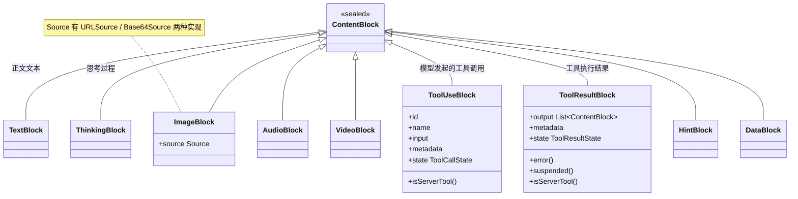
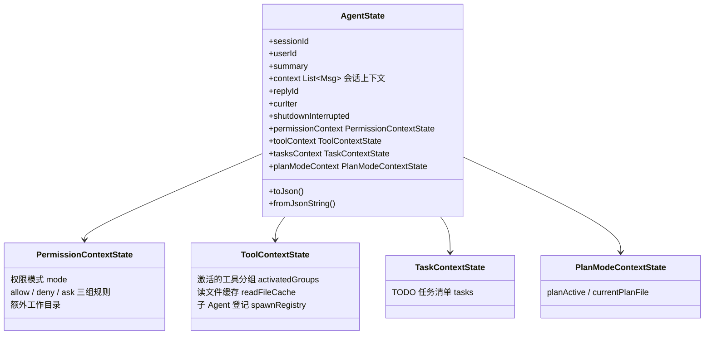
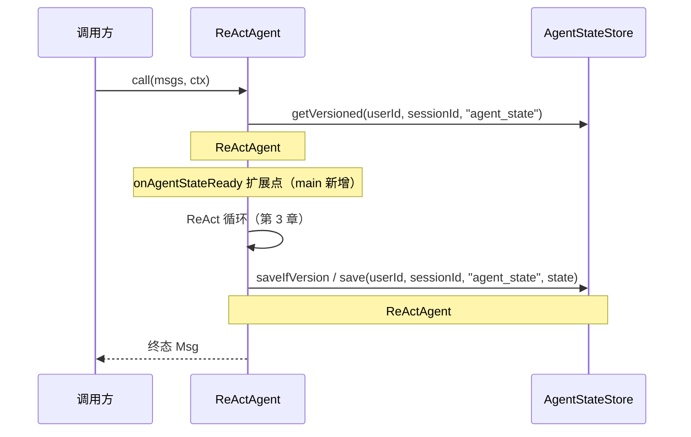
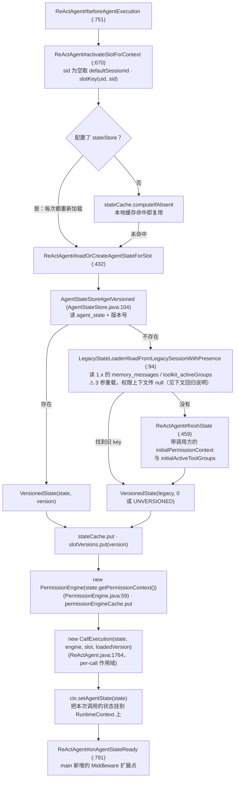
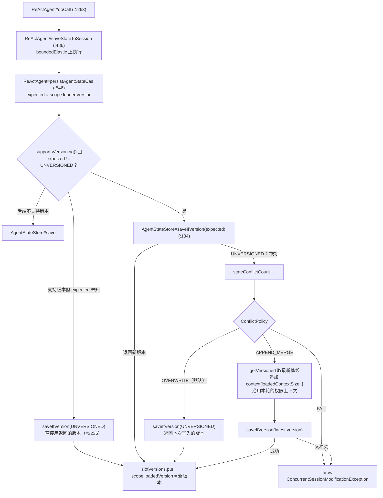

# 第 2 章 消息与状态模型（核心）

> 数据模型是理解一切行为的前提。本章讲三样东西：消息（`Msg`/`ContentBlock`）、状态（`AgentState`/`AgentStateStore`）、以及"每次调用的身份"（`RuntimeContext`）。
> 路径前缀：`agentscope-core/src/main/java/io/agentscope/core/`
> 本章已按上游 main `e9721285`（2026-10-01，`2.0.4-SNAPSHOT`，**尚未发版**）核对，行号均为 main 上的行号；最新正式版仍是 `v2.0.3`（2026-09-07），两者之间共 91 个提交。凡是 v2.0.3 之后才有的行为，正文用「main 已变更（未发版）」引用块标出。

## 2.1 Msg：一切内容的载体

`message/Msg.java`（883 行，实现 `State` 接口，因此可持久化）：

```
Msg = id + name + role(MsgRole) + List<ContentBlock> + metadata(Map) + timestamp + usage(ChatUsage)
```

要点：

- **七个字段全部 `final`，改一处就得新开一条**。`withContent` / `withMetadata` / `withGenerateReason` 都是 `new Msg(...)` 返回新对象，`id` 沿用。原因是同一条消息会同时被会话上下文、事件流、存储层引用，而一个 Agent 实例又要并发服务多个会话，谁都不能在别人眼皮底下改内容。
- **"不可变"有一个缺口：`metadata`**。`content` 在构造函数里经 `stream().toList()` 变成不可变列表，但 `metadata` 是构造函数里新建的 `HashMap`，`getMetadata()` 直接把它本身返回出去（没有包一层只读视图）。框架自己也会原地写它：`getChatUsage()`（`Msg.java:579`）发现 `_chat_usage` 是反序列化得到的 `Map` 时，会转成 `ChatUsage` 对象再 `metadata.put` 回去。所以 `Msg` 的不可变是"字段引用不可变 + 约定不改 metadata"，业务代码要加标记请走 `withMetadata`，不要在拿到的 map 上直接 `put`。
- **角色决定能装哪些内容块**。构造函数最后一步是 `validateRoleContent`（`Msg.java:181`）：`USER` 只能带文本、`DataBlock` 和图片/音频/视频块；`SYSTEM` 只能带文本块；`ASSISTANT` 与 `TOOL` 不限制。违反直接抛 `IllegalArgumentException`，属于构造期快速失败。
- **一条消息可以同时携带多种内容块**：一条助手消息可能既有 `ThinkingBlock`、`TextBlock` 又有多个 `ToolUseBlock`——这是理解 ReAct 循环"是否结束"判据的关键（第 3 章：`isFinished`（`ReActAgent.java:4220`）判「没有待执行的工具调用」且「有非空 `TextBlock`」；只有思考没有正文的回复不算结束，会带着提醒回到推理再要一次）。
- **metadata 上的约定 key**（`Msg` 中的 6 个常量，值都以 `agentscope_` 开头）：
  - `METADATA_GENERATE_REASON`：本条终态消息因何产生（见 2.2 的 `GenerateReason`）；
  - `METADATA_CONFIRM_RESULTS`：HITL 权限确认结果回传的唯一通道（第 3 章权限门）；
  - `METADATA_CONFIRM_REQUEST_REPLY_ID` / `METADATA_EXTERNAL_EXECUTION_REQUEST_REPLY_ID`：暂停时记下"是哪一条回复在等确认/等外部执行"，恢复时据此把结果对回原来那轮；
  - `METADATA_SYNTHETIC` / `METADATA_REMINDER_KIND`：标记"框架/中间件合成的瞬态消息"，不属于用户真实输入。空回复重试注入的提醒就带 `REMINDER_KIND="empty_response"`（第 3 章 3.4）。
- 另一组约定 key 在 `message/MessageMetadataKeys.java`（8 个常量，值以下划线开头）：`_chat_usage`、`_structured_output`、`_cache_control`、`_bypass_multiagent_history_merge`、两个结构化输出提醒标记，以及 main 新增的 `_summary_failed`（#2757）和 `_tool_return_direct`（#2891）。

除这些约定 key 外，`Msg.metadata` 还会被框架自动写入两类内容：模型返回的 `ChatUsage`，以及厂商私有的响应 metadata，二者都由 `ReasoningContext#buildFinalMessage` 合并进来（第 3 章 3.4）。

**厂商字段为什么必须原样带回**。带推理能力的模型会在回复里附一段"思考凭证"，并要求下一轮请求把它原封不动带回去，否则拒绝请求或丢失推理连续性。框架不解读这些字段，只负责保管，放在内容块自己的 metadata 里：

| 字段 | 存放位置 | 来源 |
|---|---|---|
| `reasoning_details`（含 `reasoning.encrypted` 加密推理链） | `ThinkingBlock.metadata["reasoningDetails"]`（`ThinkingBlock.METADATA_REASONING_DETAILS`） | OpenAI 兼容接口 / OpenRouter / Gemini |
| `thought_signature` | `ToolUseBlock.metadata["thoughtSignature"]`（`ToolUseBlock.METADATA_THOUGHT_SIGNATURE`） | Gemini 3：每个 `functionCall` 都要带回 |

> **main 已变更（未发版）**：这类"必须原样回传给厂商"的 metadata 在 2.0.3 上有两处保真缺陷，main 均已修复。① 流式拼接时 metadata 丢失：2.0.3 的 `ThinkingAccumulator` 只拼接思考文字，分片上的 metadata 一概不保留，OpenAI 兼容流式响应下发的 `reasoning_details` 整个丢掉；main 上先由 #3038（9-12）补上 `putAll` 保留 metadata，但列表型的值会被后一个分片整体覆盖，最终只剩最后一片的记录，次日 #3128 改为 `ThinkingAccumulator#mergeMetadata`：列表按流顺序追加、标量后写覆盖。② 经 JSON 持久化往返后被静默丢弃：parser 存的是 `byte[]`（Gemini 3 的 `thought_signature`）或强类型对象（`OpenAIReasoningDetail`），会话落盘再加载后变成 Base64 字符串或 `LinkedHashMap`，converter 的 `instanceof` 判断不匹配就直接跳过，下一轮请求缺签名，Gemini 返回 `400 INVALID_ARGUMENT`（#2910）；main 上 `GeminiMessageConverter#applyThoughtSignature` 与 `OpenAIMessageConverter` 两种形态都接受。**2.0.3 上"多轮推理 + 会话持久化"的组合要特别测一下**，而且要用会做 JSON 序列化的后端测：`InMemoryAgentStateStore` 存的是对象引用，不经过 JSON，这个问题在它上面复现不出来。
- 便捷子类：`UserMessage` / `AssistantMessage` / `SystemMessage` / `ToolResultMessage`，角色固定，Builder 的 `role(...)` 直接抛 `UnsupportedOperationException`。反序列化时 Jackson 按 `role` 字段选子类（`@JsonTypeInfo(property = "role")`）。

## 2.2 ContentBlock：密封类多态层次

`message/ContentBlock.java` 是 **sealed class**，`permits` 列表里正好 9 个子类，配 Jackson `@JsonTypeInfo(property="type")` 做序列化多态。类图如下（与正文类名一致）：


```mermaid
classDiagram
    class ContentBlock {
        <<sealed>>
    }
    ContentBlock <|-- TextBlock : 正文文本
    ContentBlock <|-- ThinkingBlock : 思考过程
    ContentBlock <|-- ImageBlock
    ContentBlock <|-- AudioBlock
    ContentBlock <|-- VideoBlock
    ContentBlock <|-- ToolUseBlock : 模型发起的工具调用
    ContentBlock <|-- ToolResultBlock : 工具执行结果
    ContentBlock <|-- HintBlock
    ContentBlock <|-- DataBlock
    class ToolUseBlock {
        +id
        +name
        +input
        +metadata
        +state ToolCallState
        +isServerTool()
    }
    class ToolResultBlock {
        +output List~ContentBlock~
        +metadata
        +state ToolResultState
        +error()
        +suspended()
        +isServerTool()
    }
    class ImageBlock {
        +source Source
    }
    note for ImageBlock "Source 有 URLSource / Base64Source 两种实现"
```

9 个子类按用途分三组更好记：**给人看的**（`TextBlock`、`ThinkingBlock`）、**多媒体**（`ImageBlock`、`AudioBlock`、`VideoBlock`，以及统一三者的通用二进制块 `DataBlock`）、**工具往来**（`ToolUseBlock`、`ToolResultBlock`），外加一个给模型的提示块 `HintBlock`（如 RAG 召回内容）。

密封类的意义是"类型集合是封闭的"：新增一种块必须改 `permits` 列表，所有 formatter 都要跟着处理。所以框架遇到厂商特有的东西，优先放进已有块的 `metadata`，而不是新增块类型。

> **main 已变更（未发版）**：Anthropic 与 Gemini 的服务端工具（由厂商侧执行的 web 搜索、代码执行等，#2489 #2767）就是这么进消息模型的——没有新增内容块，而是在 `ToolUseBlock` / `ToolResultBlock` 的 metadata 里打 `serverTool = true` 标记（`ToolUseBlock.METADATA_SERVER_TOOL`），两个块各加一个 `isServerTool()`。`isFinished` 据此判断：全部工具调用都是服务端工具且结果已在同一条消息里，就没有需要本地执行的东西（第 5 章展开）。

两个"状态机载体"值得单独记：

- `ToolCallState`（挂在 `ToolUseBlock` 上，共 5 值）：`PENDING` / `ASKING` / `ALLOWED` / `SUBMITTED` / `FINISHED`，构造时不传默认 `PENDING`。本地工具实际流转的是前三个：刚从模型解析出来是 `PENDING`；权限引擎判定需人工确认时改成 `ASKING`，本次调用到此暂停；放行或用户确认后改成 `ALLOWED`。`FINISHED` 目前只有 main 上 Anthropic、Gemini 的服务端工具解析器会设置；`SUBMITTED` 在 main 的主代码里还没有任何地方设置，属于预留值。状态改动通过 `withState` 生成新块再替换回上下文，所以**状态随会话持久化**——这是断点续跑能对上号的原因；
- `ToolResultState`（挂在 `ToolResultBlock` 上，共 5 值）：`SUCCESS` / `ERROR` / `INTERRUPTED` / `DENIED` / `RUNNING`，默认 `RUNNING`。`determineToolResultState`（第 3 章 3.5）在写工具结果消息前先定这个状态。

这两个枚举加上 `Msg.METADATA_CONFIRM_RESULTS`，构成了人机协作（HITL）在**数据层**的全部痕迹——第 3 章讲权限门时会看到它们如何被读写。

**`GenerateReason`（`message/GenerateReason.java`）是读 ReAct 循环的最佳线索**。终态消息一定带其中一个值，每个值对应循环的一个出口。main 上共 12 个值（v2.0.3 为 11 个），按"正常结束 / 被要求停 / 暂停待续"分三组看：

| 组 | 值 | 出口位置（第 3 章展开） |
|---|---|---|
| **正常结束** | `MODEL_STOP` | 模型正常收尾，任务完成 |
| | `STRUCTURED_OUTPUT` | 结构化输出完成（3.7 的 `generate_response` 成功） |
| | `MAX_ITERATIONS` | 达到 maxIters，走 `summarizing()` 总结收尾 |
| | `TOOL_RETURN_DIRECT` | **main 新增（#2891）**：工具声明了 `returnDirect`，结果直接作为最终答案返回，不再多调一次模型 |
| **被要求停** | `REASONING_STOP_REQUESTED` | Hook 在推理后调用了 `stopAgent()` |
| | `ACTING_STOP_REQUESTED` | Hook 在行动后调用了 `stopAgent()` |
| | `MIDDLEWARE_STOP_REQUESTED` | Middleware 发出 `RequestStopEvent`；**恢复方式是无参再 `call()` 一次**，agent 自己捡起 pending 工具接着跑 |
| | `ALL_TOOLS_DENIED` | 最近一轮的工具调用被用户全部拒绝，且 `AllToolsDeniedEvent` 的处理器调了 `stopAgent()` |
| | `INTERRUPTED` | 被中断（3.8） |
| **暂停待续** | `PERMISSION_ASKING` | 有工具在等人工确认，本次调用暂停返回；**恢复方式是带 `ConfirmResult` 再 `call()` 一次** |
| | `TOOL_SUSPENDED` | 有 externalTool 挂起，等外部执行结果 |
| **循环内部** | `TOOL_CALLS` | 模型返回了内部工具调用——框架会继续执行，**这个值一般不会出现在你拿到的终态消息上** |

三组的区别在**调用方要做什么**：正常结束什么都不用做；"被要求停"里除 `MIDDLEWARE_STOP_REQUESTED` 外都是终态；"暂停待续"必须由调用方发起第二次 `call()` 并带上恢复所需的数据（`ConfirmResult` 或 `ToolResultBlock`），这就是第 3 章 3.3 的情况 4 和 5。

读这个值时有一个默认值陷阱：`Msg#getGenerateReason()`（`Msg.java:641`）在 metadata 里**找不到该 key、或值不是合法枚举名时返回 `MODEL_STOP`**，而不是 `null`。所以"终态消息一定带其中一个值"严格说是"一定**读得出**一个值"——没被显式标记的消息会伪装成正常结束。2.0.3 里就有这样一条路径：达到 `maxIters` 后总结调用本身失败，`handleSummaryError` 构造的错误消息没有设置 reason，调用方读到的是 `MODEL_STOP`，按 reason 分支处理的业务代码会把"轮次耗尽且总结崩了"当成成功。

> **main 已变更（未发版）**：`handleSummaryError`（`ReActAgent.java:4183`）构造的总结失败消息改为显式带 `MAX_ITERATIONS`，并在 metadata 里加 `MessageMetadataKeys.SUMMARY_FAILED`（`"_summary_failed"`）标记（#2757）。在 2.0.3 上要识别这种情况，只能匹配错误消息文本 `Maximum iterations (N) reached. Error generating summary`。

## 2.3 AgentState：2.0 的核心状态载体

1.x 用 `Memory` 管上下文；**2.0 的规范位置是 `state/AgentState.java`**（394 行，`@JsonPropertyOrder` 里列了 11 个字段）：


```mermaid
classDiagram
    class AgentState {
        +sessionId
        +userId
        +summary
        +context List~Msg~ 会话上下文
        +replyId
        +curIter
        +shutdownInterrupted
        +permissionContext PermissionContextState
        +toolContext ToolContextState
        +tasksContext TaskContextState
        +planModeContext PlanModeContextState
        +toJson()
        +fromJsonString()
    }
    class PermissionContextState {
        权限模式 mode
        allow / deny / ask 三组规则
        额外工作目录
    }
    class ToolContextState {
        激活的工具分组 activatedGroups
        读文件缓存 readFileCache
        子 Agent 登记 spawnRegistry
    }
    class TaskContextState {
        TODO 任务清单 tasks
    }
    class PlanModeContextState {
        planActive / currentPlanFile
    }
    AgentState --> PermissionContextState
    AgentState --> ToolContextState
    AgentState --> TaskContextState
    AgentState --> PlanModeContextState
```

注意：

- 和 `Msg` 相反，**`AgentState` 是可变的**（类注释第一句就是 "Mutable per-agent runtime state"）：`summary`、`replyId`、`curIter`、`shutdownInterrupted`、`permissionContext` 有 setter；`getContext()` 返回防御性拷贝，`contextMutable()` 返回可以原地追加的活列表。数据（消息）不可变、容器（状态）可变，是这套模型的基本分工。
- **`context`（`List<Msg>`）就是会话记忆本身**。`memory/Memory.java` 整个接口已 `@Deprecated(forRemoval = true, since = "2.0.0")`，`memory/StateBackedMemory.java` 只是把旧 API 转发到 `AgentState.contextMutable()` 的兼容适配器，同样标了废弃。
- 子状态（权限/工具分组/任务/Plan Mode）都随 `AgentState` 一起序列化，**所以"用户勾选过的权限规则""模型自己开关过的工具组"都能跨调用、跨进程恢复**。

> **main 已变更（未发版）**：v2.0.3 的 `AgentState` 上还挂着一个 `transient volatile InterruptControl interruptControl`（中断信号按会话存放，只在内存里）。#3279 把它从 `AgentState` 里删掉了：会话级的中断标志分不清"同一会话里正在跑的 A"和"排队中的 B"，main 改成每次运行各持有一个 `RunControl`，中断信号放在 `CallExecution.interruption` 上（第 3 章 3.1、3.8）。`AgentState` 因此只剩可持久化的字段。

`memory/LongTermMemory.java` 也要留意：它和 `Memory` 一样已标 `@Deprecated(forRemoval = true, since = "2.0.0")`（v2.0.3 起就是如此），javadoc 写明长期记忆从 core 移除，跨会话的持久化由应用层或 Harness 的记忆能力（第 7 章）承担。接口仍是两个方法：

```java
Mono<Void> record(List<Msg> msgs);   // 记录
Mono<String> retrieve(Msg msg);      // 检索
```

配套 `LongTermMemoryMode`：`AGENT_CONTROL`（agent 通过工具自主读写）/ `STATIC`（框架自动注入检索结果）/ `BOTH`。新代码不建议再依赖这组接口。

## 2.4 AgentStateStore：可插拔持久化

`state/AgentStateStore.java`（231 行）按 `(userId, sessionId, key)` 三元组寻址：单值 `save / get`、列表 `save / getList`、`exists / delete / listSessionIds`，外加 2.5 节的三个带版本方法。`userId` 可空，空值代表匿名/单租户，各实现统一归到 `__anon__` 命名空间；`sessionId` 必须非空。`ReActAgent` 存整份状态时 `key` 固定是 `"agent_state"`。

main 上仓库里共有 12 个实现类：

| 实现 | 位置 | 存储形态 | 版本（2.5） |
|---|---|---|---|
| `InMemoryAgentStateStore` | core，`state/` | 两层 `ConcurrentHashMap`（用户 → 会话），**存的是对象引用，不做序列化**；重启即丢；list 为全量替换 | 支持 |
| `JsonFileAgentStateStore` | core，`state/` | `<根目录>/<userId 或 __anon__>/<sessionId>/agent_state.json`；先写 `.tmp` 再原子 `move`；目录名不符合 `[a-zA-Z0-9_\-.]+` 时转 Base64-URL；list 存 `.jsonl`，靠 `.hash` 文件判断**增量追加**还是整体重写 | **不支持** |
| `RedisAgentStateStore` | extensions-redis | 通过适配器同时支持 Jedis / Lettuce / Redisson；key 形如 `agentscope:session:<user>/<session>:<key>`，版本号存在同名加 `:ver` 的 key 里，比较与写入由一段 Lua 脚本原子完成 | 支持 |
| `JedisAgentStateStore`、`RedissonAgentStateStore` | extensions-redis（各自的子包） | 针对单一客户端的独立实现，脚本复用 `RedisStateVersionSupport` | 支持 |
| `JdbcAgentStateStore` | extensions-jdbc（2.0.3 新增） | 统一 JDBC 实现：构造时传 `DataSource` + `SessionStateDialect`，**组件里零 SQL**，语句全部来自方言；方言经 SPI 自动识别 MySQL / PostgreSQL / H2 / SQLite。一张 sessions 表（默认 `agentscope_sessions`），主键 `(session_id, state_key, item_index)`，单值存 `item_index = 0`，列表一行一个元素，另有 `state_data`、`version` 列 | 支持 |
| `MysqlAgentStateStore` | extensions-mysql | 2.0.3 之前的 JDBC 系实现，类仍保留且未标废弃；同模块的 `MysqlDistributedStore` 已 `@Deprecated(since = "2.1", forRemoval = true)`，官方指引迁往 `-jdbc` | 支持 |
| `PostgresAgentStateStore` | extensions-postgresql | 同上，`PostgresDistributedStore` 已标废弃 | 支持 |
| `MongoAgentStateStore` | extensions-mongodb（**main 新增**，#2698） | 一个会话一个文档，`_id` 是 `{user, session}` 复合键；各 key 的值放 `states` 子文档，版本放 `versions`，列表哈希放 `hashes`；会话 TTL 默认关闭 | 支持 |
| `OssAgentStateStore`、`CosAgentStateStore` | extensions-oss / extensions-cos | 对象存储 | **不支持** |
| `JpaAgentStateStore` | agentscope-service 的 `service-common` | service 平台自用的 JPA 实现 | **不支持** |

> **main 已变更（未发版）**：JDBC 这条线有三处整理。① 建表和列校验收进方言构建器（#3309）：`AbstractJdbcDialect.from(dataSource).build()` 一次完成"SPI 识别数据库 → 拼表名 → 建表（`autoCreateTable` 默认 true）→ 逐表校验列"，`JdbcAgentStateStore` 的构造函数只做空检查，不再碰表结构；`autoCreateTable(false)` 时不执行 DDL，缺表缺列直接在装配期失败并给出参考 DDL。② MySQL 的 key 列改用 `utf8mb4_bin` 排序规则（#3288），避免会话 id 只差大小写时撞主键。③ 文档里的 MySQL 页改写成统一的 JDBC 指南 `jdbc.md`（#3333）。技能持久化也并进了 JDBC 模块（#3345，第 8 章）。

**不配 store 会怎样**，`ReActAgent` 与 `HarnessAgent` 不一样：

- `ReActAgent` 的 `stateStore` 默认是 `null`：状态只活在实例内的 `stateCache`（`ConcurrentHashMap`）里，进程一重启就没了；
- `HarnessAgent` 在 `Builder#build` 里兜底：没传就 `new JsonFileAgentStateStore(defaultStateDir(agentId))`（`HarnessAgent.java:2440`），目录是 `~/.agentscope/state/<agentId>/`，可用系统属性 `agentscope.state.home` 改根目录。配了远程文件系统却还用本地 store（JSON 文件或内存）时，`build()` 直接抛 `IllegalStateException`，提示换成分布式 store。

**持久化时机（重要，图文对应第 3 章主循环图）**：

- **读**：`ReActAgent#activateSlotForContext`（`ReActAgent.java:670`）——**配置了 stateStore 时每次调用都重新从 store 读，不信任本地缓存**。这是刻意设计：任一无状态副本都能接管任一用户会话，支撑水平扩展；代价是每次调用多一次读，相比一次模型往返可以忽略。
- **写**：`ReActAgent#doCall`（`:1263`）的三条出口都会存：正常返回走 `saveStateToSession`（`:486`，在 `Schedulers.boundedElastic()` 上执行）；空结果在 `switchIfEmpty` 里同样存（main 补上的出口，#3049）；调用失败走 `saveStateAfterCallFailure`（`:521`），先存下失败前已经累积的安全状态，再把原始异常抛出去。唯一例外是中断：中断由 `handleInterrupt` 先把悬空的工具调用补齐结果再落盘，这里不抢先存。


```mermaid
sequenceDiagram
    participant C as 调用方
    participant RA as ReActAgent
    participant SS as AgentStateStore

    C->>RA: call(msgs, ctx)
    RA->>SS: getVersioned(userId, sessionId, "agent_state")
    Note over RA: ReActAgent#activateSlotForContext<br/>加载或新建 AgentState<br/>按加载到的权限上下文重建 PermissionEngine
    Note over RA: onAgentStateReady 扩展点（main 新增）
    RA->>RA: ReAct 循环（第 3 章）
    RA->>SS: saveIfVersion / save(userId, sessionId, "agent_state", state)
    Note over RA,SS: ReActAgent#saveStateToSession<br/>boundedElastic 线程异步写
    RA-->>C: 终态 Msg
```

上面的时序图只画了与 store 的交互。展开 `activateSlotForContext` 内部，一次加载实际经过这些方法（main）：


```mermaid
flowchart TB
    BE["ReActAgent#beforeAgentExecution (:751)"] --> ACT["ReActAgent#activateSlotForContext (:670)<br/>sid 为空取 defaultSessionId · slotKey(uid, sid)"]
    ACT --> HAS{"配置了 stateStore？"}
    HAS -->|"否"| MEM["stateCache.computeIfAbsent<br/>本地缓存命中即复用"]
    HAS -->|"是：每次都重新加载"| LOAD["ReActAgent#loadOrCreateAgentStateForSlot (:432)"]
    MEM -->|"未命中"| LOAD
    LOAD --> GV["AgentStateStore#getVersioned (AgentStateStore.java:104)<br/>读 agent_state + 版本号"]
    GV -->|"存在"| VS["VersionedState(state, version)"]
    GV -->|"不存在"| LEG["LegacyStateLoader#loadFromLegacySessionWithPresence (:94)<br/>读 1.x 的 memory_messages / toolkit_activeGroups<br/>⚠ 3 参重载，权限上下文传 null（见下文回归说明）"]
    LEG -->|"找到旧 key"| VS0["VersionedState(legacy, 0 或 UNVERSIONED)"]
    LEG -->|"没有"| FRESH["ReActAgent#freshState (:459)<br/>带调用方的 initialPermissionContext<br/>与 initialActiveToolGroups"]
    FRESH --> VS0
    VS --> PUT["stateCache.put · slotVersions.put(version)"]
    VS0 --> PUT
    PUT --> PE["new PermissionEngine(state.getPermissionContext())<br/>(PermissionEngine.java:59) · permissionEngineCache.put"]
    PE --> CE["new CallExecution(state, engine, slot, loadedVersion)<br/>(ReActAgent.java:1764，per-call 作用域)"]
    CE --> RC["ctx.setAgentState(state)<br/>把本次调用的状态挂到 RuntimeContext 上"]
    RC --> READY["ReActAgent#onAgentStateReady (:791)<br/>main 新增的 Middleware 扩展点"]
```

三个容易忽略的点。

**权限引擎每次都按加载到的状态重建**，而不是用构建 Agent 时传入的配置——所以用户确认时勾选"以后都允许"而追加的规则能跨调用保留；反过来，**会话一旦落过盘，构建期的权限配置对它就不再生效**：`initialPermissionContext` 只在 `freshState` 里用，也就是只对全新的会话生效。要给老会话换权限模式，用 `ReActAgent#setPermissionMode(userId, sessionId, mode)`（`:4732`，改完立即落盘并重建该会话的权限引擎），或者直接改存储里的状态。

**`loadedVersion` 在加载时就被记下**，作为 2.5 节保存时 CAS 的期望版本；在加载和保存之间，只要别的副本写过这个会话，保存时就会冲突。

**工具分组不再同步回共享的 Toolkit**。v2.0.3 在加载后调用 `toolkit.setActiveGroups(...)` 用状态覆盖构建期分组，保存前再 `syncToolkitToState` 写回；这等于拿共享的 `Toolkit` 当每次调用的草稿纸，并发下不安全。

> **main 已变更（未发版）**：#3283 删掉了这两步。激活的工具组只存在 `AgentState.toolContext.activatedGroups` 里，取工具 schema 时按次传入（`toolkit.getToolSchemas(activeGroups, toolRequestConfig)`），共享的 `Toolkit` 字段不复制也不修改（第 4 章）。另外 10 月 1 日合入的 #3370 新增 `MiddlewareBase#onAgentStateReady` 扩展点：状态加载完、进入 pre-call 之前触发，中间件可以在这里读到本次调用的 `AgentState` 并调整本次输入的消息列表；不做隔离，抛异常会直接终止本次调用（第 6 章）。

**主动管理会话：两个名字相近、语义完全不同的 API**（2.0.1 起，`ReActAgent` 与 `HarnessAgent` 都有）：

| | `clearContext(userId, sessionId)`（`ReActAgent.java:4679`） | `clearStateCache(userId, sessionId)`（`:4629`） |
|---|---|---|
| 清什么 | 模型可见的对话消息 + 压缩摘要 | 本实例的本地 `stateCache`、`permissionEngineCache`、`slotVersions` |
| 保留什么 | 会话身份、权限配置、激活工具组、任务清单、Plan Mode 状态 | 一切——store 里的数据完全不动 |
| 是否写 store | **是**：先从 store 重新加载最新状态（避免拿陈旧缓存覆盖别的副本的写入），清完**立即落盘** | 否，下次访问自动从 store 重新加载 |
| 典型用途 | 用户点"新话题"，但不想换 sessionId、不想丢已授权的权限规则 | 长生命周期的 Agent 实例定期释放内存；多副本部署下主动丢弃可能过期的本地副本 |

> **main 已变更（未发版）**：2.0.3 的 `clearStateCache` 只清 `stateCache` 和 `permissionEngineCache`，按会话维护的 CAS 版本号表 `slotVersions` 对长生命周期实例会一直增长；main 让三张表同步清理（#3074）。

两者都**不会取消在途调用**，javadoc 明确要求等本会话当前调用结束后再调；否则在途调用手里还攥着旧的 `AgentState` 引用，结束时照样会把它存回去。另一个边界：目标会话既无缓存也未持久化时，`clearContext` 是 no-op——不会凭空创建一个空会话。

**从 1.x 迁移会话数据的项目要注意一个上游回归**。旧会话格式（`memory_messages` + `toolkit_activeGroups` 两个 key）由 `state/LegacyStateLoader` 读入。发版说明称 2.0.3 修复了"加载旧会话时丢弃调用方权限上下文"（#2769），但 **v2.0.3 tag 的源码里这个修复并未生效，main `e9721285` 上仍然如此**：

- #2769（08-26 合入）给 `loadFromLegacySessionWithPresence` 加了带 `PermissionContextState` 的 4 参重载，并让 `ReActAgent` 调用它；
- 两天后 #2760（"加载失败不再被吞"，第 3 章 3.6）重写了同一个方法，调用点被改回 3 参重载——它内部传的是 `null`（`LegacyStateLoader.java:94`，调用点 `ReActAgent.java:449`）。loader 的单测只测了 4 参重载本身，没覆盖 `ReActAgent` 这条集成路径，所以没被发现。

后果顺着第 3 章 3.5 的权限门推下去：旧会话的权限上下文是 `PermissionContextState.builder().build()`（`DEFAULT` 模式、无任何规则）→ `isTrivial()` 为真 → 整个 `PermissionEngine` 被跳过（`ReActAgent.java:3448`）→ 只有工具自己在 `checkPermissions` 里显式返回 ASK / DENY 才会拦，其余一律放行。也就是说，**调用方配置的 deny / ask 规则对这类会话全部失效**。更麻烦的是，首轮调用结束后这份默认权限上下文会随 `agent_state` 一起落盘，此后该会话再加载读的是新格式——**降级是永久的**，不会因为后续调用传了正确的权限配置而恢复。

规避办法：迁移时不要依赖运行期的懒加载。写一次性脚本用 `LegacyStateLoader` 的 4 参重载读出旧会话、带上正确的 `PermissionContextState`，再 `save` 成 `agent_state`——新 key 一旦存在，`ReActAgent` 就不会再走旧格式分支。

## 2.5 乐观并发：同一会话被两个副本同时写怎么办

2.4 说"任一无状态副本都能接管任一用户会话"。反过来问：如果**两个副本同时**接管了同一个会话呢？同会话串行闸门（`callSerializationKey`，`ReActAgent.java:738`）只在单进程内有效，跨副本管不住。

`AgentStateStore` 为此加了一组带版本的方法，默认实现全都退化成旧行为，所以自定义 store 不改也能编译：

| 方法 | 默认实现 | 语义 |
|---|---|---|
| `supportsVersioning()`（`:87`） | 返回 `false` | 本后端是否支持乐观并发 |
| `getVersioned(uid, sid, key, type)`（`:104`） | 包一层 `get`，版本报 `UNVERSIONED` | 读值的同时拿到版本号；支持版本的后端在 key 不存在时报 `0` |
| `saveIfVersion(uid, sid, key, value, expectedVersion)`（`:134`） | 直接 `save`，返回 `UNVERSIONED` | CAS 写；成功返回新版本，冲突返回 `UNVERSIONED` **且不写** |

`expectedVersion` 三种取值：`0` 是"仅当不存在时创建"，`UNVERSIONED`（`-1`）是"无条件覆盖"，其它值是"仅当当前版本相等时写"。

各后端怎么保证"比较和写入"是一个原子动作：

| 后端 | 做法 |
|---|---|
| 内存 | `SessionData#casSingleState` 是 `synchronized` 方法，比较与替换在同一把锁里 |
| Redis（三套） | 一段 Lua 脚本 `RedisStateVersionSupport.SAVE_SCRIPT`：读 `:ver`、比较、写值、写新版本，脚本在 Redis 里原子执行 |
| JDBC / MySQL / PostgreSQL | `UPDATE ... SET state_data = ?, version = ? WHERE ... AND version = ?`，影响行数为 1 才算成功 |
| MongoDB | 以 `versions.<key>` 为条件做更新 |

**支持情况**：12 个实现里 8 个返回 `true`——`InMemoryAgentStateStore`、Redis 三套（`RedisAgentStateStore` / `JedisAgentStateStore` / `RedissonAgentStateStore`）、`JdbcAgentStateStore`、`MysqlAgentStateStore`、`PostgresAgentStateStore`、main 新增的 `MongoAgentStateStore`；`JsonFileAgentStateStore`、`OssAgentStateStore`、`CosAgentStateStore`、service 的 `JpaAgentStateStore` 没有实现，走 last-writer-wins 的默认路径。选后端时这是一条容易忽略的差异——**本地用 json 跑得好好的并发语义，换到生产不一定一样**（反之亦然）。

`ReActAgent` 侧对应一个 `ConflictPolicy`（Builder 可配，默认 `OVERWRITE`）。关键前提写在 `ConflictPolicy` 的 javadoc 里，值得原样记住：**CAS 冲突发生在一轮的末尾——回复可能已经流给用户了，工具的副作用也已经发生了，策略回滚不了这些**。所以只能显式选一个：

| 策略 | 行为 | 适用 |
|---|---|---|
| `OVERWRITE`（默认） | 无条件覆盖，last-writer-wins | 保持旧行为；单副本或不在意丢写 |
| `FAIL` | 抛 `ConcurrentSessionModificationException`，跳过写 | 上层已有分布式会话闸门时推荐——冲突说明闸门漏了，应该炸出来 |
| `APPEND_MERGE` | 重新加载最新基线，把本轮新增的消息追加上去，重试 CAS | 普通聊天轮次可用；**压缩/总结轮次不安全**，因为那类轮次会重写历史，追加式合并会把被压缩掉的消息又拼回来 |

`APPEND_MERGE` 依赖 `CallExecution.loadedContextSize`（加载时记下的上下文长度）来界定"本轮新增了哪些消息"——这就是第 3 章 3.1 里那个字段的用途。冲突次数由 `stateConflictCount` 计数，可通过 `getStateConflictCount()` 读出来做监控。

保存侧的完整分支（main `ReActAgent#persistAgentStateCas`，`:546`）：


```mermaid
flowchart TB
    DC["ReActAgent#doCall (:1263)"] --> SS["ReActAgent#saveStateToSession (:486)<br/>boundedElastic 上执行"]
    SS --> CAS["ReActAgent#persistAgentStateCas (:546)<br/>expected = scope.loadedVersion"]
    CAS --> V{"supportsVersioning() 且<br/>expected != UNVERSIONED？"}
    V -->|"后端不支持版本"| PLAIN["AgentStateStore#save"]
    V -->|"支持版本但 expected 未知"| UNC["saveIfVersion(UNVERSIONED)<br/>直接用返回的版本（#3236）"]
    V -->|"是"| SIV["AgentStateStore#saveIfVersion(expected) (:134)"]
    UNC --> OK
    SIV -->|"返回新版本"| OK["slotVersions.put · scope.loadedVersion = 新版本"]
    SIV -->|"UNVERSIONED：冲突"| CNT["stateConflictCount++"]
    CNT --> POL{"ConflictPolicy"}
    POL -->|"OVERWRITE（默认）"| OW["saveIfVersion(UNVERSIONED)<br/>返回本次写入的版本"]
    OW --> OK
    POL -->|"FAIL"| FAIL["throw ConcurrentSessionModificationException"]
    POL -->|"APPEND_MERGE"| AM["getVersioned 取最新基线<br/>追加 context[loadedContextSize..]<br/>沿用本轮的权限上下文"]
    AM --> AM2["saveIfVersion(latest.version)"]
    AM2 -->|"成功"| OK
    AM2 -->|"又冲突"| FAIL
```

注意 `APPEND_MERGE` 只重试**一次**：拿最新基线合并后再 CAS，若又冲突，直接抛 `ConcurrentSessionModificationException`，不会循环重试。另外，合并时用本轮的权限上下文**覆盖**基线的权限上下文（`baseline.setPermissionContext(toSave.getPermissionContext())`），所以另一个副本在这期间追加的权限规则会被这次保存冲掉。优雅停机时的状态保存（构造函数里绑定的 state saver）也走 `saveIfVersion`，冲突时只记日志并跳过覆盖——会话已被别的副本接手。

**v2.0.3 上这套机制有四个问题，main 已全部修掉**，按影响从大到小：

**① 默认的 `OVERWRITE` 在 6 个后端上是坏的**（上游 #3047）。v2.0.3 冲突后走 `OVERWRITE` 分支，调用的是 `saveIfVersion(..., UNVERSIONED)`。而 `RedisAgentStateStore`、`JedisAgentStateStore`、`RedissonAgentStateStore`、`JdbcAgentStateStore`、`MysqlAgentStateStore`、`PostgresAgentStateStore` 这 6 个实现在 `UNVERSIONED` 分支里是这样写的：

```java
if (expectedVersion == UNVERSIONED) {
    save(userId, sessionId, key, value);                                  // ① 已经覆盖写入
    return getVersioned(userId, sessionId, key, State.class).version();  // ② 读回版本号
}
```

`State` 是个空的标记接口，Jackson 无法反序列化成它，第 ② 步抛 `InvalidDefinitionException`，被 `getVersioned` 包成 `RuntimeException` 继续上抛。顺着调用链往外看：

1. `persistAgentStateCas` 抛异常 → `saveStateToSession` 的 `Mono` 以错误结束；
2. `ReActAgent#doCall` 里保存挂在 `onErrorResume(saveStateAfterCallFailure)` 的**下游**（`.flatMap(result -> saveStateToSession(scope)...)`），失败保存逻辑兜不住，错误直接抛给调用方；
3. 结果是**三件事同时成立**：回复已经流给用户、状态已经被覆盖写入、这次调用却以异常结束（客户端多半会重试，于是又多一轮）。

`InMemoryAgentStateStore` 不受影响（它从内存条目直接取版本）；`FAIL` 和 `APPEND_MERGE` 不走 `UNVERSIONED` 分支，也不受影响。**2.0.3 上用上述 6 个后端且可能发生跨副本并发写的，建议显式配 `ConflictPolicy.FAIL`**，至少让冲突以语义明确的 `ConcurrentSessionModificationException` 暴露。

> **main 已变更（未发版）**：6 个实现改为不反序列化 payload、直接取版本号（#3048）——SQL 后端加了只查 `version` 列的 `readVersion`，Redis 后端直接返回脚本给出的新版本。

**② 升级后老会话的假冲突**（上游 #3162）。给已有的表补 `version` 列时，v2.0.3 的迁移语句用 `DEFAULT 0` 回填，而 `0` 正是 `getVersioned` 表示"这行不存在"的值。于是每个老会话第一次保存都走"不存在才创建"的 INSERT 分支，撞主键，报出一个假的 CAS 冲突；配了 `FAIL` 或 `APPEND_MERGE` 的会话会永久卡住。

> **main 已变更（未发版）**：#3165 两头修。`saveIfVersion(expectedVersion = 0)` 在 INSERT 发现行已存在时，退到 `UPDATE ... WHERE version = 0`，回填出来的 0 版本行满足 CAS 并自愈到版本 1（MySQL、PostgreSQL、JDBC 三个实现；JDBC 用 savepoint 护住 INSERT，因为 PostgreSQL 上语句失败会让整个事务作废）；迁移语句改为 `DEFAULT 1`，新升级不再产生 0 版本行。接口 javadoc 同步写明了这条语义。

**③ 无条件写之后，缓存的可能是别人的版本**（上游 #3219、#3234）。会话首次落盘走的是无条件写，v2.0.3 的做法是"先 `save()`，再单独读一次版本"。两步之间如果别的写入方提交了，读回来、记进 `slotVersions` 的就是对方的版本号；下一次 CAS 带着这个不属于自己的版本照样成功，`FAIL` 和 `APPEND_MERGE` 都拦不住。

> **main 已变更（未发版）**：#3220 让 `JdbcAgentStateStore` 在同一个写事务里完成 upsert 和读版本，版本在写锁释放前取到；#3236 让 `persistAgentStateCas` 的无条件分支改调 `saveIfVersion(..., UNVERSIONED)` 并直接用返回值，`InMemoryAgentStateStore` 也改成一个 `synchronized` 方法写完直接返回本次版本；#3273 把 JDBC 的无条件写路径从 CAS 分支里拆出来，`save()` 与无条件的 `saveIfVersion` 共用一个 `upsertSingleState`。

**④ `slotVersions` 只增不减**（#3074，见 2.4 的清缓存 API）。

> main 另新增 `agentscope-extensions-mongodb`，其 `MongoAgentStateStore` 同样支持版本（#2698）。

## 2.6 RuntimeContext：每次调用的身份，不持久化

`agent/RuntimeContext.java`（525 行）与 `AgentState` 是刻意分开的两个概念：

| 维度 | RuntimeContext | AgentState |
|---|---|---|
| 生命周期 | 单次调用 | 跨调用持久化 |
| 内容 | `sessionId` / `userId` / `runId` / 字符串属性 / 类型化属性 / 本次调用的工具请求配置（`ToolExecutionContext` 已废弃，见第 4 章 4.2） | 会话上下文、权限、工具分组、任务等 |
| 谁创建 | 调用方每次传入（不传时框架用 `RuntimeContext.empty()`） | 框架从 store 加载或新建 |
| 典型用途 | 多租户身份、给工具注入业务上下文、middleware 间传递每轮临时数据 | 会话记忆与可恢复状态 |

`RuntimeContext` 的 `(userId, sessionId)` 同时决定：状态寻址、同会话串行闸门（`ReActAgent#callSerializationKey`，第 3 章）、harness 的 workspace 路径与沙箱隔离维度（第 7 章）。**一个 Agent 实例 + 不同 RuntimeContext = 并发服务多会话**，这是 2.0 无状态部署模型的基石。

两个使用上的要点：

- **中间件和工具要读状态，从 `ctx.getAgentState()` 取**。框架在调用入口把本次加载到的 `AgentState` 挂到 `RuntimeContext` 上（`beforeAgentExecution` 里的 `ctx.setAgentState(scope.state)`）；`agent.getAgentState()` 不是按调用隔离的，并发下可能拿到别的会话的状态。静态方法 `RuntimeContext.resolveAgentState(ctx, agent)` 封装了"优先取 ctx，取不到再回退"的逻辑。
- **store 后端在 Builder 时绑定，不能按调用切换**。每次调用能变的只是 `(userId, sessionId)` 这个槽位。

> **main 已变更（未发版）**：三处。① **每次调用的 `runId`**（#3290）：`RuntimeContext` 新增恒非 null 的 `runId`，`builder().runId(x)` 显式传入就原样用，否则在 `build()` 时自动生成 32 位 hex。它是一次执行的关联 id：中间件、工具、日志、链路追踪都可以用 `ctx.getRunId()` 串起同一次调用；`prepareRun` / `prepareCall` 创建的 `AgentRun` 句柄直接采纳它（`run.runId() == ctx.getRunId()`）；`RuntimeContext.builder(parentRc)` 派生时会拷贝 runId，所以 `agent_spawn` 出来的子 Agent 即使有自己的 sessionId，也继承父调用的 runId。框架只负责生成和传递，日志里要不要打、怎么打由你的代码决定；同一个 ctx 顺序用在多次调用上时这些调用共享同一个 runId，框架不报错，需要严格区分就每次新建 ctx。② **上下文显式传递**（#3279）：v2.0.3 的 Agent 上有一个共享的 `activeRc` 字段，并发调用可能读到别人的上下文；main 改为把 `RuntimeContext` 沿调用链显式传递，并删除了 `hook/RuntimeContextAware`。③ **按请求的工具配置**（#3283）：`RuntimeContext` 上新增 `toolRequestConfig`，承载"这一次调用额外带来的工具 + 合并方式"，与共享 Toolkit 组合出本次的工具面（第 4 章）。

## 2.7 customer_work 实战

### 会话状态三后端切换

`customer-work-starter/src/main/java/com/richard/fyoung/customerwork/infra/config/SessionConfig.java` 按 `customer-work.session.mode` 装配三种 `AgentStateStore`（截至 customer_work `3b7dcf6d`，框架版本 2.0.3）：

```
memory → InMemoryAgentStateStore（默认）
redis  → JedisAgentStateStore（io.agentscope.extensions.redis.state.jedis）
mysql  → MysqlAgentStateStore（io.agentscope.extensions.mysql.state）
```

开发环境用 memory 零依赖起步，生产切 redis/mysql 只改一行配置——正是 `AgentStateStore` 接口边界清晰带来的红利。对照 2.5：这三个后端都支持版本，但在 2.0.3 上 redis 与 mysql 两档正好落在"默认 `OVERWRITE` 会抛异常"的 6 个后端里，多副本部署时要显式配 `ConflictPolicy.FAIL` 或等升级。

### 两个真实的坑（详见第 10 章）

1. **`MysqlAgentStateStore` 必须用 4 参构造显式传库名**：1 参 `(DataSource)` 与 2 参 `(DataSource, boolean)` 构造都硬编码库名为 `agentscope`（`DEFAULT_DATABASE_NAME`），**main 上仍是如此**。admin 侧 `customer-admin-server/.../config/AdminAgentRuntimeConfig.java` 因此显式传库名。换用 `JdbcAgentStateStore` 则没有这个问题——它不拼库名，库由 `DataSource` 的连接串决定。
2. **`SandboxSafeAgentStateStore`（starter 与 admin 各一份装饰器）**：Harness 沙箱的 `SessionSandboxStateStore` 会往 sessionId 里拼 `/`，而 2.0.0 GA 的 `MysqlAgentStateStore#validateSessionId` 拒绝 `/`——项目用装饰器在两者之间做转义适配。这是"框架两个子系统的隐含约定冲突"的典型案例。**上游已在 v2.0.3 修复**（#2022，提交 `769eac17` 首次随 2.0.3 发布）：`validateSessionId` 现在只校验非空与长度 ≤255；main 上 `JdbcAgentStateStore` 也放开了带路径分隔符的槽位 id（#3233）。升级到 2.0.3 后这个装饰器可以移除，但要注意移除后**已经按转义格式落库的历史会话 key 会对不上**，需要一次数据迁移或保留反向转义的读路径。

### metadata 约定的生产用法

`customer-work-starter/.../data/rag/search/KnowledgeInjectionMiddleware.java` 注入 RAG 召回内容时，给合成消息打上 `Msg.METADATA_SYNTHETIC` 标记且**不写回 `AgentState.context`**——保证召回内容只影响当轮推理，不污染持久化的会话历史。这是"瞬态注入"模式的标准做法（第 6 章 Middleware 实战会再次出现）。

### 租户隔离

`customer-work-starter/.../core/agent/CustomerServiceAgentFactory.java` 的 `resolveTenant` 把外部 sessionId `tenantA:conv-1` 按分隔符拆出 `userId=tenantA`，同时作为 `RuntimeContext.userId` 与长期记忆的租户 key——一份代码同时喂饱了状态寻址、串行闸门、LTM 隔离三个机制，展示了 `(userId, sessionId)` 二元组贯穿框架的设计。
