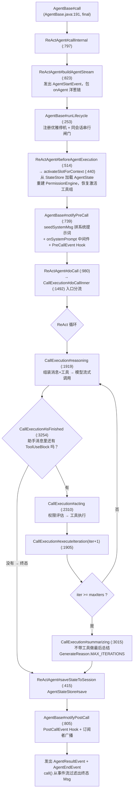
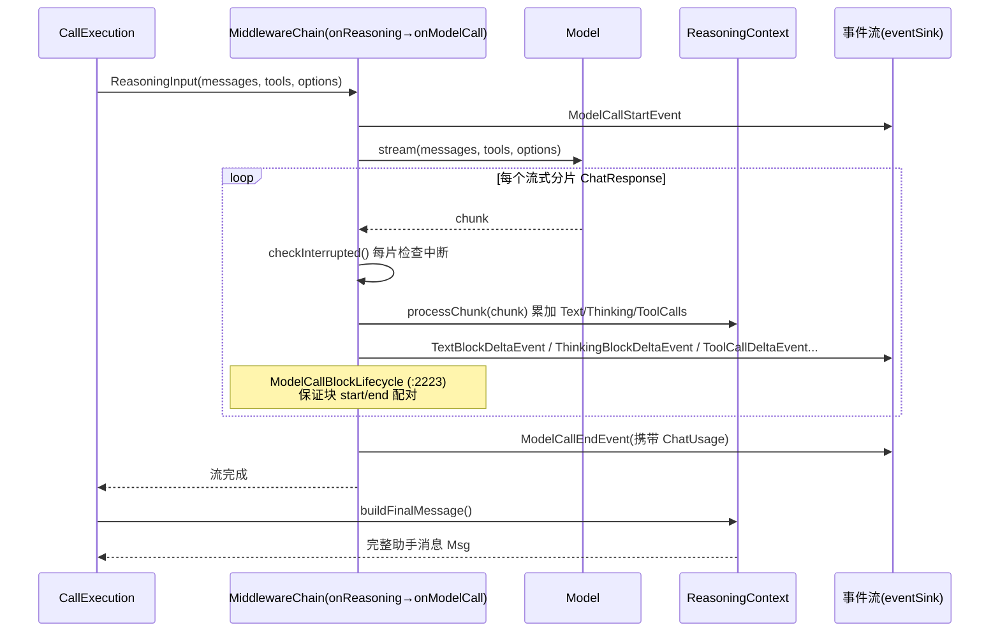
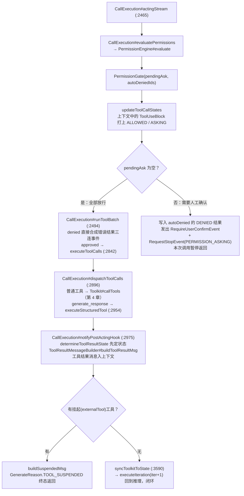
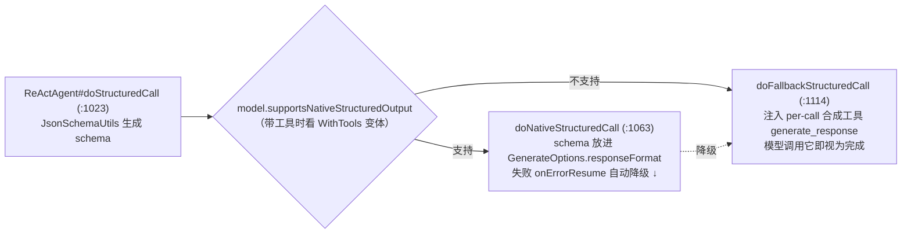

# 第 3 章 ReAct 主循环（核心的核心）

> 文件：`agentscope-core/src/main/java/io/agentscope/core/ReActAgent.java`（4491 行）。
> 这是整个框架的心脏。本章按"类结构 → 入口链 → 推理 → 行动 → 收尾 → 横切能力"的顺序拆解，所有方法名均可在源码中直接定位（附行号，基于 2.0.0 主干，小幅漂移属正常）。

## 3.1 类结构：为什么循环写在内部类里

```
ReActAgent extends AgentBase implements AutoCloseable            (:203)
 ├─ final class CallExecution          (:1419)  ← ReAct 循环全部在这里（非静态内部类）
 │    └─ private final class ModelCallBlockLifecycle (:2223)     ← 流式块 start/end 事件配对
 ├─ private record PermissionGate(pendingAsk, autoDeniedIds)     (:2662)
 ├─ private record PermissionVerdict(...)                        (:2740)
 └─ public static class Builder        (:3667)  ← 约 45 个 builder 方法
```

**`CallExecution` 是 per-call 作用域**（源码 javadoc 明确说明设计意图）：持有本次调用的 `AgentState`、`PermissionEngine`、`slotKey`、`systemMsg`、`eventSink`、结构化输出的 `soTool/soCompleted/soResultMsg` 等。它是非静态内部类，因此可以直接引用外层 agent 的不可变配置（`model` / `toolkit` / `middlewares`）。

**并发模型**：一个 `ReActAgent` 实例可并发服务多个会话。`AgentBase` 通过 Reactor Context 携带三个 key（`CALL_SCOPE_KEY` / `RUNTIME_CONTEXT_KEY` / `SHUTDOWN_REQUEST_ID_KEY`），每次调用的 `CallExecution` 互不干扰；`ReActAgent#callSerializationKey`（`:501`）返回 `(userId, sessionId)`，`AgentBase#serializeOnKey`（`AgentBase.java:345`）据此实现**同会话串行、跨会话并行**。

## 3.2 全局视角：一次 call 的宏观流程

先看整体，再逐段深入。下图节点全部对应本章讲解的方法：



**关键设计**：`call()` 与 `streamEvents()`（`:898`）**共用同一个 `buildAgentStream` 核心**。`call()` 只是对事件流做 `.filter(AgentResultEvent).map(::getResult).takeLast(1).next()`。因此 `onAgent` middleware 链在两条路径上都恰好触发一次；内部递归调的是 `runLifecycle` 而非 `call()`，避免洋葱链被套两层。

## 3.3 入口分流：doCallInner 的 5 种情况

`CallExecution#doCallInner`（`:1492`）先看上下文里有没有"悬而未决"的工具调用，再决定走哪条路：

| # | 条件 | 走向 |
|---|---|---|
| 1 | 上次调用被优雅停机打断（`state.shutdownInterrupted`） | 丢弃客户端重发的重复输入（`msgs = List.of()`），纯从内存恢复 |
| 2 | 开启 `enablePendingToolRecovery` 且存在孤儿 pending 工具 | `maybePatchPendingToolCalls`：合成错误结果补齐后继续 |
| 3 | 无 pending 工具（最常见） | `addToContext(msgs)`（`:1888`）→ `coreAgent()`（`:1897`）→ `executeIteration(0)` |
| 4 | 有 **ASKING** 状态的工具调用（上次因权限暂停） | 必须从 `Msg.METADATA_CONFIRM_RESULTS` 取 `List<ConfirmResult>`，否则抛带完整恢复指引的 `IllegalStateException`；有则 `applyConfirmResults` → `resumeAgent()`（`:1902`，**直接进 acting，不再推理**） |
| 5 | 有 pending（externalTool 挂起）且用户带来了 `ToolResultBlock` | `validateAndAddToolResults` → `resumeAgent()` 或 `coreAgent()` |

情况 4/5 就是 HITL 与外部工具执行的"断点续跑"机制：**暂停不是线程阻塞，而是终态返回 + 状态落库；恢复是带着确认结果重新 call**。无状态服务因此天然支持"确认请求落在副本 A、确认结果回到副本 B"。

## 3.4 推理阶段：reasoning

`CallExecution#reasoning(iter, ignoreMaxIters)`（`:1919`）的骨架：

```
1. iter >= maxIters（且不忽略）→ 转 summarizing()
2. 新建 ReasoningContext（agent/accumulator/ReasoningContext.java，流式分片累加器）
3. checkInterrupted()                          ← 读 state.interruptControl()
4. LegacyHookDispatcher#firePreReasoning       ← 遗留 Hook（可改写输入消息/选项）
5. 组装三要素：
   options = Hook 给的 effectiveGenerateOptions ?: buildGenerateOptions()
   modelInput = prependSystemMsg(输入消息, systemMsg)
   tools = Toolkit#getToolSchemas(state.getToolContext().getActivatedGroups())
6. MiddlewareChain#build(..., MiddlewareBase::onReasoning, reasoningCore)
       .apply(new ReasoningInput(modelInput, tools, options))     ← 洋葱链包住整轮推理
7. 流结束后 ReasoningContext#buildFinalMessage() → 完整助手消息
8. runPostReasoningPipeline(msg, iter)         ← 决定下一步去向
```

`reasoningStream`（`:2093`）内再包一层 `onModelCall` 洋葱链，最终 `modelCallStream`（`:2113`）发出真正的模型请求：



`runPostReasoningPipeline`（`:2049`）的分支决定循环去向：

- Hook 的 `PostReasoningEvent#stopAgent()` → 终态，`GenerateReason.REASONING_STOP_REQUESTED`；
- `PostReasoningEvent#gotoReasoning(msgs)` → 追加消息后 `reasoning(iter+1, true)` 再推一轮；
- **`isFinished(eventMsg)`（`:3254`）判据极简：`msg.getContentBlocks(ToolUseBlock.class).isEmpty()`** —— 模型没再要求调工具，就是自然结束；
- 否则 → `acting(iter)`。

助手消息在此处进入上下文：`state.contextMutable().add(eventMsg)`。

## 3.5 行动阶段：acting 与权限门

`CallExecution#acting(iter)`（`:2310`）：

```
extractPendingToolCalls()      ← 从最近助手消息取尚无结果的 ToolUseBlock (:3286)
LegacyHookDispatcher#firePreActing
MiddlewareChain#build(..., MiddlewareBase::onActing, actingCore)   ← 洋葱链包住工具批次
actingStream(toolCalls, replyId, resultHolder)                     (:2465)
```

**权限门是 acting 的第一站**，流程如下（`PermissionGate` record 见 3.1 类结构）：



`PermissionEngine`（`permission/PermissionEngine.java`）的评估顺序（javadoc 明列，优先级从高到低）：

1. 工具级 **deny** 规则（最高）
2. 工具级 **ask** 规则
3. **工具自身检查（不可绕过）**：`EXPLORE`/`ACCEPT_EDITS` 模式下 readOnly 工具放行、危险路径检查（`ToolBase#isDangerousPath`）、`ToolBase#checkPermissions`
4. 工具级 **allow** 规则
5. `BYPASS` 模式兜底放行
6. 默认 ASK（`DONT_ASK` 模式下转 DENY）

`PermissionMode` 五档：`DEFAULT / ACCEPT_EDITS / EXPLORE / BYPASS / DONT_ASK`。引擎构造时把 `PermissionContextState` 的规则**快照**进自己的可变表；用户确认时勾选"以后都允许"会通过 `addRule()` 追加并随 `AgentState` 持久化。

一个容易被忽略的细节：`runToolBatch` 内部订阅 `executeToolCalls` 时特意用 `deferContextual` 捕获父 Reactor Context 再传下去——否则子 Agent（`AgentSpawnTool`）的事件转发链会断（第 6 章事件流、第 7 章 subagent 都依赖这条链）。

## 3.6 收尾阶段：summarizing 与状态保存

`iter >= maxIters` 时进入 `CallExecution#summarizing`（`:3015`）：

1. 为未完成的 pending 工具合成"因达到最大迭代被取消"的错误结果；
2. `publishEvent(new ExceedMaxItersEvent(...))`；
3. `firePreSummary` → `summaryStream`（结构同 `reasoningStream` 但**不传 tools**，模型只能输出文字总结）→ `firePostSummary`；
4. 结果打上 `GenerateReason.MAX_ITERATIONS` 入上下文；异常走 `handleSummaryError`（`:3207`）。

无论从哪个出口离开循环，`ReActAgent#doCall`（`:980`）都保证 `saveStateToSession(scope)` 执行（`.flatMap(r -> saveStateToSession(scope).thenReturn(r))`），随后 `AgentBase#notifyPostCall`（`AgentBase.java:805`）触发 PostCall Hook 并向 `observe` 订阅者广播。

## 3.7 结构化输出：双路径自动降级

`ReActAgent#doStructuredCall`（`:1023`），供 `call(prompt, IntentResult.class, ctx)` 这类重载使用：



兜底路径的 `generate_response` 工具是 **per-call 的**（挂在 `CallExecution.soTool` 上），执行走 `executeStructuredTool`（`:2954`）而非共享 Toolkit——避免结构化输出污染工具注册表。成功后 `soCompleted=true` 并在 `notifyPostActingHook` 里 `stopAgent()`，循环立即收敛。结果通过 `Msg#hasStructuredData()` / `Msg#getStructuredData(Class)` 读取。

## 3.8 横切能力：中断与优雅停机

**会话级中断**：`ReActAgent#interrupt` 有 4 个重载（`:687`~`:748`），最终都落到 `getAgentState(uid, sid).interruptControl().trigger(InterruptSource, Msg)`。循环在三处检查：reasoning 开始前、**每个模型分片之后**（`modelCallStream` 里 `concatMap(chunk -> checkInterrupted())`）、acting 开始前。因为 `InterruptControl` 挂在 `AgentState` 上且 `transient volatile`，中断只影响目标会话，不影响同实例其他并发调用。被中断时按 `PartialReasoningPolicy` 决定是否保留半截推理消息。

**优雅停机**：`shutdown/GracefulShutdownManager.java`（单例）按 **requestId 而非 agentId** 追踪在途请求（避免同实例并发调用被合并）：`registerRequest` → `bindRequestState` → 停机时 `interruptIfShuttingDown` 触发 SYSTEM 中断并保存状态 → 下次调用 `doCallInner` 开头的 `checkAndClearShutdownInterrupted` 识别"上次被停机打断"，丢弃客户端重发的重复输入（3.3 情况 1）。

## 3.9 customer_work 实战

### 同步对话：resolveAgent + 会话锁 + call

```
CustomerServiceController#chat
→ CustomerServiceService#chat（customer-work-starter/.../service/CustomerServiceService.java）
→ resolveAgent（进程内 LRU 热缓存，MAX_HOT_AGENTS=1000）
→ CustomerServiceAgentFactory#createAgent → ReActAgent.Builder#build
→ contextFor（sessionId "tenantA:conv-1" 拆出 userId/sessionId）
→ ReActAgent#call(userText, ctx) → Msg#getTextContent
```

注意 `CustomerServiceService#withSessionLock` 用 Semaphore 又做了一层应用侧会话串行。框架的 `callSerializationKey` 只保护**单实例内**的同会话并发；应用缓存了多个 Agent 实例、还有降级逻辑要包在锁里，所以自己再锁一层是合理的纵深防御。

### 流式回复：streamEvents 而非废弃的 stream

`CustomerServiceService#chatStream`：`agent.streamEvents(msgs, ctx)` → `publishOn(boundedElastic)` → 只取 `TextBlockDeltaEvent#getDelta` 下发 SSE；一个 delta 都没出现时用 `AgentResultEvent` 补全文。源码注释明确记录：**刻意不用已废弃的 `stream(...)`**——旧 API 会按 `isLast=true` 回放整段再给最终全文，消费侧要做两级去重（第 10 章坑 3）。

### 结构化意图识别：doStructuredCall 的生产姿势

`CustomerServiceService#classifyIntent`：`agent.call(prompt, IntentResult.class, ctx)`，配套三个工程决策——
1. 用独立 sessionId `"intent:" + sessionId` 建一次性 Agent，不污染真实会话上下文；
2. `Mono.defer + subscribeOn(boundedElastic)`：因为 `onSystemPrompt` 中间件会让 `seedSystemMsg` 同步 `block()`，落在 WebFlux 请求线程会炸（第 10 章坑 8）；
3. 已知框架限制（agentscope-java issue #1852/#1699）：兜底路径把 `generate_response` 当普通工具而不用 `tool_choice` 强制，模型可能不调用——未命中就降级为 `other` 兜底并打 `customerwork.intent.classify.errors` 指标。**fail-open 而非重试**，因为意图识别在主链路上，延迟比精度更贵。

### HITL 双层闸门

声明式规则（`config/PermissionConfig.java` 给 `submitRefund`/`transferToHuman` 配 ask/deny，走本章 3.5 的 `PermissionEngine`）+ 观测层 `middleware/HumanApprovalMiddleware`。**真正的拦截靠权限引擎**，middleware 只做告警埋点——把"安全闸门"交给框架不可绕过的那一层，是正确的职责划分。

另一个反面教训：admin 侧 `AdminAgentRuntimeConfig` 必须用 `PermissionMode.BYPASS` 而非 `DEFAULT`——`DEFAULT` 语义是"所有操作都需显式授权规则"，没配规则时工具调用全部进 ASKING，而 admin 的调用方没实现确认回传协议，直接 `IllegalStateException`（对应 3.3 情况 4 的报错，第 10 章坑 6）。
