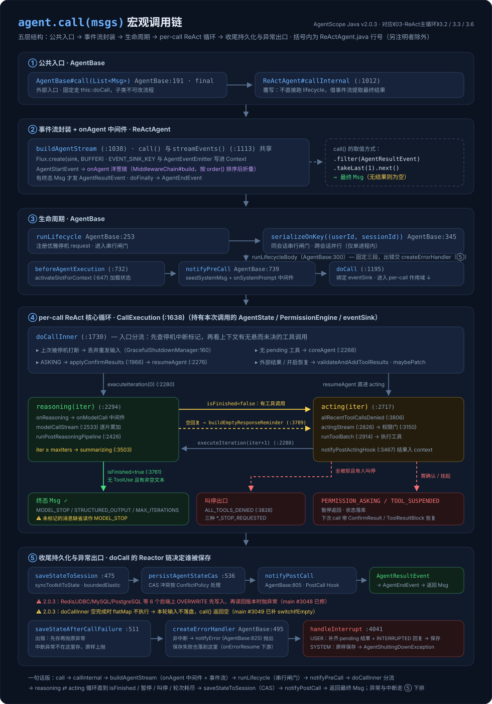
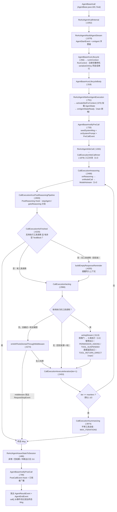
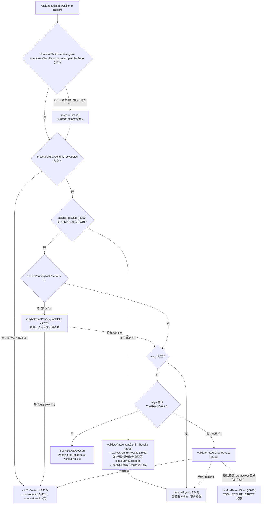
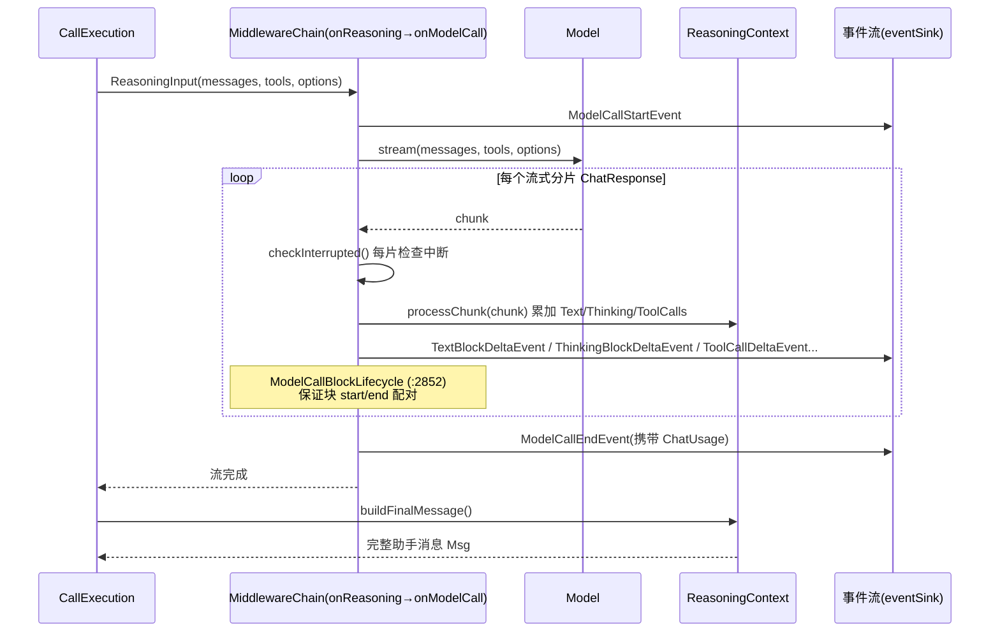
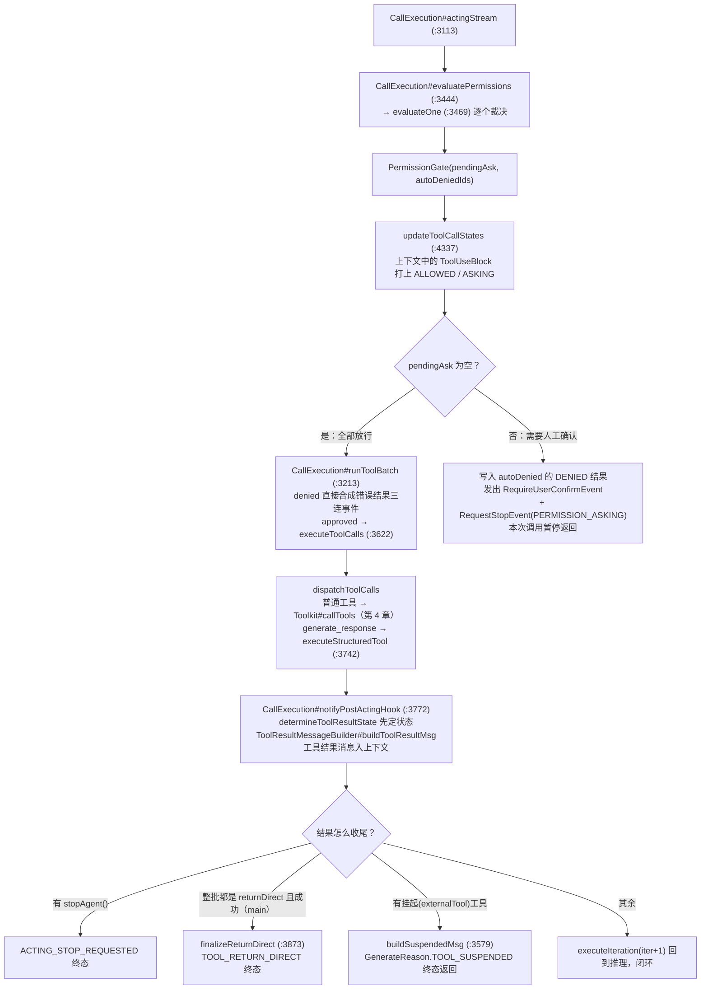
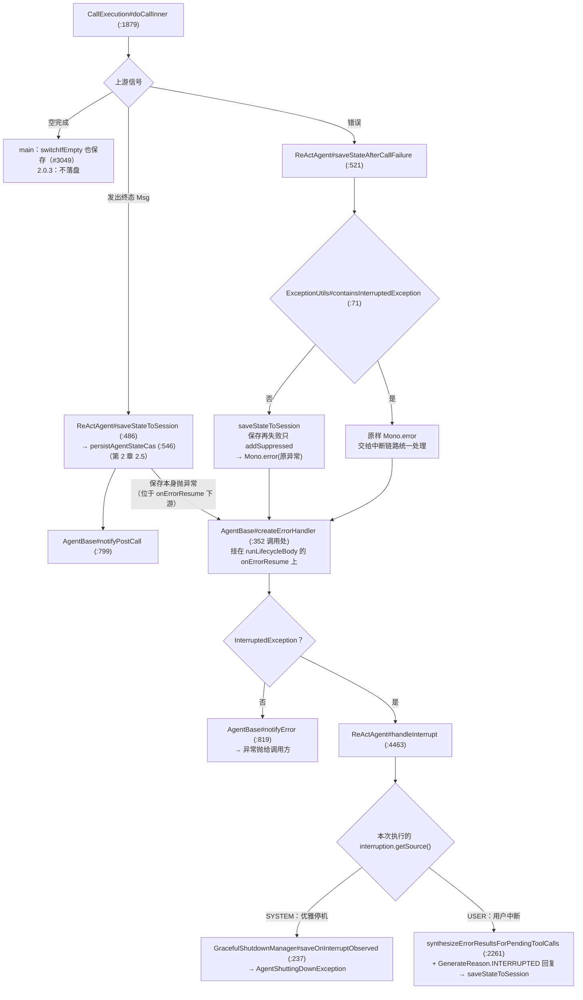
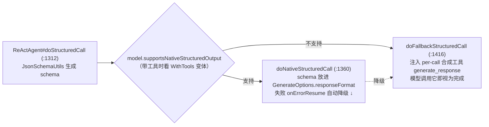

# 第 3 章 ReAct 主循环（核心的核心）

> 文件：`agentscope-core/src/main/java/io/agentscope/core/ReActAgent.java`（main 上 5782 行，v2.0.3 时 5355 行）。
> 这是整个框架的心脏。本章按"类结构 → 入口链 → 推理 → 行动 → 收尾 → 横切能力"的顺序拆解，所有方法名均可在源码中直接定位。行号已按上游 main `e9721285`（2026-10-01，`2.0.4-SNAPSHOT`，未发版）校准；v2.0.3 之后才有的行为单独标注"main 已变更（未发版）"。

先看一张五层结构的全景图（各层细节在本章对应小节展开）：



## 3.1 类结构：为什么循环写在内部类里

```
ReActAgent extends AgentBase implements AutoCloseable            (:220)
 ├─ final class CallExecution          (:1764)  ← ReAct 循环全部在这里（非静态内部类）
 │    ├─ private final class ModelCallBlockLifecycle (:2852)     ← 流式块 start/end 事件配对
 │    ├─ private record PermissionGate(pendingAsk, autoDeniedIds) (:3430)
 │    └─ private record PermissionVerdict(use, behavior)          (:3508)
 └─ public static class Builder        (:4923)  ← 43 个 builder 方法
```

**`CallExecution` 是 per-call 作用域**（源码 javadoc 明确说明设计意图）：持有本次调用的 `AgentState`、`PermissionEngine`、`slotKey`、`systemMsg`、`eventSink`、加载时的版本号 `loadedVersion` 与上下文长度 `loadedContextSize`（第 2 章 2.5 的 CAS 与 `APPEND_MERGE` 用），结构化输出的 `soTool/soCompleted/soResultMsg`，以及本次调用的中断信号 `interruption`。它是非静态内部类，因此可以直接引用外层 agent 的不可变配置（`model` / `toolkit` / `middlewares`），又把每次调用的可变状态隔离在自己身上。

**并发模型**：一个 `ReActAgent` 实例可并发服务多个会话。`AgentBase` 通过 Reactor Context 携带 `CALL_SCOPE_KEY` / `RUNTIME_CONTEXT_KEY` / `SHUTDOWN_REQUEST_ID_KEY`，每次调用的 `CallExecution` 互不干扰；`ReActAgent#callSerializationKey`（`:738`）返回 `(userId, sessionId)`，`AgentBase#serializeOnKey`（`AgentBase.java:106`）据此实现**同会话串行（FIFO）、跨会话并行**。

> **main 已变更（未发版）**：#3279 补了两处并发隔离。① v2.0.3 的 agent 上有一个共享的 `activeRc` 字段，并发调用可能读到别人的 `RuntimeContext`；main 改为沿调用链显式传递（`beforeAgentExecution(msgs, rc, control)`，`:751`）。② 中断信号从 `AgentState`（`transient volatile InterruptControl`）挪到每次执行自己的 `RunControl` 上，`CallExecution.interruption` 在 `beforeAgentExecution` 里取自 `control.interruption()`（`:780`），见 3.8。另外 #3283 让 `CallExecution` 持有 `activeToolkit` + 不可变的 `toolRequestConfig`，共享 `Toolkit` 不再被每次调用改写（第 4 章）。

### AgentRun：一次执行的句柄（main 新增）

> **main 已变更（未发版）**：#3279 新增 `agent/AgentRun`（154 行）与 `agent/RunControl`（122 行）。

`ReActAgent#prepareRun(msgs, ctx)`（`:1151`）/ `prepareCall(msgs, ctx)`（`:1163`）返回一个**惰性、只能订阅一次**的执行句柄，调用并不立刻开始：

| 能力 | API | 说明 |
|---|---|---|
| 身份 | `runId()` | 直接采用 `ctx.getRunId()`（第 2 章 2.6），句柄和上下文指同一次执行 |
| 启动 | `stream()` | 订阅即开始；第二次订阅直接报 `IllegalStateException("AgentRun permits one subscription")` |
| 状态 | `status()` / `termination()` | `CREATED → QUEUED → RUNNING → COMPLETED / FAILED / CANCELLED` |
| 取消 | `cancel()` | 立即取消订阅，排队中的也能取消 |
| 中断 | `interrupt(msg)` | 运行中协作式中断（走 3.8 的 `handleInterrupt`）；还没进入执行的直接取消 |

`RunControl` 的 javadoc 第一句是 "Runtime-only control for one execution; never stored in conversation state"——控制信息只活在这一次执行里，不进档案。`AgentBase#runInContext`（`AgentBase.java:266`）在 Reactor Context 里找 `RunControl.CONTEXT_KEY`：通过 `AgentRun` 进来的用它自带的控制；直接 `call()` 的现场新建一个。所以老的 `call()` / `streamEvents()` 用法完全不变，`AgentRun` 是多出来的一层。

为什么要单独一个句柄：前端点"停止"时，要停的是**这一次**执行，而不是"这个会话"。会话级的中断标志分不清"同一会话里正在跑的 A"和"排在后面的 B"（同会话串行），用句柄就没有歧义。

## 3.2 全局视角：一次 call 的宏观流程

先看整体，再逐段深入。下图节点全部对应本章讲解的方法：


```mermaid
flowchart TB
    CALL["AgentBase#call (AgentBase.java:183, final)"] --> CI["ReActAgent#callInternal (:1052)"]
    CI --> BAS["ReActAgent#buildAgentStream (:1079)<br/>AgentStartEvent + onAgent 洋葱链"]
    BAS --> RL["AgentBase#runLifecycle (:256) → runInContext<br/>RunControl · 注册优雅停机 · serializeOnKey 同会话串行"]
    RL --> RLB["AgentBase#runLifecycleBody (:318)"]
    RLB --> BE["ReActAgent#beforeAgentExecution (:751)<br/>→ activateSlotForContext (:670) 加载 AgentState<br/>→ onAgentStateReady（main 新增）"]
    BE --> PRE["AgentBase#notifyPreCall (:733)<br/>seedSystemMsg + onSystemPrompt + PreCallEvent"]
    PRE --> DC["ReActAgent#doCall (:1263)<br/>→ CallExecution#doCallInner (:1879) 入口分流（3.3）"]
    DC --> R["CallExecution#reasoning (:2468)<br/>onReasoning → onModelCall → Model#stream（3.4）"]
    R --> PIPE["CallExecution#runPostReasoningPipeline (:2603)<br/>PostReasoning Hook：stopAgent / gotoReasoning 分支"]
    PIPE --> FIN{"CallExecution#isFinished (:4220)<br/>无待执行工具调用 且 有非空 TextBlock？"}
    FIN -->|"是"| DONE(["终态 Msg"])
    FIN -->|"否：有工具调用"| A["CallExecution#acting (:2966)"]
    FIN -->|"否：无工具调用（空回复）"| REM["buildEmptyResponseReminder (:4255)<br/>提醒写入上下文"]
    REM --> A
    A --> PEND{"有待执行的工具调用？"}
    PEND -->|"有"| TOOLS["actingStream (:3113)<br/>权限门 → 工具执行（3.5）<br/>暂停出口：PERMISSION_ASKING / TOOL_SUSPENDED<br/>直接返回出口：TOOL_RETURN_DIRECT（main）"]
    PEND -->|"无，且最近一轮全被拒"| ALLD["emitAllToolsDeniedThroughMiddleware (:4274)"]
    ALLD -->|"middleware 发出 RequestStopEvent"| DONE
    ALLD -->|"无人叫停"| ITER
    PEND -->|"无（空回复那一轮）"| ITER
    TOOLS --> ITER["CallExecution#executeIteration(iter+1) (:2453)"]
    ITER --> MAX{"iter >= maxIters ?<br/>（默认 10）"}
    MAX -->|"否"| R
    MAX -->|"是"| SUM["CallExecution#summarizing (:3974)<br/>不带工具总结 · MAX_ITERATIONS"]
    SUM --> DONE
    DONE --> SAVE["ReActAgent#saveStateToSession (:486)<br/>异常 / 空结果 / 中断出口见 3.6"]
    SAVE --> POST["AgentBase#notifyPostCall (:799)<br/>PostCallEvent Hook + 订阅者广播"]
    POST --> RES["发出 AgentResultEvent + AgentEndEvent<br/>call() 从事件流过滤出终态 Msg"]
```

**关键设计**：`call()` 与 `streamEvents()`（`:1206`）**共用同一个 `buildAgentStream` 核心**。`call()` 只是对事件流做 `.filter(AgentResultEvent).map(::getResult).takeLast(1).next()`。因此 `onAgent` middleware 链在两条路径上都恰好触发一次；内部调的是 `runLifecycle` 而非 `call()`，避免洋葱链被套两层。

## 3.3 入口分流：doCallInner 的 5 种情况

`CallExecution#doCallInner`（`:1879`）先看上下文里有没有"悬而未决"的工具调用，再决定走哪条路：

| # | 条件 | 走向 |
|---|---|---|
| 1 | 上次调用被优雅停机打断（`state.shutdownInterrupted`） | 丢弃客户端重发的重复输入（`msgs = List.of()`），纯从内存恢复 |
| 2 | 开启 `enablePendingToolRecovery` 且存在孤儿 pending 工具 | `maybePatchPendingToolCalls`（`:2202`）：合成错误结果补齐后继续 |
| 3 | 无 pending 工具（最常见） | `addToContext(msgs)`（`:2430`）→ `coreAgent()`（`:2441`）→ `executeIteration(0)` |
| 4 | 有 **ASKING** 状态的工具调用（上次因权限暂停） | 必须从 `Msg.METADATA_CONFIRM_RESULTS` 取 `List<ConfirmResult>`，否则抛带完整恢复指引的 `IllegalStateException`；有则 `applyConfirmResults`（`:2146`）→ `resumeAgent()`（`:2449`，**直接进 acting，不再推理**） |
| 5 | 有 pending（externalTool 挂起）且用户带来了 `ToolResultBlock` | `validateAndAddToolResults`（`:2315`）→ `resumeAgent()` 或 `coreAgent()`；main 上若整批都是 returnDirect 工具，直接收尾（3.5） |

同一段逻辑按源码分支顺序画成图（每个菱形对应 `doCallInner` 里的一个 `if`）：


```mermaid
flowchart TB
    DCI["CallExecution#doCallInner (:1879)"] --> SD{"GracefulShutdownManager#<br/>checkAndClearShutdownInterruptedForState (:161)"}
    SD -->|"是：上次被停机打断（情况 1）"| DROP["msgs = List.of()<br/>丢弃客户端重发的输入"]
    SD -->|"否"| P
    DROP --> P{"MessageUtils#pendingToolUseIds<br/>为空？"}
    P -->|"是：最常见（情况 3）"| NORMAL["addToContext (:2430)<br/>→ coreAgent (:2441) → executeIteration(0)"]
    P -->|"否"| ASK{"askingToolCalls (:4356)<br/>有 ASKING 状态的调用？"}
    ASK -->|"是（情况 4）"| CONF["validateAndAcceptConfirmResults (:2011)<br/>→ extractConfirmResults (:1981)<br/>取不到则抛带恢复指引的 IllegalStateException<br/>→ applyConfirmResults (:2146)"]
    CONF --> RESUME["resumeAgent (:2449)<br/>直接进 acting，不再推理"]
    ASK -->|"否"| REC{"enablePendingToolRecovery ?"}
    REC -->|"是（情况 2）"| PATCH["maybePatchPendingToolCalls (:2202)<br/>为孤儿调用合成错误结果"]
    PATCH -->|"补齐后无 pending"| NORMAL
    PATCH -->|"仍有 pending"| EMPTY
    REC -->|"否"| EMPTY{"msgs 为空？"}
    EMPTY -->|"是"| RESUME
    EMPTY -->|"否"| TR{"msgs 里带 ToolResultBlock？"}
    TR -->|"是（情况 5）"| VAL["validateAndAddToolResults (:2315)"]
    VAL -->|"整批都是 returnDirect 且成功（main）"| RD["finalizeReturnDirect (:3873)<br/>TOOL_RETURN_DIRECT 终态"]
    VAL -->|"仍有 pending"| RESUME
    VAL -->|"全部补齐"| NORMAL
    TR -->|"否"| THROW["IllegalStateException<br/>Pending tool calls exist without results"]
```

情况 4/5 就是 HITL 与外部工具执行的"断点续跑"机制：**暂停不是线程阻塞，而是终态返回 + 状态落库；恢复是带着确认结果重新 call**。无状态服务因此天然支持"确认请求落在副本 A、确认结果回到副本 B"。

**情况 4 的确认结果怎么写回**（`applyConfirmResults`，`:2146`）：同意的调用改成 `ToolCallState.ALLOWED`，确认时附带的规则通过 `permissionEngine.addRule` 追加（"以后都允许"）；拒绝的调用直接写入一条 `DENIED` 的工具结果。

> **main 已变更（未发版）**：人工拒绝这条路有两处修正。① #3104、#2546：v2.0.3 只把 DENIED 结果写进上下文，**不发任何工具结果事件**，`streamEvents` 的消费方（AG-UI 前端等）看不到被拒的结果；规则自动拒绝那条路却会发 `ToolResultStart → TextDelta → End` 三连。main 上两条路对齐，人工拒绝也发三连（`deniedToolResultEvents`，`:2192`）。② #2546：`ConfirmResult` 新增可选的 `reason`，用户拒绝时给的理由会成为写回模型上下文的 DENIED 结果文本，模型能看懂"为什么被拒"再换路；不传则仍是默认的 `Permission denied by user`。

## 3.4 推理阶段：reasoning

`CallExecution#reasoning(iter, ignoreMaxIters)`（`:2468`）的骨架：

```
1. iter >= maxIters（且不忽略）→ 转 summarizing()
2. 新建 ReasoningContext（agent/accumulator/ReasoningContext.java，流式分片累加器）
3. checkInterrupted()                          ← 读本次执行自己的 interruption（main）
4. LegacyHookDispatcher#firePreReasoning       ← 遗留 Hook（可改写输入消息/选项）
5. 组装三要素：
   options = Hook 给的 effectiveGenerateOptions ?: buildGenerateOptions()
            （原生结构化输出时再并入 responseFormat）
   modelInput = prependSystemMessage(输入消息, systemMsg)
   tools = activeToolkit.getToolSchemas(激活的工具组, toolRequestConfig)
          （兜底结构化输出时再追加 per-call 的 generate_response）
6. MiddlewareChain#build(..., MiddlewareBase::onReasoning, reasoningCore)
       .apply(new ReasoningInput(modelInput, tools, options))     ← 洋葱链包住整轮推理
7. 流结束后 ReasoningContext#buildFinalMessage() → 完整助手消息（含 ChatUsage 与厂商 metadata）
8. runPostReasoningPipeline(msg, iter)         ← 决定下一步去向
```

`reasoningStream`（`:2673`）内再包一层 `onModelCall` 洋葱链，最终 `modelCallStream`（`:2709`）发出真正的模型请求：


```mermaid
sequenceDiagram
    participant R as CallExecution#reasoning
    participant MW as MiddlewareChain(onReasoning→onModelCall)
    participant M as Model#stream（第 5 章）
    participant RC as ReasoningContext
    participant SINK as 事件流(eventSink)

    R->>MW: ReasoningInput(messages, tools, options)
    MW->>SINK: ModelCallStartEvent
    MW->>M: stream(messages, tools, options)
    loop 每个流式分片 ChatResponse
        M-->>MW: chunk
        MW->>MW: checkInterrupted()  每片检查中断
        MW->>RC: processChunk(chunk) 累加 Text/Thinking/ToolCalls
        MW->>SINK: TextBlockDeltaEvent / ThinkingBlockDeltaEvent / ToolCallDeltaEvent...
        Note over MW: ModelCallBlockLifecycle (:2852)<br/>保证块 start/end 配对
    end
    MW->>SINK: ModelCallEndEvent(携带 ChatUsage)
    MW-->>R: 流完成
    R->>RC: buildFinalMessage()
    RC-->>R: 完整助手消息 Msg
```

**`ReasoningContext` 会把厂商私有 metadata 一路带到终态消息上**（`agent/accumulator/ReasoningContext.java`）：累加分片时把每个 `ChatResponse.getMetadata()` 并进一张 `responseMetadata` 表，`buildFinalMessage()` 以它为底再叠加 `ChatUsage`，最终写进 `Msg.metadata`。这条通路是给"必须原样回传给厂商"的字段准备的。2.0.3 在这条通路上有两处保真缺陷（流式拼接时思考块的 metadata 整个丢失、`thought_signature` 经会话持久化后丢失），main 已修复但未发版，详见第 2 章 2.1。

**middleware 在推理中途叫停**：`onReasoning` 链里的 middleware 可以发 `RequestStopEvent`。`reasoning` 把流跑完后，若收到过叫停，先把这一轮已经生成的消息存进上下文（下次调用才能从 pending 的工具调用续上），再打上叫停给的 `GenerateReason` 返回，并跳过遗留的 PostReasoning Hook。

`runPostReasoningPipeline`（`:2603`）的分支决定循环去向：

- Hook 的 `PostReasoningEvent#stopAgent()` → 终态，`GenerateReason.REASONING_STOP_REQUESTED`；
- `PostReasoningEvent#gotoReasoning(msgs)` → 追加消息后 `reasoning(iter+1, true)` 再推一轮；
- **`isFinished(eventMsg)`（`:4220`）判两件事**：没有待执行的工具调用，**且**至少有一个非空白的 `TextBlock`，才算自然结束；
- 否则 → `checkInterrupted().then(acting(iter))`。

> **main 已变更（未发版）**：`isFinished` 认得服务端工具（Anthropic、Gemini 那些由厂商一侧执行的搜索、代码执行，第 2 章 2.2）。同一条助手消息里，若所有工具调用都是 `serverTool` 且结果已经随消息返回，就没有需要本地执行的东西，循环直接结束；服务端工具调用还没有结果的（如 `pause_turn`）则继续，回到厂商那边接着跑。

`isFinished` 的第二个条件是后加的，起因值得记一笔（issue #2750）：推理模型偶尔把整个最终答案写进 `reasoning_content` 通道，`content` 留空、`finish_reason=stop`、也没有工具调用。旧判据只看"有没有工具调用"，于是 ReAct 循环**静默终止**——下游一个 `TEXT_BLOCK_*` 事件都收不到，会话历史里留下一条空的助手消息，日志里也没有任何异常。kimi-k2.6、DeepSeek-R1 这类走 OpenAI 兼容端点的推理模型都可能踩到。

现在的处理是"看见空回复就再要一次"：

```
runPostReasoningPipeline 里，若 !hasToolCalls(eventMsg)（即 isFinished 判否是因为内容为空）
  → log.warn 记下 model / iter
  → state.contextMutable().add(buildEmptyResponseReminder())   (:4255)
  → 继续走 acting(iter)：没有待执行的工具，acting 直接进下一轮 reasoning，模型会看到这条提醒
```

`buildEmptyResponseReminder` 造的是一条 `role=USER / name=system` 的合成消息，带 `METADATA_SYNTHETIC=true` 与 `METADATA_REMINDER_KIND="empty_response"`，内容是一句 `<system-reminder>` 提示模型"把最终答案写进 content 通道"。它和 `TaskReminderMiddleware` 的待办提醒不同——**这条会写进 `AgentState.context` 并随会话持久化**，纠正信号对后续轮次持续可见。累积量由 `maxIters` 天然封顶。

助手消息在此处进入上下文：`state.contextMutable().add(eventMsg)`。

## 3.5 行动阶段：acting 与权限门

`CallExecution#acting(iter)`（`:2966`）：

```
① 取待执行的工具调用 extractPendingToolCalls
   为空 → 最近一轮全被拒？ MessageUtils#allToolCallsDenied
            是 → emitAllToolsDeniedThroughMiddleware (:4274)
            否 → executeIteration(iter+1)
② LegacyHookDispatcher#firePreActing
③ MiddlewareChain#build(..., MiddlewareBase::onActing, actingCore)   ← 洋葱链包住工具批次
   actingStream(toolCalls, replyId, resultHolder)                     (:3113)
④ 处理结果：叫停 → 挂起 → returnDirect → 回到推理（见下文）
```

**权限门是 actingStream 的第一站**，流程如下（`PermissionGate` record 见 3.1 类结构）：


```mermaid
flowchart TB
    START["CallExecution#actingStream (:3113)"] --> EVAL["CallExecution#evaluatePermissions (:3444)<br/>→ evaluateOne (:3469) 逐个裁决"]
    EVAL --> GATE["PermissionGate(pendingAsk, autoDeniedIds)"]
    GATE --> UPD["updateToolCallStates (:4337)<br/>上下文中的 ToolUseBlock 打上 ALLOWED / ASKING"]
    UPD --> Q{"pendingAsk 为空？"}
    Q -->|"是：全部放行"| RUN["CallExecution#runToolBatch (:3213)<br/>denied 直接合成错误结果三连事件<br/>approved → executeToolCalls (:3622)"]
    Q -->|"否：需要人工确认"| ASK["写入 autoDenied 的 DENIED 结果<br/>发出 RequireUserConfirmEvent<br/>+ RequestStopEvent(PERMISSION_ASKING)<br/>本次调用暂停返回"]
    RUN --> DISPATCH["dispatchToolCalls<br/>普通工具 → Toolkit#callTools（第 4 章）<br/>generate_response → executeStructuredTool (:3742)"]
    DISPATCH --> POST["CallExecution#notifyPostActingHook (:3772)<br/>determineToolResultState 先定状态<br/>ToolResultMessageBuilder#buildToolResultMsg<br/>工具结果消息入上下文"]
    POST --> NEXT{"结果怎么收尾？"}
    NEXT -->|"有 stopAgent()"| STOP["ACTING_STOP_REQUESTED 终态"]
    NEXT -->|"整批都是 returnDirect 且成功（main）"| RD["finalizeReturnDirect (:3873)<br/>TOOL_RETURN_DIRECT 终态"]
    NEXT -->|"有挂起(externalTool)工具"| SUSP["buildSuspendedMsg (:3579)<br/>GenerateReason.TOOL_SUSPENDED 终态返回"]
    NEXT -->|"其余"| ITER["executeIteration(iter+1) 回到推理，闭环"]
```

**先看有没有必要进引擎**：`evaluatePermissions`（`:3444`）开头判 `state.getPermissionContext().isTrivial()`（`:3448`）——当 `mode == DEFAULT` 且 workingDirectories / allow / deny / ask 四张表全空时，整个 `PermissionEngine` 被跳过，`evaluateOne` 直接调 `ToolBase#checkPermissions`。没配任何权限规则的普通 Agent 因此不为权限付出任何额外代价。另外，已被用户确认提升为 `ToolCallState.ALLOWED` 的工具调用会在 `evaluateOne` 最开头短路返回 `ALLOW`，不重复过引擎。紧接着还有第二个短路：工具如果**不是 `ToolBase` 子类**（`:3475`），同样直接 `ALLOW`。core 自带的 `ShellCommandTool`、`SubAgentTool` 就属于这种情况，权限规则对它们不生效（第 4 章 4.2）。

裁决结果是 `PermissionBehavior` 四值：`DENY`（进 autoDeniedIds）、`ASK`（进 pendingAsk）、`ALLOW` / `PASSTHROUGH`（放行执行）。

真正进引擎时，`PermissionEngine`（`permission/PermissionEngine.java`，入口 `checkPermission(tool, toolInput)`）的评估顺序（javadoc 明列，优先级从高到低）：

1. 工具级 **deny** 规则（最高）
2. 工具级 **ask** 规则
3. **工具自身检查（不可绕过）**：`EXPLORE`/`ACCEPT_EDITS` 模式下 readOnly 工具放行、危险路径检查（`ToolBase#isDangerousPath`）、`ToolBase#checkPermissions`
4. 工具级 **allow** 规则
5. `BYPASS` 模式兜底放行
6. 默认 ASK（`DONT_ASK` 模式下转 DENY）

`PermissionMode` 五档：`DEFAULT / ACCEPT_EDITS / EXPLORE / BYPASS / DONT_ASK`。引擎构造时把 `PermissionContextState` 的规则**快照**进自己的可变表；用户确认时勾选"以后都允许"会通过 `addRule()` 追加并随 `AgentState` 持久化。

**全员被拒是一个独立出口**。`MessageUtils#allToolCallsDenied`（`util/MessageUtils.java:233`）扫上下文，确认最近一轮的每个 `ToolUseBlock` 都拿到了 `ToolResultState.DENIED` 的结果（判据是 `toolIds.size() == resultStates.size()` 且全部 DENIED——**少一个结果就不算**，避免把"还没执行完"误判成"全被拒"）。命中后走 `emitAllToolsDeniedThroughMiddleware`（`:4274`）：它临时搭一条 `onActing` 洋葱链，只为把 `AllToolsDeniedEvent` 发出去，给 middleware 一个表态的机会——

- middleware 发出 `RequestStopEvent` → agent 立刻返回，终态 `GenerateReason.ALL_TOOLS_DENIED`；
- 没有 middleware 表态 → 继续下一轮迭代（模型会看到一堆 DENIED 结果，自己换路）。

默认行为是"继续"而不是"停止"，因为用户拒绝某个工具往往只是想让 agent 换个做法，而不是终止整个任务。要改成硬停，就自己写一个 middleware 监听这个事件。

**收尾的优先级**（`acting` 的最后一段）：middleware 在 acting 中途叫停的先返回（`PERMISSION_ASKING` 时返回最后一条助手消息，其余用 `buildStopMsg`）；然后逐个触发 PostActing Hook 并把**每个已执行工具的结果都落进上下文**，最早的 `stopAgent()` 胜出（`earliestStopOrLast`，`:3074`）——不用 `takeUntil` 是为了避免已经跑完的工具没有 tool_result，留下悬空的 tool_use；之后才是 returnDirect、挂起、回到推理。

> **main 已变更（未发版）**：**returnDirect**（#2891）。`@Tool(returnDirect = true)` 或 `ToolBase.Builder#returnDirect(true)` 声明的工具，执行成功后**结果直接作为本轮的最终答案返回，不再多调一次模型**。几条规则（`Tool.java` 的 javadoc 与 `isReturnDirectToolCall`，`:3835`）：
> - 这个标记**对模型不可见**，不进工具 schema，不影响模型要不要调它，只决定调完以后怎么办；
> - 一批调用里，**每个**执行的工具都是 returnDirect、且结果**全部 SUCCESS**、没有挂起的，才短路；混了普通工具或有失败，全部结果照常喂回模型；
> - 收尾由 `finalizeReturnDirect`（`:3873`）完成：把各工具结果的内容块拼成一条助手消息，打 `TOOL_RETURN_DIRECT` 与 `_tool_return_direct` 标记，结果为空时给 `(no output)`；同时按普通回答的样子发一组 `TextBlockStart/Delta/End` 事件，前端无需特殊处理；
> - 上下文里那条 tool_result 被换成一句占位话（"结果已作为本轮最终输出展示给用户"），下一轮模型能看到"这件事已经交付"，不会把大段结果再读一遍；
> - 外部工具（`externalTool`）挂起后由调用方带结果续跑时同样生效（3.3 情况 5），但跨多次续跑才补齐的一批，或者外部结果和框架执行结果混在一起的，一律喂回模型。
>
> 适用场景：工具本身产出的就是要给用户的最终内容（查询结果卡片、生成好的报告），再让模型复述一遍只会多花一次调用、还可能改写原文。

一个容易被忽略的细节：`runToolBatch` 内部订阅 `executeToolCalls` 时特意用 `deferContextual` 捕获父 Reactor Context 再传下去——否则子 Agent（`AgentSpawnTool`）的事件转发链会断（第 6 章事件流、第 7 章 subagent 都依赖这条链）。

但只 `putAll(parentCtx)` 还不够。走 `streamEvents()` 时，本次调用的 sink 是绑在 `CallExecution.eventSink` 字段上的，它并**不在** Reactor Context 里——父 Context 原样复制过去，子 Agent 一查 `AgentEventEmitter.CONTEXT_KEY` 查不到，事件就地丢弃（issue #2482：`HarnessAgent#streamEvents` 里 `agent_spawn` 起的本地同步子 Agent，事件全部收不到）。所以合并 Context 时会补一手：

```
merged = ctx.putAll(parentCtx)
若 merged 既无 SubagentEventBus.CONTEXT_KEY 也无 AgentEventEmitter.CONTEXT_KEY：
    eventSink != null            → 放入 (AgentEventEmitter) eventSink::next
    否则 externalEventEmitter != null → 放入 externalEventEmitter
```

判空顺序即优先级：**已有的转发器不被覆盖**（子 Agent 自己可能已挂在某条链上），只有"确实没人接"时才把本 agent 的 sink 补进去。`externalEventEmitter` 是本 agent 作为**子 Agent** 时父方注入的转发器（见 3.1 的字段说明），因此这段逻辑同时管住了"父→子"和"祖→父→子"两层嵌套。

> **main 已变更（未发版）**：v2.0.3 在工具执行后调用 `syncToolkitToState` 把共享 Toolkit 的激活分组抄回状态；#3283 删除了这一步，激活分组只存在 `AgentState` 里，取 schema 时按次传入（第 2 章 2.4、第 4 章）。

## 3.6 收尾阶段：summarizing 与状态保存

`iter >= maxIters`（Builder 默认 10）时进入 `CallExecution#summarizing`（`:3974`）：

1. 为未完成的 pending 工具合成"因达到最大迭代被取消"的错误结果；
2. `publishEvent(new ExceedMaxItersEvent(...))`；
3. `firePreSummary` → `summaryStream`（结构同 `reasoningStream` 但**不传 tools**，模型只能输出文字总结）→ `firePostSummary`；
4. 结果打上 `GenerateReason.MAX_ITERATIONS` 入上下文；异常走 `handleSummaryError`（`:4183`）。

> **main 已变更（未发版）**：2.0.3 的 `handleSummaryError` 构造的错误消息**没有设置 reason**，而 `Msg#getGenerateReason()` 缺省返回 `MODEL_STOP`，调用方会把"轮次耗尽、总结也失败"误判为正常结束。main 上这条消息明确打 `MAX_ITERATIONS`，并加 `_summary_failed=true`（#2757，第 2 章 2.2）。

`ReActAgent#doCall`（`:1263`）在循环外面挂了保存，随后 `AgentBase#notifyPostCall`（`AgentBase.java:799`）触发 PostCall Hook 并向 `observe` 订阅者广播。保存的写法决定了它覆盖哪些出口（main）：

```java
return scope.doCallInner(msgs)
        .onErrorResume(error -> saveStateAfterCallFailure(scope, error))   // 出错：先存再抛原异常
        .flatMap(result -> saveStateToSession(scope).thenReturn(result))   // 有结果：存完再返回
        .switchIfEmpty(Mono.defer(() ->
                saveStateToSession(scope).then(Mono.<Msg>empty())));       // 空结果：也存
```

> **main 已变更（未发版）**：`flatMap` 只在上游**发出元素**时才执行。2.0.3 没有最后那行 `switchIfEmpty`，所以 `doCallInner` **以空 `Mono` 完成**时不落盘——例如模型流一个分片都没返回（普通推理、结构化输出的原生与兜底两条路径都会出现），这一轮用户的输入就不会被保存，下次调用看不到上一个问题。main 上两处 `doCall` 都补了这一行（#3049）。

把正常、空结果、异常、中断四类出口放在一起看，状态在哪一步落盘、异常在哪一层被接住：


```mermaid
flowchart TB
    DCI["CallExecution#doCallInner (:1879)"] --> SIG{"上游信号"}
    SIG -->|"发出终态 Msg"| SAVE["ReActAgent#saveStateToSession (:486)<br/>→ persistAgentStateCas (:546)（第 2 章 2.5）"]
    SIG -->|"空完成"| SKIP["main：switchIfEmpty 也保存（#3049）<br/>2.0.3：不落盘"]
    SIG -->|"错误"| SF["ReActAgent#saveStateAfterCallFailure (:521)"]
    SF --> INT{"ExceptionUtils#containsInterruptedException (:71)"}
    INT -->|"否"| SF2["saveStateToSession<br/>保存再失败只 addSuppressed<br/>→ Mono.error(原异常)"]
    INT -->|"是"| PASS["原样 Mono.error<br/>交给中断链路统一处理"]
    SAVE --> POST["AgentBase#notifyPostCall (:799)"]
    SAVE -->|"保存本身抛异常<br/>（位于 onErrorResume 下游）"| EH
    SF2 --> EH["AgentBase#createErrorHandler (:352 调用处)<br/>挂在 runLifecycleBody 的 onErrorResume 上"]
    PASS --> EH
    EH --> IE{"InterruptedException？"}
    IE -->|"否"| NE["AgentBase#notifyError (:819)<br/>→ 异常抛给调用方"]
    IE -->|"是"| HI["ReActAgent#handleInterrupt (:4463)"]
    HI --> SRC{"本次执行的 interruption.getSource()"}
    SRC -->|"SYSTEM：优雅停机"| SYS["GracefulShutdownManager#saveOnInterruptObserved (:237)<br/>→ AgentShuttingDownException"]
    SRC -->|"USER：用户中断"| USR["synthesizeErrorResultsForPendingToolCalls (:2261)<br/>+ GenerateReason.INTERRUPTED 回复<br/>→ saveStateToSession"]
```

图里有三个值得记住的边界：**中断不在 `doCall` 这层存**，统一交给 `handleInterrupt` 处理；**保存失败会越过 `saveStateAfterCallFailure`**，因为保存挂在 `onErrorResume` 的下游；**两种中断的落盘方式不同**：用户中断会先给悬空的工具调用合成错误结果，再追加一条 `INTERRUPTED` 回复后保存，存下来的状态是自洽的；停机中断不产出回复，由 `saveOnInterruptObserved` 通过 `ActiveRequestContext#saveState` 按当时的状态**原样保存**，悬空的工具调用会留到下一次调用——那时由 3.3 的情况 1 丢弃重复输入，再按情况 2 或 5 处理这些 pending 调用。

还有一个同样由这段写法带来的后果：保存本身若抛异常（比如第 2 章 2.5 讲的 2.0.3 `OVERWRITE` 缺陷），因为 `flatMap` 在 `onErrorResume` **下游**，失败保存逻辑兜不住，异常会直接抛给调用方。**`onErrorResume` 只管得到它上游的错误**，这是读 Reactor 链时最容易看漏的地方。

**失败路径也要落盘**。`doCall` / `doStructuredCall` 都挂了 `.onErrorResume(error -> saveStateAfterCallFailure(scope, error))`：模型调用中途炸了（超时、限流、鉴权失败），本轮已经进入 `AgentState.context` 的用户消息、上一轮的工具结果不能丢，否则用户重试时上下文断层。这个方法有三条规矩：

1. **原始异常始终优先**：保存成功也好、保存本身又失败也好，最终 `Mono.error` 抛的都是原来那个 `callFailure`；保存失败只是 `addSuppressed` 挂上去并记一条日志。诊断信息不被二次故障掩盖。
2. **中断被显式跳过**：`ExceptionUtils.containsInterruptedException(callFailure)` 为真就直接 `Mono.error` 原样抛出，不在这里存。因为中断有自己的 `handleInterrupt` 全链路——它会先给悬空的 `tool_use` 合成错误结果，再持久化。在这里抢跑会存下"有 tool_use 没有 tool_result"的不一致状态。
3. **半截分片不算数**：未完成的模型流式分片只存在于 per-iteration 的 `ReasoningContext` 累加器里，从来没进过 `AgentState`，所以这里保存的天然是"上一个安全点"。

与之配套的还有加载侧：`activateSlotForContext` 加载状态时**不再吞异常**（#2760，v2.0.3 已含）。旧实现 catch 住 store 读取失败、打条日志然后返回一个全新的空 `AgentState`——Redis 抖一下，用户的会话历史就静默清零了。现在异常直接向上传播，调用方能看见"这次是加载失败"而不是"这个会话是新的"。

## 3.7 结构化输出：双路径自动降级

`ReActAgent#doStructuredCall`（`:1312`），供 `call(prompt, IntentResult.class, ctx)` 这类重载使用。它的第一步是 `JsonSchemaUtils#generateSchemaFromClass`（`:1324`）把 Java 类转成 JSON Schema。

> **main 已变更（未发版）**：2.0.3 的 `JsonSchemaUtils` 在整个 JVM 里共享一个静态的 victools `SchemaGenerator`，它内部的 Jackson 内省缓存是非同步的 `Map`。**同一进程里任意多个结构化输出调用并发时（不限于同一个 Agent 实例），都会在这个生成器上产生竞争**，生成的 schema 可能出错。main 用一把全局锁 `SCHEMA_LOCK`（`JsonSchemaUtils.java:73`）把生成过程串行化了（#2796）。在 2.0.3 上的规避办法：启动时单线程调一次 `JsonSchemaUtils` 生成 schema 并转成 `JsonNode` 缓存起来，调用时改用 `call(msgs, JsonNode schema)` 重载（`AgentBase.java:430`）。这条路径走的是 `generateSchemaFromJsonNode`，只做类型转换，不碰共享生成器。

调用链：


```mermaid
flowchart LR
    SC["ReActAgent#doStructuredCall (:1312)<br/>JsonSchemaUtils 生成 schema"] --> Q{"model.supportsNativeStructuredOutput<br/>（带工具时看 WithTools 变体）"}
    Q -->|"支持"| NATIVE["doNativeStructuredCall (:1360)<br/>schema 放进 GenerateOptions.responseFormat<br/>失败 onErrorResume 自动降级 ↓"]
    Q -->|"不支持"| FB["doFallbackStructuredCall (:1416)<br/>注入 per-call 合成工具 generate_response<br/>模型调用它即视为完成"]
    NATIVE -.->|"降级"| FB
```

兜底路径的 `generate_response` 工具是 **per-call 的**（挂在 `CallExecution.soTool` 上），执行走 `executeStructuredTool`（`:3742`）而非共享 Toolkit——避免结构化输出污染工具注册表，也让并发的结构化输出调用互不冲突。成功后 `soCompleted=true` 并在 `notifyPostActingHook` 里 `stopAgent()`，循环立即收敛。结果通过 `Msg#hasStructuredData()` / `Msg#getStructuredData(Class)` 读取。两条路径返回的结构化消息都带 `Msg#getUsage()`——2.0.3 之前原生与兜底路径重新组装消息时都漏拷了 usage（#2966，v2.0.3 已修），用结构化输出做意图识别、再按 token 计费的场景拿到的是 `null`。

## 3.8 横切能力：中断与优雅停机

**会话级中断**：`ReActAgent#interrupt` 有 7 个重载（`:945`~`:1003`），推荐用 `interrupt(userId, sessionId[, msg])` 或 `interrupt(ctx[, msg])`，无参的几个已标废弃（只作用于默认会话）。循环在三处检查中断：reasoning 开始前（`:2476`）、**每个模型分片之后**（`modelCallStream` 里 `concatMap(chunk -> checkInterrupted())`，`:2717`）、acting 开始前（`:2650`）。被中断时，已经流出的半截推理消息默认保留进上下文；只有**停机中断**且 `PartialReasoningPolicy.DISCARD` 时才丢弃。

> **main 已变更（未发版）**：中断信号挪了位置（#3279）。
> - **2.0.3**：`interrupt(...)` 最终落到 `getAgentState(uid, sid).interruptControl().trigger(...)`。`InterruptControl` 以 `transient volatile` 挂在**会话状态**上，同一会话里"正在跑的 A"和"排在后面的 B"（同会话串行）共用一个标志，分不清要停的是哪一次（#3279 的 PR 描述原话：a session-owned interrupt flag cannot distinguish running A from queued B）。
> - **main**：每次执行有自己的 `RunControl`，里面装一个 `InterruptControl`（3.1）。`AgentBase` 维护一张"会话键 → 当前已进入执行的 `RunControl`"的表（`runningCalls`），`interrupt(userId, sessionId)` 经 `interruptRunning` 只打断**此刻正在执行的那一次**；还在排队的不受影响。要打断某一次指定的执行，用 `AgentRun#interrupt()`。
> - `RunControl#interrupt` 对还没开始执行的调用直接取消；`handleInterrupt` 读的是本次执行自己的 `interruption.getSource()`。

**优雅停机**：`shutdown/GracefulShutdownManager.java`（单例）按 **requestId 而非 agentId** 追踪在途请求（避免同实例并发调用被合并）：`registerRequest`（`:183`）→ `bindRequestState`（`:201`）→ 停机时触发 SYSTEM 中断并保存状态 → 下次调用 `doCallInner` 开头的 `checkAndClearShutdownInterruptedForState(state)`（`:161`）识别"上次被停机打断"，丢弃客户端重发的重复输入（3.3 情况 1）。停机保存走第 2 章 2.5 的 `saveIfVersion`，版本冲突时只记日志、不覆盖——会话已被别的副本接手。

这个方法名里的 `ForState` 是 2.0.3 才加的（#2712），它补的是 per-call 作用域的最后一个漏洞。旧代码调的是 `checkAndClearShutdownInterrupted(ReActAgent.this)`，内部读 `agent.getAgentState()`——**agent 的默认会话**的状态。可停机中断标记是写在被中断的那个 `(userId, sessionId)` 会话的状态上的。一个实例服务多会话时，两个问题同时出现：

1. 会话 B 被停机打断，重启后 B 的客户端重试，检查的却是默认会话的标记——查不到，重复输入被当成新问题再处理一遍；
2. 反过来，如果默认会话恰好带着标记，B 的请求会把它清掉——并且因为判定为真，`msgs = List.of()`，**B 这次真实的新输入被当作重复输入直接丢弃**，用户看到的是"问了没反应"。

`GracefulShutdownManager` 保留了按 agent 的旧入口（`:145`，内部转调 `ForState` 版本），给没有 per-call 状态的 Agent 用；`ReActAgent` 改为传入本次调用解析出的 `CallExecution.state`。这和第 7 章沙箱绑定按调用隔离是同一类修正：**凡是会话级的标记，读写都必须对准本次调用的会话**。

## 3.9 customer_work 实战

### 同步对话：resolveAgent + 会话锁 + call

```
CustomerServiceController#chat
→ CustomerServiceService#chat（customer-work-starter/.../service/CustomerServiceService.java）
→ resolveAgent（进程内 LRU 热缓存，MAX_HOT_AGENTS=1000）
→ CustomerServiceAgentFactory#createAgent → ReActAgent.Builder#build
→ contextFor（sessionId "tenantA:conv-1" 拆出 userId/sessionId）
→ ReActAgent#call(userText, ctx) → Msg#getTextContent
```

注意 `CustomerServiceService#withSessionLock` 又做了一层应用侧会话串行：锁是 `infra/lock/SessionLock` 接口，单机用 `InMemorySessionLock`，多副本换 `RedissonSessionLock`（分布式锁），在 `boundedElastic` 上获取，不阻塞 Netty 线程（截至 customer_work `3b7dcf6d`）。框架的 `callSerializationKey` 只保护**单实例内**的同会话并发；跨副本的串行、以及应用缓存的多个 Agent 实例和降级逻辑，都要靠这把锁，所以自己再锁一层是合理的纵深防御（与第 2 章 2.5 的冲突计数配合）。

### 流式回复：streamEvents 而非废弃的 stream

`CustomerServiceService#chatStream`：`agent.streamEvents(msgs, ctx)` → `publishOn(boundedElastic)` → 只取 `TextBlockDeltaEvent#getDelta` 下发 SSE；一个 delta 都没出现时用 `AgentResultEvent` 补全文。源码注释明确记录：**刻意不用已废弃的 `stream(...)`**——旧 API 会按 `isLast=true` 回放整段再给最终全文，消费侧要做两级去重（第 10 章坑 3）。

### 结构化意图识别：doStructuredCall 的生产姿势

`CustomerServiceService#classifyIntent`：`agent.call(prompt, IntentResult.class, ctx)`，配套三个工程决策——
1. 用独立 sessionId `"intent:" + sessionId` 建一次性 Agent，不污染真实会话上下文；
2. `Mono.defer + subscribeOn(boundedElastic)`：因为 `onSystemPrompt` 中间件会让 `seedSystemMsg` 同步 `block()`，落在 WebFlux 请求线程会炸（第 10 章坑 8）；
3. 已知框架限制（agentscope-java issue #1852/#1699）：兜底路径把 `generate_response` 当普通工具而不用 `tool_choice` 强制，模型可能不调用——未命中就降级为 `other` 兜底并打 `customerwork.intent.classify.errors` 指标。**fail-open 而非重试**，因为意图识别在主链路上，延迟比精度更贵。

### HITL 双层闸门

声明式规则（`config/PermissionConfig.java` 给 `submitRefund`/`transferToHuman` 配 ask/deny，走本章 3.5 的 `PermissionEngine`）+ 观测层 `middleware/HumanApprovalMiddleware`。**真正的拦截靠权限引擎**，middleware 只做告警埋点——把"安全闸门"交给框架不可绕过的那一层，是正确的职责划分。

另一个反面教训：admin 侧 `AdminAgentRuntimeConfig` 必须用 `PermissionMode.BYPASS` 而非 `DEFAULT`——`DEFAULT` 语义是"所有操作都需显式授权规则"，没配规则时工具调用全部进 ASKING，而 admin 的调用方没实现确认回传协议，直接 `IllegalStateException`（对应 3.3 情况 4 的报错，第 10 章坑 6）。
