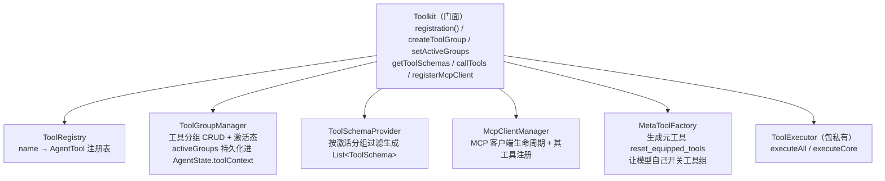
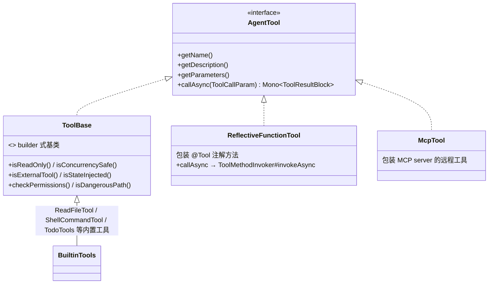
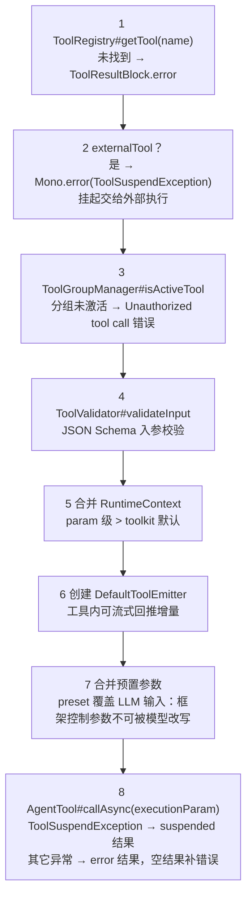

# 第 4 章 工具系统（核心）

> 路径前缀：`agentscope-core/src/main/java/io/agentscope/core/tool/`
> 上一章讲到 `CallExecution#dispatchToolCalls` 把工具调用交给 `Toolkit#callTools`，本章从这里接力：工具怎么注册、Schema 怎么生成、执行链路长什么样。

## 4.1 Toolkit：门面 + 五个管理器

`Toolkit.java`（1031 行）是门面类，内部职责拆给五个组件；`ToolExecutor` 是包私有的真正执行器：



- **分组与激活态**：工具按 group 组织，只有激活分组的工具会出现在发给模型的 `ToolSchema` 列表里。激活态存进 `AgentState.toolContext.activatedGroups`——所以"模型上一轮自己开的工具组"下一次调用还在（第 2 章讲过的可恢复子状态）。
- **元工具**：开启 meta-tool 后模型可调 `reset_equipped_tools` 自主调整装备的工具组，实现"上百工具但上下文里只放当前需要的一小撮"。
- **防御性拷贝**：`ReActAgent.Builder#build` 会对传入的 Toolkit 做深拷贝（`Toolkit#copy`），保证实例间隔离——这个行为在 customer_work 里引出一个著名的坑（见 4.6）。

## 4.2 从注解到 Schema：@Tool / @ToolParam

```java
@Tool(name = "query_order", description = "查询订单", readOnly = true)
public OrderInfo queryOrder(@ToolParam(name = "orderId", description = "订单号") String orderId) { ... }
```

- `@Tool`（`Tool.java`）属性：`name / description / strict / readOnly / concurrencySafe / externalTool / stateInjected / dangerousFiles / dangerousDirectories / converter`。其中 `readOnly` 参与权限引擎的模式判断（第 3 章 3.5），`concurrencySafe` 参与并发分区（4.4），`externalTool` 表示"由外部系统执行"（触发挂起，第 3 章 3.3 情况 5）。
- `@ToolParam`（`ToolParam.java`）：参数名、描述、必填。**未标注 `@ToolParam` 的参数不进 Schema**——这是"上下文注入参数"的入口：`ToolEmitter`、`AgentState`、或任意放进 `RuntimeContext` 类型化属性的业务 POJO 都会按类型自动注入（`ToolMethodInvoker#resolveContextParameter`）。
- `ToolSchemaGenerator.java`：反射 `Method` → OpenAI 风格 JSON Schema；细节处理：把每个参数 schema 里的 `$defs`/`definitions` **上提（hoist）到根**，保证 `#/$defs/X` 引用可解析。

接口层次（组合优于继承的教科书案例——`@Tool` 方法不需要继承任何类，由 `ReflectiveFunctionTool` 包装成 `AgentTool`）：



## 4.3 执行链路：executeCore 八步

第 3 章的 `Toolkit#callTools`（`Toolkit.java:511`）→ `ToolExecutor#executeAll`（`ToolExecutor.java:296`）→ 单个工具走 `executeWithInfrastructure`（`:374`，调度/超时/重试/停机守卫）→ `executeCore`（`:184`）：



`ReflectiveFunctionTool#callAsync`（`:160`）→ `ToolMethodInvoker#invokeAsync`（`:55`）：`convertParameters`（`:149`，JSON → Java 类型）→ `resolveContextParameter`（`:259`，按类型从 `RuntimeContext` 注入）→ `Method#invoke`（真正调用用户代码，支持返回 `Object` / `Mono<T>` / `CompletableFuture` 三种形态）→ `ToolResultConverter#convert` 转 `ToolResultBlock`（可用 `@Tool(converter=...)` 定制）。

**fail-safe 设计**：整条链上任何异常都被收敛为 `ToolResultBlock.error(...)` 回给模型，而不是炸掉整次调用——模型看到错误信息后可以自行重试或换路。这与框架 fast-fail 的 Builder 校验形成互补：**配置错误早炸，运行时错误软着陆**。

## 4.4 批量执行与并发分区

`ToolExecutor#executeAll`：`parallel=false` 时 `Flux.concat` 顺序执行；`parallel=true` 时按 `isConcurrencySafe`（`:363`）做**分区**——连续的并发安全工具打包成 `Flux.mergeSequential`（并发执行但保持结果顺序），非并发安全工具单独成串行槽。这是 2.0 新增的算法：既吃到并发红利，又不破坏"工具结果顺序与调用顺序一致"的上下文约定。

## 4.5 MCP 与内置工具

**MCP 接入**：`mcp/McpClientBuilder`（支持 stdio / SSE / streamableHttp 三种传输）→ `buildAsync()` 得 `McpClientWrapper` → `Toolkit#registerMcpClient(wrapper)`，server 上的工具被包成 `McpTool` 进入注册表，与本地工具无差别参与 Schema 与执行（`McpContentConverter` 负责结果格式转换）。

**内置工具**（浏览一遍就知道框架自带哪些能力）：`builtin/TodoTools`（任务清单，配 `TaskReminderMiddleware` 使用）、`file/{ReadFileTool,WriteFileTool}`、`coding/ShellCommandTool`（配 `CommandValidator` 双实现做安全校验，见下）、`subagent/SubAgentTool`（Agent-as-Tool，带 `session_id`/`message` 参数的多轮子会话）。

**Shell 命令安全校验的现状（值得留意）**：`coding/CommandValidator` 有 `UnixCommandValidator` / `WindowsCommandValidator` 两个实现，做的是**纯字符串级校验**——提取可执行名（去引号、取首 token、剥 `.sh`/`.py` 等扩展名）→ 无白名单则放行 → 扫 `&`/`&&`/`|`/`||`/`;`/换行 等分隔符命中即拒（引号内与 `\` 转义后跳过）→ `./` 相对路径检查是否逃逸当前目录 → 白名单匹配。

`agentscope-core/pom.xml:121` 声明了 `io.github.bonede:tree-sitter` + `tree-sitter-bash`，注释写明用途是"Bash 工具的 AST-based safety analysis"，但**截至 2.0.0 主干，仓库内没有任何 Java 代码引用它**（无 import、无 `TSParser`/`TSNode` 等 API 调用、无反射加载），`UnixCommandValidator` 只 import 了 `java.util.Set` 与 slf4j。这是个为将来升级 AST 版校验器预留的依赖。

读 pom 时容易困惑"为什么声明两个 artifact"，分工如下：`tree-sitter`（951KB）是解析器引擎 API（`TSParser`/`TSNode`/`TSTree`/`TSQuery`）；`tree-sitter-bash`（1.1MB）只含 **1 个 748 字节的 Java 类** `TreeSitterBash` 加 **5 个平台的原生 grammar 库**（linux/macos 的 arm64+x86_64、windows x86_64，解压共 7.6MB），作用仅是喂给 `parser.setLanguage(new TreeSitterBash())`。基础包必须显式声明，因为 `tree-sitter-bash` 对它的依赖是 `<scope>runtime</scope>`，编译期不可见。

**成本提示**：当前为零功能回报引入 7.6MB 多平台 JNI 原生库，且 GraalVM native image 需额外配 JNI 注册——自建裁剪版依赖时可以放心 exclude。

## 4.6 customer_work 实战

### 七域业务工具：Schema 壳 + 后端 SPI

`customer-work-starter/.../tool/ToolRegistrar#registerBusinessTools(Toolkit, sessionId)` 注册 7 个分组：`knowledge / order / after_sales / presale / member / complaint / human`。工具类（`OrderTools`、`AfterSalesTools` 等）**只是 Schema 壳**，逻辑委托 `tool.backend.*` SPI（`OrderBackend` 等 6 个接口），默认 mock 实现离线可跑，`tool-backend.mode=jdbc` 切 MyBatis-Plus 真实现——工具定义与业务实现解耦，单测不需要模型也能全绿。

### DefaultActiveGroupsToolkit：一个值得细品的框架适配

`tool/DefaultActiveGroupsToolkit extends Toolkit`，覆写 `setActiveGroups` / `getToolSchemas` / `copy`。背景（第 10 章坑 1）：2.0 GA 下配了 StateStore 时，新会话加载到的 `activatedGroups` 是空列表，`ReActAgent#activateSlotForContext` 会用它**全量覆盖**构建期激活的分组——表现为"模型看不到订单查询工具"。子类守卫空覆盖；且 **`copy()` 刻意返回自身**，否则 `ReActAgent.Builder#build` 的防御性拷贝（4.1）拷出来的是基类 Toolkit，守卫直接丢失。这个案例完整展示了"读懂框架内部机制（状态恢复 + 防御性拷贝）才能写对扩展"。

### MCP / Higress 网关接入

- `tool/McpToolkitConfigurer#configure` → `McpClientFactory#buildClientBuilder`（starter 与 admin 共用的构建核心）→ `McpClientBuilder#buildAsync` → `Toolkit#registerMcpClient(wrapper).block()`。注册前后 diff `Toolkit#getToolNames` 登记进 `ToolKindRegistry`，供调用日志把耗时归类到 TOOL/MCP/SKILL；单个 MCP server 不可用只打日志，不阻断启动（fail-open）。
- `tool/HigressToolkitConfigurer` → `HigressMcpClientBuilder.create(...).toolSearch(keyword, maxTools)`：经 Higress AI 网关做**按需工具发现**，避免把上百个工具 Schema 全塞进上下文——与框架元工具（4.1）解决同一问题的网关侧方案。
- admin 动态版：`customer-admin-server/.../aiconfig/mcp/runtime/AdminMcpFactory` 按 `ai_agent_mcp` 表逐行注册，实现界面配置 MCP。

### 上下文注入参数的生产用法

七域工具的方法签名里，`sessionId`、当前用户等业务上下文都是**无 `@ToolParam` 参数**，由 `ToolMethodInvoker#resolveContextParameter` 从 `RuntimeContext` 注入——模型 Schema 里看不到它们，也就无法伪造他人身份查订单。这是"框架控制参数不可被模型改写"（4.3 第 7 步 preset 合并同理）在安全上的实际意义。
