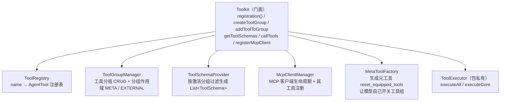
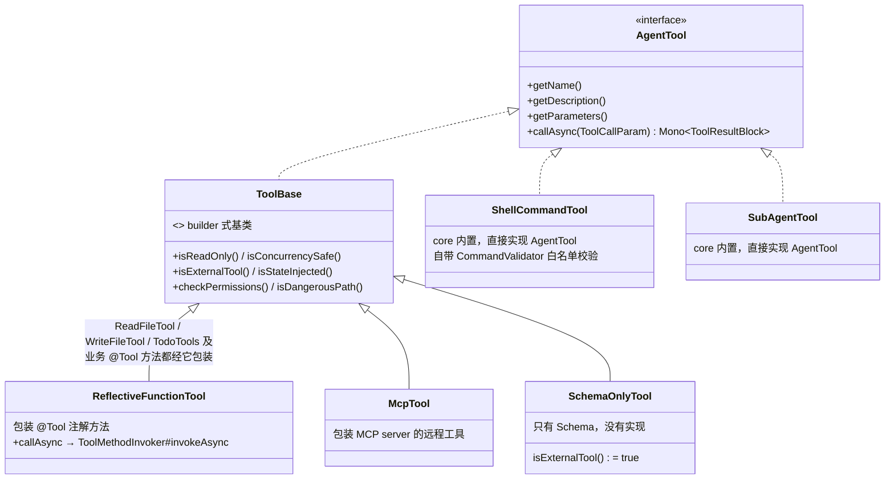
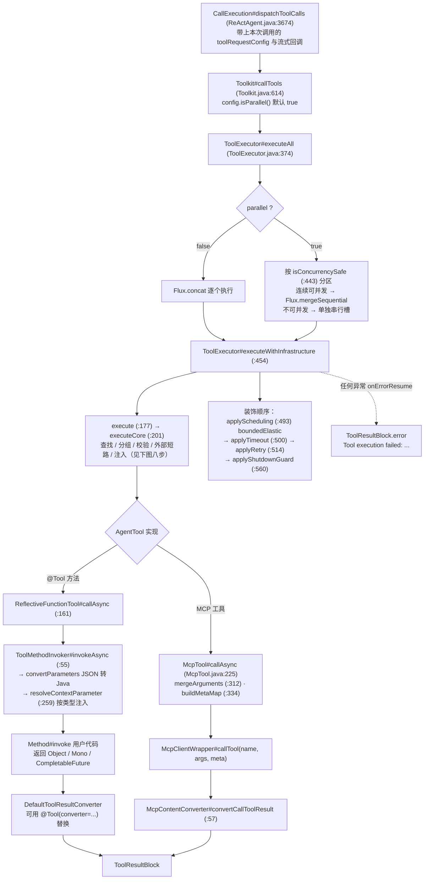
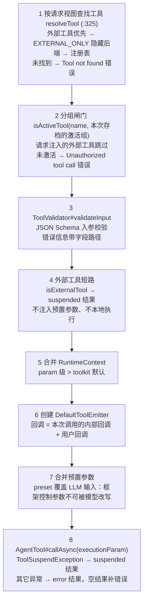
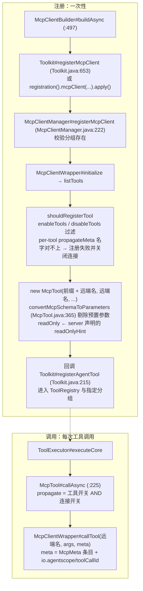

# 第 4 章 工具系统（核心）

> 路径前缀：`agentscope-core/src/main/java/io/agentscope/core/tool/`
> 上一章讲到 `CallExecution#dispatchToolCalls` 把工具调用交给 `Toolkit#callTools`，本章从这里接力：工具怎么注册、Schema 怎么生成、执行链路长什么样、一个共享的 Toolkit 怎么给每个请求组合出不同的工具面。行号已按上游 main `2c503d88`（2026-10-02，`2.0.4-SNAPSHOT`，未发版）校准；v2.0.3 之后才有的行为单独标注"main 已变更（未发版）"。

## 4.1 Toolkit：门面 + 五个管理器

`Toolkit.java`（main 上 1282 行，v2.0.3 时 1060 行）是门面类，内部职责拆给五个组件（字段在 `:74`～`:83`）；`ToolExecutor`（571 行）是包私有的真正执行器：


```mermaid
flowchart TB
    TK["Toolkit（门面）<br/>registration() / createToolGroup / addToolToGroup<br/>getToolSchemas / callTools / registerMcpClient"]
    TK --> REG["ToolRegistry<br/>name → AgentTool 注册表"]
    TK --> GRP["ToolGroupManager<br/>工具分组 CRUD + 分组作用域 META / EXTERNAL"]
    TK --> SP["ToolSchemaProvider<br/>按激活分组过滤生成 List&lt;ToolSchema&gt;"]
    TK --> MCPM["McpClientManager<br/>MCP 客户端生命周期 + 其工具注册"]
    TK --> META["MetaToolFactory<br/>生成元工具 reset_equipped_tools<br/>让模型自己开关工具组"]
    TK --> EXEC["ToolExecutor（包私有）<br/>executeAll / executeCore"]
```

- **分组与激活态**：工具按 group 组织，只有激活分组里的工具会出现在发给模型的 `ToolSchema` 列表里；**没有分组的工具永远可见**（`ToolGroupManager#isActiveTool`，`ToolGroupManager.java:355`，`groups` 为空直接返回 `true`）。一个工具可以属于多个组，只要其中一个组激活它就可见。激活态的唯一来源是会话存档里的 `AgentState.toolContext.activatedGroups`（第 2 章讲过的可恢复子状态），所以"模型上一轮自己开的工具组"下一次调用还在。新会话的初始激活组取自构建期 Toolkit 上 `active=true` 的分组（`ReActAgent.java:342` 记下 `initialActiveToolGroups`，`freshState` 在 `:474` 写进新存档）。这一步是 2.0.1 才有的，2.0.0 GA 的新会话存档是空列表。
- **分组作用域**：`ToolGroupScope` 只有两种。`META` 组由元工具管，模型可以开关；`EXTERNAL` 组由开发者代码管（比如技能激活时打开的组），元工具看不到也改不了。
- **元工具**：开启 meta-tool 后模型可调 `reset_equipped_tools` 自主调整装备的工具组，实现"上百工具但上下文里只放当前需要的一小撮"。它的入参 `to_activate` 是**最终集合而不是增量**：不在列表里的 META 组全部关掉，EXTERNAL 组不受影响（`MetaToolFactory#resetEquippedToolsImpl`）。
- **工具与分组是 n:m**：`Toolkit#addToolToGroup(groupName, toolName)`（`Toolkit.java:771`）把**已注册**的工具追加进另一个已存在的组，重复添加幂等，组或工具不存在则 `IllegalArgumentException`（fast-fail）。典型用途：同一个 `query_order` 既属于 `order` 组，也属于 `after_sales` 组，不必注册两遍。
- **构建期拷贝**：`ReActAgent.Builder#build`（`ReActAgent.java:5712`）对传入的 Toolkit 调 `Toolkit#copy`（`Toolkit.java:946`）：复制注册表和分组元数据，**工具实例按引用共享**（所以自定义工具自己要保证线程安全），元工具重新绑定到副本的分组管理器上，用户设置的流式回调保留。拷贝只为"构建某个 Agent 时加的 Hook 工具、元工具不污染别的 Agent"，**不是**给每个请求用的——请求级差异见 4.6。

> **main 已变更（未发版）**：#3283 把"哪些工具组开着"彻底收到会话存档里。v2.0.3 有三处会改共享状态：`activateSlotForContext` 每次调用都执行 `toolkit.setActiveGroups(...)` 把本会话的激活组写回共享 Toolkit；元工具 `reset_equipped_tools` 调 `groupManager.replaceMetaActiveGroups` 改共享开关；执行器的分组闸门 `groupManager.isActiveTool(name)` 读共享开关。同一个 Agent 同时服务多个会话时，A 会话开关工具组会影响 B 会话。main 上元工具改写本次调用的 `ToolContextState`（`tcs.replaceActivatedGroups`），拿不到会话上下文时直接返回错误、不碰共享状态；执行器按本次调用存档里的激活组判断（`ToolExecutor#resolveActiveGroups`，`ToolExecutor.java:334`）；`ReActAgent` 不再调用 `setActiveGroups`。

## 4.2 从注解到 Schema：@Tool / @ToolParam

```java
@Tool(name = "query_order", description = "查询订单", readOnly = true)
public OrderInfo queryOrder(@ToolParam(name = "orderId", description = "订单号") String orderId) { ... }
```

- `@Tool`（`Tool.java`）属性：`name / description / strict / readOnly / concurrencySafe / externalTool / stateInjected / returnDirect / dangerousFiles / dangerousDirectories / converter`。`name` 留空时取方法名；`description` 留空时框架填 `"Tool: " + 名字`（`Toolkit.java:455`），模型几乎拿它没用，所以描述要自己写清楚"什么时候调"。`readOnly` 参与权限引擎的模式判断（第 3 章 3.5），`concurrencySafe` 默认 `true`（`Tool.java:117`），参与并发分区（4.4）；`externalTool` 表示"由外部系统执行"（触发挂起，第 3 章 3.3）；`returnDirect`（`Tool.java:171`，main 新增 #2891）见第 3 章 3.4。
- 自定义权限判断覆写的是 `ToolBase#checkPermissions(Map<String,Object>, PermissionContextState)`（`ToolBase.java:235`）。老代码里的 `tool/ToolExecutionContext` 已 `@Deprecated`，它承担的"给工具传上下文"职责由 `RuntimeContext` 接手，权限侧的上下文则统一为 `PermissionContextState`——升级时按这两个方向拆。
- `@ToolParam`（`ToolParam.java`）：`name` **没有默认值，必须写**（`:76`）——编译时不加 `-parameters`，反射拿到的参数名是 `arg0`，模型按 `arg0` 传参就对不上了；`required` 默认 `true`（`:87`）；`description` 写给模型看。
- `ToolSchemaGenerator#generateParameterSchema`（`ToolSchemaGenerator.java:50`）：**只有标了 `@ToolParam` 的参数进 Schema**，预置参数（4.3 第 7 步）也会被剔除；每个参数的类型交给 `JsonSchemaUtils.generateSchemaFromType`（基于 victools，和第 3 章结构化输出用的是同一个生成器），再把参数 schema 里的 `$defs`/`definitions` **上提（hoist）到根**（`:75`），保证 `#/$defs/X` 引用可解析；两个参数里出现同名但内容不同的定义，注册时直接 `IllegalStateException`。

**没标 `@ToolParam` 的参数从哪来**（`ToolMethodInvoker#convertParameters`）：按类型依次判断，`ToolEmitter`、`Agent`、`AgentState`（优先取 `RuntimeContext` 里本次调用的存档）、`RuntimeContext` 本身、已废弃的 `ToolExecutionContext` 都按类型注入；剩下的参数只有"自定义类型"才会走 `resolveContextParameter`（`ToolMethodInvoker.java:259`）从 `RuntimeContext` 的类型化属性里取。判断是不是自定义类型的规则在 `isUserContextPojo`：基本类型、`Msg` 和 `ContentBlock` 子类、`java.*`/`javax.*` 包下的类型都**不算**。

这里有个坑：**`String sessionId` 这种 JDK 类型的参数不加 `@ToolParam`，不会被注入**。它会走 `convertSingleParameter` 去模型入参里按反射名找值，可它又不在 Schema 里，模型不会传，最后拿到 `null`。业务上下文要么包成自己的类型放进 `RuntimeContext`，要么直接注入 `RuntimeContext` 再取（4.7 的 customer_work 就是后一种）。

接口层次（组合优于继承的教科书案例——业务类的 `@Tool` 方法不需要继承任何类，由框架内部的 `ReflectiveFunctionTool` 包装成 `ToolBase` 子类）：


```mermaid
classDiagram
    class AgentTool {
        <<interface>>
        +getName()
        +getDescription()
        +getParameters()
        +callAsync(ToolCallParam) Mono~ToolResultBlock~
    }
    class ToolBase {
        <<abstract>> builder 式基类
        +isReadOnly() / isConcurrencySafe()
        +isExternalTool() / isStateInjected()
        +checkPermissions() / isDangerousPath()
    }
    class ReflectiveFunctionTool {
        包装 @Tool 注解方法
        +callAsync → ToolMethodInvoker#invokeAsync
    }
    class McpTool {
        包装 MCP server 的远程工具
    }
    class SchemaOnlyTool {
        只有 Schema，没有实现
        isExternalTool() = true
    }
    class ShellCommandTool {
        core 内置，直接实现 AgentTool
        自带 CommandValidator 白名单校验
    }
    class SubAgentTool {
        core 内置，直接实现 AgentTool
    }
    AgentTool <|.. ToolBase
    ToolBase <|-- ReflectiveFunctionTool : ReadFileTool / WriteFileTool / TodoTools 及业务 @Tool 方法都经它包装
    ToolBase <|-- McpTool
    ToolBase <|-- SchemaOnlyTool
    AgentTool <|.. ShellCommandTool
    AgentTool <|.. SubAgentTool
```

**是否继承 `ToolBase` 不只是代码组织问题，它决定了两件运行期行为**（main 源码核实，v2.0.3 相同）：

| | 继承 `ToolBase`（`ReflectiveFunctionTool`、`McpTool`、`SchemaOnlyTool`） | 直接实现 `AgentTool`（`ShellCommandTool`、`SubAgentTool`、自定义实现） |
|---|---|---|
| 权限门 | 进入第 3 章 3.5 的评估：规则、模式、`checkPermissions` 都生效 | `CallExecution#evaluateOne`（`ReActAgent.java:3469`）判断 `!(tool instanceof ToolBase)` 后**直接 `ALLOW`**，allow/deny/ask 规则全部不生效 |
| 并发分区 | 取 `isConcurrencySafe()`（`McpTool` 固定为 `false`） | `ToolExecutor#isConcurrencySafe`（`ToolExecutor.java:443`）**一律返回 `true`**，按可并发处理 |

所以给 core 的 `ShellCommandTool` 配 deny 规则是**无效**的，它的安全边界只有自带的 `CommandValidator`（见 4.5）。自己写工具时，想纳入权限治理就继承 `ToolBase`，或者直接用 `@Tool` 注解。

## 4.3 执行链路：executeCore 八步

从 ReAct 循环到用户方法被真正调用，方法级的完整链路（main）：


```mermaid
flowchart TB
    DT["CallExecution#dispatchToolCalls (ReActAgent.java:3674)<br/>带上本次调用的 toolRequestConfig 与流式回调"] --> CT["Toolkit#callTools (Toolkit.java:614)<br/>config.isParallel() 默认 true"]
    CT --> EA["ToolExecutor#executeAll (ToolExecutor.java:374)"]
    EA --> PAR{"parallel ?"}
    PAR -->|"false"| SEQ["Flux.concat 逐个执行"]
    PAR -->|"true"| PART["按 isConcurrencySafe (:443) 分区<br/>连续可并发 → Flux.mergeSequential<br/>不可并发 → 单独串行槽"]
    SEQ --> WI
    PART --> WI["ToolExecutor#executeWithInfrastructure (:454)"]
    WI --> EX["execute (:177) → executeCore (:201)<br/>查找 / 分组 / 校验 / 外部短路 / 注入（见下图八步）"]
    WI --> DEC["装饰顺序：applyScheduling (:493) boundedElastic<br/>→ applyTimeout (:500) → applyRetry (:514)<br/>→ applyShutdownGuard (:560)"]
    EX --> KIND{"AgentTool 实现"}
    KIND -->|"@Tool 方法"| RFT["ReflectiveFunctionTool#callAsync (:161)"]
    RFT --> INV["ToolMethodInvoker#invokeAsync (:55)<br/>→ convertParameters JSON 转 Java<br/>→ resolveContextParameter (:259) 按类型注入"]
    INV --> MI["Method#invoke 用户代码<br/>返回 Object / Mono / CompletableFuture"]
    MI --> CONV["DefaultToolResultConverter<br/>可用 @Tool(converter=...) 替换"]
    KIND -->|"MCP 工具"| MT["McpTool#callAsync (McpTool.java:225)<br/>mergeArguments (:312) · buildMetaMap (:334)"]
    MT --> MCW["McpClientWrapper#callTool(name, args, meta)"]
    MCW --> MCC["McpContentConverter#convertCallToolResult (:57)"]
    CONV --> OUT["ToolResultBlock"]
    MCC --> OUT
    WI -.->|"任何异常 onErrorResume"| ERR["ToolResultBlock.error<br/>Tool execution failed: ..."]
```

两处容易被忽略：**调度在 `executeWithInfrastructure` 里统一加**，每个工具调用都被 `subscribeOn` 到 `boundedElastic`（或 `ToolkitConfig` 里的自定义线程池）上，所以 `@Tool` 方法里写阻塞代码不会卡住 Reactor 线程；**异常有两层兜底**，`McpTool#callAsync` 自己先把错误转成 `MCP tool error: ...`，外层 `executeWithInfrastructure` 再兜一次，模型最终看到的永远是 `ToolResultBlock`，而不是一次失败的调用。

单个工具的 `executeCore`（`ToolExecutor.java:201`）按下面的顺序走。注意外部工具的短路排在校验**之后**：外部工具也要先通过分组和参数校验，才会挂起交给外部执行。


```mermaid
flowchart TB
    S1["1 按请求视图查找工具 resolveTool (:325)<br/>外部工具优先 → EXTERNAL_ONLY 隐藏后端 → 注册表<br/>未找到 → Tool not found 错误"] --> S2["2 分组闸门 isActiveTool(name, 本次存档的激活组)<br/>请求注入的外部工具跳过<br/>未激活 → Unauthorized tool call 错误"]
    S2 --> S3["3 ToolValidator#validateInput<br/>JSON Schema 入参校验<br/>错误信息带字段路径"]
    S3 --> S4["4 外部工具短路<br/>isExternalTool → suspended 结果<br/>不注入预置参数、不本地执行"]
    S4 --> S5["5 合并 RuntimeContext<br/>param 级 > toolkit 默认"]
    S5 --> S6["6 创建 DefaultToolEmitter<br/>回调 = 本次调用的内部回调 + 用户回调"]
    S6 --> S7["7 合并预置参数<br/>preset 覆盖 LLM 输入：框架控制参数不可被模型改写"]
    S7 --> S8["8 AgentTool#callAsync(executionParam)<br/>ToolSuspendException → suspended 结果<br/>其它异常 → error 结果，空结果补错误"]
```

第 3 步的校验失败信息是**给模型看的**，所以格式很关键：`ToolValidator`（基于 networknt json-schema-validator）把每条错误前面拼上 `getInstanceLocation()`（JSON Pointer 形式的字段路径），多条之间用换行分隔（`ToolValidator.java:129`，#2718，2.0.3 起），外面再包一句 `Please correct the parameters and try again.`，例如

```
Parameter validation failed for tool 'query_order': /orderId: string found, integer expected
/pageSize: must have a maximum value of 100
Please correct the parameters and try again.
```

早期只输出 `getMessage()` 并用 `; ` 拼接，模型看到"must be integer"却不知道是哪个参数，往往原样重试同一个错误入参。**把定位信息交给模型，它才有可能自己改对**——这是"工具错误软着陆"能真正闭环的前提。另外校验前会把可选字段上显式传的 `null` 去掉，当成没传处理。

第 7 步的预置参数（`registration().presetParameters(...)`）在注册时就从 Schema 里剔除，执行时再覆盖进入参：API key、租户 id 这类值模型既看不到也改不了。

**fail-safe 设计**：整条链上任何异常都被收敛为 `ToolResultBlock.error(...)` 回给模型，而不是炸掉整次调用——模型看到错误信息后可以自行重试或换路。这与框架 fast-fail 的 Builder 校验形成互补：**配置错误早炸，运行时错误软着陆**。

## 4.4 批量执行、并发分区、超时与重试

`ToolExecutor#executeAll`（`:374`）：`parallel=false` 时 `Flux.concat` 顺序执行；`parallel=true` 时按 `isConcurrencySafe`（`:443`）做**分区**——连续的并发安全工具打包成 `Flux.mergeSequential`（并发执行但保持结果顺序），非并发安全工具单独成串行槽。例如模型一轮要调 `[查订单, 查物流, 改地址, 查会员]`，改地址标了不可并发，结果是三段：查订单和查物流一起跑 → 改地址单独跑 → 查会员。结果列表的顺序始终和调用顺序一致。

**默认是并行**。开关在 `tool/ToolkitConfig`，其 Builder 的字段初值就是 `parallel = true`（`ToolkitConfig.java:127`），`Toolkit#callTools` 把 `config.isParallel()` 传给 `executeAll`（`Toolkit.java:630`）。这是 2.0.1 的重构（#2558）改的，此前默认串行。影响要结合另一个默认值一起看：`@Tool#concurrencySafe()` 的**默认值也是 `true`**（`Tool.java:117`），`ToolBase.Builder` 同样默认 `true`，直接实现 `AgentTool` 的工具更是一律按可并发处理（见 4.2 的表）。两个默认值叠加起来，结果是：**同一轮里模型一次要求调多个工具时，只要你没有显式标注，它们就会真的并发执行**。非线程安全的工具（共享可变状态、对同一个文件做读改写、依赖调用顺序的外部接口）必须显式写 `@Tool(concurrencySafe = false)`。core 里显式标成不可并发的只有两处：`TodoTools`，以及**所有 MCP 工具**——`McpTool` 的构造器里写死了 `concurrencySafe(false)`（`McpTool.java:114`，v2.0.3 相同），所以同一轮里的 MCP 调用总是一个一个跑，每个都单独占一个串行槽。连 `WriteFileTool` 都保持默认值，同一轮对同一个文件的两次写入之间没有顺序保证。需要全局串行时，用 `ToolkitConfig.builder().parallel(false)`。

**超时与重试**：`callTools`（`Toolkit.java:622`）把三层执行配置按参数逐项合并：Agent 级 > Toolkit 级 > `ExecutionConfig.TOOL_DEFAULTS`。工具的系统默认值是**超时 5 分钟、只试 1 次**（`ExecutionConfig.java:163`；对照模型侧 `MODEL_DEFAULTS` 是 5 分钟、3 次、只重试可重试错误）。装饰顺序是先超时后重试，所以超时按**每次尝试**计算；关机守卫在最外层（`Mono.firstWithSignal` 和全局停机信号赛跑，第 3 章 3.8）。三个细节：

- 超时只是取消订阅。`@Tool` 方法里的阻塞调用已经在 `boundedElastic` 线程上跑了，取消不会打断它，下游请求可能照样执行完。框架的重试日志自己就写着"上一次尝试已取消，可能仍在占用资源"（`ToolExecutor.java:538`）。
- 重试对整个 Toolkit 统一生效，不区分工具是否幂等。`retryOn` 不配时**任何错误都重试**（`:528`）。发起退款、创建工单这类工具，超时往往意味着请求已经到了下游，重试一次就多做一次。
- `ExecutionConfig` 里的 `backoffMultiplier` 在 core 里没有任何地方读取（只有 getter），工具重试的退避按 Reactor `Retry.backoff` 的默认指数增长，`maxBackoff` 封顶，带 0.5 的抖动。

## 4.5 MCP 与内置工具

**MCP 接入**：`mcp/McpClientBuilder`（支持 stdio / SSE / streamableHttp 三种传输）→ `buildAsync()`（`McpClientBuilder.java:497`）得 `McpClientWrapper` → `Toolkit#registerMcpClient(wrapper)`（`Toolkit.java:653`），server 上的工具被包成 `McpTool` 进入注册表，与本地工具无差别参与 Schema 与执行（`McpContentConverter` 负责结果格式转换）。要过滤、分组、加前缀、配预置参数时用 `toolkit.registration().mcpClient(...)`。

注册与调用两条链路：


```mermaid
flowchart TB
    subgraph REG["注册：一次性"]
        B["McpClientBuilder#buildAsync (:497)"] --> RM["Toolkit#registerMcpClient (Toolkit.java:653)<br/>或 registration().mcpClient(...).apply()"]
        RM --> MM["McpClientManager#registerMcpClient (McpClientManager.java:222)<br/>校验分组存在"]
        MM --> INIT["McpClientWrapper#initialize → listTools"]
        INIT --> FIL["shouldRegisterTool<br/>enableTools / disableTools 过滤<br/>per-tool propagateMeta 名字对不上 → 注册失败并关闭连接"]
        FIL --> NEW["new McpTool(前缀 + 远端名, 远端名, ...)<br/>convertMcpSchemaToParameters (McpTool.java:365) 剔除预置参数<br/>readOnly ← server 声明的 readOnlyHint"]
        NEW --> RAT["回调 Toolkit#registerAgentTool (Toolkit.java:215)<br/>进入 ToolRegistry 与指定分组"]
    end
    subgraph CALL["调用：每次工具调用"]
        C1["ToolExecutor#executeCore"] --> C2["McpTool#callAsync (:225)<br/>propagate = 工具开关 AND 连接开关"]
        C2 --> C3["McpClientWrapper#callTool(远端名, args, meta)<br/>meta = McpMeta 条目 + io.agentscope/toolCallId"]
    end
    RAT -.-> C1
```

**`readOnly` 的来源是一条信任边界**。`McpClientManager` 构造 `McpTool` 时，`readOnly` 直接取自 MCP server 在工具 annotations 里**自己声明**的 `readOnlyHint`（`McpClientManager.java:300`）。而第 3 章 3.5 的权限引擎在 `EXPLORE` / `ACCEPT_EDITS` 模式下，对 `isReadOnly()` 为真的工具直接 `ALLOW`（`PermissionEngine#checkExploreMode`，`PermissionEngine.java:229`）。换句话说，**一个自称只读的第三方 MCP server，在这两种模式下可以跳过人工确认**。接入不受控的 MCP server 时，不要依赖这两种模式做安全隔离，应该对它的工具显式配置 ask 或 deny 规则。

**工具名前缀**（main 新增，#3080）：`registration().mcpClient(...).mcpToolNamePrefix("crm_")`，模型看到的名字是 `crm_query`，调用远端时仍用原名 `query`（`McpTool` 分别存 `name` 和 `remoteToolName`）。两个 MCP server 都有同名工具时靠它避免冲突。

**给 MCP 请求带业务元数据**：`mcp/McpMeta` 是一个类型命名空间标记——把它的实例注册进 `RuntimeContext` 的类型化属性，其中的条目会自动填进每次 `CallToolRequest` 的 `meta` 字段（`McpTool#extractMcpMeta`，`:348`）。多租户场景下往 MCP server 透传租户 id、trace id 就靠它。设计上有一道刻意的闸门：**只有注册在 `McpMeta.class` 这个 key 下的对象会被提取**，`RuntimeContext` 里的其它东西（DI bean、配置对象、业务 POJO）绝不会泄漏到 MCP meta 里——和 4.2 的按类型注入是同一套 `RuntimeContext` 机制，但边界收得更紧，因为这些数据要出进程。

> **main 已变更（未发版）**：① #3080 起每次调用还会额外带上框架的工具调用 id（key 是 `io.agentscope/toolCallId`，`McpTool#buildMetaMap`，`:334`）。② #3255 加了元数据开关：连接级 `McpClientBuilder#propagateMeta(boolean)`（`:487`，默认开，每次调用实时读取），注册级 `registration().propagateMeta(false)` 和按远端工具名的 `propagateMeta("tool", false)`；最终是否带 meta 取"工具开关 AND 连接开关"，关掉时 `meta` 字段整个不发（`null`），连工具调用 id 也不发。按工具配置的名字对不上真实注册的工具（拼错、远端改名、被 enable/disable 过滤掉）时注册直接失败，并尽力关闭已建立的连接，避免 stdio 子进程泄漏。v2.0.3 对所有 MCP server 都无条件透传 `McpMeta`，接第三方 server 时内部的 trace id、回调地址会一并发出去。

两个接入层细节：

- **动态鉴权**用 `McpClientBuilder#httpRequestCustomizer(McpSyncHttpClientRequestCustomizer)`（`McpClientBuilder.java:266`），每次发请求前回调，可以在这里注入会过期刷新的 OAuth token。它只对 HTTP 类传输生效（方法内判了 `transportConfig instanceof HttpTransportConfig`），给 stdio 传输配置是静默无效的。
- **SDK 版本**：v2.0.3 在 `agentscope-dependencies-bom` 里把 MCP Java SDK 从 0.17.0 升到 0.17.2（#2958），main 仍是 0.17.2。起因是有的 MCP server 对 `initialize` / `notifications/initialized` 回 `202 Accepted` + `text/plain` + 空分块体，0.17.0 的 `HttpClientStreamableHttpTransport` 直接抛 `Unknown media type`。自己管理依赖版本、没用 BOM 的项目要手动对齐。

**内置工具**（浏览一遍就知道框架自带哪些能力）：`builtin/TodoTools`（任务清单，配 `TaskReminderMiddleware` 使用）、`file/{ReadFileTool,WriteFileTool}`、`coding/ShellCommandTool`（配 `CommandValidator` 双实现做安全校验，见下）、`subagent/SubAgentTool`（Agent-as-Tool，带 `session_id`/`message` 参数的多轮子会话）。

**Shell 命令安全校验的现状（值得留意）**：`coding/CommandValidator` 有 `UnixCommandValidator` / `WindowsCommandValidator` 两个实现，做的是**纯字符串级校验**——提取可执行名（去引号、取首 token、剥 `.sh`/`.py` 等扩展名）→ 无白名单则放行 → 扫 `&`/`&&`/`|`/`||`/`;`/换行 等分隔符命中即拒（引号内与 `\` 转义后跳过）→ `./` 相对路径检查是否逃逸当前目录 → 白名单匹配。

`agentscope-core/pom.xml:120` 起声明了 `io.github.bonede:tree-sitter` + `tree-sitter-bash`，注释写明用途是"Bash 工具的 AST-based safety analysis"，但**截至 main `2c503d88`，仓库内仍没有任何 Java 代码引用它**（无 import、无 `TSParser`/`TSNode` 等 API 调用、无反射加载），`UnixCommandValidator` 只 import 了 `java.util.Set` 与 slf4j。这是个为将来升级 AST 版校验器预留的依赖。

读 pom 时容易困惑"为什么声明两个 artifact"，分工如下：`tree-sitter`（951KB）是解析器引擎 API（`TSParser`/`TSNode`/`TSTree`/`TSQuery`）；`tree-sitter-bash`（1.1MB）只含 **1 个 748 字节的 Java 类** `TreeSitterBash` 加 **5 个平台的原生 grammar 库**（linux/macos 的 arm64+x86_64、windows x86_64，解压共 7.6MB），作用仅是喂给 `parser.setLanguage(new TreeSitterBash())`。基础包必须显式声明，因为 `tree-sitter-bash` 对它的依赖是 `<scope>runtime</scope>`，编译期不可见。

**成本提示**：当前为零功能回报引入 7.6MB 多平台 JNI 原生库，且 GraalVM native image 需额外配 JNI 注册——自建裁剪版依赖时可以放心 exclude。

## 4.6 按请求的工具视图：ToolRequestConfig（main 新增）

> **main 已变更（未发版）**：#3283（2026-09-24）新增 `ToolRequestConfig`（119 行）与 `ToolMergeMode`（51 行），解决"一个共享 Toolkit 怎么给每个请求组合出不同的工具面"。

**问题从哪来**。一个 `ReActAgent` 实例同时服务很多会话（第 2 章的 `(userId, sessionId)` 槽位），它手里只有一个 Toolkit。v2.0.3 上有三类"按请求不同"的东西直接写在这个共享对象上：

1. **工具组激活**：见 4.1 末尾。
2. **流式工具回调**：每轮行动开始时 `toolkit.setInternalChunkCallback(...)` 把本次调用的事件出口设到共享 `ToolExecutor` 的字段上。两个会话同时在跑工具时，后设的覆盖先设的，A 会话工具推的进度可能出现在 B 会话的事件流里。main 上回调作为参数沿 `callTools → executeAll → execute` 一路传下去（`internalChunkCallback`），绑定在本次调用上。
3. **前端传来的工具**：AG-UI 前端可以在一次 run 里带上自己的工具 Schema。v2.0.3 的 `AguiAgentAdapter#injectFrontendTools` 是把它们 `registerAgentTool` 进共享 Toolkit，`FRONTEND_ONLY` 模式还会先把后端工具全部 `removeTool`，跑完再恢复。并发请求下，别的用户这段时间要么看不到后端工具，要么看到不属于自己的前端工具。

**main 的做法：不改共享对象，每次按需组合**。`ToolRequestConfig` 是一个不可变的 record，两个字段：

```java
public record ToolRequestConfig(
        Map<String, SchemaOnlyTool> externalTools, // 名字 → 只有 Schema 的外部工具
        ToolMergeMode mergeMode) { ... }
```

调用方把它放进 `RuntimeContext`（`RuntimeContext.builder().toolRequestConfig(...)`），`ReActAgent#beforeAgentExecution` 把它存到本次调用的 `CallExecution.toolRequestConfig`（`ReActAgent.java:776`），之后三个地方都按它组合：

| 用在哪 | 方法 | 做什么 |
|---|---|---|
| 推理前给模型看的工具清单 | `Toolkit#getToolSchemas(activeGroups, requestConfig)`（`Toolkit.java:410`），`ReActAgent.java:1332` / `:2498` 调用 | 后端按本次存档的激活组过滤 → 和外部工具同名的后端工具去掉 → 追加外部工具 Schema；`EXTERNAL_ONLY` 时整个后端隐藏 |
| 权限门找工具 | `Toolkit#getTool(name, requestConfig)`（`:271`），`evaluateOne` 调用 | 同一套解析规则 |
| 执行器找工具 | `ToolExecutor#resolveTool`（`ToolExecutor.java:325`） | 同一套解析规则；请求注入的外部工具跳过分组闸门 |

解析规则只写在一处：`ToolRequestConfig#resolveTool`——外部工具优先 → `EXTERNAL_ONLY` 时隐藏后端 → 查注册表。注释里写明这样做是为了"让清单和执行器不会各说各话"。

`ToolMergeMode` 三种：

| 模式 | 行为 |
|---|---|
| `MERGE_EXTERNAL_PRIORITY`（默认，`mergeMode` 传 `null` 时取它） | 两边合并，同名时外部工具覆盖后端 |
| `EXTERNAL_ONLY` | 只用外部工具，后端全部隐藏（不删注册，所以不受 `allowToolDeletion` 影响；外部列表为空时就是没有工具） |
| `AGENT_ONLY` | 只用后端；构造时同时带外部工具会直接 `IllegalArgumentException`；`ToolRequestConfig.NONE` 就是它 |

构造器里的 fast-fail 还有两条：外部工具的 key 必须等于它 Schema 里的名字；名字和工具都不能为 `null`。外部工具一律是 `SchemaOnlyTool`，执行到 4.3 第 4 步就返回 suspended，由调用方（比如前端）执行后提交结果，接上第 3 章的挂起/恢复流程。

AG-UI 适配器在 main 上改成把 `RunAgentInput.tools` 转成本次 run 的 `ToolRequestConfig`（`AguiAgentAdapter#buildToolRequestConfig`），枚举也从 `agui.model.ToolMergeMode`（`FRONTEND_ONLY` / `MERGE_FRONTEND_PRIORITY`）挪到 core 并改名为 `EXTERNAL_ONLY` / `MERGE_EXTERNAL_PRIORITY`——升级时要改 import 和枚举值。

## 4.7 customer_work 实战

> customer_work 基于 agentscope 2.0.3（commit `3b7dcf6d`，2026-09-25）。

### 七域业务工具：Schema 壳 + 后端 SPI

`customer-work-starter/.../tool/ToolRegistrar#registerBusinessTools(Toolkit, sessionId)` 注册 7 个分组：`knowledge / order / after_sales / presale / member / complaint / human`。工具类（`OrderTools`、`AfterSalesTools` 等）**只是 Schema 壳**，逻辑委托 `tool.backend.*` SPI（`OrderBackend` 等 6 个接口），默认 mock 实现离线可跑，`tool-backend.mode=jdbc` 切 MyBatis-Plus 真实现——工具定义与业务实现解耦，单测不需要模型也能全绿。

### 调用身份：注入 RuntimeContext，不进 Schema

`OrderTools` 的每个方法都是"`@ToolParam` 的业务参数 + 一个不加注解的 `RuntimeContext context`"。`RuntimeContext` 按类型注入（4.2），方法里 `context.get(AgentInvocationIdentity.class)` 取出调用身份和租户，在 `withInvocationIdentity` 的作用域里冻结后再调后端。模型 Schema 里看不到这些参数，也就无法伪造他人身份查订单。这是"框架控制参数不可被模型改写"（4.3 第 7 步 preset 合并同理）在安全上的实际意义。注意不要写成 `String tenantId` 不加注解——见 4.2 的坑。

### ManagedToolkit：把执行默认值改成"安全的"

`tool/ManagedToolkit extends Toolkit` 的无参构造固定用 `ToolkitConfigs.sequentialWith(new ToolExecutionProperties())`：

- **串行**：`parallel(false)`。客服工具多是对同一笔订单的读改写，不需要并发红利，也不想逐个工具判断 `concurrencySafe`。
- **超时 15 秒**（`ToolExecutionProperties.timeoutMs = 15_000`）：注释原话的意思是，框架的 5 分钟对客服对话等于没有超时，订单库慢一次，用户就对着不动的界面等五分钟。超时后模型拿到错误结果自己应对。
- **不重试**（`maxAttempts = 1`）：框架重试不区分幂等性，"发起退款""创建工单"重试一次就多做一次。
- 把配置放进构造器而不是让每个调用方记得传——项目里 Toolkit 的实例化点有 7 处。

### DefaultActiveGroupsToolkit：一个绑定版本的框架适配

`tool/DefaultActiveGroupsToolkit extends ManagedToolkit`，覆写 `setActiveGroups` / `getToolSchemas(Collection)` / `copy`。背景（第 10 章坑 1）：2.0.0 GA 配了 StateStore 时，新会话存档里的 `activatedGroups` 是空列表，`ReActAgent#activateSlotForContext` 会用它**全量覆盖**构建期激活的分组——表现为"模型看不到订单查询工具"。子类忽略空集合的覆盖、空集合时回退到内置激活标志；且 **`copy()` 刻意返回自身**，否则 `ReActAgent.Builder#build` 的构建期拷贝（4.1）拷出来的是基类 Toolkit，守卫直接丢失。

这个适配要跟着版本重新评估：

- **2.0.1 起**新会话存档已经用构建期激活组初始化（4.1），"新会话为空"这个根因不存在了。
- **升级到 main 后两个覆写都不会再被调用**：`ReActAgent` 不再调 `setActiveGroups`，推理取清单走的是两参数的 `getToolSchemas(activeGroups, requestConfig)`，它内部直接调 `ToolSchemaProvider`，不经过子类覆写的单参数版本。
- `copy()` 返回自身意味着放弃了构建期隔离：同一个 Toolkit 构建出的多个 Agent，元工具、Hook 工具都注册在同一份注册表上。

这个案例完整展示了"读懂框架内部机制（状态恢复 + 构建期拷贝）才能写对扩展"，也展示了反面：**扩展点绑定的是某个版本的内部调用路径，升级时要按新源码重查一遍**。

### MCP / Higress 网关接入

- `tool/McpToolkitConfigurer#configure` → `McpClientFactory#buildClientBuilder`（starter 与 admin 共用的构建核心）→ `McpClientBuilder#buildAsync` → `Toolkit#registerMcpClient(wrapper).block()`。注册前后 diff `Toolkit#getToolNames` 登记进 `ToolKindRegistry`，供调用日志把耗时归类到 TOOL/MCP/SKILL；单个 MCP server 不可用只打日志，不阻断启动（fail-open）。
- `tool/HigressToolkitConfigurer` → `HigressMcpClientBuilder.create(...).toolSearch(keyword, maxTools)`：经 Higress AI 网关做**按需工具发现**，避免把上百个工具 Schema 全塞进上下文——与框架元工具（4.1）解决同一问题的网关侧方案。
- admin 动态版：`customer-admin-server/.../aiconfig/mcp/runtime/AdminMcpFactory` 按 `ai_agent_mcp` 表逐行注册，实现界面配置 MCP。
