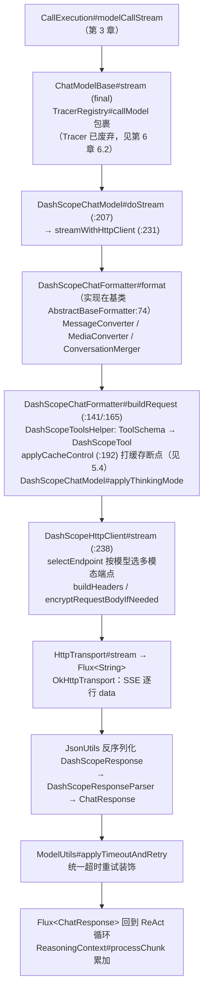
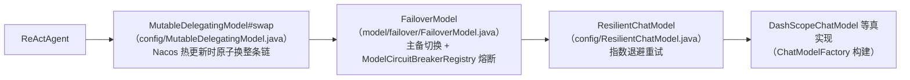

# 第 5 章 模型层（核心）

> 路径前缀：`agentscope-core/src/main/java/io/agentscope/core/model/`（抽象）与 `agentscope-extensions/agentscope-extensions-model/`（五厂商实现）。
> 第 3 章的 `modelCallStream` 调用 `Model#stream` 后发生的一切，都在本章。

## 5.1 Model 接口：一个方法打天下

`Model.java` 的唯一核心方法：

```java
Flux<ChatResponse> stream(List<Msg> messages, List<ToolSchema> tools, GenerateOptions options);
```

**没有单独的"非流式"方法**——同步调用就是把流 collect 起来。辅助方法：`supportsNativeStructuredOutput()` / `supportsNativeStructuredOutputWithTools()`（第 3 章结构化输出双路径的分流依据）、`getContextWindowSize()`。

`ChatModelBase.java` 用模板方法钉死横切逻辑：

```java
public final Flux<ChatResponse> stream(...) {      // final！
    return TracerRegistry.get().callModel(...)     // 可观测性包裹
        .flatMapMany(x -> doStream(...));          // 厂商只需实现 doStream
}
```

**所有厂商实现只需要实现 `doStream`**，tracing 挂载点由基类统一保证——这就是 `ChatModelBase#stream` 声明为 `final` 的原因。

配套数据类：`ChatResponse`（单分片：`id / List<ContentBlock> / usage / metadata / finishReason`）、`ChatUsage`（token 统计）、`GenerateOptions`（温度/toolChoice/responseFormat/cacheControl/超时重试，`mergeOptions(a,b)` 做优先级合并）、`ExecutionConfig`（超时重试配置）。

## 5.2 Formatter：协议翻译官与"五件套"模式

`formatter/Formatter.java` 是三泛型接口 `Formatter<TReq, TResp, TParams>`：

| 方法 | 方向 |
|---|---|
| `List<TReq> format(List<Msg>)` | AgentScope 消息 → 厂商请求消息 |
| `ChatResponse parseResponse(TResp, Instant)` | 厂商响应 → AgentScope |
| `applyOptions / applyTools / applyToolChoice` | 选项与工具的协议映射 |

每个厂商扩展模块都遵循完全一致的**五件套**结构（dashscope/openai/anthropic/gemini/ollama 五个模块一模一样，**读懂一个即读懂全部**）：

```
XxxChatFormatter        单 agent 会话格式化（另有 XxxMultiAgentFormatter 处理多 agent 会话合并）
XxxMessageConverter     Msg ↔ 厂商消息结构
XxxMediaConverter       多模态内容转换
XxxConversationMerger   会话合并策略
XxxResponseParser       厂商响应 → ChatResponse
XxxToolsHelper          ToolSchema → 厂商工具定义
```

## 5.3 传输层与完整调用链（以 DashScope 为例）

`transport/HttpTransport.java`：`HttpResponse execute(req)` + `Flux<String> stream(req)`（SSE 逐行 data）。实现有 `OkHttpTransport` / `JdkHttpTransport`，由 `HttpTransportFactory` 选择；另有 `transport/websocket/` 双实现用于实时多模态。

从 ReAct 循环到 HTTP 字节流的完整链路（路径在 `agentscope-extensions/agentscope-extensions-model/agentscope-extensions-model-dashscope/`）：



上游消费方式值得注意：`ReActAgent` 用 `concatMap`（而非 `flatMap`）消费这个 Flux——**保证分片顺序 + 每片之间检查中断**（第 3 章 3.8）。

## 5.4 Prompt Caching：一个 Boolean 开关背后的三处协作

长 system prompt、大工具定义、多轮会话，重复的前缀每轮都重新计费。厂商侧的解法是 prompt caching，框架把它收敛成 `GenerateOptions.cacheControl`（`Boolean`，注意是包装类型——`null` 表示"没表态"，与 `false` 语义不同）。

**自动策略**：开启后 formatter 在 system 消息与请求的最后一条消息上打 `cache_control: {"type": "ephemeral"}`。Anthropic 侧还额外覆盖工具定义，缓存前缀顺序按官方文档的 `tools → system → messages`——给最后一个工具打断点，等于把整段工具定义纳入缓存前缀。

**手工覆盖**：单条 `Msg` 可以用 `metadata` 里的 `MessageMetadataKeys.CACHE_CONTROL`（字面量 `"_cache_control"`）自己表态，优先级高于自动策略。三值语义：

| 值 | 转换结果 | 含义 |
|---|---|---|
| `true` | `{"type":"ephemeral"}` | 在这条消息上设缓存断点 |
| `false` | `{"type":"no_cache"}` | **显式排除**，自动策略也不会覆盖它 |
| 不设（`null`） | 交给自动策略 | 默认行为 |

`false` 这一档是后补的（issue #2684）。此前只认 `true`，"我要这条消息永远不进缓存"表达不出来——比如末条消息里含一次性的敏感上下文，却恰好落在自动策略的断点位置上。判定逻辑现在写成 `shouldAutoCache(cc) = cc == null || "ephemeral".equals(cc)`：`no_cache` 与任何自定义值都不被自动策略覆盖。

**回读命中率**：`ChatUsage` 除 `inputTokens` / `outputTokens` 外还有 `cachedTokens`（`ChatUsage.java:32`，getter `:97`），由各厂商的 `XxxResponseParser` 从响应 usage 里读出。目前 Anthropic / OpenAI / Gemini 三家的 parser 解析了它；DashScope、Ollama 的 parser 尚未填充这个字段，读到的是 0——**做成本核算时要区分"没命中缓存"和"这家还没上报"**。这个数字最终经 `ModelCallEndEvent` 流到消费端（第 6 章 6.3）。

## 5.5 ModelRegistry：字符串 id → Model 实例

`ModelRegistry.java` 让 `.model("dashscope:qwen-plus")` 成为可能，解析优先级：

1. `register(name, model)` 注册的具名实例；
2. `registerFactory(regex, factory)` 注册的用户工厂；
3. **SPI**：`ServiceLoader` 加载 `model/spi/ModelProvider` 实现（`providerId() / supports(modelId) / create(modelId, ctx)`），每个模型扩展模块都提供一个（`DashScopeModelProvider`、`OpenAIModelProvider`…），API key 自动读环境变量。

带 `ModelCacheKey` 缓存与 sha256 上下文指纹，避免重复构建。**切换厂商 = 改一个字符串**，这是 SPI 机制的直接收益。

## 5.6 customer_work 实战

### 五厂商统一工厂

`customer-work-starter/.../config/ChatModelFactory.java` 是全项目唯一的模型构建点（admin 复用），按 `customer-work.model.provider` 分发到 `DashScopeChatModel / OpenAIChatModel / AnthropicChatModel / GeminiChatModel / OllamaChatModel` 五个 Builder。API key 解析优先级：配置项 → 环境变量 `DASHSCOPE_API_KEY` → 都没有则抛带引导文案的 `IllegalStateException`（fast-fail：启动就暴露配置问题，而不是首个请求才炸）。

### 装饰器栈：把 Model 接口用到极致

项目在 `Model` 接口上叠了三层装饰器（全部实现 `Model`，对 ReActAgent 完全透明）：



`config/RuntimeConfigApplier` 收到 Nacos 配置变更 → 用 `ChatModelFactory` 重建内层链 → `MutableDelegatingModel#swap(newModel)` 原子替换 → `CustomerServiceService#flushHotAgents` 清热 Agent 缓存（不动 StateStore，会话无感）。**一行 `Flux<ChatResponse> stream(...)` 的窄接口，是这套装饰器组合能成立的根本原因。**

### 直接调 Model 的轻量场景

不是所有 LLM 调用都值得起一个 Agent。工单分类 `routing/TicketClassifier#classify` 与会话总结 `assist/ConversationSummaryService` 都直接：

```java
model.stream(List.of(userMsg), List.of(), GenerateOptions.builder().build())
     .collectList().block(timeout);
```

一次性调用、无工具、无状态、fail-open 降级到规则版——**"什么时候用 Agent、什么时候裸调 Model"** 的边界判断：需要工具循环/会话状态才用 Agent，纯一问一答用 Model 就够。

### 视觉 OCR

`attachment/ModelVisionOcrService`：`ImageBlock + Base64Source` 组装多模态 `Msg` 直接走 `Model#stream`——多模态在消息模型层（第 2 章 `ContentBlock` 层次）就已打通，模型层无需特殊处理，`DashScopeHttpClient#selectEndpoint` 会按模型名自动选多模态端点。
