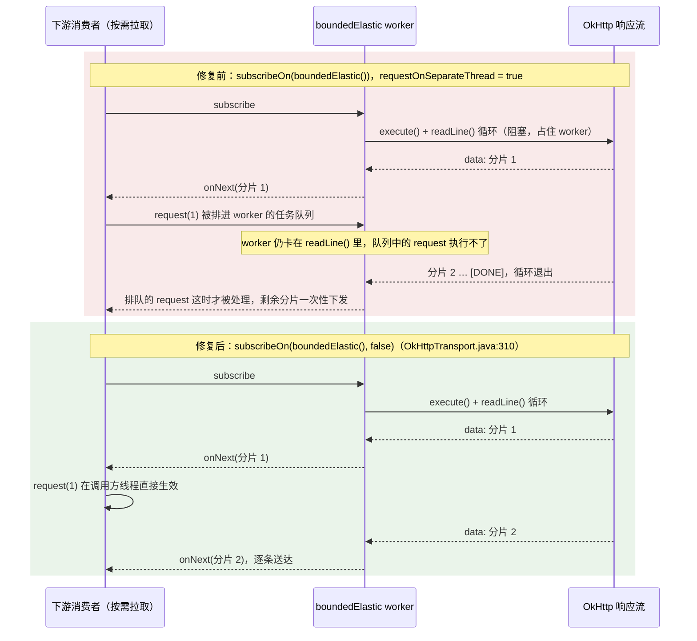
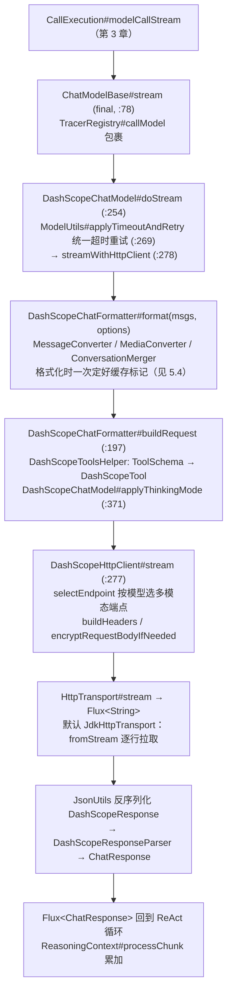
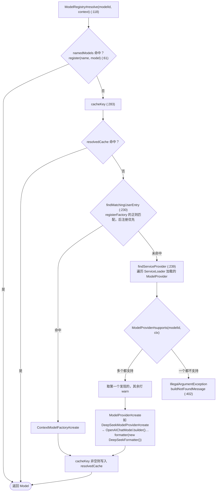
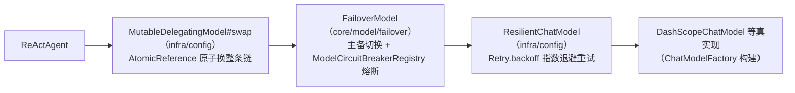

# 第 5 章 模型层（核心）

> 路径前缀：`agentscope-core/src/main/java/io/agentscope/core/model/`（抽象）与 `agentscope-extensions/agentscope-extensions-model/`（main 上 6 个模块：dashscope / openai / anthropic / gemini / ollama 五个原生实现，加上 openai-official 的 Responses API 模块；SPI 提供商一共 10 个，见 5.5）。
> 第 3 章的 `modelCallStream` 调用 `Model#stream` 后发生的一切，都在本章。行号已按上游 main `91550713`（2026-10-02，`2.0.4-SNAPSHOT`，未发版）校准；v2.0.3 之后才有的行为单独标注"main 已变更（未发版）"。

## 5.1 Model 接口：一个方法打天下

`Model.java`（85 行）真正干活的方法只有一个：

```java
Flux<ChatResponse> stream(List<Msg> messages, List<ToolSchema> tools, GenerateOptions options);   // :33
```

另一个抽象方法 `getModelName()` 只是身份。**没有单独的"非流式"方法**——同步调用就是把流 collect 起来。三个默认方法：`supportsNativeStructuredOutput()` / `supportsNativeStructuredOutputWithTools()`（第 3 章结构化输出双路径的分流依据，默认 `false`）、`getContextWindowSize()`（默认 `0`，含义是"不知道"而不是"窗口为零"）。

`ChatModelBase.java`（96 行）用模板方法钉死横切逻辑：

```java
public final Flux<ChatResponse> stream(...) {      // :78，final！
    return TracerRegistry.get().callModel(this, messages, tools, options,
            () -> doStream(messages, tools, options));     // 厂商只需实现 doStream
}
```

**所有厂商实现只需要实现 `doStream`**，tracing 挂载点由基类统一保证——这就是 `ChatModelBase#stream` 声明为 `final` 的原因。

配套数据类：`ChatResponse`（单分片：`id / List<ContentBlock> / usage / metadata / finishReason`）、`ChatUsage`（token 统计，见 5.4）、`GenerateOptions`（903 行：温度 / toolChoice / responseFormat / cacheControl / 超时重试等，`mergeOptions(a,b)` 做优先级合并）、`ExecutionConfig`（超时重试配置）。

窄接口的回报在 5.9 的 customer_work 里看得最清楚：备用模型、熔断、重试、热替换都能写成实现 `Model` 的装饰器，Agent 完全无感。

## 5.2 Formatter：协议翻译官

`formatter/Formatter.java` 是三泛型接口 `Formatter<TReq, TResp, TParams>`：

| 方法 | 方向 |
|---|---|
| `List<TReq> format(List<Msg>)` | AgentScope 消息 → 厂商请求消息 |
| `List<TReq> format(List<Msg>, GenerateOptions)` | 同上，带本次请求的选项（main 新增，#2878，缓存标记靠它在格式化时一次定好，见 5.4） |
| `ChatResponse parseResponse(TResp, Instant)` | 厂商响应 → AgentScope |
| `applyOptions / applyTools / applyToolChoice` | 选项与工具的协议映射 |

各厂商模块的 formatter 包长得很像，但**不是完全一样**：

| 模块 | formatter 包里的类 |
|---|---|
| dashscope / gemini / ollama | `ChatFormatter`、`MultiAgentFormatter`、`MessageConverter`、`MediaConverter`、`ConversationMerger`、`ResponseParser`、`ToolsHelper`，各 7 个 |
| anthropic | 上面 7 个，加 `AnthropicBaseFormatter` 与 `AnthropicServerToolHelper`（服务端工具，main 新增，5.8） |
| openai | 没有独立的 `MediaConverter` 和 `ToolsHelper`，这两部分在 `OpenAIBaseFormatter` 与 `OpenAIConverterUtils` 里；另有 DeepSeek / GLM 方言 formatter（Kimi / MiniMax 的在 `compat/` 包里，见 5.5） |

所以"读懂一个就读懂大部分"仍然成立，但读 openai 模块时要知道多模态和工具转换在基类里。

## 5.3 传输层与完整调用链（以 DashScope 为例）

`transport/HttpTransport.java`：`HttpResponse execute(req)` + `Flux<String> stream(req)`（SSE 逐行 data，或 NDJSON 逐行）。实现有 `JdkHttpTransport` / `OkHttpTransport`；另有 `transport/websocket/` 双实现用于实时多模态。

**默认是 JDK 实现**：`HttpTransportFactory#getDefault`（`:80`）懒加载的是 `new JdkHttpTransport()`（`:84`，v2.0.3 相同）。DashScope 的选择逻辑在 `DashScopeChatModel.Builder#resolveTransport`（`DashScopeChatModel.java:815`）：显式给了 `httpTransport` 用它；只调了 `proxy()` 才新建一个带代理的 `OkHttpTransport`；都没给就用工厂默认，也就是 JDK。

**明文请求默认 HTTP/1.1**（main 已变更，#3214）。`HttpTransportConfig` 的 `httpVersion` 默认值从 `HTTP_2` 改成 `null`（`HttpTransportConfig.java:209`），含义是自动：`JdkHttpTransport#resolveRequestVersion`（`:439`）对非 https 的请求降到 HTTP/1.1，https 继续走 HTTP/2（ALPN 协商）。起因是 JDK `HttpClient` 设成 HTTP/2 时，对明文地址会发 h2c upgrade，vLLM / uvicorn 这类服务处理不了，**直接丢掉 POST 请求体**——本地部署的推理服务上表现为模型收到空请求。显式配 `HTTP_2` 仍按原样生效（等于主动选择 h2c）。这个选项只有 JDK 实现认。

**两种实现的流式读取不一样**。JDK 实现在 `processStreamResponse`（`:306`）里用 `Flux.using` + `Flux.fromStream(reader.lines())`（`readSseLines`，`:330`）读行，`fromStream` 按下游的请求数逐条拉取，`subscribeOn(boundedElastic())` 只是把阻塞读放到弹性线程上。OkHttp 实现是 `Flux.create` 里一个 `while (readLine())` 的推送循环，就有下面这个背压坑。

**一个只差一个参数的背压 bug**（#2963，v2.0.3 已修复）。`OkHttpTransport#stream` 的结构是：

```java
return Flux.<String>create(sink -> {
            response = client.newCall(okHttpRequest).execute();      // 阻塞
            while ((line = reader.readLine()) != null) { ... sink.next(data); }   // 阻塞循环直到 [DONE]
            sink.complete();
        })
        .subscribeOn(Schedulers.boundedElastic(), false);            // :310，此前是单参重载
```

单参的 `subscribeOn(scheduler)` 等价于 `requestOnSeparateThread = true`：**下游发来的 `request(n)` 也会被调度到同一个 worker 上执行**。可这个 worker 正被 `readLine()` 循环整个占住，于是下游的增量请求一直排在队列里，直到读到 `[DONE]`、循环退出才被处理。表现是：下游一旦用了按需拉取的算子（如 `limitRate`、跨线程的 `publishOn`），SSE 事件就不再逐条到达，而是在流结束时一次性涌出，打字机效果完全失效。改成 `subscribeOn(boundedElastic(), false)` 后，阻塞读取仍在弹性线程上，但 `request(n)` 在发起方线程上直接执行，不再排队。默认的 JDK 实现没有这个问题，**走代理或手动换成 OkHttp 的部署才会遇到**。


```mermaid
sequenceDiagram
    participant D as 下游消费者（按需拉取）
    participant W as boundedElastic worker
    participant H as OkHttp 响应流

    rect rgba(200, 80, 80, 0.12)
    Note over D,H: 修复前：subscribeOn(boundedElastic())，requestOnSeparateThread = true
    D->>W: subscribe
    W->>H: execute() + readLine() 循环（阻塞，占住 worker）
    H-->>W: data: 分片 1
    W-->>D: onNext(分片 1)
    D->>W: request(1) 被排进 worker 的任务队列
    Note over W: worker 仍卡在 readLine() 里，队列中的 request 执行不了
    H-->>W: 分片 2 … [DONE]，循环退出
    W-->>D: 排队的 request 这时才被处理，剩余分片一次性下发
    end

    rect rgba(80, 160, 80, 0.12)
    Note over D,H: 修复后：subscribeOn(boundedElastic(), false)（OkHttpTransport.java:310）
    D->>W: subscribe
    W->>H: execute() + readLine() 循环
    H-->>W: data: 分片 1
    W-->>D: onNext(分片 1)
    D->>D: request(1) 在调用方线程直接生效
    H-->>W: data: 分片 2
    W-->>D: onNext(分片 2)，逐条送达
    end
```

**结论可以推广**：`Flux.create` 里跑阻塞循环时，`subscribeOn` 必须用 `requestOnSeparateThread = false` 的重载；能改成 `fromStream` / `generate` 这类按需拉取的源更好。第 10 章 10.2 把它列进了 Reactor 禁忌。

从 ReAct 循环到 HTTP 字节流的完整链路（路径在 `agentscope-extensions/agentscope-extensions-model/agentscope-extensions-model-dashscope/`）：


```mermaid
flowchart TB
    MC["CallExecution#modelCallStream（第 3 章）"] --> CMB["ChatModelBase#stream (final, :78)<br/>TracerRegistry#callModel 包裹"]
    CMB --> DS["DashScopeChatModel#doStream (:254)<br/>ModelUtils#applyTimeoutAndRetry 统一超时重试 (:269)<br/>→ streamWithHttpClient (:278)"]
    DS --> FMT["DashScopeChatFormatter#format(msgs, options)<br/>MessageConverter / MediaConverter / ConversationMerger<br/>格式化时一次定好缓存标记（见 5.4）"]
    FMT --> REQ["DashScopeChatFormatter#buildRequest (:197)<br/>DashScopeToolsHelper: ToolSchema → DashScopeTool<br/>DashScopeChatModel#applyThinkingMode (:371)"]
    REQ --> HTTP["DashScopeHttpClient#stream (:277)<br/>selectEndpoint 按模型选多模态端点<br/>buildHeaders / encryptRequestBodyIfNeeded"]
    HTTP --> TR["HttpTransport#stream → Flux&lt;String&gt;<br/>默认 JdkHttpTransport：fromStream 逐行拉取"]
    TR --> PARSE["JsonUtils 反序列化 DashScopeResponse<br/>→ DashScopeResponseParser → ChatResponse"]
    PARSE --> OUT["Flux&lt;ChatResponse&gt; 回到 ReAct 循环<br/>ReasoningContext#processChunk 累加"]
```

**模型侧的超时与重试**：`ModelUtils#applyTimeoutAndRetry` 先套超时（按每次尝试）、再套 `Retry.backoff`。各模型的默认执行配置来自 `ExecutionConfig.MODEL_DEFAULTS`（超时 5 分钟、最多 3 次、首次退避 2 秒、最长 30 秒、只重试 `RETRYABLE_ERRORS`：429、5xx、超时、IO 错误，包装异常看 cause）。DashScope、OpenAI、Gemini、Responses 模块经 `ModelUtils#ensureDefaultExecutionConfig` 套上它，Ollama 在构建时合并它；**Anthropic 没有套**，模型自身只靠官方 SDK 的设置。放进 Agent 里时，`ReActAgent#buildGenerateOptions` 还会叠一层 `ModelConfig.maxRetries`（默认 3，`Builder#maxRetries`）作为重试次数，`Builder#modelExecutionConfig` 可以给完整的执行配置。于是 Anthropic 在 Agent 里拿到的只有"试 3 次"：没有超时，`retryOn` 为空时按"任何错误都重试"处理（`ModelUtils` 里 `error -> true`），连 400 也会重试。重试是对整条流重新订阅，已经吐出的分片会从头再来。

上游消费方式值得注意：`ReActAgent` 用 `concatMap`（而非 `flatMap`）消费这个 Flux（`ReActAgent.java:2717`）——**保证分片顺序 + 每片之间检查中断**（第 3 章 3.8）。

## 5.4 Prompt Caching 与用量明细

长 system prompt、大工具定义、多轮会话，重复的前缀每轮都重新计费。厂商侧的解法是 prompt caching，框架把它收敛成 `GenerateOptions.cacheControl`（`Boolean`，注意是包装类型——`null` 表示"没表态"）。

**手工表态**：单条 `Msg` 可以用 `metadata` 里的 `MessageMetadataKeys.CACHE_CONTROL`（字面量 `"_cache_control"`）自己表态，优先级高于自动策略：`true` 表示在这条消息上设缓存断点；`false` 表示**这条不要自动打**；不设交给自动策略。

> **main 已变更（未发版）**：#2878 把 DashScope 原生与 OpenAI 兼容两条路的缓存标记从**消息级**挪到了**最后一个内容块**上（`DashScopeContentPart` / `OpenAIContentPart` 上的 `cache_control`）。纯字符串内容只在需要打标记时才转成文本块数组；多模态内容保持原样，标记打在最后一块上。策略在格式化时用 `Formatter#format(msgs, options)` 一次定好，不再先格式化、再回头改 DTO。v2.0.3 的消息级 `cacheControl` 字段、`applyCacheControl(...)` 方法和 `false` 对应的空 Map 哨兵（`NO_CACHE_CONTROL`）**都删了**——`false` 现在的意思是"不发任何标记"，自动策略跳过它。

**自动策略**（main，`DashScopeChatFormatter#applyAutomaticCacheControl`，OpenAI 兼容路径同理）：`cacheControl(true)` 时，先数已有的显式标记；**一次请求最多 4 个标记**（`MAX_CACHE_MARKERS = 4`，`DashScopeChatFormatter.java:52`），显式标记已经超过 4 个就打一条日志、不再自动加。然后按顺序挑候选：最后一条消息优先，其次是各条 system 消息，只挑没表过态的（`shouldAutoCache` = 指令为 `null`），打到 4 个为止。显式标记照原样发出，调用方自己要控制在 4 个以内。

Anthropic 走自己的路径：`AnthropicChatModel` 在 `cacheControl` 开启时，把 system prompt 发成带 `cache_control: ephemeral` 的文本块，再由 `formatter.applyCacheControl(...)` 给消息打断点；缓存前缀顺序按官方文档的 `tools → system → messages`。另外可以配 `cacheTtl`（默认 5 分钟）。

**回读用量**：`ChatUsage`（main 上 311 行）的字段：

| 字段 | 含义 | 版本 |
|---|---|---|
| `inputTokens` / `outputTokens` | 输入 / 输出 | — |
| `cachedTokens` | 输入里命中缓存的部分，**永远是 `inputTokens` 的子集** | v2.0.3 已有 |
| `cacheCreationTokens` | 写入缓存的部分 | main 新增 |
| `reasoningTokens` | 输出里的推理部分 | main 新增 |
| `toolUsePromptTokens` | 服务端工具带进来的提示词 | main 新增 |

> **main 已变更（未发版）**：#3215 把后三项加进 `ChatUsage`，各厂商 parser 都补上了解析：DashScope 从 `prompt_tokens_details` 读缓存命中与缓存写入、从 `output_tokens_details` 读推理；Ollama 读 `prompt_eval_cached_count`；Anthropic 读 `cache_creation_input_tokens` 和 `thinking_tokens`。v2.0.3 的 DashScope、Ollama parser 根本不填 `cachedTokens`，读到的永远是 0——做成本核算时要区分"没命中缓存"和"这家没上报"，升级到 main 后这个问题没了。`ReasoningContext` 累加分片时把四项一起累加；`OtelTracingMiddleware` 按 GenAI 语义约定上报 `gen_ai.usage.cache_read.input_tokens`、`gen_ai.usage.cache_creation.input_tokens`、`gen_ai.usage.reasoning.output_tokens`，服务端工具提示词用 AgentScope 自己的 `agentscope.usage.tool_use_prompt_tokens`。

口径上框架做了归一化，按厂商原始字段算账会算错。Anthropic 原生 usage 里 `input_tokens` **不含**缓存部分，`AnthropicResponseParser` 把它折算成 `inputTokens = input_tokens + cache_read + cache_creation`、`cachedTokens = cache_read`，与 OpenAI 的 `prompt_tokens` / `cached_tokens` 口径一致，跨厂商可以统一用 `cachedTokens / inputTokens` 算命中率。v2.0.3 的代价是缓存写入并进普通输入后不再可区分（Anthropic 对缓存写入单独计价），main 上用 `cacheCreationTokens` 单独拿出来了。

> **main 已变更（未发版）**：Gemini 的口径也修过（#3034）：v2.0.3 输入没算服务端工具的 `toolUsePromptTokenCount`，输出又减掉了 thinking 的 `thoughtsTokenCount`，用了服务端工具或 thinking 的响应 usage 都偏低。main 改为 `input = promptTokenCount + toolUsePromptTokenCount`、`output = candidatesTokenCount + thoughtsTokenCount`。Anthropic 在 main 上支持 Bearer Token 鉴权（#3038），面向走网关代理的部署。这些数字最终经 `ModelCallEndEvent` 流到消费端（第 6 章 6.3）。

## 5.5 ModelRegistry：字符串 id → Model 实例

`ModelRegistry.java`（428 行）让 `.model("dashscope:qwen-plus")` 成为可能，解析优先级：

1. `register(name, model)`（`:61`）注册的具名实例；
2. 缓存（见下表）；
3. `registerFactory(regex, factory)`（`:76`/`:91`）注册的用户工厂，**后注册的优先**；
4. **SPI**：`ServiceLoader` 加载 `model/spi/ModelProvider` 实现（`providerId() / supports(modelId) / create(modelId, ctx)`），API key 自动读环境变量。

main 上各模块 `META-INF/services/io.agentscope.core.model.spi.ModelProvider` 里注册的提供商一共 10 个：

| providerId | Provider 类 | 所在模块 | 构建出的 Model | 默认读取的环境变量 |
|---|---|---|---|---|
| `dashscope` | `DashScopeModelProvider` | `-model-dashscope` | `DashScopeChatModel` | `DASHSCOPE_API_KEY` |
| `openai` | `OpenAIModelProvider` | `-model-openai` | `OpenAIChatModel` | `OPENAI_API_KEY` |
| `anthropic` | `AnthropicModelProvider` | `-model-anthropic` | `AnthropicChatModel` | `ANTHROPIC_API_KEY` |
| `gemini` | `GeminiModelProvider` | `-model-gemini` | `GeminiChatModel` | `GEMINI_API_KEY` |
| `ollama` | `OllamaModelProvider` | `-model-ollama` | `OllamaChatModel` | `OLLAMA_BASE_URL`（本地部署无需 key，读的是地址） |
| `deepseek` | `compat/deepseek/DeepSeekModelProvider` | `-model-openai` | `OpenAIChatModel` + `DeepSeekFormatter` | `DEEPSEEK_API_KEY` |
| `glm` | `compat/glm/GLMModelProvider` | `-model-openai` | `OpenAIChatModel` + `GLMFormatter` | `ZAI_API_KEY` / `GLM_API_KEY` / `ZHIPUAI_API_KEY` |
| `kimi` | `compat/kimi/KimiModelProvider` | `-model-openai` | `OpenAIChatModel` + `KimiFormatter` | `MOONSHOT_API_KEY` / `KIMI_API_KEY` |
| `minimax` | `compat/minimax/MiniMaxModelProvider` | `-model-openai` | `OpenAIChatModel` + `MiniMaxFormatter` | `MINIMAX_API_KEY` |
| `openai-official` | `OpenAIOfficialModelProvider` | `-model-openai-official`（main 新增） | `OpenAIResponsesChatModel` | `OPENAI_API_KEY`（`OPENAI_BASE_URL` 可选） |

deepseek / glm / kimi / minimax 四个是 2.0.1 加的，结构值得看一眼：**没有新的 `ChatModel` 实现**，每个提供商只做三件事——填默认 `baseUrl`、挑环境变量、给 `OpenAIChatModel` 换一个继承自 `OpenAIChatFormatter` 的方言 formatter（外加一个多 agent 版本）。厂商之间的差异被压缩到 formatter 这一层（比如 DeepSeek 要求去掉工具定义里的 `strict`、thinking 模式下带工具调用的片段要保留 `reasoning_content`）：**接一个 OpenAI 兼容厂商，写一个 formatter 子类就够了**。

上下文窗口靠 `ModelContextWindows#lookup` 按模型名**最长前缀**查表（`ModelContextWindows.java:152`），查不到返回 `0`。表里只有各厂商官方模型名（main 上补了 `deepseek-flash`，#3380），自建网关起的别名、私有化部署的模型名都会得到 0，需要在 Builder 上显式 `contextWindowSize(...)`。

`ModelRegistry#resolve(modelId, context)`（`:118`）的实际查找顺序：


```mermaid
flowchart TB
    R["ModelRegistry#resolve(modelId, context) (:118)"] --> N{"namedModels 命中？<br/>register(name, model) (:61)"}
    N -->|"是"| RET(["返回 Model"])
    N -->|"否"| CK["cacheKey (:283)"]
    CK --> CACHE{"resolvedCache 命中？"}
    CACHE -->|"是"| RET
    CACHE -->|"否"| UF{"findMatchingUserEntry (:230)<br/>registerFactory 的正则匹配，后注册优先"}
    UF -->|"命中"| FC["ContextModelFactory#create"]
    UF -->|"未命中"| SP["findServiceProvider (:239)<br/>遍历 ServiceLoader 加载的 ModelProvider"]
    SP --> SUP{"ModelProvider#supports(modelId, ctx)"}
    SUP -->|"多个都支持"| FIRST["取第一个发现的，其余打 warn"]
    SUP -->|"一个都不支持"| NF["IllegalArgumentException<br/>buildNotFoundMessage (:402)"]
    FIRST --> PC["ModelProvider#create<br/>如 DeepSeekModelProvider#create<br/>→ OpenAIChatModel.builder()…formatter(new DeepSeekFormatter())"]
    FC --> PUT["cacheKey 非空则写入 resolvedCache"]
    PC --> PUT
    PUT --> RET
```

缓存规则由 `cacheKey` 决定，四种情况要分清：

| `ModelCreationContext` | 缓存键 | 效果 |
|---|---|---|
| 空（单参 `resolve(modelId)` 就是这种） | `(modelId, "legacy")` | **同一个 modelId 全进程共用一个 Model 实例** |
| `cachePolicy` 为 `DISABLED` 或 `DEFAULT` | 无 | 每次都新建 |
| `ENABLED` 且给了 `cacheId` | `(modelId, "explicit:" + cacheId)` | 按调用方指定的身份复用 |
| `ENABLED`，没给 `cacheId` | `(modelId, "standard:" + 指纹)`，指纹由 apiKey 的 sha256、baseUrl、endpointPath、stream、enableThinking 拼成；若 context 里带了 options 或 components 这类无法指纹化的输入，**直接抛异常**，要求显式给 `cacheId` | 配置相同则复用 |

第一行值得留意：`ReActAgent.Builder#model(String)`（`ReActAgent.java:5061`）内部调的就是单参 `resolve(modelId)`。所以多租户场景下，如果每个租户的 Agent 都写 `.model("openai:gpt-4o")`，拿到的是**同一个 Model 实例、同一份从环境变量读出来的 API key**。需要按租户区分凭证时，要自己用带 apiKey 的 context 调 `resolve`，或者直接构建 Model 传给 `.model(Model)`。

## 5.6 备用模型与 FailoverListener

`ReActAgent.Builder#fallbackModel(...)` 配一个备用模型（存进 `agent/config/ModelConfig`，v2.0.3 已有）。每次调用模型前，`ReActAgent#modelForCall`（`ReActAgent.java:4397`）把主备包成一个临时的 `Model`：

```java
Flux<ChatResponse> primaryFlux = Flux.defer(() -> model.stream(messages, tools, options));
return primaryFlux.switchOnFirst((signal, flux) -> {
    if (signal.isOnError()) {            // 只看第一个信号
        activeModel.set(fallbackModel);
        notifyFailover(failoverListener, model, error);   // main 新增
        return fallbackModel.stream(messages, tools, options);
    }
    return flux;
});
```

三个要点：

- **只看第一个信号**。主模型第一个信号就是错误（连不上、401、429、5xx 在首包前就失败）才切备用；已经吐出分片、中途才断的，不切换，错误照常往上抛。`Flux.defer` 让构建请求时的同步异常也走同一条路。
- 这个包装器在 `onModelCall` 中间件拿到的 `ModelCallInput` 里（第 3 章 3.4），所以中间件看到的就是"会自动切换的模型"；`getModelName()` 返回当前实际在用的那个。
- 包装器只在内存里切换，不做熔断、不记状态，每次调用都先试主模型。
- **主模型要先把自己的重试用完**：主模型的 `stream` 里已经套着超时和重试（5.3），错误要等重试耗尽才冒到 `switchOnFirst`。默认 3 次、每次超时 5 分钟，主模型卡住不回时最坏要十几分钟备用才上场；备用模型共用同一份 `maxRetries` 预算（`ModelConfig` 注释原话）。对话场景要用 `Builder#maxRetries` 与 `Builder#modelExecutionConfig` 收紧。

> **main 已变更（未发版）**：#3145 新增 `agent/config/FailoverListener`，只有一个方法 `onFailover(Model primary, Throwable error)`，挂在 `ModelConfig` 第三个字段、`ReActAgent.Builder#failoverListener(...)`。v2.0.3 切换时只打一行 warn，主模型的原始错误被 `switchOnFirst` 吃掉，下游的指标、限流冷却、告警都拿不到"哪个模型因为什么错误被切走"。现在在切换现场同步回调，拿到原始 `Throwable`，能区分 429 和 5xx。契约：在 Reactor 线程上同步调用，必须快、不能阻塞；一个实例跨并发调用共享，要线程安全；监听器抛的异常只打日志，不影响切换。这个 PR 刻意只做观察，不做跳过或降级策略。

## 5.7 OpenAI Responses API 模块（main 新增）

> **main 已变更（未发版）**：#3078 新增 `agentscope-extensions-model-openai-official` 模块，providerId `openai-official`，模型 id 写成 `openai-official:<模型名>`。

和 `openai` 模块（Chat Completions 协议 + 框架自己的 HTTP 传输）不同，这个模块：

- **直接用 OpenAI 官方 Java SDK**（`openai-java`，BOM 里 4.52.0），不走 `HttpTransport`；流式事件由 `ResponsesStreamingAssembler` 拼成 `ChatResponse`。
- **默认无状态**：`ResponsesRequestMapper` 每次都 `.store(false)`，把完整历史转成 Responses 的输入项发过去。推理模型上一轮的推理内容以 `encrypted_content` 形式存进 `ThinkingBlock` 的 metadata（`openai.reasoning.encrypted_content`），下一轮作为 reasoning 输入项回放；没有加密内容的 `ThinkingBlock` 直接报错，不静默丢弃。
- **fail-fast**：`GenerateOptions.additionalBodyParams` 只认白名单里的 10 个键（`max_tool_calls`、`prompt_cache_key`、`previous_response_id`、`store`、`service_tier` 等，`OpenAIOfficialConstants`），其它键直接报错；单次请求想覆盖 apiKey 或 baseUrl 也直接报错（凭证只能在构建时定）。要用服务端会话，把 `store` 和 `previous_response_id` 显式放进白名单参数。
- 原生结构化输出默认打开，带工具时也走原生路径。
- 错误由 `OpenAIErrorTranslator` 转成 `OpenAIOfficialModelException`，可重试状态码在通用规则上多认 408、409。

## 5.8 服务端工具：Anthropic 与 Gemini（main 新增）

服务端工具由模型厂商执行（网页搜索、网页抓取、代码执行、Google 搜索等），调用和结果在**同一条回复里**一起回来，本地 Toolkit 不参与。

> **main 已变更（未发版）**：#2489（Anthropic，2026-09-26）与 #2767（Gemini，2026-09-27）。

- **声明**：直接用厂商 SDK 的强类型工具定义，再包一层：`AnthropicServerTool.of(ToolUnion...)` 加到 `AnthropicChatModel.Builder#addServerTool`；`GeminiServerTool.of(Tool...)` 传给 `GeminiChatModel.Builder#serverTools(...)`。参数名、类型、校验都归 SDK 管；`GeminiServerTool.of` 拒绝本地 function 工具（本地工具还是走 Toolkit）。
- **进消息模型**：parser 把服务端工具调用转成 `ToolUseBlock`、结果转成 `ToolResultBlock`，metadata 里标 `serverTool = true`（`ToolUseBlock.METADATA_SERVER_TOOL`，`ToolUseBlock.java:46`；`isServerTool()`）。
- **循环怎么处理**：第 3 章 3.4 的出口判定把"这一轮只有服务端工具、结果也已经跟着回来"视为没有待执行的调用，直接结束；执行器不会去本地找这些工具。用量上，Gemini 服务端工具带进来的提示词计入 `toolUsePromptTokens`（5.4）。

## 5.9 customer_work 实战

> customer_work 基于 agentscope 2.0.3（commit `3b7dcf6d`，2026-09-25）。

### 九家厂商统一工厂

`customer-work-starter/.../infra/config/ChatModelFactory.java`（233 行）是全项目唯一的模型构建点（主对话模型与附件视觉 OCR 共用），按 provider 分发：dashscope / openai / anthropic / gemini / ollama 走各自的 Builder，glm / deepseek / kimi / minimax 走 `OpenAIChatModel` + 专用 formatter + 默认 baseUrl（`openAiCompatible`）；provider 为空按 dashscope 兜底。不直接用 `openai` 配个 baseUrl 的原因写在注释里：框架按模型名前缀查上下文窗口，这几家走通用路径时窗口一律推断为 0，上线认证的窗口检查恒失败（5.5）。DashScope 的 API key：配置项 → 环境变量 `DASHSCOPE_API_KEY` → 都没有就抛带引导文案的 `IllegalStateException`（fast-fail：启动就暴露配置问题）。

### 装饰器栈：把 Model 接口用到极致

项目在 `Model` 接口上叠了三层装饰器（全部实现 `Model`，对 ReActAgent 完全透明）：


```mermaid
flowchart LR
    RA["ReActAgent"] --> MDM["MutableDelegatingModel#swap<br/>（infra/config）<br/>AtomicReference 原子换整条链"]
    MDM --> FO["FailoverModel<br/>（core/model/failover）<br/>主备切换 + ModelCircuitBreakerRegistry 熔断"]
    FO --> RES["ResilientChatModel<br/>（infra/config）<br/>Retry.backoff 指数退避重试"]
    RES --> REAL["DashScopeChatModel 等真实现<br/>（ChatModelFactory 构建）"]
```

`infra/config/RuntimeConfigApplier` 收到配置变更 → 用 `ChatModelFactory` 重建内层链 → `MutableDelegatingModel#swap(newModel)` 原子替换 → 清热 Agent 缓存（不动 StateStore，会话无感）。`FailoverModel` 比框架的 `fallbackModel` 多了熔断：已熔断的模型直接跳过，主备都不可用时抛 `NoHealthyModelAvailableException`。**一行 `Flux<ChatResponse> stream(...)` 的窄接口，是这套装饰器组合能成立的根本原因。**

### 直接调 Model 的轻量场景

不是所有 LLM 调用都值得起一个 Agent。工单分类 `capability/routing/TicketClassifier` 与会话总结 `capability/assist/ConversationSummaryService` 都直接：

```java
model.stream(List.of(userMsg), List.of(), GenerateOptions.builder().build())
     .collectList().block(timeout);
```

一次性调用、无工具、无状态、失败就返回兜底结果（工单分类返回默认分类，绝不打断转人工）——**"什么时候用 Agent、什么时候裸调 Model"** 的边界判断：需要工具循环 / 会话状态才用 Agent，纯一问一答用 Model 就够。

### 视觉 OCR

`data/attachment/ModelVisionOcrService`：`ImageBlock + Base64Source` 组装多模态 `Msg` 直接走 `Model#stream`——多模态在消息模型层（第 2 章 `ContentBlock` 层次）就已打通，模型层无需特殊处理，`DashScopeHttpClient#selectEndpoint` 会按模型名自动选多模态端点。
