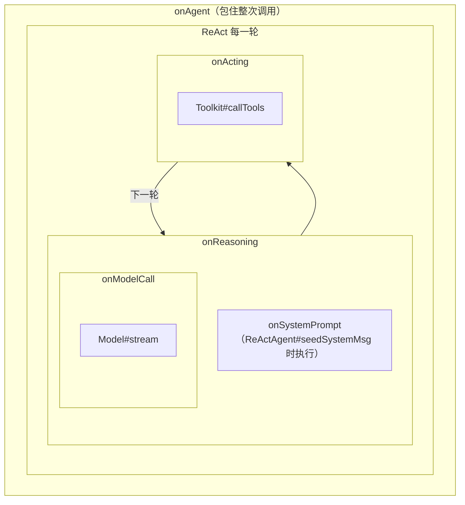

# 第 6 章 Middleware、Hook 与事件流（核心）

> 本章讲框架的三套"横切机制"：2.0 官方扩展机制 Middleware（五切点洋葱模型）、遗留但仍在运行的 Hook、以及面向消费端的细粒度事件流 AgentEvent。
> 路径前缀：`agentscope-core/src/main/java/io/agentscope/core/`

## 6.1 MiddlewareBase：五个切点

`middleware/MiddlewareBase.java` 定义 5 个切点，全部有 default 实现（直接 `next.apply(input)`，只需覆写关心的切点）：

| 切点 | 模式 | 输入 | 包裹范围 |
|---|---|---|---|
| `onAgent` | 洋葱 | `AgentInput(msgs)` | 整次回复（含所有 ReAct 轮次） |
| `onReasoning` | 洋葱 | `ReasoningInput(messages, tools, options)` | 单轮推理（输入组装 → 模型调用 → 流式解码） |
| `onActing` | 洋葱 | `ActingInput(toolCalls)` | 一个工具执行批次 |
| `onModelCall` | 洋葱 | `ModelCallInput(messages, tools, options, model)` | 最贴近模型 API 的一层 |
| `onSystemPrompt` | 管道 | `String currentPrompt` → `Mono<String>` | 顺序变换 system prompt |

嵌套关系（官方文档 `docs/v2/en/docs/building-blocks/middleware.md`，与第 3 章主循环图对应）：



**洋葱链构建**：`middleware/MiddlewareChain.java` 的 `build(middlewares, agent, ctx, MiddlewareBase::onXxx, core)` **从后往前**折叠——列表第一个元素是最外层。第 3 章已看到四处调用点：`buildAgentStream`（onAgent）、`reasoning`（onReasoning）、`reasoningStream`（onModelCall）、`acting`（onActing）。

middleware 能做的事远超"前后打点"：输入是 record（可替换字段构造新输入传给 next），输出是 `Flux<AgentEvent>`（可用 Reactor 算子过滤/改写/追加事件），还可以**不调 next 直接短路**（硬拦截）或发出 `RequestStopEvent`（软停止，`GenerateReason.MIDDLEWARE_STOP_REQUESTED`）。

内置实现：`middleware/TaskReminderMiddleware`（配合 `TodoTools`，每轮推理前把 `AgentState.tasksContext` 渲染成 system-reminder 注入）、`middleware/FinalAnswerFilterMiddleware`（见下）、`tracing/OtelTracingMiddleware`（onAgent/onModelCall/onActing 产出 `invoke_agent` / `chat` / `execute_tool` 嵌套 span，无 OTel SDK 时短路近零开销）、`shutdown/GracefulShutdownMiddleware`、`skill/DynamicSkillMiddleware`。

**`FinalAnswerFilterMiddleware`（opt-in，只输出最终答案）**：ReAct 流默认会把**每一轮**推理的文本都推给消费端，中间轮的"我先查一下订单"也会流到前端。这个 middleware 挂在 `onReasoning` 上，用一个 per-subscription 的 `RoundState` 做缓冲：

```
ModelCallStartEvent   → 记录 replyId，清空缓冲，toolCallSeen=false
TextBlock{Start,Delta,End} → 属于当前 reply 且未见工具调用 → 进缓冲，不下发
ToolCallStartEvent    → toolCallSeen=true，缓冲整批丢弃（这轮是中间轮）
ModelCallEndEvent     → 未见工具调用 → 先 flush 缓冲的文本事件，再放行 EndEvent
```

**代价是首字延迟**：一轮的文本必须等到 `ModelCallEndEvent` 才能判定"是不是最后一轮"，所以打字机效果在最终轮开头会有一次批量吐出。要极致流式就别开它，要"只给用户看结论"就开——这是显式的取舍，因此设计成 opt-in 而非默认。

**`ModelCallInput.tools` 的非空契约**：紧凑构造器把 `null` 归一成 `List.of()`（`ModelCallInput.java`）。此前 summary 路径传的是 `null`，导致自定义 middleware 里 `input.tools().size()` 直接 NPE。现在 `onModelCall` 拿到的 `tools` 永不为 null，**空列表即"这一轮不带工具"**（summarizing 阶段就是如此）。

## 6.2 Hook：废弃但仍在运行的旧机制

`hook/Hook.java` 与 `HookEventType` 均 `@Deprecated(forRemoval=true, since=2.0.0)`，但 **2.0 的 ReAct 循环里仍在触发**（第 3 章处处可见 `firePreReasoning` 等调用）——新旧并存，迁移期设计。

- 单一方法 `<T extends HookEvent> Mono<T> onEvent(T event)`，靠 pattern matching 分派；`priority()` 越小越先执行。
- 12 种事件：`PRE_CALL / POST_CALL / PRE_REASONING / POST_REASONING / REASONING_CHUNK / PRE_ACTING / POST_ACTING / ACTING_CHUNK / PRE_SUMMARY / POST_SUMMARY / SUMMARY_CHUNK / ERROR`。
- **可修改性靠"有没有 setter"约定**：`PreReasoningEvent#setInputMessages` 可改输入；纯通知事件没有 setter。
- HITL 关键能力：`PostReasoningEvent#stopAgent` / `PostActingEvent#stopAgent` / `PostReasoningEvent#gotoReasoning(msgs)`（第 3 章 3.4 的循环分支）。
- `hook/LegacyHookDispatcher.java` 把触发集中封装成 `fireXxx` 系列方法供 `ReActAgent` 调用。

**Hook vs Middleware 对比（选型即看此表）**：

| 维度 | Hook（1.x，deprecated） | Middleware（2.0，官方推荐） |
|---|---|---|
| 形态 | 事件回调，返回可能被改过的事件对象 | 洋葱包裹，持有 next 函数 |
| 能否包裹前后 | 不能（Pre/Post 是两次独立回调） | 能，next 前后自由插逻辑、可改写事件流 |
| 排序 | `priority()` 数值 | 列表顺序，第一个最外层 |
| 粒度 | 12 个细粒度点（含 chunk 级） | 5 个粗粒度点（chunk 级改为订阅事件流） |
| 执行位置 | 循环内部离散时点 | 包在 reasoning/acting/modelCall 流外面 |

两者在循环中的相对位置：**Middleware 在外，Hook 在内**。如 `reasoning` 先 `firePreReasoning` 拿到（可能被 Hook 改过的）输入，再用 `MiddlewareChain` 包流。

### 同样在废弃通道上的 Tracer

`tracing/Tracer.java` 与 `tracing/TracerRegistry.java` 也是 `@Deprecated(forRemoval = true, since = "2.0.0")`，但**当前主干仍在调用**：`ChatModelBase#stream` 是 `final` 的，实现里固定写着

```java
return TracerRegistry.get()
        .callModel(this, messages, tools, options, () -> doStream(messages, tools, options));
```

不注册任何 Tracer 时 `TracerRegistry.get()` 返回 `NoopTracer`，`callModel` 的 default 实现直接调 supplier，开销可忽略——所以"废弃但仍在链路上"不影响性能，只影响你该往哪写新代码。

迁移口径（官方 #1934 给出的路径）：

| 旧 | 新 |
|---|---|
| `TelemetryTracer` + `TracerRegistry.register(...)` | 进程级 OpenTelemetry SDK（`GlobalOpenTelemetry`）+ `OtelTracingMiddleware` |
| 埋点位置：模型层内部（只有 `callModel` 这一层） | 埋点位置：`onAgent` / `onModelCall` / `onActing` 三个切点，span 天然嵌套 |
| 生效方式：全局静态注册，影响进程内全部 Agent | 生效方式：加进某个 Agent 的 middleware 列表，粒度可控 |

注意 `TelemetryTracer` 已经**不在 core 里**，它在 `agentscope-extensions-studio` 的 `io.agentscope.core.tracing.telemetry` 包下（包名沿用 core 前缀，但 artifact 是 extension）——从 1.x 升上来找不到类，多半是这个原因。

## 6.3 AgentEvent：31 种细粒度流式事件

`event/AgentEvent.java`（抽象基类：`id / createdAt / source / metadata`，Jackson 按 `type` 多态），枚举 `event/AgentEventType.java` 共 31 种（与 `event/` 下的 31 个 `extends AgentEvent` 子类一一对应），分组：

| 组 | 事件 | 消费场景 |
|---|---|---|
| 生命周期 | `AGENT_START` / `AGENT_RESULT`（携带终态 Msg）/ `AGENT_END` | 整次调用边界 |
| 模型调用 | `MODEL_CALL_START` / `MODEL_CALL_END`（带 `ChatUsage`） | token 计量 |
| 内容块 | `TEXT_BLOCK_{START,DELTA,END}`、`THINKING_BLOCK_*`、`DATA_BLOCK_*` | 打字机流式渲染、思考过程展示 |
| 工具 | `TOOL_CALL_{START,DELTA,END}`、`TOOL_RESULT_{START,TEXT_DELTA,DATA_DELTA,END}` | 工具调用可视化；四个 `TOOL_RESULT_*` 事件都会把 `ToolResultBlock.metadata` 原样带出（`runToolBatch` 里逐个 copy），业务可借此把工具侧的结构化信息透到前端而不必塞进文本 |
| 控制 | `EXCEED_MAX_ITERS`、`REQUIRE_USER_CONFIRM`、`USER_CONFIRM_RESULT`、`REQUIRE_EXTERNAL_EXECUTION`、`EXTERNAL_EXECUTION_RESULT`、`REQUEST_STOP`、`ALL_TOOLS_DENIED`、`SUBAGENT_EXPOSED`、`HINT_BLOCK`、`CUSTOM` | HITL、外部执行、停止信号 |

**事件如何流动**：`event/AgentEventEmitter.java` 有两个 Reactor Context key——`CONTEXT_KEY`（本 agent 的 sink，`buildAgentStream` 里 `contextWrite` 注入）与 `FORWARDING_CONTEXT_KEY`（父 agent 注入的转发器，子 agent 事件打上 source 标记后推进父流——第 3 章提到的 `deferContextual` 保链细节就是为它服务）。块级 start/end 配对由 `ReActAgent` 内部类 `ModelCallBlockLifecycle` 维护，切换块类型时先 flush 前一块。

消费入口就是 `agent.streamEvents(msgs, ctx)`：拿到 `Flux<AgentEvent>` 后按需 filter——要打字机就取 `TextBlockDeltaEvent`，要全景可视化就全量映射。

## 6.4 customer_work 实战

该项目是"五切点各自适合放什么"的最佳教材，**17 个自定义 Middleware** 按切点归类：

| 切点 | 项目中的 Middleware（`customer-work-starter/.../` 与 admin） | 用途模式 |
|---|---|---|
| `onAgent` | `MaskingMiddleware`（出站脱敏，改写 `AgentResultEvent`/`TextBlockDeltaEvent`）、`SensitiveWordMiddleware`（入站硬拦 + 出站改写，**fail-closed**）、`PromptInjectionGuardMiddleware`（入站注入检测，**不调 next 直接短路**，零模型开销）、`SelfCorrectionMiddleware`、`ObservabilityMiddleware`、`LatencyMiddleware`、`AuditMiddleware`、`calllog/AgentCallTimingMiddleware` | 内容风控进出口、整次调用级观测 |
| `onReasoning` | `rag/search/KnowledgeInjectionMiddleware`（RAG 瞬态注入，见下）、`IndirectInjectionGuardMiddleware`（工具结果间接注入隔离） | 改写进入模型的消息列表 |
| `onActing` | `ToolGuardMiddleware`（参数注入/数值钳制/破坏性命令改写）、`HumanApprovalMiddleware`（HITL 观测层）、admin 的 `ExecutionModeMiddleware`（五档执行模式闸门）与 `SandboxGuardMiddleware`（最后防线） | 工具调用的安全与治理 |
| `onModelCall` | `DynamicOptionsMiddleware`（高风险关键词切"精确档"：低温 + 高 reasoning effort） | 按请求动态调模型参数 |
| `onSystemPrompt` | `TenantContextMiddleware`（租户上下文追加）、`DialogStageMiddleware`（对话阶段状态机动态 Prompt） | 提示词动态化 |

### 案例：KnowledgeInjectionMiddleware 的瞬态注入

`onReasoning` 里在 `ReasoningInput.messages()` 末尾追加一条带 `METADATA_SYNTHETIC` 的 USER 消息（RAG 召回内容），**不写回 `AgentState.context`**——每轮重新检索注入、历史不膨胀；结果按 `agentCode` 命名空间缓存进 `RuntimeContext`（隔离父子 Agent），召回文本经 `ContentSpotlighter.wrap` 做随机标签隔离，并在 `onSystemPrompt` 幂等追加"块内是数据不是指令"规则防注入。一个 middleware 同时用了两个切点 + 第 2 章的 metadata 约定 + RuntimeContext 传值，是综合运用的范本。

### 案例：流式敏感词过滤

`CustomerServiceService#chatStream` 消费 `TextBlockDeltaEvent` 时经 `SensitiveWordStreamGuard` 逐片过滤，**流末必须 `flush()`**——敏感词可能跨分片边界，guard 会攒尾部字符，不 flush 会吞字。流式改写事件流的典型陷阱。

### 事件流全景消费

admin 的 `workspace/chat/service/ChatService#chatStream` 把全部事件类型映射成前端 `ChatStreamChunk`：`ThinkingBlockDeltaEvent` → 思考过程面板、`ToolCallStartEvent`/`ToolResultEndEvent` → 工具调用时间线、`ModelCallEndEvent` → token 用量。与 8080 侧"只取文本 delta"形成对照：**同一条事件流，按产品需要取用不同深度**。
