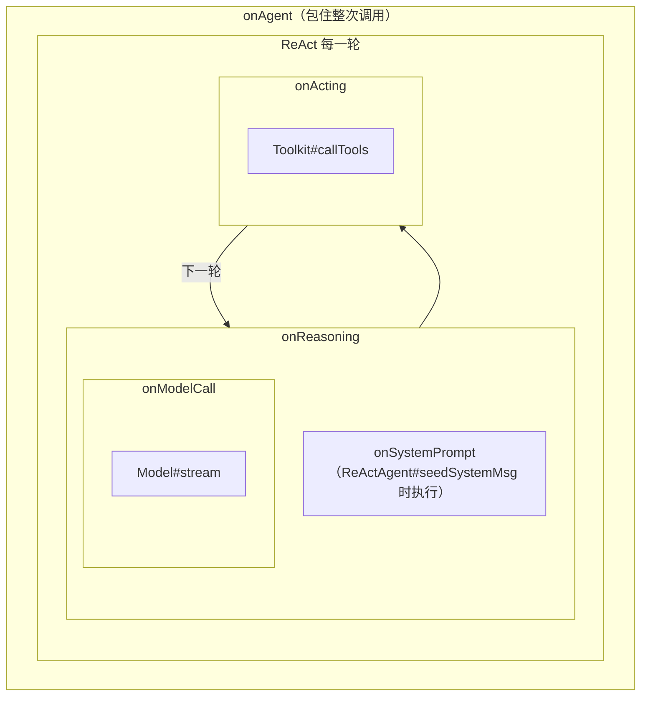
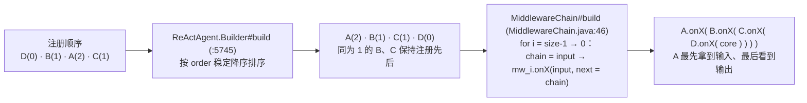
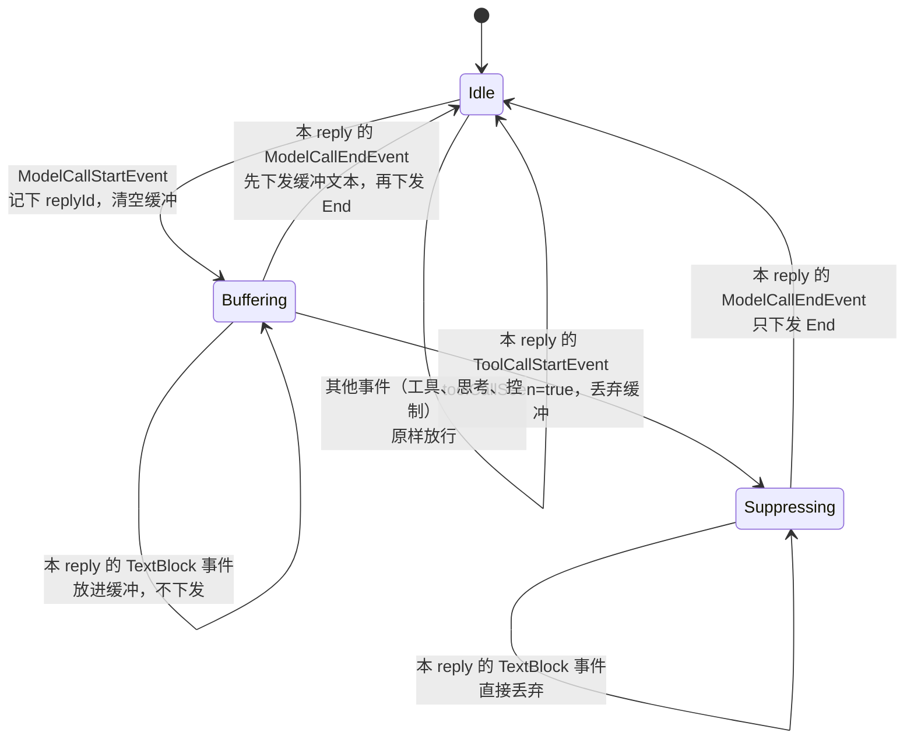
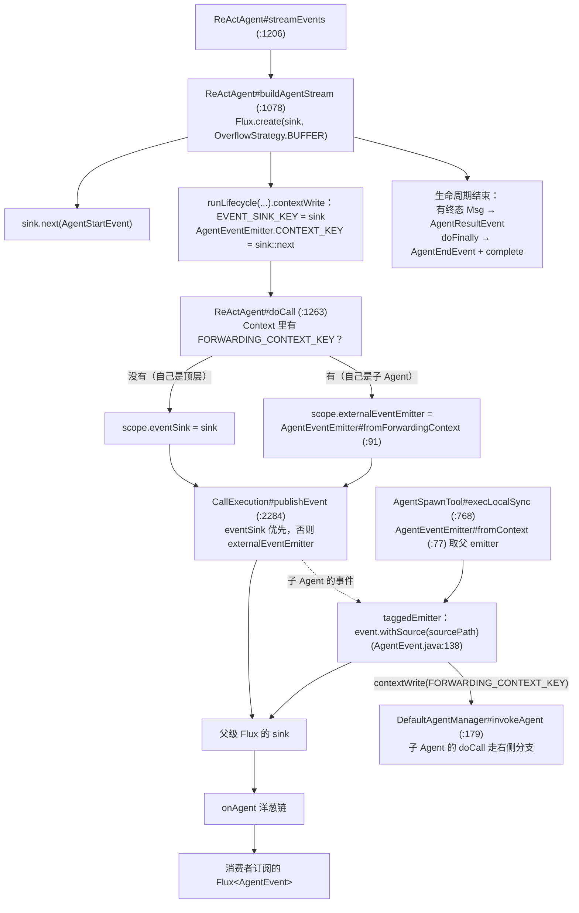

# 第 6 章 Middleware、Hook 与事件流（核心）

> 本章讲框架的三套"横切机制"：2.0 官方扩展机制 Middleware（五个包裹切点 + main 新增的一个通知点）、遗留但仍在运行的 Hook、以及面向消费端的细粒度事件流 AgentEvent。
> 路径前缀：`agentscope-core/src/main/java/io/agentscope/core/`
> 源码基线：agentscope-java main `91550713`（2026-10-02，2.0.4-SNAPSHOT 未发版）；行号均按此提交。标“main”的内容不在 v2.0.3 里。

## 6.1 MiddlewareBase：五个切点，main 上再加一个通知点

`middleware/MiddlewareBase.java` 定义 5 个包裹切点，全部有 default 实现（直接 `next.apply(input)`，只需覆写关心的切点）；main 上又加了第 6 个扩展点 `onAgentStateReady`，它不是洋葱，是一次性通知：

| 切点 | 模式 | 输入 | 包裹范围 |
|---|---|---|---|
| `onAgent` | 洋葱 | `AgentInput(msgs)` | 整次回复（含所有 ReAct 轮次） |
| `onReasoning` | 洋葱 | `ReasoningInput(messages, tools, options)` | 单轮推理（输入组装 → 模型调用 → 流式解码） |
| `onActing` | 洋葱 | `ActingInput(toolCalls)` | 一个工具执行批次 |
| `onModelCall` | 洋葱 | `ModelCallInput(messages, tools, options, model)` | 最贴近模型 API 的一层 |
| `onSystemPrompt` | 管道 | `String currentPrompt` → `Mono<String>` | 顺序变换 system prompt |
| `onAgentStateReady`（main，#3370） | 通知 | `AgentState state, List<Msg> inputMessages`，返回 `void` | 本次调用的会话状态绑定好之后、输入进入流水线之前，同步调一次；没有 `next`，抛异常会让整次调用失败 |

嵌套关系（官方文档 `docs/v2/en/docs/building-blocks/middleware.md`，与第 3 章主循环图对应）：


```mermaid
flowchart TB
    subgraph OA["onAgent（包住整次调用）"]
        subgraph ROUND["ReAct 每一轮"]
            subgraph OR["onReasoning"]
                OSP["onSystemPrompt<br/>（ReActAgent#seedSystemMsg 时执行）"]
                subgraph OMC["onModelCall"]
                    M["Model#stream"]
                end
            end
            subgraph OACT["onActing"]
                T["Toolkit#callTools"]
            end
            OR --> OACT
            OACT -->|"下一轮"| OR
        end
    end
```

**洋葱链构建**：`middleware/MiddlewareChain.java` 的 `build(middlewares, agent, ctx, MiddlewareBase::onXxx, core)` **从后往前**折叠——列表第一个元素是最外层。第 3 章已看到四处调用点：`buildAgentStream`（onAgent）、`reasoning`（onReasoning）、`reasoningStream`（onModelCall）、`acting`（onActing）。

**但"列表"不等于"注册顺序"**。2.0.1 起 `MiddlewareBase` 多了一个默认方法：

```java
default int order() { return 1; }   // 数值越大越靠外
```

`ReActAgent.Builder#build` 在把框架自带的 middleware（如 `TaskReminderMiddleware`、`DynamicSkillMiddleware`）追加进列表之后，做一次排序（`ReActAgent.java:5745`）：

```java
// List.sort is stable: middlewares with equal order retain their registration order.
middlewares.sort(Comparator.comparingInt(MiddlewareBase::order).reversed());
```

所以真实规则是两级：**先按 `order()` 降序，同 order 再按注册顺序**。框架内置的 middleware（core 与 harness 两侧）目前**没有一个覆写 `order()`**，全员都是 1——这就是"注册顺序即洋葱层次"在默认情况下仍然成立的原因，也是它会在你不经意时失效的原因：

| 你的 middleware | 实际位置 |
|---|---|
| 不覆写 `order()`（=1） | 按注册顺序排，先注册的在外 |
| `order()` 返回 2 及以上 | 排到**所有**默认 middleware 外面，无论注册早晚 |
| `order()` 返回 0 或负数 | 排到**所有**默认 middleware 里面——包括第 7 章 Harness 装配的沙箱、压缩等全部内置层 |

最后一行值得警惕：审计、脱敏这类"必须看到最终结果"的 middleware，如果被人随手写了个 `order() = 0`，就会跑到 `SandboxLifecycleMiddleware` 等内置层内侧，观察到的是加工之前的事件。

从注册到真正执行，用一个具体例子走一遍（`A.order()=2`，`B`、`C` 取默认值 1，`D.order()=0`，注册顺序为 D、B、A、C）：


```mermaid
flowchart LR
    REG["注册顺序<br/>D(0) · B(1) · A(2) · C(1)"] --> SORT["ReActAgent.Builder#build (:5745)<br/>按 order 稳定降序排序"]
    SORT --> LIST["A(2) · B(1) · C(1) · D(0)<br/>同为 1 的 B、C 保持注册先后"]
    LIST --> FOLD["MiddlewareChain#build (MiddlewareChain.java:46)<br/>for i = size-1 → 0：<br/>chain = input → mw_i.onX(input, next = chain)"]
    FOLD --> RUN["A.onX( B.onX( C.onX( D.onX( core ) ) ) )<br/>A 最先拿到输入、最后看到输出"]
```

`build` 本身不排序，也不做去重：同一个 middleware 实例注册两次，就会在链上出现两层。它只负责按列表顺序折叠，排序只在 `ReActAgent.Builder#build` 里做一次。

**main 新增：`activePoints()` 参与开关（#3371）**。排好序之后，构造器还会按扩展点分一次组（`groupMiddlewares`，`ReActAgent.java:818`）：每个 middleware 用 `activePoints()` 声明自己参与哪几个扩展点，默认是全部；分组结果是构造时的不可变快照，各切点调用处用 `middlewaresAt(point)`（`:845`）取参与者，再交给 `MiddlewareChain.build`。几条规则：

- 它是参与开关，不是“覆写了哪些方法”的声明：声明了没覆写，走默认的直通；**覆写了但没声明，永远不会被调用**。
- 返回空集合等于在所有点上关掉，但仍然留在注册列表里；返回 `null` 按全集处理。
- 只在构造 Agent 时读一次，之后改返回值无效。
- 分组是稳定过滤，各点内部仍保持 `order()` 排出来的洋葱顺序。

core 自带的 5 个 middleware 在 main 上都收窄了声明：`FinalAnswerFilterMiddleware` 只在 `ON_REASONING`，`TaskReminderMiddleware` 在 `ON_SYSTEM_PROMPT` + `ON_REASONING`，`OtelTracingMiddleware` 在 `ON_AGENT` + `ON_MODEL_CALL` + `ON_ACTING`，`GracefulShutdownMiddleware` 在 `ON_REASONING` + `ON_ACTING`，`DynamicSkillMiddleware` 只在 `ON_SYSTEM_PROMPT`。它们的注释都写着“子类多覆写了切点，必须把集合也扩上”——**继承这些类再覆写别的切点，不扩 `activePoints()` 就是静默不生效**。Harness 的内置 middleware 同样都声明了 `activePoints()`。

`onAgentStateReady` 的调用点在 `beforeAgentExecution`（`:768`）：会话状态刚绑到 `RuntimeContext` 上，就按 `order()` 顺序逐个通知（`:791`），传进去的 `inputMessages` 是本次调用的私有可变副本，就地修改对本次调用生效、不影响调用方的原列表。它在中断注册之后、追踪和错误事件链建立之前执行，所以这里抛的异常不会触发 `ErrorEvent` Hook，也没有追踪 span，源码注释要求它非阻塞、快速失败，并且不能重入同一会话的 Agent（会卡死在调用闸门上）。

middleware 能做的事远超"前后打点"：输入是 record（可替换字段构造新输入传给 next），输出是 `Flux<AgentEvent>`（可用 Reactor 算子过滤/改写/追加事件），还可以**不调 next 直接短路**（硬拦截）或发出 `RequestStopEvent`（软停止，`GenerateReason.MIDDLEWARE_STOP_REQUESTED`）。

**改写事件流 ≠ 改写会话历史**，差别取决于你挂在哪个切点。看 `reasoningStream`（`ReActAgent.java:2673`）怎么收尾：

```java
return MiddlewareChain.build(middlewares, ..., MiddlewareBase::onModelCall, modelCallCore)
        .apply(new ModelCallInput(...))
        .doOnNext(event -> {                       // 收集的是经过 onModelCall 链之后的 delta
            if (event instanceof TextBlockDeltaEvent textDelta) { transformedText.append(...); }
        })
        .doOnTerminate(() -> context.replaceAccumulatedText(transformedText.toString()));
```

`reasoningStream` 整体又被包在 `onReasoning` 链里（`:2514` 的 `reasoningCore`），`buildFinalMessage()` 在链结束后才调（`:2549`）。回灌带一个条件（`:2701`）：只有链上真出现过文本增量、或者累加器本来就有文本时才覆盖，避免一轮纯工具调用把累加器清空。于是：

| 在哪个切点改写 `TextBlockDeltaEvent` | 推给消费端的文本 | 写进 `AgentState.context` 的助手消息 |
|---|---|---|
| `onModelCall`（推理轮） | 改写后 | **改写后**（被 `replaceAccumulatedText` 回灌） |
| `onReasoning` / `onAgent` | 改写后 | **原文**（累加器早在内层就定稿了） |

而且不是每个切点"改写事件流"都有效。决定消费端能看到什么的，是 `publishEvent` 挂在链的里面还是外面：

| 切点 | `publishEvent` 的位置 | middleware 改写或追加的事件，消费端能否看到 |
|---|---|---|
| `onAgent` | 链的核心就是 sink 本身 | 能 |
| `onReasoning` | 链外：`reasoning` 里 `stream.doOnNext(this::publishEvent)`（`ReActAgent.java:2538`） | 能。源码注释写明，就是为了让 `onReasoning` 追加的事件（如 `InboxMiddleware` 的 `HintBlockEvent`）也能转发出去 |
| `onModelCall` | 推理轮在外层 `onReasoning` 链外发布；总结轮在 `summaryStream` 的链外发布（`:4084`） | 能 |
| `onActing` | **链内**：`actingStream` 自己就 `doOnNext(this::publishEvent)`（`:3185`），链外的 `acting` 只检查有没有 `RequestStopEvent` | **不能**。事件在进入你的 middleware 之前就已经推给消费端了，改写无效，追加的事件也会被丢掉。只有 `RequestStopEvent` 会被识别并生效 |

最后一行是个容易踩的坑：想在 `onActing` 里给工具结果打标、脱敏或补充一个 `CustomEvent`，写完发现前端完全没变化。这类需求应该放到 `onAgent`，或者改工具本身的返回值（`ToolResultBlock.metadata` 会随工具结果事件一起带出，见 6.3）。main `91550713` 上这里的结构没有变化。

这条回灌是 2.0.1 修的（#2469，此前 `onModelCall` 的改写连最终消息都进不去，原生结构化输出会读到陈旧文本）。落到实践上：**只想让用户看不到、但会话历史里要保留原文**（审计、客服质检回放）的脱敏，放 `onAgent`；**要求模型下一轮也看不到原文**的改写，必须放 `onModelCall`。

内置实现：`middleware/TaskReminderMiddleware`（配合 `TodoTools`，每轮推理前把 `AgentState.tasksContext` 渲染成 system-reminder 注入）、`middleware/FinalAnswerFilterMiddleware`（见下）、`tracing/OtelTracingMiddleware`（onAgent/onModelCall/onActing 产出 `invoke_agent` / `chat` / `execute_tool` 嵌套 span，无 OTel SDK 时短路近零开销；main 上新增带 `OpenTelemetry` 参数的构造器，可以用应用自己的 SDK 实例而不依赖 `GlobalOpenTelemetry`（#3250），`chat` span 也补上了缓存读、缓存写、推理和服务端工具四项用量属性（#3215，见第 5 章））、`shutdown/GracefulShutdownMiddleware`、`skill/DynamicSkillMiddleware`。

**`FinalAnswerFilterMiddleware`（opt-in，只输出最终答案）**：ReAct 流默认会把**每一轮**推理的文本都推给消费端，中间轮的"我先查一下订单"也会流到前端。这个 middleware 挂在 `onReasoning` 上，用一个 per-subscription 的 `RoundState` 做缓冲：

```
ModelCallStartEvent   → 记录 replyId，清空缓冲，toolCallSeen=false
TextBlock{Start,Delta,End} → 属于当前 reply 且未见工具调用 → 进缓冲，不下发
ToolCallStartEvent    → toolCallSeen=true，缓冲整批丢弃（这轮是中间轮）
ModelCallEndEvent     → 未见工具调用 → 先 flush 缓冲的文本事件，再放行 EndEvent
```

同一逻辑的状态机（`FinalAnswerFilterMiddleware.RoundState`，`:75`；每次订阅新建一个实例，互不干扰）：


```mermaid
stateDiagram-v2
    [*] --> Idle
    Idle --> Buffering: ModelCallStartEvent<br/>记下 replyId，清空缓冲
    Buffering --> Buffering: 本 reply 的 TextBlock 事件<br/>放进缓冲，不下发
    Buffering --> Suppressing: 本 reply 的 ToolCallStartEvent<br/>toolCallSeen=true，丢弃缓冲
    Suppressing --> Suppressing: 本 reply 的 TextBlock 事件<br/>直接丢弃
    Buffering --> Idle: 本 reply 的 ModelCallEndEvent<br/>先下发缓冲文本，再下发 End
    Suppressing --> Idle: 本 reply 的 ModelCallEndEvent<br/>只下发 End
    Idle --> Idle: 其他事件（工具、思考、控制）<br/>原样放行
```

只有**属于当前 `replyId`** 的文本事件才会被缓冲或丢弃（`isCurrentReply`）。另外要知道，父 Agent 挂的这个 middleware **根本收不到子 Agent 的事件**：子 Agent 的事件经 emitter 直接写进父级的 sink，不经过父级的 `onReasoning` 链（见 6.3 的事件流图）。所以父 Agent 开了最终答案过滤，子 Agent 中间轮次的文本仍然会出现在流里；要过滤子 Agent 的文本，得在子 Agent 自己身上也挂一份。

**代价是首字延迟**：一轮的文本必须等到 `ModelCallEndEvent` 才能判定"是不是最后一轮"，所以打字机效果在最终轮开头会有一次批量吐出。要极致流式就别开它，要"只给用户看结论"就开——这是显式的取舍，因此设计成 opt-in 而非默认。

**`ModelCallInput.tools` 的非空契约**：紧凑构造器把 `null` 归一成 `List.of()`（`ModelCallInput.java`）。此前 summary 路径传的是 `null`，导致自定义 middleware 里 `input.tools().size()` 直接 NPE。现在 `onModelCall` 拿到的 `tools` 永不为 null，**空列表即"这一轮不带工具"**（summarizing 阶段就是如此）。

## 6.2 Hook：废弃但仍在运行的旧机制

`hook/Hook.java` 与 `HookEventType` 均 `@Deprecated(forRemoval=true, since=2.0.0)`，但 **2.0 的 ReAct 循环里仍在触发**（第 3 章处处可见 `firePreReasoning` 等调用）——新旧并存，迁移期设计。

- 单一方法 `<T extends HookEvent> Mono<T> onEvent(T event)`，靠 pattern matching 分派；`priority()` 越小越先执行。
- 12 种事件：`PRE_CALL / POST_CALL / PRE_REASONING / POST_REASONING / REASONING_CHUNK / PRE_ACTING / POST_ACTING / ACTING_CHUNK / PRE_SUMMARY / POST_SUMMARY / SUMMARY_CHUNK / ERROR`。
- **可修改性靠"有没有 setter"约定**：`PreReasoningEvent#setInputMessages` 可改输入；纯通知事件没有 setter。
- HITL 关键能力：`PostReasoningEvent#stopAgent` / `PostActingEvent#stopAgent` / `PostReasoningEvent#gotoReasoning(msgs)`（第 3 章 3.4 的循环分支）。
- `hook/LegacyHookDispatcher.java` 把触发集中封装成 `fireXxx` 系列方法供 `ReActAgent` 调用。

**Hook vs Middleware 对比（选型即看此表）**：

| 维度 | Hook（1.x，deprecated） | Middleware（2.0，官方推荐） |
|---|---|---|
| 形态 | 事件回调，返回可能被改过的事件对象 | 洋葱包裹，持有 next 函数 |
| 能否包裹前后 | 不能（Pre/Post 是两次独立回调） | 能，next 前后自由插逻辑、可改写事件流 |
| 排序 | `priority()` 数值，越小越先 | `order()` 数值，**越大越外**（默认 1）；同值按注册顺序 |
| 粒度 | 12 个细粒度点（含 chunk 级） | 5 个粗粒度点（chunk 级改为订阅事件流） |
| 执行位置 | 循环内部离散时点 | 包在 reasoning/acting/modelCall 流外面 |

两者在循环中的相对位置：**Middleware 在外，Hook 在内**。如 `reasoning` 先 `firePreReasoning` 拿到（可能被 Hook 改过的）输入，再用 `MiddlewareChain` 包流。

### 同样在废弃通道上的 Tracer

`tracing/Tracer.java` 与 `tracing/TracerRegistry.java` 也是 `@Deprecated(forRemoval = true, since = "2.0.0")`，但**当前主干仍在调用**：`ChatModelBase#stream` 是 `final` 的，实现里固定写着

```java
return TracerRegistry.get()
        .callModel(this, messages, tools, options, () -> doStream(messages, tools, options));
```

不注册任何 Tracer 时 `TracerRegistry.get()` 返回 `NoopTracer`，`callModel` 的 default 实现直接调 supplier，开销可忽略——所以"废弃但仍在链路上"不影响性能，只影响你该往哪写新代码。

迁移口径（官方 #1934 给出的路径）：

| 旧 | 新 |
|---|---|
| `TelemetryTracer` + `TracerRegistry.register(...)` | 进程级 OpenTelemetry SDK（`GlobalOpenTelemetry`）+ `OtelTracingMiddleware` |
| 埋点位置：模型层内部（只有 `callModel` 这一层） | 埋点位置：`onAgent` / `onModelCall` / `onActing` 三个切点，span 天然嵌套 |
| 生效方式：全局静态注册，影响进程内全部 Agent | 生效方式：加进某个 Agent 的 middleware 列表，粒度可控 |

注意 `TelemetryTracer` 已经**不在 core 里**，它在 `agentscope-extensions-studio` 的 `io.agentscope.core.tracing.telemetry` 包下（包名沿用 core 前缀，但 artifact 是 extension）——从 1.x 升上来找不到类，多半是这个原因。

## 6.3 AgentEvent：31 种细粒度流式事件

`event/AgentEvent.java`（抽象基类：`id / createdAt / source / metadata`，Jackson 按 `type` 多态），枚举 `event/AgentEventType.java` 共 31 种（与 `event/` 下的 31 个 `extends AgentEvent` 子类一一对应），分组：

| 组 | 事件 | 消费场景 |
|---|---|---|
| 生命周期 | `AGENT_START` / `AGENT_RESULT`（携带终态 Msg）/ `AGENT_END` | 整次调用边界 |
| 模型调用 | `MODEL_CALL_START` / `MODEL_CALL_END`（带 `ChatUsage`） | token 计量 |
| 内容块 | `TEXT_BLOCK_{START,DELTA,END}`、`THINKING_BLOCK_*`、`DATA_BLOCK_*` | 打字机流式渲染、思考过程展示 |
| 工具 | `TOOL_CALL_{START,DELTA,END}`、`TOOL_RESULT_{START,TEXT_DELTA,DATA_DELTA,END}` | 工具调用可视化；四个 `TOOL_RESULT_*` 事件都会把 `ToolResultBlock.metadata` 原样带出（`runToolBatch` 里逐个 copy），业务可借此把工具侧的结构化信息透到前端而不必塞进文本 |
| 控制 | `EXCEED_MAX_ITERS`、`REQUIRE_USER_CONFIRM`、`USER_CONFIRM_RESULT`（2.0.1 起在 HITL 恢复时发出，与前一次的 `REQUIRE_USER_CONFIRM` 通过 `replyId` 配对）、`REQUIRE_EXTERNAL_EXECUTION`、`EXTERNAL_EXECUTION_RESULT`、`REQUEST_STOP`、`ALL_TOOLS_DENIED`、`SUBAGENT_EXPOSED`、`HINT_BLOCK`、`CUSTOM` | HITL、外部执行、停止信号 |

**事件如何流动**：`event/AgentEventEmitter.java` 有两个 Reactor Context key——`CONTEXT_KEY`（本 agent 的 sink，`buildAgentStream` 里 `contextWrite` 注入）与 `FORWARDING_CONTEXT_KEY`（父 agent 注入的转发器，子 agent 事件打上 source 标记后推进父流——第 3 章提到的 `deferContextual` 保链细节就是为它服务）。块级 start/end 配对由 `ReActAgent` 内部类 `ModelCallBlockLifecycle` 维护，切换块类型时先 flush 前一块。

事件从产生到被消费者拿到的完整路径（含 `agent_spawn` 子 Agent 转发）：


```mermaid
flowchart TB
    SE["ReActAgent#streamEvents (:1206)"] --> BAS["ReActAgent#buildAgentStream (:1078)<br/>Flux.create(sink, OverflowStrategy.BUFFER)"]
    BAS --> START["sink.next(AgentStartEvent)"]
    BAS --> CW["runLifecycle(...).contextWrite：<br/>EVENT_SINK_KEY = sink<br/>AgentEventEmitter.CONTEXT_KEY = sink::next"]
    CW --> DC["ReActAgent#doCall (:1263)<br/>Context 里有 FORWARDING_CONTEXT_KEY？"]
    DC -->|"没有（自己是顶层）"| BIND1["scope.eventSink = sink"]
    DC -->|"有（自己是子 Agent）"| BIND2["scope.externalEventEmitter =<br/>AgentEventEmitter#fromForwardingContext (:91)"]
    BIND1 --> PUB["CallExecution#publishEvent (:2284)<br/>eventSink 优先，否则 externalEventEmitter"]
    BIND2 --> PUB
    PUB --> SINK["父级 Flux 的 sink"]
    PUB -.->|"子 Agent 的事件"| TAG
    SPAWN["AgentSpawnTool#execLocalSync (:768)<br/>AgentEventEmitter#fromContext (:77) 取父 emitter"] --> TAG["taggedEmitter：event.withSource(sourcePath)<br/>(AgentEvent.java:138)"]
    TAG -->|"contextWrite(FORWARDING_CONTEXT_KEY)"| CHILD["DefaultAgentManager#invokeAgent (:179)<br/>子 Agent 的 doCall 走右侧分支"]
    TAG --> SINK
    BAS --> DONE["生命周期结束：<br/>有终态 Msg → AgentResultEvent<br/>doFinally → AgentEndEvent + complete"]
    SINK --> MW["onAgent 洋葱链"] --> CONSUMER["消费者订阅的 Flux&lt;AgentEvent&gt;"]
```

这张图解释了三个现象。**`call()` 可能返回空**：`AgentResultEvent` 只在生命周期发出终态 `Msg` 时才产生，`call()` 从事件流里过滤这个事件，拿不到就返回空 `Mono`（第 3 章 3.6 的空结果出口）。**消费慢会占内存**：`Flux.create` 用的是 `BUFFER` 策略，消费者跟不上时事件在内存里无上限堆积，SSE 客户端网络差的时候要留意。**不要在工具方法里 `block()` 子 Agent 调用**：`AgentSpawnTool` 的 javadoc 专门提醒过，`block()` 会另起一个订阅，拿不到父级 Context 里的 emitter，子 Agent 的事件就断在这里，转发不到父级流。

还有一条对选切点影响很大：**父 Agent 自己的事件和子 Agent 的事件，进入 sink 的位置不同**。父 Agent 推理阶段的事件先流过 `onReasoning` 链，再由 `doOnNext(this::publishEvent)`（`ReActAgent.java:2538`）写入 sink；子 Agent 的事件则由 `taggedEmitter` 直接写入 sink。结果是，父级的 `onReasoning`、`onActing`、`onModelCall` 都**看不到子 Agent 的事件**，只有 `onAgent` 能同时看到两者。审计、脱敏这类必须覆盖全部输出的 middleware，挂在 `onAgent` 才完整。

还有一条旁路：已废弃的 `stream()` 走的是 `SubagentEventBus`。`buildAgentStream` 发现订阅方的 Context 里有 `SubagentEventBus.CONTEXT_KEY` 时，就不装 `AgentEventEmitter.CONTEXT_KEY`（`:1097` 的注释），否则子 Agent 的事件会被导进内部 sink、再被过滤掉。新代码一律用 `streamEvents`。

main 上 `AgentEvent` 还多了一个约定好的 metadata 键 `generate_reason`：工具结果被 `returnDirect` 直接当作最终答案时（第 3 章），框架合成的那几个 `TextBlock` 事件会带上它，消费端可以区分“模型说的”和“工具结果顶上来的”。

消费入口就是 `agent.streamEvents(msgs, ctx)`：拿到 `Flux<AgentEvent>` 后按需 filter——要打字机就取 `TextBlockDeltaEvent`，要全景可视化就全量映射。

## 6.4 customer_work 实战

该项目是"五切点各自适合放什么"的最佳教材（按 customer_work `3b7dcf6d`，2026-09-25）：`git grep` 实现 `MiddlewareBase` 的类有 **32 个**，下表按切点列出其中有代表性的：

| 切点 | 项目中的 Middleware（`customer-work-starter/.../` 与 admin） | 用途模式 |
|---|---|---|
| `onAgent` | `MaskingMiddleware`（出站脱敏，改写 `AgentResultEvent`/`TextBlockDeltaEvent`）、`SensitiveWordMiddleware`（入站硬拦 + 出站改写，**fail-closed**）、`PromptInjectionGuardMiddleware`（入站注入检测，**不调 next 直接短路**，零模型开销）、`SelfCorrectionMiddleware`、`ObservabilityMiddleware`、`LatencyMiddleware`、`AuditMiddleware`、`calllog/AgentCallTimingMiddleware` | 内容风控进出口、整次调用级观测 |
| `onReasoning` | `rag/search/KnowledgeInjectionMiddleware`（RAG 瞬态注入，见下）、`IndirectInjectionGuardMiddleware`（工具结果间接注入隔离） | 改写进入模型的消息列表 |
| `onActing` | `ToolGuardMiddleware`（参数注入/数值钳制/破坏性命令改写）、`HumanApprovalMiddleware`（HITL 观测层）、admin 的 `ExecutionModeMiddleware`（五档执行模式闸门）与 `SandboxGuardMiddleware`（最后防线） | 工具调用的安全与治理 |
| `onModelCall` | `DynamicOptionsMiddleware`（高风险关键词切"精确档"：低温 + 高 reasoning effort） | 按请求动态调模型参数 |
| `onSystemPrompt` | `TenantContextMiddleware`（租户上下文追加）、`DialogStageMiddleware`（对话阶段状态机动态 Prompt） | 提示词动态化 |

### 案例：MiddlewareOrders，把顺序写成契约

项目早期 24 个 middleware 全用默认的 `order() = 1`，实际顺序就落回注册顺序；而注册列表来自 Spring 的 `orderedStream()`，这些 Bean 一个 `@Order` 都没标，先后是不确定的。于是“先裁剪还是先注入”“审计记的是脱敏前还是脱敏后”这类问题，答案由 Bean 定义顺序偶然决定，改一行无关代码就可能翻转，而且不报错。

后来集中建了一个 `core/middleware/MiddlewareOrders` 常量类，所有治理 middleware 的 `order()` 都返回这里的值，常量按八段从外到内排列：准入（`AGENT_LIFECYCLE = 200`）→ 观测与计量（190～155）→ 审计（150）→ 入站防护（140～135）→ 出站过滤（敏感词 130、脱敏 125）→ 工具治理（120～110）→ 内容质量（107～100）→ 上下文组装（90～50，预算裁剪 `CONTEXT_BUDGET = 50` 最靠内）。审计排在脱敏外面，出站时最后执行，记下的是已经脱敏、过滤过的最终内容；`MiddlewareOrderContractTest` 断言不留默认值、不重复取值、关键相对次序成立。

要注意一个副作用：这些值都大于 1，所以项目自己的 middleware 全部排在框架内置 middleware（都是 1）的外面。“预算裁剪最靠内”只是在项目自己的层里成立：项目开了任务清单（`enableTaskList()`）时，框架会自动加一个 `TaskReminderMiddleware`（`ReActAgent.java:5686`，`order()` 为 1），它也挂在 `onReasoning` 上，位置在 `ContextBudgetMiddleware`（50）里面，裁剪完之后还会再往消息里注入一段任务提醒。

### 案例：KnowledgeInjectionMiddleware 的瞬态注入

`onReasoning` 里在 `ReasoningInput.messages()` 末尾追加一条带 `METADATA_SYNTHETIC` 的 USER 消息（RAG 召回内容），**不写回 `AgentState.context`**——每轮重新检索注入、历史不膨胀；结果按 `agentCode` 命名空间缓存进 `RuntimeContext`（隔离父子 Agent），召回文本经 `ContentSpotlighter.wrap` 做随机标签隔离，并在 `onSystemPrompt` 幂等追加"块内是数据不是指令"规则防注入。一个 middleware 同时用了两个切点 + 第 2 章的 metadata 约定 + RuntimeContext 传值，是综合运用的范本。

### 案例：流式敏感词过滤

`CustomerServiceService#chatStream` 消费 `TextBlockDeltaEvent` 时经 `SensitiveWordStreamGuard` 逐片过滤，**流末必须 `flush()`**——敏感词可能跨分片边界，guard 会攒尾部字符，不 flush 会吞字。流式改写事件流的典型陷阱。

### 事件流全景消费

admin 的 `workspace/chat/service/ChatService#chatStream` 把全部事件类型映射成前端 `ChatStreamChunk`：`ThinkingBlockDeltaEvent` → 思考过程面板、`ToolCallStartEvent`/`ToolResultEndEvent` → 工具调用时间线、`ModelCallEndEvent` → token 用量。与 8080 侧"只取文本 delta"形成对照：**同一条事件流，按产品需要取用不同深度**。
