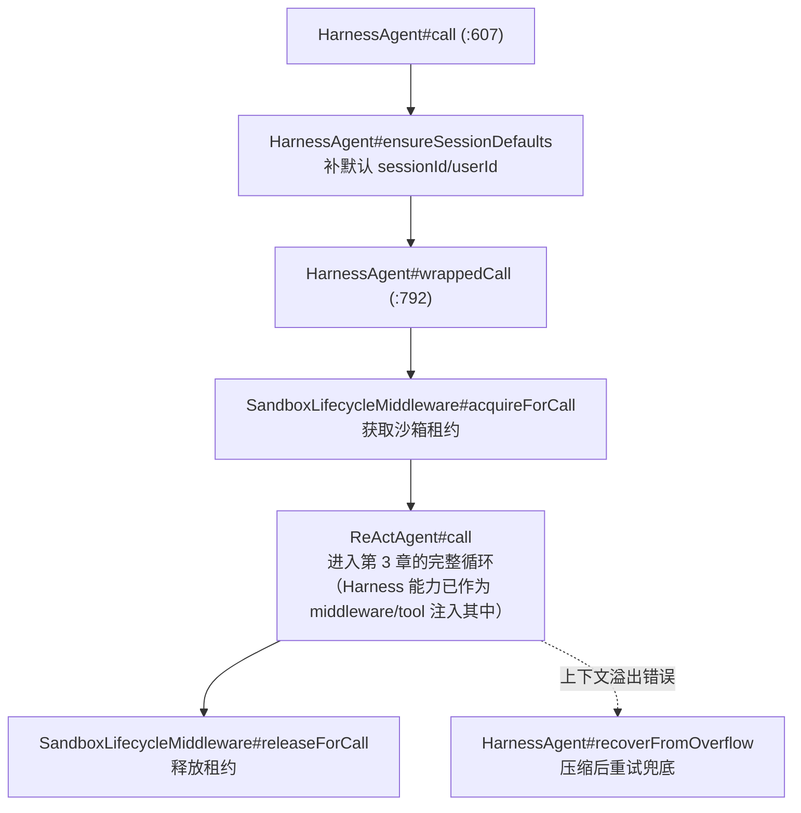
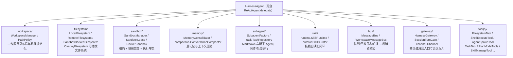

# 第 7 章 Harness 工程化外壳（核心）

> 路径前缀：`agentscope-harness/src/main/java/io/agentscope/harness/`
> 裸 ReAct 只解决"一轮任务"；跑数小时、累积状态、需要文件系统与子 Agent 的长任务，靠 Harness。本章讲 `HarnessAgent` 如何在**不改 ReAct 算法一行**的前提下叠加这些能力。

## 7.1 组合而非继承：HarnessAgent 的结构

`agent/HarnessAgent.java`（2485 行）**implements `Agent`，内部组合一个 `ReActAgent delegate`**。所有 `call/streamEvents` 重载都经 `wrappedCall`（`:792`）：



官方架构文档（`docs/v2/en/docs/harness/architecture.md`）的三条核心原则，读 Harness 源码前先记住：

1. **能力叠加在推理循环之上，而非嵌入其中**——workspace 注入、压缩、子 Agent、沙箱、Plan Mode 各自挂在循环的关键时刻（以 Middleware/Tool 形式），核心算法零改动；
2. **能力之间互不依赖，只共享三个对象**——`RuntimeContext`（本次调用是谁）、workspace（读写哪些文件）、`AgentStateStore`（如何恢复）；
3. **内置 middleware 顺序固定，用户 middleware 永远排在最前面（最外层）。**

## 7.2 Builder 装配：内置 Middleware 的固定顺序

`HarnessAgent.Builder#build`（约 `:2078`~`:2440`）向内部 `ReActAgent.Builder` 按固定顺序注入内置 middleware（列表顺序 = 洋葱层次，第 6 章）：

```
用户 middleware（最外层）
→ SandboxLifecycleMiddleware → AgentTraceMiddleware
→ WorkspaceContextMiddleware → AtPathExpansionMiddleware
→ MemoryFlushMiddleware → MemoryMaintenanceMiddleware
→ CompactionMiddleware → ToolResultEvictionMiddleware
→ InboxMiddleware → DynamicSubagentsMiddleware/SubagentsMiddleware
→ AsyncToolMiddleware → PlanModeMiddleware
→ SkillUsageMiddleware/SkillCuratorMiddleware → HarnessSkillMiddleware
```

另一入口 `HarnessAgent.Builder.fromAgent(existingReActAgent)` 可把现成 ReActAgent 包成 HarnessAgent（customer_work 的渠道接入就这么用，见 7.5）。

## 7.3 能力子包地图



各子包一句话 + 关键类：

| 子包 | 关键类 | 要点 |
|---|---|---|
| `workspace` | `WorkspaceManager`、`WorkspaceIndex`、`PathPolicy`、`plan/PlanModeManager` | 工作区是所有能力的物理基座；沙箱/远端模式下**必须走它而非 `java.nio.Files`** |
| `filesystem` | `local/LocalFilesystem(WithShell)`、`remote/RemoteFilesystem`、`sandbox/SandboxBackedFilesystem`、`OverlayFilesystem`、`spec/{Local,Remote,Sandbox}FilesystemSpec` | 同一套读写/grep/glob 抽象，物理落点（本地/远端/沙箱）是配置选择 |
| `sandbox` | `SandboxManager`、`SandboxLease`、`SandboxIsolationKey`、`SandboxExecutionGuard`、`snapshot/*`、`impl/docker/DockerSandbox*` | 租约式生命周期；快照支持跨进程恢复；`IsolationScope`（SESSION/USER/AGENT/GLOBAL）决定隔离粒度 |
| `memory` | `MemoryConfig`、`MemoryConsolidator`、`compaction/{ConversationCompactor,CompactionConfig,ToolResultEvictionConfig}`、`session/SessionTree` | 三层：上下文 → 每日 `memory/YYYY-MM-DD.md` → 节流后台任务合并进 `MEMORY.md`；压缩是**结构化**的（保留目标/状态/发现/下一步），超大工具结果落盘驱逐 |
| `subagent` | `SubagentDeclaration`、`SubagentFactory`、`AgentSpecLoader`、`task/{BackgroundTask,TaskRepository,WorkspaceTaskRepository,TaskStatus}` | Markdown 声明子 Agent；`agent_spawn` 工具触发；后台任务结果经 system-reminder 推回主 Agent，无需轮询 |
| `skill` | `WorkspaceSkillRepository`、`runtime/{SkillRuntime,SkillLoadTool}`、`curator/{SkillCurator,SkillPromoter,SkillSecurityScanner,SkillPromotionGate}` | 自演化闭环：使用统计 → 提案 → 安全扫描 → 审批门 → 晋升为 `workspace/skills/` 下的 Markdown |
| `bus` | `MessageBus`、`WorkspaceMessageBus`、`AsyncToolRegistry` | 三种消费模式：排空队列（单消费者）/ 回放日志（多消费者各自游标）/ 瞬时广播；key 约定如 `agentscope:inbox:<sessionId>` |
| `gateway` | `HarnessGateway`、`MsgContext`、`SessionTurnGate`、`SubagentRegistry`、`channel/{Channel,ChannelRouter,InboundMessage,OutboundAddress}` | 渠道消息 → `MsgContext#canonicalKey` 稳定映射 sessionId → `SessionTurnGate` 每会话公平互斥 → 路由到注册的 `HarnessAgent#call`；`lastRouteBySession` 支持主动推送 |
| `tool`/`tools` | `FilesystemTool`、`ShellExecuteTool`、`TaskTool`、`AgentSpawnTool`、`MemorySaveTool` 等、`ToolsConfig`（`workspace/tools.json` 声明 MCP 与过滤） | Harness 的能力以内置工具形式暴露给模型 |

**状态三层**（官方文档口径，与第 2 章衔接）：in-call（`AgentState` + `RuntimeContext`）→ cross-call（每次 call 结束自动存/下次自动读，另有永不压缩的全量会话日志 `sessions/<sessionId>.log.jsonl`）→ long-term（`MEMORY.md` 蒸馏，每步推理注入 system prompt）。三条不变式：**system prompt 每步重建**（改 `AGENTS.md`/`MEMORY.md` 立即生效）；压缩/记忆蒸馏有节流（不是每轮都跑）；持久化统一由 core 的 `ReActAgent` + `AgentStateStore` 负责，Harness 不再自带持久化钩子。

## 7.4 何时用 ReActAgent，何时用 HarnessAgent

| 场景 | 选择 |
|---|---|
| 对话、意图识别、轻量工具调用 | `ReActAgent` 足够 |
| 需要文件系统/工作区、长任务、上下文压缩、子 Agent、Plan Mode、沙箱执行代码 | `HarnessAgent` |
| 已有 ReActAgent 想加渠道/工程能力 | `HarnessAgent.Builder.fromAgent(agent)` 包装 |

## 7.5 customer_work 实战

### 全量配置的 HarnessAgent 装配

`customer-work-starter/.../agent/HarnessAgentFactory#createHarnessAgent` 是 Harness Builder 用法的活字典，在内层 ReActAgent 之上叠加：

```
HarnessAgent.Builder.fromAgent(innerReActAgent)
  .stateStore(...)  .permissionContext(...)
  .generateOptions(...)          ← 规避框架 #1644：不显式设置则 streamEvents NPE（第 10 章坑 2）
  .workspace(...)  .compaction(ContextMemoryFactory#createCompaction)   ← CompactionConfig 按 yml 的
                                    context.{compression-enabled,max-token,msg-threshold,last-keep} 生成
  .memory(MemoryConfig)  .environmentMemory(...)
  .toolResultEviction(ToolResultEvictionConfig.defaults())
  .enableSkillManageTool()  .enableSkillCurator(SkillCuratorConfig.defaults())
  .additionalContextFile(...)
  .enablePlanMode().allowShellInPlanMode().planFileDirectory(...)
  .subagentFactory(name, id -> expert)    ← 把 MultiAgentOrchestrator 的三个专家注册为 subagent
  + applySandbox：LocalFilesystemSpec | DockerFilesystemSpec + IsolationScope.{SESSION,USER,AGENT,GLOBAL}
```

每个能力对应 `customer-work.harness.*` 一个配置开关——"每个能力 = 一个开关 + 一个可替换实现"是该项目的总设计原则。

### 用 MybatisTaskRepository 替换框架实现

admin 的 VibeCoding 场景里，子 Agent 后台任务（`agent_spawn`）默认由 `subagent/task/WorkspaceTaskRepository` 落工作区文件；`customer-admin-server/.../workspace/task/runtime/MybatisTaskRepository implements TaskRepository` 改为落库，任务列表就能进管理界面查询。**Harness 的每个子系统都留了接口缝**，这是替换点用法的范例。

### 渠道接入：fromAgent 包装

`customer-channel/.../DingTalkChannelConfigurer#start`：`HarnessAgent.Builder.fromAgent(customerServiceAgent)` + `DingTalkChannel` + `ChannelConfig`（Stream 模式 WebSocket，免公网回调），飞书/企微同构——**同一个业务 Agent，包一层就接入一个新渠道**，gateway/channel 抽象（7.3）在生产中的直接体现。

### VibeCoding：workspace 布局

`workspace/vibecoding/service/VibeCodingService` 的目录设计：HarnessAgent workspace 根为 `{agentCode}/`（`MEMORY.md` 跨会话共享），会话级目录 `data/admin-workspace/{agentCode}/sessions/{sessionId}/`——对应 7.3 的三层状态：agent 级记忆与会话级工作产物分层存放。

### 多 Agent 编排：框架之外的 Reactor 手工编排

1.x 的 `Pipelines` 编排 API 在 2.0 已移除。`MultiAgentOrchestrator#consult` 用纯 Reactor 实现"快慢车道"：规则快车道（关键词命中唯一意图直接路由）→ LLM 分诊 → fanout 三个专家 ReActAgent（各自 `subscribeOn(boundedElastic)` + `maxConcurrency` 限流 + 单专家 timeout 隔离）→ reduce 归纳统一口径。**框架提供 Agent 原语，编排交给通用响应式代数**——这是 2.0 的明确取向（详细链路见第 9 章场景 8）。
