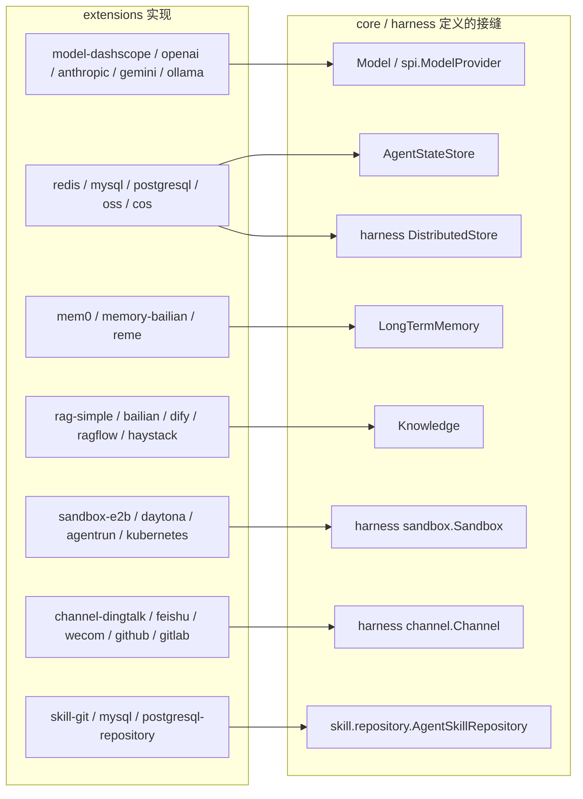

# 第 8 章 扩展生态（非核心，按需查阅）

> 路径前缀：`agentscope-extensions/`。18 个一级模块展开为 58 个可发布 artifact，全部遵循同一原则：**实现 core（少数实现 harness）定义的接口，应用按需引入**。
> 本章是"地图"而非"精读"——先知道有什么、接在哪个接口上，用到时再进对应模块。

## 8.1 全景图：每类扩展接在哪个核心接口上



协议层（AG-UI / A2A / chat-completions）与 Spring Boot Starter 不实现单一接口，而是把 `Agent` 整体适配/暴露出去，单列于 8.3、8.4。

## 8.2 分类速查

### 模型厂商（`agentscope-extensions-model/`）

| 模块 | 一句话 |
|---|---|
| `-dashscope` | 阿里云百炼/通义：`DashScopeChatModel` + `DashScopeHttpClient`（原生 HTTP/SSE、多模态端点自动选择、thinking 模式、请求加密），第 5 章的示例厂商 |
| `-openai` | OpenAI 及一切兼容端点；另含 `DeepSeekFormatter`/`GLMFormatter` 等方言 formatter |
| `-anthropic` / `-gemini` / `-ollama` | Claude / Gemini / 本地 Ollama |
| `-e2e-tests` | 五厂商端到端一致性测试 |

每个模块都带 `XxxModelProvider implements ModelProvider`（SPI），支撑 `ModelRegistry.resolve("openai:gpt-4o")`（第 5 章 5.5）。

### RAG（`agentscope-extensions-rag/`）

| 模块 | 一句话 |
|---|---|
| `-simple` | 自建 RAG 全套：`EmbeddingModel` 抽象（DashScope/Ollama 实现）、reader（Text/PDF/Word/Image/Tika + `TextChunker`）、store（InMemory/PgVector/Qdrant/Milvus/Elasticsearch）、`SimpleKnowledge` |
| `-bailian` / `-dify` / `-ragflow` / `-haystack` | 分别对接百炼托管知识库 / Dify / RAGFlow / Haystack 检索服务 |

core 侧的接缝：`rag/Knowledge`（`addDocuments` / `retrieve`）+ `RAGMode`（`GENERIC` 自动检索注入 / `AGENTIC` 模型经 `KnowledgeRetrievalTools` 自主决定 / `NONE`）。

### 长期记忆（`agentscope-extensions-mem/`）

`-mem0`（Mem0 本地/云）、`-memory-bailian`（百炼记忆服务）、`-reme`（ReMe，含轨迹记忆）——都实现 core 的 `LongTermMemory` 两方法接口（第 2 章 2.3）。

### 存储与分布式

| 模块 | 一句话 |
|---|---|
| `-redis` | `RedisAgentStateStore`（Jedis/Lettuce/Redisson 三套客户端）、`RedisDistributedStore`、`RedisSandboxExecutionGuard`（分布式沙箱执行锁）、快照客户端 |
| `-mysql` | `MysqlAgentStateStore`、`JdbcStore` + Mysql/Postgres/H2/Sqlite 四方言、`JdbcSandboxExecutionGuard` |
| `-postgresql` | `PostgresAgentStateStore` + `BaseStore` 的 PostgreSQL 实现，独立成模块（不在 `-mysql` 的方言里）；支持乐观并发（第 2 章 2.5） |
| `-oss` / `-cos` | 阿里云 OSS / 腾讯云 COS 的状态存储 + 分布式存储 + 快照 |

### 沙箱（`agentscope-extensions-sandbox/`）

`-e2b` / `-daytona` / `-agentrun`（阿里云，含 OSS/NAS 挂载）/ `-kubernetes`（Fabric8 Pod）——云端沙箱；本地 Docker 实现在 harness 自带（`impl/docker/DockerSandbox`，第 7 章）。

### 协议、渠道与周边

| 模块 | 一句话 |
|---|---|
| `-protocol/-agui` | AG-UI 协议：`AguiAgentAdapter` 把 `Flux<AgentEvent>` 编码成 AG-UI 事件流。协议层 SPI（`AgentEventConverter`、`AguiEventEnricher`、`AguiAgentAdapterFactory`，以及后来从 starter 下沉回来的 `AguiRuntimeContextRequest` / `AguiRuntimeContextResolver` / `AguiRequestBodyParser`）都在这里，**不带 Spring 依赖**——纯 WebFlux / RSocket 接入方也能复用 |
| `-protocol/-a2a/{-client,-server}` | Agent-to-Agent 协议，跨进程 agent 像微服务一样互调（agent-card + JSON-RPC）。server 侧的 `AgentRunner` 已从废弃的 `stream()`/`Event` 迁到 `streamEvents()`/`AgentEvent`，`AgentScopeAgentExecutor` 负责把类型化事件转成 A2A 的流式 artifact 与终态消息 |
| `-protocol/-agent-protocol` | 内部任务 HTTP 协议的 Spring MVC 端点，**用于远程子 Agent**（第 7 章 subagent 的跨进程形态） |
| `-protocol/-chat-completions-web` | 把 agent 暴露成 OpenAI `/v1/chat/completions` 兼容接口 |
| `-channel/{-common,-dingtalk,-feishu,-wecom,-github,-gitlab}` | 各 IM/代码平台的 harness `Channel` 实现，公共部分在 `-common` |
| `-nacos/{-a2a,-prompt,-skill}` | Nacos 做 A2A 注册发现 / 提示词动态下发 / 技能仓库 |
| `-scheduler/{-common,-quartz,-xxl-job}` | 定时任务触发 agent |
| `-higress` | Higress AI 网关做 MCP 工具按需发现（第 4 章 4.6） |
| `-studio` | AgentScope Studio 可视化调试对接；**并承载完整 OTel 语义实现 `tracing/telemetry/TelemetryTracer`** |
| `-skills/skill-{git,mysql,postgresql}-repository` | 从 Git / MySQL / PostgreSQL 加载 Markdown 技能 |
| `-training` | 强化学习训练闭环（TrainingRunner / RewardCalculator / TrinityClient） |
| `-aistio` | **旁路观测数据面 SDK**：把自部署的 AgentScope agent 上报给 `agentscope-service` 的控制面（Aistio），做到「自己部署、集中观测」（见第 1 章 1.1 的 service 模块） |

### Spring Boot Starters（`agentscope-spring-boot-starters/`）

| Starter | 一句话 |
|---|---|
| `agentscope-spring-boot-starter` | 核心自动装配：`AgentscopeAutoConfiguration` + 配置属性即建 agent |
| `-dashscope` / `-openai` / `-anthropic` / `-gemini` | 各厂商模型自动装配 |
| `-agui` / `-a2a` / `-chat-completions-web` | 三种协议端点自动暴露（agui 同时提供 MVC 与 WebFlux 两套） |
| `-nacos` | Nacos 提示词/A2A/agent 三套装配 |
| `-admin` | 运维面：会话管理、指标、快照恢复、审计、优雅停机端点、OpenAPI |

## 8.3 agentscope-service：从"框架"到"平台"

2.0.3 主干多出一个与 extensions 平级的顶层模块 `agentscope-service`（第 1 章 1.1 的模块表）。它不是又一个扩展点实现，而是一整套四平面服务：

```
service-gateway     入口网关
service-dataplane   托管数据面（跑 Managed Agents 的 HarnessAgent 运行时）
service-scheduler   调度
service-common      公共
aistio/             控制面（Aistio）
frontend/           Dashboard 控制台
docker/ docker-compose.yml scripts/
```

它解决的是**框架层解决不了的问题**：一家公司里研发用 Coding Agent、业务中台用 AgentScope、新项目想直接上托管运行时，这几套东西各自为政，没有统一的注册、观测和编排入口。三块能力：

- **Control Plane（Aistio）**：所有 Agent 应用统一注册，通过 SDK 或 Sidecar 支持 AgentScope / LangChain / ADK / Claude / Qoder 等运行时。Dashboard 提供在线 agent 列表、实例信息、活跃 session、token 消耗等集群级观测，还能对运行中的 session 做上下文压缩、介入会话。自部署的 agent 走 `agentscope-extensions-aistio` 这个旁路 SDK 上报。
- **Managed Agents**：由 `agentscope-builder` 升级而来的低代码平台，底层就是 HarnessAgent 运行时。强调 **Brain/Hands 分离**——推理侧的 harness 能力完全托管，工具执行则委托给用户自己控制的 Sandbox。设计上对长任务的关键要求是**可恢复**：事件落库、状态可重建、HITL 可暂停续跑，前端刷新或副本切换不等于任务从头开始（对应第 2 章的 `AgentStateStore` 与第 3 章的断点续跑）。
- **Agent Teams**：把注册进控制面的智能体（不论自部署还是托管）编排成协作团队——任务可认领、计划可审批、成员可唤醒，状态不随单个 session 结束而消失。

与框架侧的关系值得说清：**harness 的 `team` 子包（第 7 章 7.3）是框架原生的 Teams 能力**，在主 agent 编码阶段做多 agent 编排；service 的 Teams 则是控制台上把多个独立 agent 动态编排起来。两条路都通，取决于编排关系是"写死在代码里"还是"运营时决定"。

读源码的角度，这个模块**不是理解框架的必经之路**——它是框架的消费者而非组成部分。但如果你在评估"AgentScope 能不能撑起公司级的 Agent 治理"，它就是答案所在。

## 8.4 customer_work 实战：20 个扩展的取舍

customer_work 对每类扩展的选型都是"**一个配置项切换多后端**"（各后端在第 2、9 章有细讲，此处看全景）：

| 能力 | 配置项 | 可选后端（全部来自本章模块） |
|---|---|---|
| 模型 | `customer-work.model.provider` | dashscope / openai / anthropic / gemini / ollama |
| 会话状态 | `customer-work.session.mode` | memory / json（core 自带）/ redis / mysql |
| 长期记忆 | `customer-work.memory.provider` | memory（自研）/ bailian / mem0 / reme |
| RAG | `customer-work.rag.provider` | memory（自研）/ simple / bailian / dify |
| 调度 | `admin.scheduler.mode` 等 | internal / xxl-job |
| 沙箱 | `customer-work.harness.sandbox.mode` | none / local / docker |

**三个模块三种集成姿势**，很有代表性：

1. `customer-work-starter`：自己写 `@AutoConfiguration`，直接 new 扩展类（如 `JedisAgentStateStore`），完全掌控装配顺序；
2. `customer-channel`：用官方 starter（admin 控制台 / chat-completions / AG-UI 三套端点零代码获得），只在 `CustomerWebAgentConfig` 里定义 `Agent`/`Toolkit`/`Model` Bean 供官方 starter 接管；
3. `customer-admin-server`：**用 `spring.autoconfigure.exclude` 关闭 starter 自动装配**，一切显式 new（`AdminAgentRuntimeConfig`）——因为管理后台要按数据库配置动态构建 agent，静态装配反而碍事。

选型判断可以借用该项目的实践：**默认后端保证离线开箱即用（memory/json/mock），生产后端全部可由配置切换**——扩展生态的意义不是"全都用上"，而是"接口统一，随时可换"。
