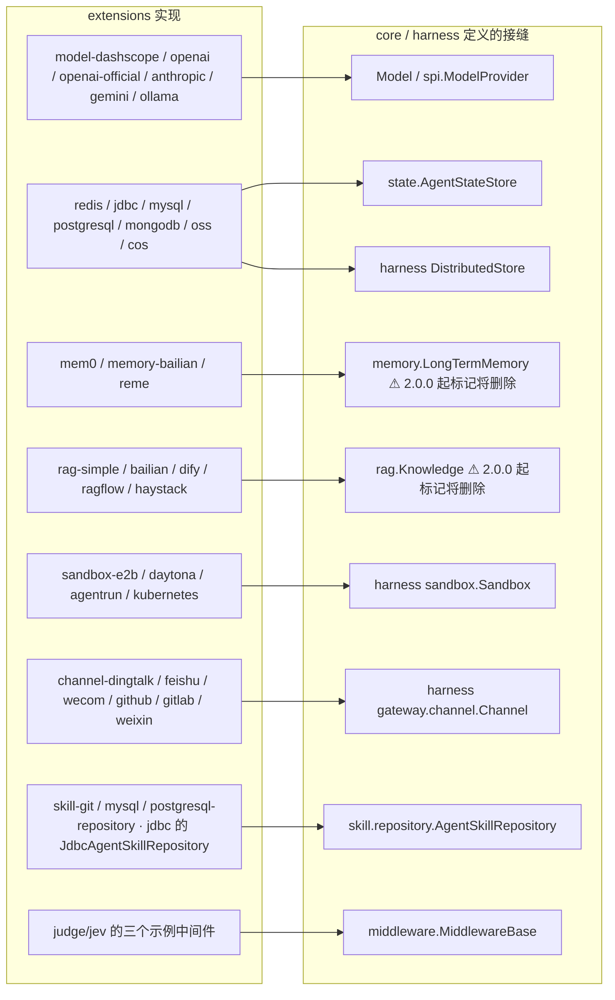
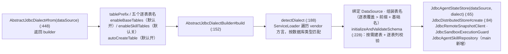
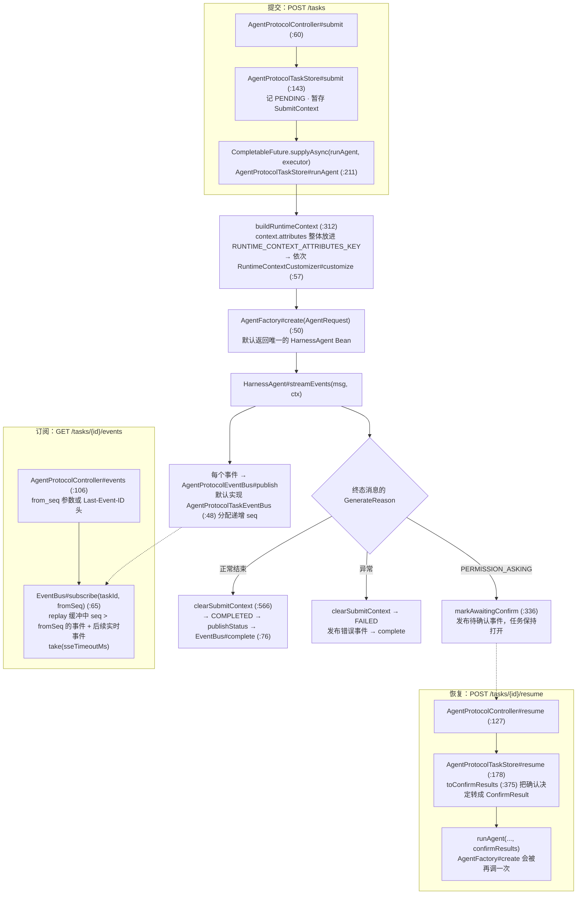

# 第 8 章 扩展生态（非核心，按需查阅）

> 路径前缀：`agentscope-extensions/`。基线 main `9e43ed83`（2026-10-04，2.0.4-SNAPSHOT 未发版）：除 starters 外 **21 个一级模块**，连同 starters 展开为 **64 个**模块 artifact（v2.0.3 是 19 个、59 个；main 新增 `-mongodb`、`-judge/-jev`、`-model-openai-official`、`-channel-weixin`、`jev` starter 这 5 个）。全部遵循同一原则：**实现 core（少数实现 harness）定义的接口，应用按需引入**。
> 本章是"地图"而非"精读"——先知道有什么、接在哪个接口上，用到时再进对应模块。

## 8.1 全景图：每类扩展接在哪个核心接口上


```mermaid
flowchart LR
    subgraph CORE_IF["core / harness 定义的接缝"]
        IM["Model / spi.ModelProvider"]
        ISS["state.AgentStateStore"]
        ILTM["memory.LongTermMemory ⚠ 2.0.0 起标记将删除"]
        IK["rag.Knowledge ⚠ 2.0.0 起标记将删除"]
        ISB["harness sandbox.Sandbox"]
        ICH["harness gateway.channel.Channel"]
        ISK["skill.repository.AgentSkillRepository"]
        IDS["harness DistributedStore"]
        IMW["middleware.MiddlewareBase"]
    end
    subgraph EXTS["extensions 实现"]
        M5["model-dashscope / openai / openai-official / anthropic / gemini / ollama"]
        ST["redis / jdbc / mysql / postgresql / mongodb / oss / cos"]
        LTM3["mem0 / memory-bailian / reme"]
        RAG5["rag-simple / bailian / dify / ragflow / haystack"]
        SB4["sandbox-e2b / daytona / agentrun / kubernetes"]
        CH6["channel-dingtalk / feishu / wecom / github / gitlab / weixin"]
        SKR["skill-git / mysql / postgresql-repository · jdbc 的 JdbcAgentSkillRepository"]
        JEV["judge/jev 的三个示例中间件"]
    end
    M5 --> IM
    ST --> ISS
    ST --> IDS
    LTM3 --> ILTM
    RAG5 --> IK
    SB4 --> ISB
    CH6 --> ICH
    SKR --> ISK
    JEV --> IMW
```

协议层（AG-UI / A2A / agent-protocol / chat-completions）与 Spring Boot Starter 不实现单一接口，而是把 `Agent` 整体适配/暴露出去，单列于 8.2 的“协议、渠道与周边”和 Starters 小节。

**两条接缝已经标了"将删除"**：`rag/Knowledge`（连同 `RAGMode`、`KnowledgeRetrievalTools`、`GenericRAGHook`、`Document`、`RetrieveConfig`）和 `memory/LongTermMemory`（连同 `LongTermMemoryMode`、`LongTermMemoryTools`、`StaticLongTermMemoryHook`）从 **2.0.0 起**就是 `@Deprecated(forRemoval = true, since = "2.0.0")`，javadoc 写明“rag 包已移除，请在应用层集成检索”“长期记忆已移除，会话上下文改放在 `AgentState#getContext()`”。`ReActAgent.Builder` 里 `knowledge(...)` / `ragMode(...)` / `longTermMemory(...)` 仍能用（main 上 `ragMode` 默认 `GENERIC`，`AGENTIC` 时注册 `KnowledgeRetrievalTools`），所以 RAG 的 5 个扩展、长期记忆的 3 个扩展今天照常工作，但它们实现的是**计划删除的接口**。选型时的含义：

- 新项目把检索做成普通工具或中间件，不要再往 `ragMode` 上建；跨会话记忆优先用 harness 的记忆文件（第 7 章）；
- 已经用上的项目（customer_work 的 C 端就是 `RAGMode.AGENTIC` + `LongTermMemoryMode.BOTH`，见 8.4）在升级大版本前要留迁移时间。

另外 `judge/jev` 是唯一一个**不实现数据接口、而是以中间件形态接进来**的扩展（见 8.2 “裁判”）。

## 8.2 分类速查

### 模型厂商（`agentscope-extensions-model/`）

| 模块 | 一句话 |
|---|---|
| `-dashscope` | 阿里云百炼/通义：`DashScopeChatModel` + `DashScopeHttpClient`（原生 HTTP/SSE、多模态端点自动选择、thinking 模式、请求加密），第 5 章的示例厂商。另带 `tool/DashScopeMultiModalTool`，把文生图、**图生图（`dashscope_image_to_image`，2.0.3 新增，改图而非按描述重画）**、图生文、文/图生视频、语音合成与识别等 9 个能力以 `@Tool` 暴露给 Agent |
| `-openai` | OpenAI 及一切兼容端点。2.0.1 起在 `compat/` 下内置 DeepSeek / GLM / Kimi / MiniMax 四个一等提供商（`deepseek:` / `glm:` / `kimi:` / `minimax:` 前缀），它们复用 `OpenAIChatModel`、只替换方言 formatter（第 5 章 5.5 有完整对照表） |
| `-openai-official` | **仅 main（未发版，#3078）**：基于官方 `openai-java` SDK 的 Responses API 模块（第 5 章 5.7） |
| `-anthropic` / `-gemini` / `-ollama` | Claude / Gemini / 本地 Ollama |
| `-e2e-tests` | 跨厂商端到端一致性测试（覆盖原生厂商，也包括 DeepSeek、GLM 等兼容提供商） |

每个模块都带 `XxxModelProvider implements ModelProvider`（SPI，main 上共 10 个实现：6 个原生 + 4 个兼容），支撑 `ModelRegistry.resolve("openai:gpt-4o")`（第 5 章 5.5）。

### RAG（`agentscope-extensions-rag/`）

| 模块 | 一句话 |
|---|---|
| `-simple` | 自建 RAG 全套：`EmbeddingModel` 抽象（DashScope/Ollama 实现）、reader（Text/PDF/Word/Image/Tika + `TextChunker`）、store（InMemory/PgVector/Qdrant/Milvus/Elasticsearch）、`SimpleKnowledge` |
| `-bailian` / `-dify` / `-ragflow` / `-haystack` | 分别对接百炼托管知识库 / Dify / RAGFlow / Haystack 检索服务 |

core 侧的接缝：`rag/Knowledge`（`addDocuments` / `retrieve`）+ `RAGMode`（`GENERIC` 自动检索注入 / `AGENTIC` 模型经 `KnowledgeRetrievalTools` 自主决定 / `NONE`）。**这两者 2.0.0 起都标了将删除**（见 8.1）。

### 长期记忆（`agentscope-extensions-mem/`）

`-mem0`（Mem0 本地/云）、`-memory-bailian`（百炼记忆服务）、`-reme`（ReMe，含轨迹记忆）——都实现 core 的 `LongTermMemory` 两方法接口（`record` / `retrieve`，第 2 章 2.3），**该接口 2.0.0 起标了将删除**（见 8.1）。

### 存储与分布式

| 模块 | 一句话 |
|---|---|
| `-redis` | `RedisAgentStateStore`（Jedis/Lettuce/Redisson 三套客户端）、`RedisDistributedStore`、`RedisSandboxExecutionGuard`（分布式沙箱执行锁）、快照客户端 |
| `-jdbc` | **2.0.3 新增的统一 JDBC 模块**，见下文；main 上把技能持久化也并了进来 |
| `-mysql` | `MysqlAgentStateStore`、`JdbcStore` + Mysql/Postgres/H2/Sqlite 四方言、`JdbcSandboxExecutionGuard`。v2.0.3 起类原样保留，`MysqlDistributedStore` 标 `@Deprecated(since = "2.1", forRemoval = true)`，官方指引迁往 `-jdbc` |
| `-mongodb` | **仅 main（未发版，#2698）**：`MongoAgentStateStore`（支持乐观并发）、`MongoBaseStore`、`MongoDistributedStore`、`MongoSandboxExecutionGuard`、`MongoRemoteSnapshotClient`，文档型存储的一套完整后端 |
| `-postgresql` | `PostgresAgentStateStore` + `BaseStore` 的 PostgreSQL 实现，独立成模块（不在 `-mysql` 的方言里）；支持乐观并发（第 2 章 2.5） |
| `-oss` / `-cos` | 阿里云 OSS / 腾讯云 COS 的状态存储 + 分布式存储 + 快照 |

**`-jdbc` 的方言设计**（`io.agentscope.extensions.jdbc.dialect`，`package-info.java` 里有完整示意图）值得单独看一眼，它把"一个组件 × 四种数据库"的矩阵收敛成了两层：

```
按表拆接口（dialect.table）：StoreDialect / SessionStateDialect / SnapshotDialect
                            + SkillDialect / SkillResourcesDialect（main 新增，#3345）
    —— 每个接口 = 抽象 DDL + ANSI 标准业务 SQL 的 default 实现
          ▲ implements
AbstractJdbcDialect（聚合抽象类）：同时实现五个表接口 + SandboxLockStrategy
    —— 持有表名前缀（默认 agentscope_）与逐表覆盖；默认用表锁实现 tryEnter()
          ▲ extends
按库一个类（dialect.vendor）：MysqlDialect / PostgresDialect / H2Dialect / SqliteDialect
    —— 只覆写 DDL、不兼容的 upsert 语法、以及原生锁（MySQL 用 GET_LOCK，其余继承表锁）
```

入口是 `AbstractJdbcDialect.from(dataSource)` 返回的 builder：`build()` 经 `ServiceLoader` 探测数据库类型 → 绑定 `DataSource` → 组装表名 → 按需建表并**逐表校验列**（main 上 #3309 把建表和列校验都收进了 builder，`autoCreateTable` 默认 `true`，关掉后仍会校验已有表的列）。表按两组开关：`enableBaseTables` 默认开（存储、会话状态、快照三张表），`enableSkillTables` **默认关**（技能、技能资源两张表）；两组都关时 `build()` 直接抛 `IllegalStateException`。上层组件——`JdbcAgentStateStore`、`JdbcStore`、`JdbcDistributedStore`（`create(dataSource)` 一行拿到）、`JdbcRemoteSnapshotClient`、`JdbcSandboxExecutionGuard`，以及 main 新增的 `JdbcAgentSkillRepository`——都只依赖表接口，不感知具体数据库。与旧 `-mysql` 模块"每个组件各配一个方言类"相比，**新增一种数据库只需加一个 vendor 类**，新增一个组件也只需依赖已有表接口。`JdbcAgentStateStore` 支持乐观并发（第 2 章 2.5），且不在代码里拼库名，第 10 章坑 7 在它身上不存在。


```mermaid
flowchart LR
    F["AbstractJdbcDialect#from(dataSource) (:448)<br/>返回 builder"] --> OPT["tablePrefix / 五个逐表表名<br/>enableBaseTables（默认开）/ enableSkillTables（默认关）<br/>autoCreateTable（默认开）"]
    OPT --> B["AbstractJdbcDialectBuilder#build (:152)"]
    B --> D["detectDialect (:188)<br/>ServiceLoader 遍历 vendor 方言，按数据库类型匹配"]
    D --> BIND["绑定 DataSource · 组装表名（逐表覆盖 > 前缀 + 基础名）<br/>initializeAndValidateSchema (:228)：按需建表 + 逐表列校验"]
    BIND --> USE["JdbcAgentStateStore(dataSource, dialect) (:65)<br/>JdbcDistributedStore#create (:84)<br/>JdbcRemoteSnapshotClient · JdbcSandboxExecutionGuard<br/>JdbcAgentSkillRepository（main 新增）"]
```

> 发版说明称 `MysqlDistributedStore` / `PostgresDistributedStore` "已委托给统一 JDBC 模块"，但 v2.0.3 源码里这两个类的改动只有新增 `@Deprecated` 注解与 javadoc，原文写的是"preserved unchanged for backward compatibility"，**并未委托**。以源码为准：旧类行为不变，新旧模块是两套独立实现。
>
> **main 已变更（未发版）**：#3345 把技能持久化并入 `-jdbc`，`skill-mysql-repository` 的 `MysqlSkillRepository` 与 `skill-postgresql-repository` 的 `PostgresSkillRepository` 都标了 `@Deprecated`，javadoc 指向 `JdbcAgentSkillRepository`。

### 沙箱（`agentscope-extensions-sandbox/`）

`-e2b` / `-daytona` / `-agentrun`（阿里云，含 OSS/NAS 挂载）/ `-kubernetes`——云端沙箱。其中 `-kubernetes` 在 2.0.1 迁到了 Kubernetes SIG 的 [agent-sandbox](https://github.com/kubernetes-sigs/agent-sandbox) CRD / 控制器模型（经 `SandboxClaim` 申领），沙箱生命周期与预热池由集群侧控制器负责，框架只通过运行时镜像约定的 `/execute`、`/upload`、`/download` 接口交互，不再自己管理 Pod；本地 Docker 实现在 harness 自带（`impl/docker/DockerSandbox`，第 7 章）。main 上 `-e2b` 新增按沙箱自动清理旧的 `NATIVE_SNAPSHOT` 快照（#2555，未发版）。

### 协议、渠道与周边

| 模块 | 一句话 |
|---|---|
| `-protocol/-agui` | AG-UI 协议：`AguiAgentAdapter` 把 `Flux<AgentEvent>` 编码成 AG-UI 事件流。协议层 SPI（`AgentEventConverter`、`AguiEventEnricher`、`AguiAgentAdapterFactory`，以及后来从 starter 下沉回来的 `AguiRuntimeContextRequest` / `AguiRuntimeContextResolver` / `AguiRequestBodyParser`）都在这里，**不带 Spring 依赖**——纯 WebFlux / RSocket 接入方也能复用 |
| `-protocol/-a2a/{-client,-server}` | Agent-to-Agent 协议，跨进程 agent 像微服务一样互调（agent-card + JSON-RPC）。server 侧的 `AgentRunner` 已从废弃的 `stream()`/`Event` 迁到 `streamEvents()`/`AgentEvent`，`AgentScopeAgentExecutor` 负责把类型化事件转成 A2A 的流式 artifact 与终态消息 |
| `-protocol/-agent-protocol` | 内部任务 HTTP 协议的 Spring MVC 端点，**用于远程子 Agent**（第 7 章 subagent 的跨进程形态），默认关闭（`agentscope.agent-protocol.enabled=false`）。2.0.2 集中增强了这一层：`AgentFactory` 在首次 `POST /tasks` 和**每次** `POST /tasks/{id}/resume` 时都被调用，可按 `agentId`、租户或任意上下文属性路由到不同的 `HarnessAgent`（默认实现总是返回唯一的那个 `HarnessAgent` Bean）；调用方提交的 `context.attributes` 整体以一个 map 放进 `RuntimeContext` 的专用 key（`AgentProtocolConstants#RUNTIME_CONTEXT_ATTRIBUTES_KEY`，不会与框架 key 冲突），要把其中某个属性提升为独立 key 或转成类型化对象，就注册 `RuntimeContextCustomizer` Bean；`TaskStore` 也与执行侧 `WorkspaceManager` 解耦。2.0.3 引入 `AgentProtocolEventBus`：负责给每个任务分配单调递增的序号、发布事件、按 `fromSeq` 回放；默认实现 `AgentProtocolTaskEventBus` 把回放缓冲放在**进程内存**里——**多副本部署时 SSE 断线重连若落到另一个实例就回放不出来**，需要自己提供共享实现（如 Redis Streams）注册为该 Bean |
| `-protocol/-chat-completions-web` | 把 agent 暴露成 OpenAI `/v1/chat/completions` 兼容接口 |
| `-channel/{-common,-dingtalk,-feishu,-wecom,-github,-gitlab,-weixin}` | 各 IM/代码平台的 harness `Channel`（`harness/agent/gateway/channel/Channel`）实现，公共部分在 `-common`；main 上的变化见下文“渠道” |
| `-judge/-jev` | **仅 main（未发版，#3240）**：TypeSafe System One 的 Java 客户端 `JevClient` 加三个示例中间件，见下文“裁判” |
| `-nacos/{-a2a,-prompt,-skill}` | Nacos 做 A2A 注册发现 / 提示词动态下发 / 技能仓库 |
| `-scheduler/{-common,-quartz,-xxl-job}` | 定时任务触发 agent |
| `-higress` | Higress AI 网关做 MCP 工具按需发现（第 4 章 4.6） |
| `-studio` | AgentScope Studio 可视化调试对接；**并承载完整 OTel 语义实现 `tracing/telemetry/TelemetryTracer`** |
| `-skills/skill-{git,mysql,postgresql}-repository` | 从 Git / MySQL / PostgreSQL 加载 Markdown 技能（main 上 mysql、postgresql 两个已标 `@Deprecated`，迁往 `-jdbc`） |
| `-training` | 强化学习训练闭环（TrainingRunner / RewardCalculator / TrinityClient） |
| `-aistio` | **控制面 SDK**：把自部署的 agent 接入 `agentscope-service` 的控制面（Aistio），做到「自己部署、集中观测」；main 上随 #3080 重写，见 8.3 |

### 渠道：三种收消息方式，以及“默认都是单机版”

七个渠道按“消息怎么进来”分三类：

| 收消息方式 | 渠道 | 入口 |
|---|---|---|
| 平台推送（HTTP 回调 / Webhook） | 飞书、企业微信、GitHub、GitLab、钉钉的 `http` 模式 | 各自的 `XxxCallbackController` / `XxxWebhookController`，验签后分发 |
| 长连接 | 钉钉的 `stream` 模式（默认） | `DingTalkStreamClient`，WebSocket |
| 长轮询（拉取） | 个人微信 | `WeixinChannel` 主动拉 iLink 的 `getupdates` |

main 上 channel 的改动（都未发版）：

- **钉钉 HTTP 回调**（#3177）：`DingTalkChannelProperties.mode` 取 `stream`（默认）或 `http`；`http` 模式由 `DingTalkCallbackController` 接 `POST /api/channels/dingtalk/{channelId}/callback`，校验 `timestamp`/`sign` 头，请求体超过 64 KB 直接 400；重复投递、非文本、环路保护、分发失败这些“良性”情况一律回 200，免得钉钉重试。
- **入站去重可插拔**（#3175）：`InboundEventDeduplicator` 接口，默认实现 `IdempotencyStore` 是有界的 JVM 内存表；`BotLoopGuard` 防两个机器人互相刷屏（默认 60 秒窗口 20 条，触发后冷却 60 秒），并补了空闲 peer 的回收。
- **access token 存储可插拔**（#3182）：`AccessTokenStore`，默认 `InMemoryAccessTokenStore`。
- **入站媒体元数据**（#3180）：`ChannelMediaMetadata`，把图片、文件这类入站消息作为中性元数据交给上层。
- **个人微信 iLink 渠道**（#3184）：新模块 `-channel-weixin`，20 个类，是七个渠道里最大的一个。要点：
  - 走腾讯官方 iLink 长轮询接口（默认 `https://ilinkai.weixin.qq.com`；`WeixinEndpointPolicy` 只放行官方域名的 443 端口或本机回环地址，凭证不会发往别的地址）；扫码登录由 `WeixinLoginClient` / `WeixinLoginChallenge` 提供；首版只处理私聊文本，群聊、媒体、事件消息一律忽略；
  - **至少一次投递 + 租约防旧主**：`WeixinStateStore` 按账号保存游标、对端 context token、租约和收件箱。`acquireLease` 每次换主都把 `generation` 加一（`WeixinLease(holderId, generation)`），之后每次写入都先校验租约仍有效，过期的旧消费者写不进去；`acceptBatch` 在一个事务里把整批消息按 messageId 去重存入并推进游标；`claimMessages` 按收到的顺序认领，每次认领生成新的 `claimId`，迟到的完成回执结束不了更新的那次尝试；
  - 一条消息分发失败 3 次（`MAX_DISPATCH_ATTEMPTS`）就放弃，凭证被拒不算失败次数；默认长轮询 35 秒、租约 90 秒、单条分发超时 120 秒；
  - 模块**只带内存实现** `InMemoryWeixinStateStore`，javadoc 写明“Not for production”：重启丢游标和会话上下文，第二个实例看到的是另一份状态；生产要由宿主自己实现持久化的 `WeixinStateStore`（模块不带 Redis/JDBC 适配器）。README 还提醒这是**个人账号自动化**，合规和告知用户是部署方的责任。

把 agent-protocol 的事件总线、去重表、token 缓存、微信状态存储放在一起看，规律是一样的：**扩展的默认实现都放在单个进程的内存里，接口留好了，多副本部署时由你换成共享存储**。上线前逐个确认这几处有没有换。

### 裁判：`judge/jev`（main 新增，未发版）

`JevClient` 是 TypeSafe 的 System One 接口（`POST /v1/systemone`，默认 `https://api.typesafe.ai`、模型 `jev-latest`、超时 5 秒）的 Java 客户端。javadoc 明说 **Jev 不是聊天模型，客户端故意不实现 `Model` 接口**：它只回答带概率的结构化问题，问题类型是密封接口 `Question` 的三种实现——`NoulQuestion`（是/否）、`ChoiceQuestion`（多选一）、`ScoreQuestion`（打分）。

模块在 `example/` 下给了三个中间件，演示怎么把“快速、带置信度的判断”接进 Agent 循环，三个的 `order()` 都是 0、默认 `failOpen = true`：

| 中间件 | 参加的切点 | 做什么 |
|---|---|---|
| `JevModelRouterMiddleware` | `ON_AGENT` + `ON_MODEL_CALL` | 每次调用开头按最新用户消息问一次“哪个模型最便宜又能完成”，结果存进 `RuntimeContext`，本次调用后续每次模型调用都换成它，中途不会因为工具结果换模型 |
| `JevToolSelectionMiddleware` | `ON_REASONING` | 每步推理前给工具排序，只留概率高于“都不需要”那一项的工具，最多 3 个；`load_skill_through_path`、`reset_tools`、`generate_response` 始终保留 |
| `JevAutoModeMiddleware` | `ON_ACTING` | 对列入 `guardedTools` 的工具调用先问“安全吗”，P(safe) 低于 `safetyThreshold`（默认 0.5）就写一条 `DENIED` 工具结果、不派发；用户已经明确允许（`ALLOWED`）的调用跳过检查，所以它推翻不了人工确认；通过的调用照样要过 core 的 `PermissionEngine` |

要注意 `failOpen` 默认开：Jev 调用失败时，`JevAutoModeMiddleware` 会把受保护的工具调用**直接放行**（只打一条 warn 日志）。把它当安全护栏用，要么显式 `failOpen(false)`，要么确保 `PermissionEngine` 的规则本身兜得住。`agentscope-jev-spring-boot-starter`（前缀 `agentscope.jev`）只自动装配 `JevClient`，三个中间件不会自动注册。

### agent-protocol 的任务链路

远程子 Agent（第 7 章 `agent_spawn` 的远程分支）落到服务端，走的是 `-protocol/-agent-protocol` 这条链路（`io.agentscope.extensions.agentprotocol`）：


```mermaid
flowchart TB
    subgraph SUBMIT["提交：POST /tasks"]
        C1["AgentProtocolController#submit (:60)"] --> S1["AgentProtocolTaskStore#submit (:143)<br/>记 PENDING · 暂存 SubmitContext"]
        S1 --> RA["CompletableFuture.supplyAsync(runAgent, executor)<br/>AgentProtocolTaskStore#runAgent (:211)"]
    end
    RA --> RC["buildRuntimeContext (:312)<br/>context.attributes 整体放进 RUNTIME_CONTEXT_ATTRIBUTES_KEY<br/>→ 依次 RuntimeContextCustomizer#customize (:57)"]
    RC --> AF["AgentFactory#create(AgentRequest) (:50)<br/>默认返回唯一的 HarnessAgent Bean"]
    AF --> SE["HarnessAgent#streamEvents(msg, ctx)"]
    SE --> PUB["每个事件 → AgentProtocolEventBus#publish<br/>默认实现 AgentProtocolTaskEventBus (:48) 分配递增 seq"]
    SE --> END{"终态消息的 GenerateReason"}
    END -->|"PERMISSION_ASKING"| AW["markAwaitingConfirm (:336)<br/>发布待确认事件，任务保持打开"]
    END -->|"正常结束"| DONE["clearSubmitContext (:566)<br/>→ COMPLETED → publishStatus → EventBus#complete (:76)"]
    END -->|"异常"| FAILED["clearSubmitContext → FAILED<br/>发布错误事件 → complete"]
    subgraph EVENTS["订阅：GET /tasks/{id}/events"]
        C2["AgentProtocolController#events (:106)<br/>from_seq 参数或 Last-Event-ID 头"] --> SUB["EventBus#subscribe(taskId, fromSeq) (:65)<br/>replay 缓冲中 seq > fromSeq 的事件 + 后续实时事件<br/>take(sseTimeoutMs)"]
    end
    subgraph RESUME["恢复：POST /tasks/{id}/resume"]
        C3["AgentProtocolController#resume (:127)"] --> S3["AgentProtocolTaskStore#resume (:178)<br/>toConfirmResults (:375) 把确认决定转成 ConfirmResult"]
        S3 --> RA2["runAgent(..., confirmResults)<br/>AgentFactory#create 会被再调一次"]
    end
    PUB -.-> SUB
    AW -.-> C3
```

默认事件总线（`AgentProtocolTaskEventBus`）有三个边界，部署前要确认能否接受：

- **回放窗口有限**：每个任务的 channel 是 `Sinks.many().replay().limit(replayBufferSize)`，默认 256（`agentscope.agent-protocol.sse-replay-buffer-size`，最小 16），断线重连只能补回最近这么多条事件，再早的拿不回来。
- **只在单个进程内有效**：channel 保存在进程内存里，多副本部署时，重连请求如果落到别的实例，一条都回放不出来（前文讲过，需要替换成共享实现）。
- **任务结束后再订阅会一直空等**：`complete` 会把该任务的 channel 从表里移除；之后的订阅通过 `computeIfAbsent` 拿到一个**新建的空 channel**，收不到任何事件，只能等 `take(sseTimeoutMs)` 超时才结束（默认 `sseTimeoutMs` 是 10 800 000 毫秒，即 3 小时），而且这个空 channel 不会再被清理。客户端应该先用 `GET /tasks/{id}` 查任务状态，确认任务还在运行再订阅事件流。

还有一个细节：`resume` 会再次调用 `AgentFactory#create`。如果你的工厂每次都 new 一个新的 `HarnessAgent`，恢复时就换成了另一个实例——状态能接上是因为有 `AgentStateStore`（第 2 章），**不是因为同一个实例还活着**。

### Spring Boot Starters（`agentscope-spring-boot-starters/`）

| Starter | 一句话 |
|---|---|
| `agentscope-spring-boot-starter` | 核心自动装配：`AgentscopeAutoConfiguration` + 配置属性即建 agent |
| `-dashscope` / `-openai` / `-anthropic` / `-gemini` / `-ollama` | 各厂商模型自动装配（`-ollama` 为 2.0.1 新增） |
| `-agui` / `-a2a` / `-chat-completions-web` | 三种协议端点自动暴露（agui 同时提供 MVC 与 WebFlux 两套） |
| `-nacos` | Nacos 提示词/A2A/agent 三套装配 |
| `-admin` | 运维面：会话管理、指标、快照恢复、审计、优雅停机端点、OpenAPI |
| `-jev` | **仅 main（未发版）**：只装配 `JevClient`（`agentscope.jev.*`，`enabled` 缺省为开），中间件要自己注册 |

## 8.3 agentscope-service：从"框架"到"平台"

### v2.0.3 的形态

2.0.3 主干多出一个与 extensions 平级的顶层模块 `agentscope-service`（第 1 章 1.1 的模块表），它是一整套四平面服务：`service-gateway` / `service-dataplane` / `service-scheduler` / `service-common` 四个 Java 模块，加上 Go 实现的控制面 `aistio/`（`aistiod`，带 helm chart）和 `frontend/` 控制台。它解决的是**框架层解决不了的问题**：一家公司里研发用 Coding Agent、业务中台用 AgentScope、新项目想直接上托管运行时，这几套东西各自为政，没有统一的注册、观测和编排入口。

### main 上的新实现（#3080，未发版）

main 上 #3080 以"全新设计的实现"重写了这个模块：一次改动 1318 个文件（+151104 / −24645），新增 `deploy/`、`helm/`、`release/` 等目录。README 写明项目尚未发版，v4 的执行表结构直接替换旧表，不留兼容层。模块划分仍是 common / gateway / dataplane / scheduler 四个 Java 模块 + Go 控制面，体量差得很多：Go 源码约 9.98 万行（505 个 .go 文件），Java 主代码约 2.58 万行；`service-gateway` 只有一个启动类和一份 Spring Cloud Gateway 路由表。

**四个平面各管什么**（README 的分工表）：

| 平面 | 负责 | 不负责 |
|---|---|---|
| Gateway | 公网入口、认证、API 路由 | 业务状态、Agent 执行 |
| Control Plane（`aistiod`） | 产品资源、控制台、Agent 状态、Session、Team、运行时命令 | Harness 推理、Session 事件流传输 |
| Dataplane | 托管的 Harness 运行时、事件日志、SSE、回合租约（Turn Lease）、HITL、工作队列 | 直接读产品目录表 |
| Scheduler | 渠道、Cron、出站任务、自托管 Hands Worker | 推理循环 |

**一个执行契约，三种数据面**：控制面管理三类数据面（`DataPlaneKind`）——`managed`（托管的 Harness 执行）、`external-application`（用户自己用 AgentScope、LangChain、Claude Agent SDK 等写的应用，经 Application SDK / ASDP 注册）、`hosted-runtime`（Runtime Host 守护进程按任务拉起 Codex、Claude Code 这类进程）。三类都执行同一个持久化的 `ExecutionAttempt` 契约（`aistio/internal/controlplane/model/types.go`）：一次物理尝试，9 个状态（queued → assigned → preparing → running ⇄ waiting → succeeded / failed / cancelled，外加 cancel_requested），状态迁移集中在 `CanTransitionExecutionAttempt`；尝试上带 `LeaseOwner`、`LeaseToken`、`FencingToken`、`LeaseExpiresAt`、`HeartbeatAt`，用租约 + 防旧主令牌保证同一时刻只有一个执行者有效。

**Issue-first 的协作模型**（`docs/controlplane/adr-0001-issue-first-collaboration.md`，2026-08-26 Accepted）：Issue 是长期工作和验收的唯一主对象，Comment 是人和 Agent 的持久通信，AgentTask 是一次执行义务，ExecutionAttempt 是一次物理尝试，Team 是持久的 leader/worker 名册；Session transcript **不是**事实源，Team 分工用子 Issue 或 @ 提及，不另建一套消息/任务板。

**数据面怎么跑一轮**（`service-dataplane`，包名仍是 `io.agentscope.builder`）：

- `HarnessAgentBuildService`：按控制面 resolve 返回的 agent 快照、工作区路径、定义文件构建（并缓存）`HarnessAgent`，按会话隔离；
- `SessionTurnRunner`：用 `agent.prepareRun(...)`（第 3 章的 `AgentRun`，main 新增）跑一轮，把 `AgentEvent` 映射成会话事件落库；
- `TurnLeaseService`：同一会话同一时刻只允许一个 Brain 副本在跑这一轮——租约默认 90 秒（`builder.coord.turn-lease-ttl-seconds`，最小 15 秒），每 1/3 TTL 心跳一次，心跳顺带消费跨副本的中断票据；它只做互斥，**不做会话粘滞路由**，持久化靠 `JdbcCoordinationStore`；
- `ToolConfirmationMiddleware`：一个 harness 中间件，配成 `always_ask` 的工具暂停等用户确认（HITL）；
- `EnvironmentSpecFactory`：把 Environment 映射成 harness 的文件系统/沙箱配置，四种类型 `local`（开发用）/ `sandbox`（E2B 云沙箱）/ `remote`（分布式 KV 文件系统，无 shell）/ `self_hosted`；托管会话默认 `IsolationScope.SESSION`。

**Brain/Hands 分离怎么落地**：`self_hosted` 环境下，Brain 侧的本地文件和 shell 工具关掉，换成只有 Schema 的外部工具（`SelfHostedToolSchemas`，名字和参数与 `FilesystemTool`、`ShellExecuteTool` 一致，模型看到的工具面不变）。模型一调用，这一轮以 `GenerateReason.TOOL_SUSPENDED` 结束（第 3 章外部工具的“终态返回 + 状态落库”），`SessionTurnRunner` 把挂起的工具调用落库；`HandsLeaseService` 往 `EnvironmentWorkQueue` 放一个工作项，用户自己机器上的 Environment Worker 认领、本地执行，再把 `user.tool_result` 提交回来续跑这一轮。Brain 全程不持有活的沙箱。（`WorkspaceSandbox` 这个类的 javadoc 还在描述 Worker 注册成外部沙箱的旧做法，但 main 上已经没有任何地方 new 它。）

**service 是 extensions 的消费者**：`service-dataplane` 依赖 `-aistio`、`-jdbc`、`-model-dashscope`、`-sandbox-e2b`；`service-scheduler` 依赖钉钉、飞书、企业微信、GitHub、GitLab 五个渠道和 `-jdbc`（没有引入 main 新增的个人微信渠道）。

**自部署的 agent 怎么接进来**：`-aistio` SDK 的入口是 `Aistio.instrument(agent, config, adapter)`；要上报完整事件流，得在构建 agent 时就挂上 `AgentScopeAdapter.middleware()`（`AistioObserverMiddleware`），因为 `ReActAgent` 的中间件列表构造后就固定了，对已经建好的 agent 只能上报快照、上下文和历史。SDK 遵循**旁路原则**：拦截只复制数据、上报失败一律吞掉，接入后的 agent 必须和没接入时行为完全一样；Level-2 事件先写本地 outbox（默认 `~/.agentscope/aistio/event-journal`）防崩溃丢失。`ControlPlaneStores` 还能把控制面当成 `DistributedStore` 的后端（BaseStore、消息总线、异步工具表、任务仓库、回合闸门、沙箱执行锁、快照），但 `AgentStateStore` 刻意不提供，要自己传。

**与框架侧 Teams 的关系**（以源码为准）：harness 的 `team` 子包（第 7 章）是框架原生的 Teams，`TeamClient` 在 main 上只有 `LocalTeamClient` 一个实现。v2.0.3 的 `-aistio` 里有一个 `ControlPlaneTeamClient`（617 行），#3080 把它连同 `HarnessTeamSessionStarter` 一起删了，换成按 AgentTask 协作的 `HarnessAgentTaskStarter`、`CollaborationClient`、`OrchestrationClient`。README 仍写“框架原生 Teams 借助控制面做分布式任务管理”，但 Java 源码里已经没有对应的 `TeamClient` 实现；service 侧的 Team 现在是控制面上的 leader/worker 名册，按 Issue 分工。

读源码的角度，这个模块**不是理解框架的必经之路**——它是框架的消费者而非组成部分。但如果你在评估"AgentScope 能不能撑起公司级的 Agent 治理"，它就是答案所在；只是它还没发版、表结构说换就换，现阶段适合读设计、跑本地，不适合直接上生产。

## 8.4 customer_work 实战：扩展的取舍

customer_work（main `17007e4a`）在各模块的 pom 里一共引入了 24 个 extensions 模块和 3 个官方 starter（admin、chat-completions-web、agui）。它对每类扩展的选型都是"**一个配置项切换多后端**"（各后端在第 2、9 章有细讲，此处看全景）：

| 能力 | 配置项 | 可选后端（全部来自本章模块） |
|---|---|---|
| 模型 | `customer-work.model.provider` | dashscope / openai / anthropic / gemini / ollama |
| 会话状态 | `customer-work.session.mode` | memory / json（core 自带）/ redis / mysql |
| 长期记忆 | `customer-work.memory.provider` | memory（自研）/ bailian / mem0 / reme |
| RAG | `customer-work.rag.provider` | memory（自研）/ simple / bailian / dify |
| 调度 | `admin.scheduler.mode` 等 | internal / xxl-job |
| 沙箱 | `customer-work.harness.sandbox.mode` | none / local / docker |

两处要对照 8.1 看：C 端 `CustomerServiceAgentFactory` 用的是 `ragMode(RAGMode.AGENTIC)` 和 `longTermMemoryMode(LongTermMemoryMode.BOTH)`，长期记忆和 RAG 的后端也都实现 core 的 `LongTermMemory` / `Knowledge`——**这几条都在 2.0.0 标的“将删除”名单上**，升级大版本前要先规划迁移；会话状态的关系库后端引的是旧的 `-mysql`，不是统一的 `-jdbc`。

**三个模块三种集成姿势**，很有代表性：

1. `customer-work-starter`：项目自己的 starter，写 `@AutoConfiguration`（`CustomerWorkAutoConfiguration`），直接 new 扩展类（如 `JedisAgentStateStore`），完全掌控装配顺序；
2. `customer-channel`：用官方 starter（admin 控制台 / chat-completions / AG-UI 三套端点零代码获得），只在 `CustomerWebAgentConfig` 里定义 `Agent`/`Toolkit`/`Model` Bean 供官方 starter 接管；同时用 `spring.autoconfigure.exclude` 关掉项目自己的 `CustomerWorkAutoConfiguration`；
3. `customer-admin-server`：同样**用 `spring.autoconfigure.exclude` 关掉 `CustomerWorkAutoConfiguration`**，只复用 starter 里与 web 无关的能力类，一切显式 new（`AdminAgentRuntimeConfig`）——因为管理后台要按数据库配置动态构建 agent，静态装配反而碍事。

选型判断可以借用该项目的实践：**默认后端保证离线开箱即用（memory/json/mock），生产后端全部可由配置切换**——扩展生态的意义不是"全都用上"，而是"接口统一，随时可换"。
