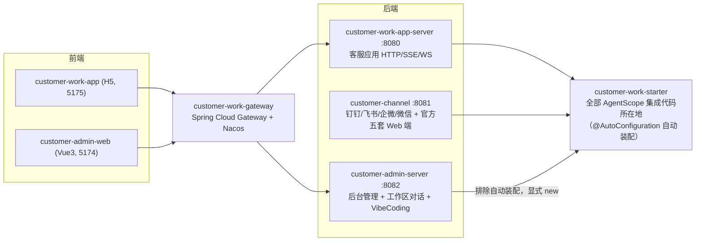
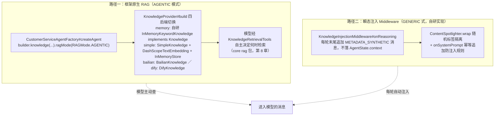
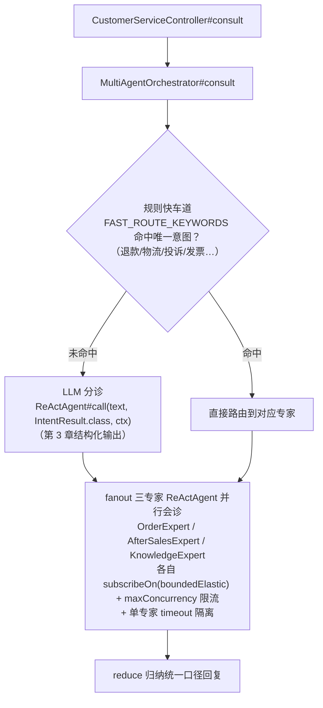
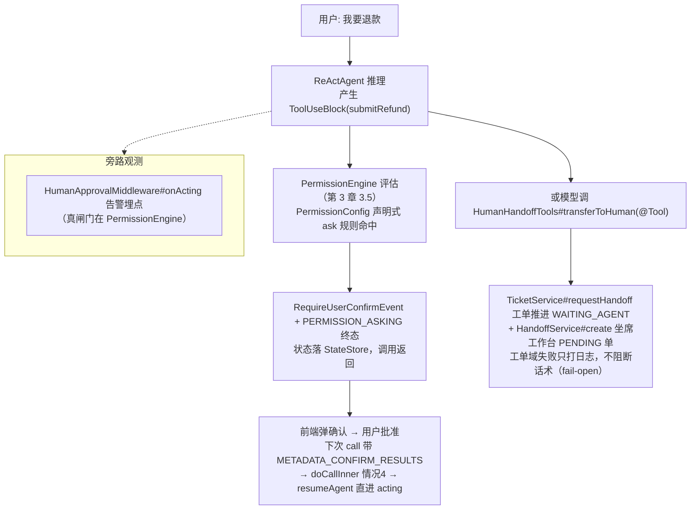

# 第 9 章 customer_work 场景全景映射（实战）

> 本章从**业务场景**视角出发：每个场景 = 用了什么 AgentScope 能力 + 入口在哪 + 调用链长什么样 + 对应本指南哪一章。
> 实战路径相对 customer_work 仓库根；`starter/...` 代表 `customer-work-starter/src/main/java/com/richard/fyoung/customerwork/...`，`admin/...` 代表 `customer-admin-server/src/main/java/com/richard/fyoung/customeradmin/...`。

## 9.0 项目模块与请求流向

## 9.1 场景速查表

| # | 业务场景 | AgentScope 能力 | 入口 | 详见 |
|---|---|---|---|---|
| 1 | 客服同步对话 | `ReActAgent#call` + StateStore + 权限 + Middleware 链 | `starter/service/CustomerServiceService#chat` | 第 3 章 |
| 2 | 流式回复（SSE） | `ReActAgent#streamEvents` 事件流 | 同上 `#chatStream` | 第 3、6 章 |
| 3 | 结构化意图识别 | `call(prompt, Class, ctx)` 结构化输出 | 同上 `#classifyIntent` | 第 3 章 3.7 |
| 4 | 知识库检索 / RAG | `Knowledge` + `RAGMode.AGENTIC` + 自研注入 middleware | `starter/rag/KnowledgeProvider` | 本章 9.2 |
| 5 | 七域业务工具 | `Toolkit` 分组 + `@Tool` + 后端 SPI | `starter/tool/ToolRegistrar` | 第 4 章 |
| 6 | MCP / AI 网关 | `McpClientBuilder` + `HigressMcpClientBuilder` | `starter/tool/McpToolkitConfigurer` | 第 4 章 |
| 7 | 三层会话记忆 | StateStore（L1）+ `LongTermMemory`（L2）+ 自研 FactLog（L3）+ Compaction | `starter/memory/` | 第 2、7 章 |
| 8 | 多 Agent 编排 | 多 `ReActAgent` + Reactor 手工编排 + subagent 注册 | `starter/agent/MultiAgentOrchestrator` | 本章 9.3 |
| 9 | Harness 高级能力 | Plan Mode / Sandbox / Subagent / 技能自演化 | `starter/agent/HarnessAgentFactory` | 第 7 章 |
| 10 | 人机协作（审批+转人工） | `PermissionEngine` ask 规则 + `@Tool` 转工单 | `starter/config/PermissionConfig`、`tool/HumanHandoffTools` | 本章 9.4 |
| 11 | 多渠道接入 | harness `Channel` + `DingTalkStreamClient` 复用 | `customer-channel/.../XxxChannelConfigurer` | 第 7、8 章 |
| 12 | AG-UI 协议 | `AguiAgentAdapter` + `AguiEventEncoder` | `starter/agent/AguiService` | 第 8 章 |
| 13 | A2A 对外导出 | `AgentScopeA2aServer` + 自定义 `AgentRunner` | `admin/a2a/A2aController` | 第 8 章 |
| 14 | 定时任务驱动 Agent | `XxlJobAgentScheduler` / 同步 `Agent#call` | `starter/config/XxlJobSchedulerConfig`、`admin/aiconfig/scheduledtask/` | 第 8 章 |
| 15 | VibeCoding 编码助手 | HarnessAgent workspace + `agent_spawn` + 自研 `TaskRepository` | `admin/workspace/vibecoding/` | 第 7 章 |
| 16 | 可观测与调用日志 | `OtelTracingMiddleware` + 自研 `Tracer` + `JsonlTraceExporter` + 打点 middleware | `starter/observability/`、`starter/calllog/` | 第 6 章 |
| 17 | 配置热更新 | Nacos 提示词 + `MutableDelegatingModel#swap` | `starter/config/NacosPromptService`、`RuntimeConfigApplier` | 第 5 章 |

场景 1/2/3/5/6/9 的调用链已在对应章节的实战小节展开，下面细讲四个跨章节的综合场景。

## 9.2 场景 4：RAG 的两条互补路径

另有工具形式第三入口：`starter/tool/KnowledgeBaseTools`（`@Tool` 委托 `KnowledgeBackend` SPI）。三条路径可并存，靠配置选择。工程细节：`KnowledgeProvider` 用 `@PostConstruct warmUp()` 启动期预热，规避 `block()` 落在 `reactor-http-nio` 线程抛 `IllegalStateException`（第 10 章坑 4）；admin 侧 `KnowledgeRetrievalMiddleware` 直接继承 starter 的注入 middleware，只换数据源。

## 9.3 场景 8：多 Agent 编排（快慢车道 + 并行会诊 + reduce）

要点：规则先行省 LLM 成本；专家互相隔离（一个超时不拖垮整单）；同一批专家还被 `HarnessAgentFactory` 经 `builder.subagentFactory(name, id -> expert)` 注册为 harness subagent（第 7 章），主 Agent 也能通过 `agent_spawn` 委派——**同一组 Agent，两种编排入口**。

## 9.4 场景 10：人机协作全链路（审批 + 转人工 + 工单）

配套两个"裸 Model"辅助（第 5 章 5.6）：`TicketClassifier#classify` 智能分单（抽 JSON 得 category/skill/priority/emotion，fail-open 降级规则版）、`ConversationSummaryService` 转人工前的会话总结。

## 9.5 其余场景一句话导航

- **场景 7（三层记忆）**：L1 = `SessionConfig` 四后端 StateStore（第 2 章实战）；L2 = `LongTermMemoryProvider` 四后端（memory 自研 / bailian / mem0 / reme，`LongTermMemoryMode.BOTH`）；L3 = 自研 `FactLog` append-only 事实流水；压缩 = `ContextMemoryFactory#createCompaction` → Harness `CompactionConfig`（第 7 章实战）。
- **场景 11（多渠道）**：演示线走框架 `Channel`（第 7 章实战）；生产线 `customer-channel/.../access/dingtalk/DingTalkStreamConnector` 实现自研 `ImChannelConnector` SPI，复用框架 `DingTalkStreamClient`（JDK WebSocket），消息经 `ChannelMessagePipeline` → `AdminOpenApiClient` 调 admin 开放 API——**框架类库可以只取传输层复用**。
- **场景 12（AG-UI）**：`CustomerServiceController#agui` → `AguiService#run` → `AguiAgentAdapter(agent, config).run(RunAgentInput)` → `AguiEventEncoder#encode` → SSE。8081 侧另有官方 starter 自动装配的同款端点，一套协议两种集成深度。
- **场景 13（A2A）**：`admin/a2a/A2aController`（`/.well-known/agent-card.json` + JSON-RPC）→ `AgentScopeA2aServer` + `ConfigurableAgentCard`；执行器 `AdminAgentRunner implements AgentRunner`，与页面对话共用 `AgentInstanceCache`。默认关闭（`admin.a2a.enabled=false`）。
- **场景 14（定时任务）**：starter 走官方 `XxlJobAgentScheduler`（cron 只在 XXL-JOB 控制台配）；admin 的 `ScheduledTaskService#execute` 每次分配全新 sessionId 同步 `Agent#call` 并落执行历史——定时驱动下"每次执行独立会话"是刻意选择。
- **场景 16（可观测）**：三套并存各管一段——`OtelTracingConfig`（OTel + OTLP gRPC，与自研 `LoggingTracer` 互斥）、`AgentCallTimingMiddleware`（`onModelCall` 取 `ChatUsage`、按 `ToolKindRegistry` 归类 TOOL/MCP/SKILL 分段耗时）、`JsonlTraceExporter`（数据飞轮 JSONL 落盘）。
- **场景 17（热更新）**：`NacosPromptService`（系统提示词优先取 Nacos，回退内置 + `runtimeFacts()` 注入当前日期）+ `RuntimeConfigApplier` → `MutableDelegatingModel#swap`（第 5 章装饰器栈）+ `flushHotAgents` 清缓存不动 StateStore——**提示词、模型、Agent 缓存三层各自的热更新粒度**。
