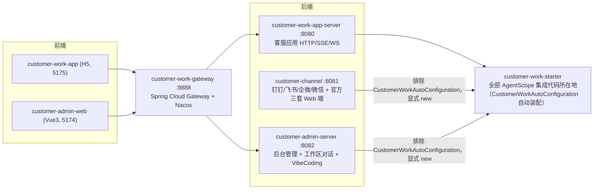
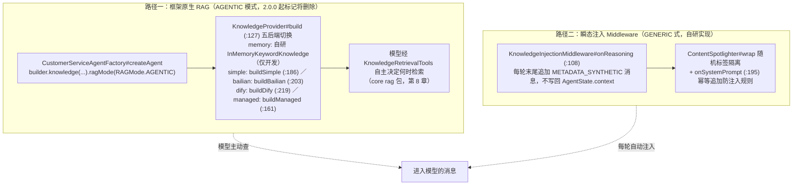
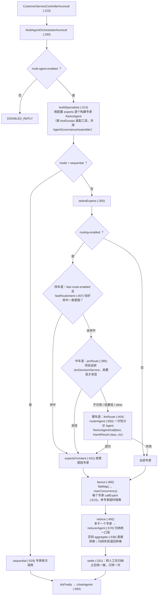
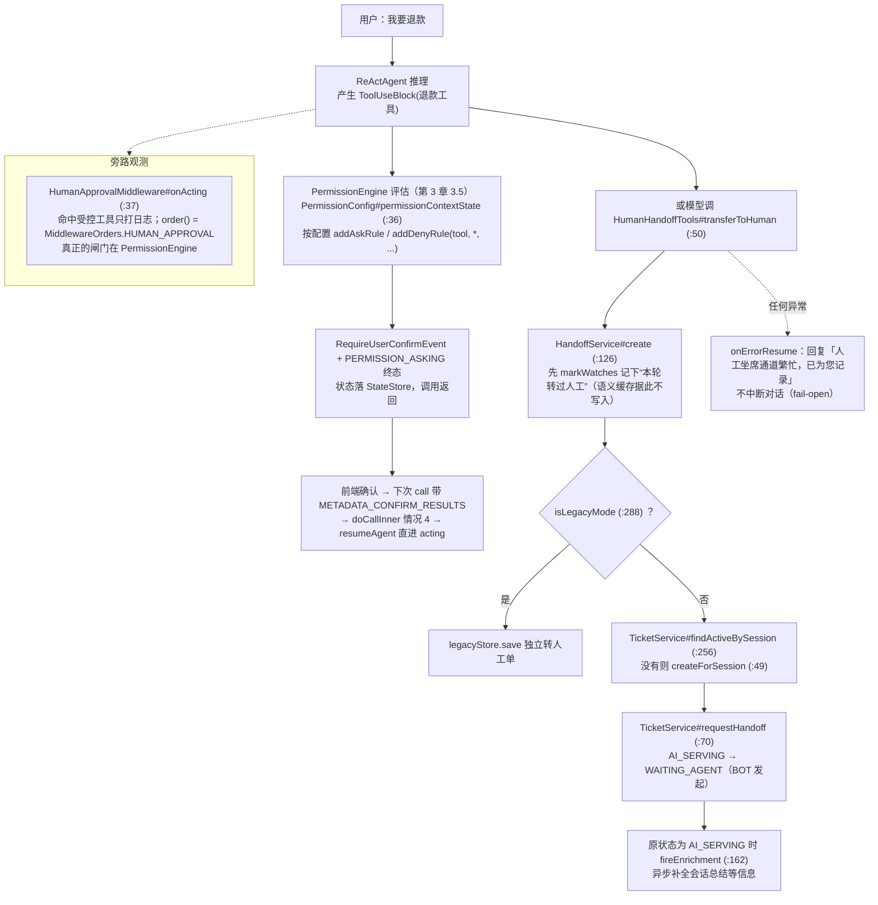
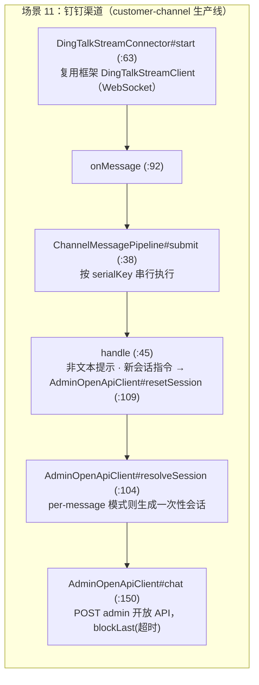
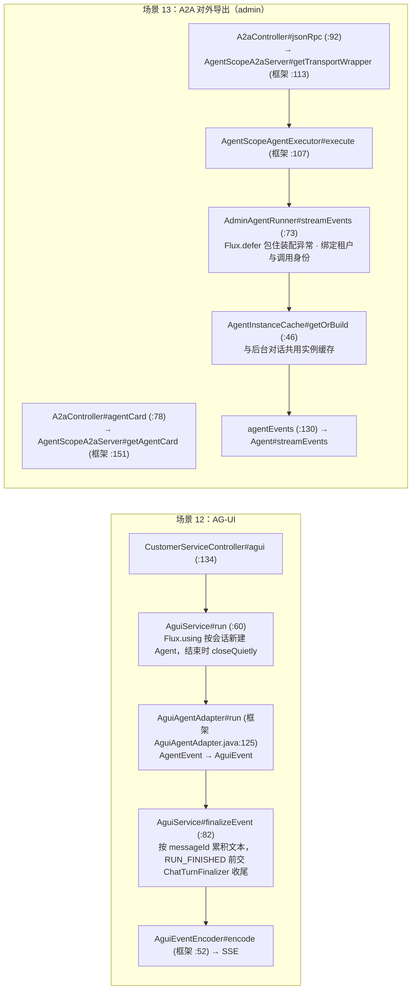
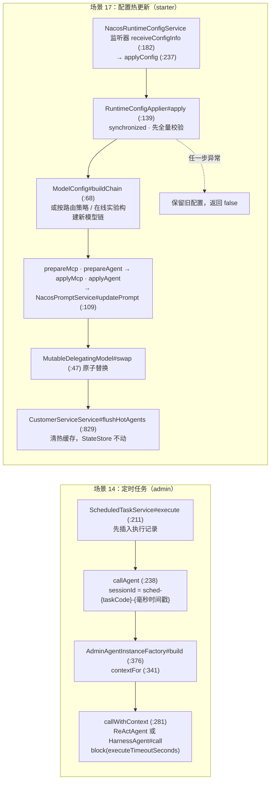

# 第 9 章 customer_work 场景全景映射（实战）

> 本章从**业务场景**视角出发：每个场景 = 用了什么 AgentScope 能力 + 入口在哪 + 调用链长什么样 + 对应本指南哪一章。
> 实战路径相对 customer_work 仓库根；`starter/...` 代表 `customer-work-starter/src/main/java/com/richard/fyoung/customerwork/...`，`admin/...` 代表 `customer-admin-server/src/main/java/com/richard/fyoung/customeradmin/...`。starter 内部已按职责分层：`core/`（agent、service、memory、middleware、model）、`data/`（rag、ticket、calllog）、`safety/`（quota、sensitiveword、security）、`capability/`（handoff、semanticcache、routing、typesafe……）、`infra/`（config、lock）、`tool/`、`observability/`。
> 本章的方法级链路图依据 customer_work main 分支 `17007e4a`（2026-10-02）逐一核对；项目依赖的是 **agentscope 2.0.3 正式版**（`agentscope.version`），所以图中框架侧行号基于 v2.0.3，与 main 有行为差异的地方单独标注。

## 9.0 项目模块与请求流向

```mermaid
flowchart LR
    subgraph FRONT["前端"]
        H5["customer-work-app (H5, 5175)"]
        ADMIN_W["customer-admin-web (Vue3, 5174)"]
    end
    GW["customer-work-gateway :8888<br/>Spring Cloud Gateway + Nacos"]
    subgraph BACK["后端"]
        APP["customer-work-app-server :8080<br/>客服应用 HTTP/SSE/WS"]
        CH["customer-channel :8081<br/>钉钉/飞书/企微/微信 + 官方三套 Web 端"]
        ADM["customer-admin-server :8082<br/>后台管理 + 工作区对话 + VibeCoding"]
    end
    STARTER["customer-work-starter<br/>全部 AgentScope 集成代码所在地<br/>（CustomerWorkAutoConfiguration 自动装配）"]
    H5 --> GW --> APP
    ADMIN_W --> GW --> ADM
    APP --> STARTER
    CH -->|"排除 CustomerWorkAutoConfiguration，显式 new"| STARTER
    ADM -->|"排除 CustomerWorkAutoConfiguration，显式 new"| STARTER
```

## 9.1 场景速查表

| # | 业务场景 | AgentScope 能力 | 入口 | 详见 |
|---|---|---|---|---|
| 1 | 客服同步对话 | `ReActAgent#call` + StateStore + 权限 + Middleware 链 | `starter/core/service/CustomerServiceService#chat` | 第 3 章 |
| 2 | 流式回复（SSE） | `ReActAgent#streamEvents` 事件流 | 同上 `#chatStream` | 第 3、6 章 |
| 3 | 结构化意图识别 | `call(prompt, Class, ctx)` 结构化输出 + 专用轻量 Agent | 同上 `#classifyIntent` | 第 3 章 3.7 |
| 4 | 知识库检索 / RAG | `Knowledge` + `RAGMode.AGENTIC`（2.0.0 起标记将删除）+ 自研注入 middleware | `starter/data/rag/KnowledgeProvider` | 本章 9.2、第 8 章 |
| 5 | 七域业务工具 | `Toolkit` 分组 + `@Tool` + 后端 SPI | `starter/tool/ToolRegistrar` | 第 4 章 |
| 6 | MCP / AI 网关 | `McpClientBuilder` + `HigressMcpClientBuilder` | `starter/tool/McpToolkitConfigurer` | 第 4 章 |
| 7 | 三层会话记忆 | StateStore（L1）+ `LongTermMemory`（L2，2.0.0 起标记将删除）+ 自研 FactLog（L3）+ Compaction | `starter/core/memory/` | 第 2、7 章 |
| 8 | 多 Agent 编排 | 多 `ReActAgent` + Reactor 手工编排 + subagent 注册 | `starter/core/agent/MultiAgentOrchestrator` | 本章 9.3 |
| 9 | Harness 高级能力 | `HarnessAgent.Builder.fromAgent` + Compaction / Sandbox / Subagent | `starter/core/agent/HarnessAgentFactory` | 第 7 章 |
| 10 | 人机协作（审批+转人工） | `PermissionEngine` ask 规则 + `@Tool` 转工单 | `starter/infra/config/PermissionConfig`、`tool/HumanHandoffTools` | 本章 9.4 |
| 11 | 多渠道接入 | harness `Channel` + `DingTalkStreamClient` 复用 | `customer-channel/.../access/...` | 第 7、8 章 |
| 12 | AG-UI 协议 | `AguiAgentAdapter` + `AguiEventEncoder` | `starter/core/agent/AguiService` | 第 8 章 |
| 13 | A2A 对外导出 | `AgentScopeA2aServer` + 自定义 `AgentRunner` | `admin/a2a/A2aController` | 第 8 章 |
| 14 | 定时任务驱动 Agent | `XxlJobAgentScheduler` / 同步 `Agent#call` | `starter/infra/config/XxlJobSchedulerConfig`、`admin/aiconfig/scheduledtask/` | 第 8 章 |
| 15 | VibeCoding 编码助手 | HarnessAgent workspace + `agent_spawn` + 自研 `TaskRepository` | `admin/workspace/vibecoding/` | 第 7 章 |
| 16 | 可观测与调用日志 | `OtelTracingMiddleware` + 自研 `Tracer` + 框架 Hook `JsonlTraceExporter` + 打点 middleware | `starter/observability/`、`starter/data/calllog/` | 第 6 章 |
| 17 | 配置热更新 | Nacos 提示词 + `MutableDelegatingModel#swap` | `starter/infra/config/NacosPromptService`、`RuntimeConfigApplier` | 第 5 章 |

场景 1/2/3/5/6/9 的调用链已在对应章节的实战小节展开，下面先看所有入口共用的装配，再细讲四个跨章节的综合场景。

### 所有入口共用的装配：`CustomerServiceAgentFactory#createAgent` + `AgentGovernanceAssembler#applyTo`

`starter/core/agent/CustomerServiceAgentFactory#createAgent (:220)` 每一行 Builder 调用都对应前面某一章：

| Builder 调用 | 作用 | 对应章节 |
|---|---|---|
| `.toolkit(buildToolkit(sessionId))` | `ToolkitConfigs.sequentialWith(...)`：按部署配置覆盖工具执行超时（注释：框架默认 5 分钟，对客服对话等于没有超时）；业务工具按域分组注册，可选 Meta-Tool、MCP、Higress | 第 4 章 |
| `.stateStore(stateStore).defaultSessionId(sessionId)` | 会话状态外置到 StateStore，按 (userId, sessionId) 加载/持久化 | 第 2 章 |
| `.permissionContext(permissionContext)` | 权限引擎：`PermissionConfig` 为配置里的工具逐个 `addAskRule` / `addDenyRule` | 第 3 章 3.5 |
| `.maxIters(...)`、`.enablePendingToolRecovery(...)` | 推理轮数上限；中断后恢复待执行工具 | 第 3 章 |
| `.enableTaskList()` | 框架内置 TodoTools（注释记录了“提示词让模型用计划工具，却从没挂上”的历史坑） | 第 7 章 |
| `governanceAssembler.applyTo(builder)` | 见下文 | 第 6 章 |
| `.hook(traceExporter())` | 框架 Hook `io.agentscope.core.hook.recorder.JsonlTraceExporter`，JSONL trace 落盘 | 第 6 章 |
| `.longTermMemory(...).longTermMemoryMode(BOTH)` | 2.0.0 起标记将删除的接口与 Builder 方法 | 第 8 章 8.1 |
| `.knowledge(...).ragMode(RAGMode.AGENTIC)` | 同上 | 第 8 章 8.1 |
| `.skillBox(...)`、`.skillCodeExecutionEnabled(true)` | 技能库与代码执行技能（2.0 Builder 内置开关替代 1.x 的流式构建） | 第 4 章 |

`starter/core/agent/AgentGovernanceAssembler#applyTo (:85)` 是三条建 Agent 路径（客服 Agent、多 Agent 编排、意图分类）共用的装配点，注释写明“杜绝能力只接在一条路径上”：

1. `builder.conflictPolicy(...)`：会话状态并发写策略（2.0.3 起框架默认乐观并发 `saveIfVersion`，第 2 章）；
2. `AgentLifecycleMiddleware`：最先判定，撤销态不允许进入模型、MCP、技能或任何工具；
3. `ObservabilityMiddleware`、可选 `HumanApprovalMiddleware`；
4. 可插拔中间件 Bean（延迟、脱敏、审计、自我纠错、护栏、动态参数、租户、分段耗时与 token 计量），`orderedStream()` 顺序注册；
5. 可选 `FinalAnswerFilterMiddleware`（框架 2.0.3 新增，默认关）：它的 `order` 是框架默认值 1，比项目治理中间件（50~200）都小，稳定落在最内层。

### 场景 1~3：一次客服请求的三条入口

同步对话、流式回复、意图识别共用 `CustomerServiceService` 与 `CustomerServiceAgentFactory`，但各自对 Agent 的持有方式不同：

```mermaid
flowchart TB
    subgraph S1["场景 1：同步对话"]
        C1["CustomerServiceController#chat (:63)"] --> SV1["CustomerServiceService#chat (:362)"]
        SV1 --> Q1{"TenantQuotaGuard#check (:50)<br/>shouldRejectForQuota (:497)"}
        Q1 -->|"BLOCK，或 DEGRADE 但没配备用模型"| QR["QUOTA_EXCEEDED_REPLY（fail-closed）"]
        Q1 -->|"放行 / 降级"| SC1{"启用语义缓存？<br/>SemanticCacheService#lookup (:129)，boundedElastic 上查"}
        SC1 -->|"命中"| HIT["applyOutboundGuard (:337) 出站过滤后直接返回"]
        SC1 -->|"未命中 / 未启用"| IA["invokeAgent (:405)"]
        IA --> RA["resolveAgent (:890)<br/>sessionAgents.computeIfAbsent<br/>harness 开 → HarnessAgentFactory#createHarnessAgent (:84)<br/>否则 CustomerServiceAgentFactory#createAgent (:220)"]
        RA --> LOCK["withSessionLock (:959)<br/>SessionLock：InMemorySessionLock / RedissonSessionLock"]
        LOCK --> CALL["callAgent (:902) → ReActAgent / HarnessAgent#call(spotlightAttachments(text), ctx)<br/>ctx = contextFor (:158)；外层 Mono.using 开关转人工观察窗口"]
        Q1 -.->|"降级"| DEG["contextWrite(ModelRoutingContext#preferFallback (:25))<br/>路由到备用模型"]
    end
    subgraph S2["场景 2：流式回复"]
        C2["CustomerServiceController#chatStream (:74)"] --> SV2["CustomerServiceService#chatStream (:468)"]
        SV2 --> SC2{"语义缓存"}
        SC2 -->|"命中"| SCA["streamCachedAnswer (:522) 切块模拟流式"]
        SC2 -->|"未命中"| SFC["streamFromAgentAndCache (:543)"]
        SFC --> SFA["streamFromAgent (:559)<br/>withSessionLockFlux (:970)"]
        SFA --> SE["streamAgentEvents (:910) → publishOn(boundedElastic)<br/>丢弃 event.getSource() != null 的子 Agent 转发事件<br/>取 TextBlockDeltaEvent；无 delta 时用 AgentResultEvent 补全文"]
        SE --> GUARD["newOutboundGuard (:288) → SensitiveWordStreamGuard<br/>流末 flush (:113) 吐出攒住的尾部；SSE 空闲超时 timeout(idle)"]
    end
    subgraph S3["场景 3：结构化意图识别"]
        C3["CustomerServiceController#classifyIntent (:96)"] --> SV3["CustomerServiceService#classifyIntent (:668)"]
        SV3 --> USING["Mono.using：CustomerServiceAgentFactory#createIntentClassifierAgent (:316)<br/>专用轻量 Agent：空工具集、不挂 StateStore，用完 AgentResourceCloser#closeQuietly (:25)"]
        USING --> SO["ReActAgent#call(prompt, IntentResult.class, ctx)<br/>ctx 挂 ConversationTurn.unattended：治理中间件不在分类里转人工"]
        SO -->|"无结构化数据 / 异常"| FB["fallbackIntent (:708)：intent = other"]
        SV3 -.-> SUB["整体 Mono.defer + subscribeOn(boundedElastic)"]
    end
```

三条入口对 Agent 实例的管理方式各不一样，这是读这段代码的关键：同步和流式复用 `sessionAgents` 里的会话级热实例（`resolveAgent` 用 `computeIfAbsent`），按配置在 ReActAgent 与 HarnessAgent 之间二选一；意图识别每次用 `Mono.using` 新建一个 `"intent:"` 前缀的**专用分类 Agent**（#252：不带业务工具、不落会话状态），用完立即关闭，不污染真实会话，也不占热缓存。

几处和框架直接相关的细节：

- **应用侧会话锁叠在框架的会话串行之上**：框架只保证同一进程内同会话串行（第 3 章），项目用 `SessionLock`（内存或 Redisson 实现）按 `memorySubject.scopeId + ":" + sessionId` 加锁，跨副本也串行；锁的释放挂在内层 `doFinally`，拿锁失败不会误释放别人的锁。
- **流式路径为什么要 `publishOn(boundedElastic)`**：注释写明旧的 `stream(...)` 在末尾自带 `publishOn`，`streamEvents` 没有；不切走，下游的敏感词过滤与 SSE 写出会跑在模型 IO 线程上，拖慢 chunk 读取。旧 `stream(msgs, options, ctx)` 已标 `forRemoval`，且它按 `isLast=true` 回放整段，消费侧要两级去重。
- **子 Agent 转发事件不下发**（#251）：`agent_spawn` 同步执行时，子 Agent 的事件带 `source` 转发进主事件流（第 6、7 章），H5 没有子 Agent 卡片，下发只会把同一件事说两遍，所以按 `getSource() != null` 过滤。
- **意图识别为什么要 `subscribeOn(boundedElastic)`**：`agent.call()` 内部的 `seedSystemMsg` 只要注册了覆写 `onSystemPrompt` 的中间件，就会同步 `block()` 一条 Mono 流水线（`ReActAgent.applySystemPromptMiddlewares`）；在 `reactor-http-nio-*` 线程上订阅会抛 `IllegalStateException`（第 10 章坑 4 同源）。

## 9.2 场景 4：RAG 的两条互补路径

```mermaid
flowchart TB
    subgraph P1["路径一：框架原生 RAG（AGENTIC 模式，2.0.0 起标记将删除）"]
        B["CustomerServiceAgentFactory#createAgent<br/>builder.knowledge(...).ragMode(RAGMode.AGENTIC)"]
        KP["KnowledgeProvider#build (:127) 五后端切换<br/>memory: 自研 InMemoryKeywordKnowledge（仅开发）<br/>simple: buildSimple (:186) ／ bailian: buildBailian (:203)<br/>dify: buildDify (:219) ／ managed: buildManaged (:161)"]
        KRT["模型经 KnowledgeRetrievalTools 自主决定何时检索<br/>（core rag 包，第 8 章）"]
        B --> KP --> KRT
    end
    subgraph P2["路径二：瞬态注入 Middleware（GENERIC 式，自研实现）"]
        KIM["KnowledgeInjectionMiddleware#onReasoning (:108)<br/>每轮末尾追加 METADATA_SYNTHETIC 消息，不写回 AgentState.context"]
        SPOT["ContentSpotlighter#wrap 随机标签隔离<br/>+ onSystemPrompt (:195) 幂等追加防注入规则"]
        KIM --> SPOT
    end
    P1 -.->|"模型主动查"| LLM["进入模型的消息"]
    P2 -.->|"每轮自动注入"| LLM
```

另有工具形式第三入口：`starter/tool/KnowledgeBaseTools`（`@Tool` 委托 `KnowledgeBackend` SPI）。三条路径可并存，靠配置选择；未知的 `customer-work.rag.provider` 直接抛 `IllegalStateException`，`memory` 后端会打日志提醒仅限开发。admin 侧 `KnowledgeRetrievalMiddleware` 直接继承 starter 的 `KnowledgeInjectionMiddleware`，只换数据源。路径一依赖的 `Knowledge`、`RAGMode`、`KnowledgeRetrievalTools` 在 2.0.0 起都是 `@Deprecated(forRemoval = true)`（第 8 章 8.1），升级大版本前要先规划迁移；路径二不依赖这些接口。

## 9.3 场景 8：多 Agent 编排（三条车道 + 并行会诊 + reduce）

```mermaid
flowchart TB
    IN["CustomerServiceController#consult (:123)"] --> ORCH["MultiAgentOrchestrator#consult (:290)"]
    ORCH --> EN{"multi-agent.enabled ？"}
    EN -->|"否"| DIS["DISABLED_REPLY"]
    EN -->|"是"| BS["buildSpecialists (:214)<br/>按配置 experts 逐个构建专家 ReActAgent<br/>（按 toolGroups 装配工具，共用 AgentGovernanceAssembler）"]
    BS --> MODE{"mode = sequential ？"}
    MODE -->|"是"| SEQ["sequential (:529) 专家依次调用"]
    MODE -->|"否"| SEL["selectExperts (:355)"]
    SEL --> RT{"routing-enabled ？"}
    RT -->|"否"| ALL["全部专家"]
    RT -->|"是"| FAST{"快车道：fast-route-enabled 且<br/>fastRouteIntent (:457) 恰好命中一类意图？"}
    FAST -->|"命中"| PICK["expertsForIntent (:431) 按意图挑专家"]
    FAST -->|"未命中"| JEV{"中车道：jevRoute (:385)<br/>项目自研 JevDecisionService，高置信才采信"}
    JEV -->|"采信"| PICK
    JEV -->|"不可用 / 低置信 / other"| ROUTER["慢车道：llmRoute (:404)<br/>routerAgent (:550) 一次性分诊 Agent<br/>ReActAgent#call(text, IntentResult.class, ctx)"]
    ROUTER -->|"成功"| PICK
    ROUTER -->|"失败"| ALL
    PICK --> FAN["fanout (:480)<br/>flatMap(..., maxConcurrency)<br/>每个专家 callExpert (:513)，单专家超时隔离"]
    ALL --> FAN
    FAN --> RED["reduce (:492)<br/>多于一个专家 → reducerAgent (:570) 归纳统一口径<br/>否则 aggregate (:538) 直接拼接；归纳失败退回拼接"]
    RED --> SET["settle (:331)：转人工在归纳之后统一做，只转一次"]
    SEQ --> CLOSE["doFinally → closeAgents (:584)"]
    SET --> CLOSE
```

要点：规则先行省一次模型调用；中车道用结构化判断（项目依赖 2.0.3，用的是自研 `capability/typesafe/JevDecisionService`，不是第 8 章 main 新增的 `judge/jev` 模块）；专家互相隔离（一个超时不拖垮整单）；转人工放在归纳之后，避免多个专家并行时同一会话建出两张单。同一批专家还被 `HarnessAgentFactory#createHarnessAgent` 经 `builder.subagentFactory(name, id -> expert)` 注册为 harness subagent（第 7 章），主 Agent 也能通过 `agent_spawn` 委派——**同一组 Agent，两种编排入口**。

## 9.4 场景 10：人机协作全链路（审批 + 转人工 + 工单）

```mermaid
flowchart TB
    U["用户：我要退款"] --> AGENT["ReActAgent 推理<br/>产生 ToolUseBlock(退款工具)"]
    AGENT --> PERM["PermissionEngine 评估（第 3 章 3.5）<br/>PermissionConfig#permissionContextState (:36)<br/>按配置 addAskRule / addDenyRule(tool, *, ...)"]
    PERM --> ASKED["RequireUserConfirmEvent + PERMISSION_ASKING 终态<br/>状态落 StateStore，调用返回"]
    ASKED --> CONFIRM["前端确认 → 下次 call 带 METADATA_CONFIRM_RESULTS<br/>→ doCallInner 情况 4 → resumeAgent 直进 acting"]
    AGENT --> HAND["或模型调 HumanHandoffTools#transferToHuman (:50)"]
    HAND --> HS["HandoffService#create (:126)<br/>先 markWatches 记下“本轮转过人工”（语义缓存据此不写入）"]
    HS --> LEG{"isLegacyMode (:288) ？"}
    LEG -->|"是"| LS["legacyStore.save 独立转人工单"]
    LEG -->|"否"| TK["TicketService#findActiveBySession (:256)<br/>没有则 createForSession (:49)"]
    TK --> RH["TicketService#requestHandoff (:70)<br/>AI_SERVING → WAITING_AGENT（BOT 发起）"]
    RH --> EN["原状态为 AI_SERVING 时 fireEnrichment (:162)<br/>异步补全会话总结等信息"]
    HAND -.->|"任何异常"| BUSY["onErrorResume：回复「人工坐席通道繁忙，已为您记录」<br/>不中断对话（fail-open）"]
    subgraph OBS["旁路观测"]
        HAM["HumanApprovalMiddleware#onActing (:37)<br/>命中受控工具只打日志；order() = MiddlewareOrders.HUMAN_APPROVAL<br/>真正的闸门在 PermissionEngine"]
    end
    AGENT -.-> OBS
```

配套两个"裸 Model"辅助（第 5 章 5.6）：`capability/routing/TicketClassifier#classify` 智能分单（抽 JSON 得 category/skill/priority/emotion，fail-open 降级规则版）、`capability/assist/ConversationSummaryService` 转人工前的会话总结。

## 9.5 其余场景一句话导航

- **场景 7（三层记忆）**：L1 = `infra/config/SessionConfig` 四后端 StateStore（第 2 章实战）；L2 = `core/memory/LongTermMemoryProvider` 四后端（memory 自研 / bailian / mem0 / reme，`LongTermMemoryMode.BOTH`，2.0.0 起标记将删除）；L3 = 自研 `FactLog` append-only 事实流水；压缩 = `ContextMemoryFactory#createCompaction (:39)` → Harness `CompactionConfig`（第 7 章实战）。
- **场景 9（Harness）**：`HarnessAgentFactory#createHarnessAgent (:84)` 用 `HarnessAgent.Builder.fromAgent(inner)` 包住客服 ReActAgent（第 7 章），挂 workspace、compaction、sandbox（`applySandbox (:200)`），并把三个专家注册成 subagent。
- **场景 11（多渠道）**：演示线走框架 `Channel`（第 7 章实战）；生产线 `customer-channel/.../access/dingtalk/DingTalkStreamConnector` 实现自研 `ImChannelConnector` SPI，复用框架 `DingTalkStreamClient`（JDK WebSocket），消息经 `ChannelMessagePipeline` → `AdminOpenApiClient` 调 admin 开放 API——**框架类库可以只取传输层复用**。
- **场景 12（AG-UI）**：`CustomerServiceController#agui` → `AguiService#run` → `AguiAgentAdapter(agent, config).run(RunAgentInput)` → `AguiEventEncoder#encode` → SSE；终态由 `ChatTurnFinalizer` 统一收尾。8081 侧另有官方 starter 自动装配的同款端点，一套协议两种集成深度。
- **场景 13（A2A）**：`admin/a2a/A2aController`（`/.well-known/agent-card.json` + JSON-RPC）→ `AgentScopeA2aServer` + `ConfigurableAgentCard`；执行器 `AdminAgentRunner implements AgentRunner`，与页面对话共用 `AgentInstanceCache`。默认关闭（`admin.a2a.enabled=false`）。
- **场景 14（定时任务）**：starter 走官方 `XxlJobAgentScheduler`（cron 只在 XXL-JOB 控制台配）；admin 的 `ScheduledTaskService#execute` 每次分配全新 sessionId 同步 `Agent#call` 并落执行历史——定时驱动下"每次执行独立会话"是刻意选择。
- **场景 16（可观测）**：三套并存各管一段——`observability/OtelTracingConfig`（OTel + OTLP gRPC，与自研 `LoggingTracer` 互斥）、`data/calllog/AgentCallTimingMiddleware`（`onModelCall` 取 `ChatUsage`、按 `ToolKindRegistry` 归类 TOOL/MCP/SKILL 分段耗时）、框架 Hook `JsonlTraceExporter`（数据飞轮 JSONL 落盘）。
- **场景 17（热更新）**：`NacosPromptService`（系统提示词优先取 Nacos，回退内置 + `runtimeFacts()` 注入当前日期）+ `RuntimeConfigApplier` → `MutableDelegatingModel#swap`（第 5 章装饰器栈）+ `flushHotAgents` 清缓存不动 StateStore——**提示词、模型、Agent 缓存三层各自的热更新粒度**。

### 场景 11 / 12 / 13 / 14 / 17 的方法级链路

```mermaid
flowchart LR
    subgraph S11["场景 11：钉钉渠道（customer-channel 生产线）"]
        D1["DingTalkStreamConnector#start (:63)<br/>复用框架 DingTalkStreamClient（WebSocket）"] --> D2["onMessage (:92)"]
        D2 --> D3["ChannelMessagePipeline#submit (:38)<br/>按 serialKey 串行执行"]
        D3 --> D4["handle (:45)<br/>非文本提示 · 新会话指令 → AdminOpenApiClient#resetSession (:109)"]
        D4 --> D5["AdminOpenApiClient#resolveSession (:104)<br/>per-message 模式则生成一次性会话"]
        D5 --> D6["AdminOpenApiClient#chat (:150)<br/>POST admin 开放 API，blockLast(超时)"]
    end
```

```mermaid
flowchart LR
    subgraph S12["场景 12：AG-UI"]
        A1["CustomerServiceController#agui (:134)"] --> A2["AguiService#run (:60)<br/>Flux.using 按会话新建 Agent，结束时 closeQuietly"]
        A2 --> A3["AguiAgentAdapter#run (框架 AguiAgentAdapter.java:125)<br/>AgentEvent → AguiEvent"]
        A3 --> A4["AguiService#finalizeEvent (:82)<br/>按 messageId 累积文本，RUN_FINISHED 前交 ChatTurnFinalizer 收尾"]
        A4 --> A5["AguiEventEncoder#encode (框架 :52) → SSE"]
    end
    subgraph S13["场景 13：A2A 对外导出（admin）"]
        B1["A2aController#agentCard (:78)<br/>→ AgentScopeA2aServer#getAgentCard (框架 :151)"]
        B2["A2aController#jsonRpc (:92)<br/>→ AgentScopeA2aServer#getTransportWrapper (框架 :113)"] --> B3["AgentScopeAgentExecutor#execute (框架 :107)"]
        B3 --> B4["AdminAgentRunner#streamEvents (:73)<br/>Flux.defer 包住装配异常 · 绑定租户与调用身份"]
        B4 --> B5["AgentInstanceCache#getOrBuild (:46)<br/>与后台对话共用实例缓存"]
        B5 --> B6["agentEvents (:130) → Agent#streamEvents"]
    end
```

```mermaid
flowchart LR
    subgraph S14["场景 14：定时任务（admin）"]
        T1["ScheduledTaskService#execute (:211)<br/>先插入执行记录"] --> T2["callAgent (:238)<br/>sessionId = sched-{taskCode}-{毫秒时间戳}"]
        T2 --> T3["AdminAgentInstanceFactory#build (:376)<br/>contextFor (:341)"]
        T3 --> T4["callWithContext (:281)<br/>ReActAgent 或 HarnessAgent#call<br/>block(executeTimeoutSeconds)"]
    end
    subgraph S17["场景 17：配置热更新（starter）"]
        H1["NacosRuntimeConfigService 监听器 receiveConfigInfo (:182)<br/>→ applyConfig (:237)"] --> H2["RuntimeConfigApplier#apply (:139)<br/>synchronized · 先全量校验"]
        H2 --> H3["ModelConfig#buildChain (:68)<br/>或按路由策略 / 在线实验构建新模型链"]
        H3 --> H4["prepareMcp · prepareAgent → applyMcp · applyAgent<br/>→ NacosPromptService#updatePrompt (:109)"]
        H4 --> H5["MutableDelegatingModel#swap (:47) 原子替换"]
        H5 --> H6["CustomerServiceService#flushHotAgents (:829)<br/>清热缓存，StateStore 不动"]
        H2 -.->|"任一步异常"| H7["保留旧配置，返回 false"]
    end
```

场景 17 有一个设计点值得注意：**先把新模型链、MCP、Agent 配置全部准备好，最后才依次生效**。`RuntimeConfigApplier#apply` 在构建阶段任何一步出错都直接返回 `false`，旧配置原样保留；而 `swap` 与 `flushHotAgents` 放在最后，保证热 Agent 缓存被清空时，新模型链已经就位。
