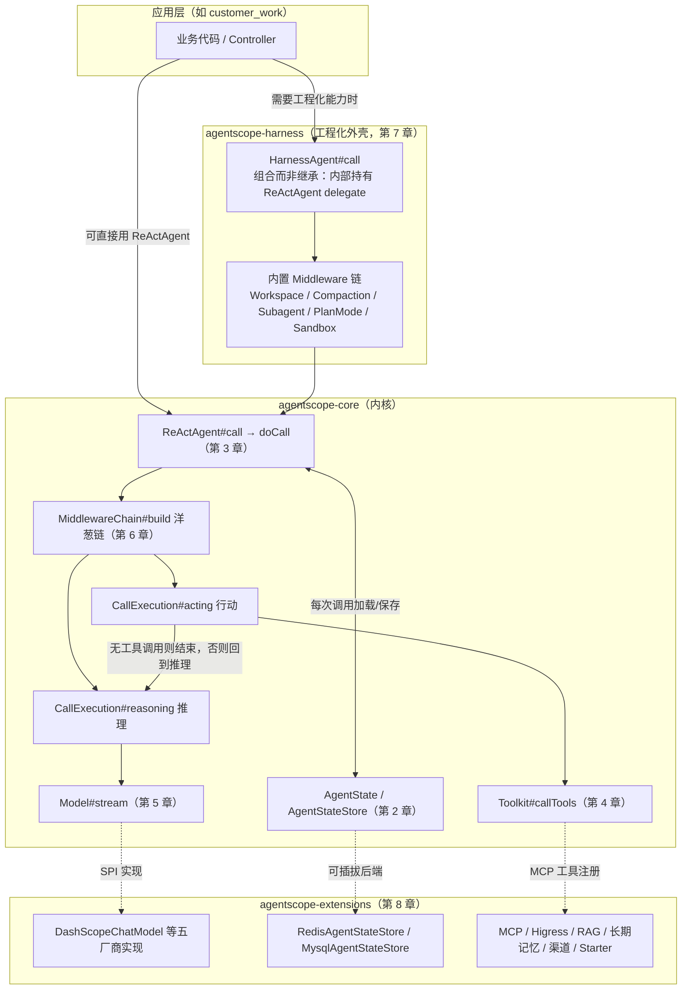
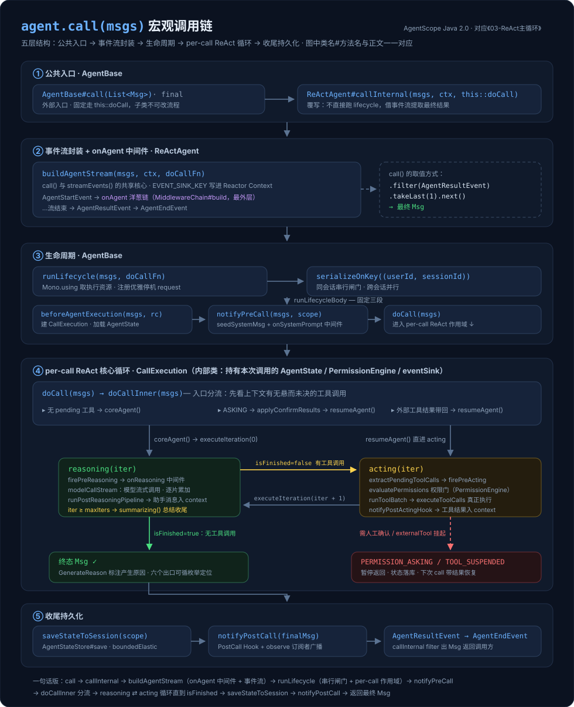

# AgentScope Java 源码阅读指南

> 面向版本：`io.agentscope:agentscope-*` **2.0.0**（仓库 main 分支为 2.0.0-SNAPSHOT，与 GA 主干一致）
> 框架仓库：[agentscope-ai/agentscope-java](https://github.com/agentscope-ai/agentscope-java)（分析基于 2026-08 前后的 main 分支，行号可能随上游演进小幅漂移）
> 实战项目：[liulangjietou/customer_work](https://github.com/liulangjietou/customer_work)（基于 2.0.0 GA 的生产级智能客服系统）
>
> 本指南所有"框架路径"均相对 agentscope-java 仓库根，所有"实战路径"均相对 customer_work 仓库根。
> 所有流程图/架构图/模块图节点使用正文中出现过的 `类名#方法名`，图文一一对应。

---

## 一、这份指南怎么读

AgentScope Java 是阿里开源的 **Agent 编程框架**，全面基于 Project Reactor（`Mono`/`Flux`）构建，JDK 17。它的分层非常清晰：

- **`agentscope-core`**：框架内核。ReAct 循环、消息模型、状态持久化、工具系统、模型抽象、Middleware 扩展机制——**读懂它就读懂了框架 80% 的运行原理**。
- **`agentscope-harness`**：工程化外壳。在 ReActAgent 之上组合出 HarnessAgent，叠加 workspace、沙箱、子 Agent、记忆压缩、Plan Mode 等"长任务工程能力"。
- **`agentscope-extensions`**：约 50 个外部集成子模块（模型厂商、RAG、长期记忆、Redis/MySQL 存储、云沙箱、协议层、IM 渠道、Spring Boot Starter）。

**核心/非核心的划分口径（按主执行链路）**：

| 分类 | 内容 | 判断标准 |
|---|---|---|
| **核心** | core 的 message/state/agent/model/tool/middleware/event/permission 包 + ReAct 主循环 + HarnessAgent 主链路 | 读不懂这些，框架就用不明白：任何一次 `agent.call()` 都会走完这些代码 |
| **非核心** | extensions 生态（模型厂商实现、RAG、记忆、存储、沙箱、协议、渠道、starter）、core 的 rag/skill/tracing/credential 等外围包 | 按需查阅：不用某能力就不必读，接口边界清晰 |

**建议阅读顺序**：

```
第 1 章（模块全景）→ 第 2 章（消息与状态：数据模型是理解一切的前提）
→ 第 3 章（ReAct 主循环：全书最重要的一章）→ 第 4 章（工具系统）
→ 第 5 章（模型层）→ 第 6 章（Middleware/Hook/事件流）
→ 第 7 章（Harness）→ 第 8 章（扩展生态，按需）
→ 第 9 章（customer_work 17 个场景全景映射）→ 第 10 章（避坑清单）
```

每个核心章节末尾都有 **「customer_work 实战」** 小节，展示该能力在真实生产项目里的用法与调用链；第 9 章再从业务场景视角做一次总映射，两个视角互补。

## 二、章节目录

| 章 | 文件 | 定位 | 一句话 |
|---|---|---|---|
| 1 | [01-模块全景与依赖拓扑.md](01-模块全景与依赖拓扑.md) | 核心 | 6 个 Maven 模块、core 的 16 个包地图、依赖方向 |
| 2 | [02-消息与状态模型.md](02-消息与状态模型.md) | 核心 | Msg/ContentBlock/AgentState/AgentStateStore，2.0 状态体系的地基 |
| 3 | [03-ReAct主循环.md](03-ReAct主循环.md) | **核心的核心** | ReActAgent 4491 行拆解：call → reasoning → acting → summarizing 全链路 |
| 4 | [04-工具系统.md](04-工具系统.md) | 核心 | Toolkit 门面、@Tool 注解 → Schema 生成 → 反射执行、MCP 接入 |
| 5 | [05-模型层.md](05-模型层.md) | 核心 | Model 抽象、Formatter 五件套、SSE 流式传输、ModelRegistry/SPI |
| 6 | [06-Middleware与事件流.md](06-Middleware与事件流.md) | 核心 | 五切点洋葱模型、与遗留 Hook 的并存关系、33 种 AgentEvent |
| 7 | [07-Harness工程化外壳.md](07-Harness工程化外壳.md) | 核心 | HarnessAgent 组合模式、workspace/沙箱/子 Agent/记忆压缩/Plan Mode |
| 8 | [08-扩展生态.md](08-扩展生态.md) | 非核心 | 约 50 个 extension 子模块速览与选型 |
| 9 | [09-customer_work场景全景映射.md](09-customer_work场景全景映射.md) | 实战 | 17 个业务场景 → AgentScope 能力 → 源码调用链 |
| 10 | [10-避坑清单.md](10-避坑清单.md) | 实战 | 生产项目踩过并在源码注释里记录的 10+ 个坑 |

## 三、全局架构图

下图是整个框架的模块分层与一次调用的宏观流向。图中每个节点都会在对应章节展开：`ReActAgent#call` 系列见第 3 章，`Toolkit#callTools` 见第 4 章，`Model#stream` 见第 5 章，`MiddlewareChain#build` 见第 6 章，`HarnessAgent#call` 见第 7 章。



另附一张 `agent.call(msgs)` 宏观调用链的五层全景图（细节见第 3 章）：



## 四、customer_work 项目速览

customer_work 是一个把"客服业务流程图落成生产代码"的完整项目，5 个 Maven 模块 + 2 个前端：


| 模块 | 端口 | 职责 | 与 AgentScope 的关系 |
|---|---|---|---|
| `customer-work-starter` | — | 可复用智能体基础设施（Spring Boot 自动装配） | 直接依赖 20 个 agentscope artifact，是绝大多数集成代码所在地 |
| `customer-work-app-server` | 8080 | 面向用户的客服应用（HTTP/SSE/WebSocket） | 无直接依赖，全部经 starter 传递 |
| `customer-channel` | 8081 | 多渠道接入（钉钉/飞书/企微/微信 + 官方五套 Web 端） | 依赖官方 starter 与 channel 扩展 |
| `customer-admin-server` | 8082 | 后台管理（模型/MCP/智能体配置、工作区对话、VibeCoding） | 依赖 A2A 扩展；**排除 starter 自动装配，显式 new** |
| `customer-work-gateway` | — | Spring Cloud Gateway 统一路由 | 无 agentscope 依赖 |

它用到了约 **130+ 个 AgentScope 类型**，覆盖 17 个业务场景，是"框架每个能力在生产中长什么样"的最佳对照材料——详见第 9 章。

## 五、框架自带的对照学习材料

- `agentscope-examples/documentation/src/main/java/io/agentscope/examples/documentation2/`：13 个子包（context/harness/hitl/mcp/middleware/model/multimodal/quickstart/skill/state/streaming/structuredoutput/tool）与官方文档章节一一对应。
- `docs/v2/zh/docs/`：中文官方文档，其中 `harness/architecture.md` 与 `building-blocks/middleware.md` 最值得逐字读。
- 根目录 `SKILL.md`：给 AI 编码助手的项目规约，`PROHIBITED PRACTICES` 与 `COMMON PITFALLS` 两节记录了框架的隐含约定（尤其 Reactor 使用禁忌）。
